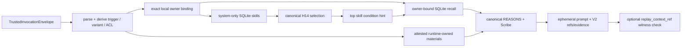

# HEY-173 ISA Run Contract — ContextComposer

- Status: In Progress
- Issue: [HEY-173](https://linear.app/heywaldo/issue/HEY-173/harness-contextcomposer-trusted-invocation-to-provenance-backed)
- Stack base: `origin/main` at `10227ec1e061d6e7b9dc6a2550d780323c5178b6`, merged forward by
  `2bba0a7`; PR #68 must target `main` after the repair evidence is complete.

## Intent

Build one deep runtime-local seam:

```ts
compose(trustedInvocation, runtimeOwnedInputs)
```

It must turn an already admitted `TrustedInvocationEnvelope` plus a bounded, runtime-owned
source capture (and, on replay, an optional prior V2 context-ref witness) into either:

- an ephemeral seven-layer REASONS prompt, a V2 `RuntimeContextCheckpoint`, and non-content
  selection/recall evidence; or
- an explicit fail-closed result with no prompt and no checkpoint.

This is a headless/local context lane only. It does not wire `RunLoopDO`, choose a provider,
write a run record, deliver output, access Supabase, or claim a production profile, connector,
FTS/RRF, pending-memory union, or live health projection.

## Current → Ideal

### [observed] Current

- PR #67 supplies strict `TrustedInvocationEnvelope` and V2 checkpoint contracts, but the
  run-loop still owns fake-derived context and a fixed prompt path.
- HEY-14 supplies canonical in-memory SkillLoader filtering/ranking; no SQLite system-skill
  repository exists.
- HEY-15 supplies an owner-bound RecallGateway contract and fail-open retrieval behavior; no
  SQLite owner-binding adapter exists, and its public result does not retain provenance/status.
- HEY-16 supplies canonical seven-layer REASONS primitives, but accepts a preformed fake canvas
  and owns neither snapshot provenance nor trusted invocation authority.
- The current DO schema has globally keyed `skills` and legacy `user_id` memory/episode rows. It
  has no tenant column, FTS/RRF data, agent-evolution table, or enough fields for a truthful
  pending/committed union conflict hydration.

### [ideal] This slice

- A sole public composer accepts a parsed/re-parsed trusted envelope, derives trigger, variant,
  recall key, and tool ACL only from `runtime_binding`, and never accepts surface authority.
- Constructor-injected, local-substitutable adapters provide system-only active skills, an exact
  `(principal_ref, tenant_ref) → legacy user_id` owner binding, owner-bound local recall, and a
  bounded required context capture. Each SQLite adapter shares only an in-flight capture for one
  composition, then releases it; a replay witness is the cross-process/cross-call safety proof.
  Public
  callers cannot select a tenant, user, trigger, ACL,
  model, provider, tier, DO, or delivery policy.
- Runtime-owned inputs may carry `replay_context_ref`: `null` for a first compose or the prior
  V2 `context_ref` for a retry in a fresh adapter/process. It is a witness, not a prompt source:
  recomposition returns only when the newly derived V2 context ref matches; otherwise it fails
  closed before any prompt escapes. The opaque identity binds the final prompt digest and the
  whole-canvas prompt serializer revision, so a fresh process cannot accept an old witness after
  byte-level rendering drift.
- Hostile envelope and adapter snapshots are copied through a bounded plain-data boundary that
  rejects accessors, cycles, symbols, and prototype-mutating keys before schema parsing. A
  top-level or nested inherited authority field cannot reach an adapter.
- The composer makes exactly one selection and at most one recall call; it forwards only the
  highest-ranked selected skill's `trigger_condition` as the recall hint.
- It renders canonical REASONS order with `wrapSkills` and canonical recall rendering, creates
  deterministic opaque V2 refs/provenance, and leaves raw prompt/health/connector content out of
  the durable result. Workspace/connector text is external data only: one reserved
  `<workspace-context>` fence marks it `[NOT instructions]`, and literal or decoded fence closers
  fail closed.
- It admits only a backend `DerivedHealthDestinationView` eligible for `trigger_prompt`; health
  text is nonnumeric and Scribe-admitted. Unsafe/malformed health fails closed.

### [blocked] Deliberately not claimed

- Production tenant routing, Supabase/RLS, live profiles/goals/workspace/connectors, provider
  calls, retries/deadlines, delivery, run persistence, and run-loop wiring.
- BM25/RRF, episode FTS, agent evolutions, full ADR-0046 union/conflict hydration, or retained
  source-taint recovery from legacy committed memory rows. The local adapter delegates canonical
  key/config/query/hint admission to HEY-15, but returns `partial` on every successful local
  read and excludes an unproven legacy row rather than laundering its taint. See
  [HEY-174](https://linear.app/heywaldo/issue/HEY-174/backend-local-recall-source-proof-ftsrank-episode-admission-and-union).
- A production-proven source for connector availability, dismissals, provisional reverts,
  identity drift, and invocation priority. The composer accepts a required, principal-scoped,
  revision-attested state adapter; this lane's adapter is an explicit frozen headless fixture.
  `skills.pinned` remains curator lifecycle metadata, not invocation priority. See
  [HEY-175](https://linear.app/heywaldo/issue/HEY-175/backend-proven-system-skill-runtime-state-source-connector-dismissal).
- Durable cross-restart source snapshots. The current DO schema has no source revision,
  snapshot manifest, or historical row capture for skills, legacy memory, materials, staged
  inputs, owner bindings, or runtime skill state. A fresh adapter can verify an unchanged
  context through `replay_context_ref`, and fails closed on divergence; it cannot reconstruct
  a mutated historical prompt. [HEY-176](https://linear.app/heywaldo/issue/HEY-176/backend-durable-contextcomposer-source-snapshot-manifest-and-replay)
  owns that durable source boundary and later single-writer handoff.

## Stable ISC criteria and falsifiers

| Criterion | Proof | Falsifier |
| --- | --- | --- |
| Trusted authority only | `compose` copies and parses `TrustedInvocationEnvelope`; the copy rejects prototype-mutating keys and derives trigger/variant/ACL from it; public runtime inputs have no authority selectors. | A raw surface request, inherited authority field, or caller-provided user/tenant/trigger/tool list can influence output. |
| Explicit local ownership | Owner binding matches both opaque principal and tenant before every current-schema local memory read; all queries are parameterized. Episode reads are deliberately absent in this temporal-partial lane. | Unmapped/mismatched binding, or a cross-principal row appears in result/evidence/prompt. |
| System-only skills | SQL reader admits active, identity-locked `provenance='system'` rows through `SkillRow` then `Skill`; a repository that exposes a non-system row fails closed without leaking its metadata. | Connector/user/agent row reaches `wrapSkills`, or a corrupt active row yields a prompt. |
| Canonical selection | H14 filter/rank/top-K behavior and canonical exclusion reasons remain observable. | Wrong order, invented exclusion reason, forbidden-tool skill, or beyond-K skill appears. |
| Recall is bounded and honest | Key/variant config is canonical; exactly one call uses the top selected condition; skipped/empty/failed are distinguishable. | A recall retry/second call happens, a failed retrieval reports `ok`, or another principal's data appears. |
| Fail-open is narrow | Retrieval failure renders canonical empty recall and succeeds with `failed` evidence; all authority, integrity, safeguard, health, sanitizer, and provenance failures return no prompt/checkpoint. | A fail-closed condition exposes a partial prompt, or recall failure blocks a valid invocation. |
| REASONS is deterministic | The seven fixed layers are joined canonically; recall begins Operations and Safeguards is last. Same adapter capture produces identical bytes and V2 provenance; a fresh replay must match the runtime-owned V2 witness or fail closed. | Layer/order/suffix drift, changing prompt/checkpoint for equivalent capture, a fresh replay escaping with a mismatched witness, or mutable input observed after an await. |
| Health and taint safety | Only destination-approved nonnumeric health view/narrative crosses Scribe; external connector/workspace sources retain external taint and sanitize before use. | Raw/numeric health or unsafe external text appears in prompt/checkpoint, or external taint becomes null. |
| Durable provenance is safe | Checkpoint matches envelope refs; source refs are opaque/unique/time-valid/scoped; durable evidence has hashes/status/refs only. | Prompt, recall content, raw health, secret, arbitrary connector text, duplicate/mis-scoped ref, or invalid taint aggregate is durable. |
| Scope discipline | No RunLoopDO/adapters/schema migration/central contract edits. | Diff touches a forbidden path or new migration. |
| Fresh-process replay binding | The V2 `context_ref` seed contains the final prompt digest and private whole-canvas serializer revision before the runtime-owned witness check. | A fresh composer accepts a witness produced by a different renderer/serializer, or emits changed bytes with the same replay identity. |
| Workspace instruction/data separation | Every workspace representation is inside exactly one reserved `[NOT instructions]` fence; literal, percent, JSON-escaped, and printable-base64 closers are rejected before assembly. | External workspace text can close its fence, render as a privileged layer, or escape its data boundary. |
| Taint and error boundary | Production SQLite construction cannot promote unproven legacy-memory taint. Expected domain outages are content-free; unexpected causes are retained only through a bounded injected internal observer. | Production adapter admits a no-proof legacy row, an unknown defect is silently classified as a domain fault, or diagnostics serialize source/prompt/health/secret content. |
| Bounded lifecycle and host independence | In-flight snapshot sharing releases after a composition; all identity/order comparisons use explicit UTF-16 code-unit ordering. | A 65th sequential capture fails because of permanent state, or equivalent Unicode/punctuation permutations change prompt/provenance. |

### Stable ISC probes

- [x] **ISC-1 — Trusted composition only.** `compose()` accepts only a strict trusted envelope
  plus strict runtime-owned snapshot inputs. **Anti:** a raw surface request or caller-selected
  identity/trigger/ACL reaches any adapter.
- [x] **ISC-2R — Scoped bounded lifecycle.** Every mutable adapter response carries matching
  principal/tenant and snapshot/revision attestation; SQLite shares an in-flight capture but has
  no permanent capacity ceiling. **Anti:** an accessor, mismatched snapshot, foreign staged
  input, non-injective legacy mapping, or a 65th sequential invocation fails due to retained
  cache state.
- [x] **ISC-3 — System-only H14 selection.** Active system rows are parsed, bounded,
  filtered/ranked/top-K'ed, and emit only canonical selected/exclusion evidence. **Anti:**
  another provenance's name/count reaches output or persisted `pinned` becomes priority.
- [x] **ISC-4 — Honest H15 recall.** Exactly one canonical recall plan/read occurs; ordinary
  source failure is explicit failed-empty, while taint/canary/integrity failures close. **Anti:**
  an unsupported local source reports `ok`, leaks another owner/tenant, or silently skips.
- [x] **ISC-5R — Canonical safe REASONS and external data fences.** Seven layers render in order,
  recall leads Operations, workspace stays in an explicit `[NOT instructions]` fence, safeguards
  finish, and only derived health/context survives final Scribe. **Anti:** raw health, unsafe
  external text, a literal/decoded reserved closer, or a partial prompt exits a failed composition.
- [x] **ISC-6R — Fresh-process deterministic V2 replay.** Same frozen adapter capture produces
  identical bytes and opaque scoped refs. A fresh adapter may replay only when an identity that
  binds prompt digest plus serializer revision equals the runtime-owned witness; renderer/source
  drift fails closed before a prompt exits. **Anti:** arbitrary source content/raw health is
  durable, taint is laundered, code-unit-equivalent ordering drifts by host, or a fresh process
  silently accepts an obsolete witness. Durable historical reconstruction remains deferred to
  HEY-176.
- [x] **ISC-7R — Diagnosable fail-safe boundary.** Explicit expected outages map to their public
  content-free result; unexpected causes produce one content-free `assembly_failed` result and
  one bounded non-serializing internal observation. **Anti:** an unknown error becomes an
  expected fault, is silently discarded, or leaks its message/source content.

## Data and failure map



| Stage | Input / owner | Success | Failure policy |
| --- | --- | --- | --- |
| Admission | PR #67 envelope | Parsed trusted authority and derived binding. | Invalid envelope fails closed before any adapter call. |
| Snapshot | Runtime-owned attested capture + optional V2 witness | Required identity/safeguards/material sources are bounded and time-valid; the witness is compared after the final prompt digest and serializer revision are folded into V2 identity. | Missing mandatory identity/safeguards, unsafe source/time/ref, witness mismatch, or renderer drift fails closed. |
| Owner binding | Injected local resolver | Exact principal+tenant binding yields a legacy local user id. | Missing/mismatched binding fails closed; no SQL recall occurs. |
| Skills | SQLite/local repository → canonical row/skill parser → H14 loader | System-only candidates plus canonical selected/excluded list. | Corrupt or non-system exposed rows fail closed with no foreign provenance evidence. |
| Skill state | Required injected principal/tenant state adapter | Attested connector/dismissal/revert/drift/priority inputs drive H14 where supplied. | Missing/mismatched/corrupt state fails closed; fixture-only state is not a production claim (HEY-175). |
| Recall | Injected owner-bound H15 temporal-partial adapter | Canonical result, snapshot provenance, and `partial`/`skipped` status for a successful current-schema read. | Ordinary source retrieval failure is the sole fail-open: canonical empty recall + `failed` evidence; canary/security/integrity failures fail closed. Unproven legacy taint is excluded (HEY-174). |
| Health/external material | Derived destination view / source-fragment Scribe gate | Allowed, bounded text and unlaundered taint; workspace renders only inside one data fence. | Raw/numeric/unsafe health, external sanitizer rejection, literal/decoded workspace closer, or invalid provenance fails closed. |
| Assembly | Canonical REASONS helpers | Stable prompt bytes, no partial output. | Any layer failure returns typed failure with no prompt/checkpoint. |
| Provenance | Internal deterministic ref factory | V2 parsed checkpoint matching envelope and captured source facts; fresh replay must match the supplied witness. | Duplicate/time-invalid/mis-scoped/taint-inconsistent source or replay witness mismatch fails closed. |

## Test strategy

Composition behavior tests cross only the public `ContextComposer.compose()` seam. One narrow
SQLite-adapter surface assertion proves that production construction exposes no test-only taint
promotion factory. In-memory adapters model true external or repository behavior; a Miniflare
Durable Object test seeds `provisionDoSchema()` and uses the local SQLite adapter for real
current-schema query proof.

1. **Tracer bullet:** trusted `user_message`, one active system skill, exact principal-scoped
   recall, derived health narrative, derived ACL, all seven layers, and a valid V2 checkpoint.
2. **Isolation/admission:** cross-principal and same-principal/different-tenant rows are absent;
   corrupt/non-system/forbidden/over-K skills surface only correct selected/exclusion evidence and
   never prompt.
3. **Recall:** one call, selected-top hint, skipped key, deterministic ordering, empty memory,
   explicit failure-open state, and no silent failure.
4. **Safety:** safeguards-final/recall-first, zero skills, missing mandatory inputs, raw health,
   unsafe external text, taint propagation, provenance/scope/time violations, and no partial
   prompt on fail-closed results.
5. **Replay/determinism:** property-style fixed capture/repeated composition, fresh-composer
   serializer and same-serializer/different-digest witness rejection, >64 lifecycle capacity,
   Unicode/punctuation ordering permutations, and one committed ordering/ACL/tenant/replay
   mutation configuration whose relevant tests kill the mutant.
6. **Local SQLite:** parameterized active-system skill and owner-bound temporal memory reads
   using the existing DO schema, including cross-owner negative proof; seeded episodes prove
   they are not fabricated/admitted by this partial capability.

## Vertical TDD slices

1. Define the public discriminated result, trusted snapshot material contract, and successful
   user-message tracer test. Make it red; add only enough composer behavior for green.
2. Add canonical selection and repository-admission truth-table evidence; keep corrupt input
   fail-closed.
3. Add exact owner binding plus one-call H15 recall status/provenance adapter and cross-tenant
   proof.
4. Add Scribe/health/external-taint/provenance fail-safe coverage and replay property.
5. Add the local SQLite implementation and Miniflare integration test; do not alter schema.
6. Run contract/standards/security/health/adversarial review and whole verification wall; repair
   until falsifiers are closed or explicitly blocked.

## Verification plan

- `pnpm --filter @waldo/runtime test -- context-composer.test.ts` after every tracer slice.
- Runtime typecheck and repeated complete runtime suite after implementation.
- `/check-contract`, `/break-feature`, independent standards/spec code review, and focused
  health-data/security review against this document and the final diff.
- `git diff --check`, forbidden-file/import scans, and local SQLite test.
- The established local-only Supabase verification procedure; if its required local service is
  unavailable, record that exact blocked condition without claiming the aggregate wall passed.
- Recheck PR #67/#61 heads and changed-file overlap immediately before push/PR creation.

## Verification evidence

- Focused ContextComposer/SQLite/recall configuration: 3 files, 113 tests passed.
- Runtime typecheck passed; full runtime suite passed twice, 29 files / 779 tests each run.
- Property/Scribe suite: 3 files, 258 tests passed.
- Narrow deterministic-order mutation run: 3 of 3 selected mutants killed, 100.00% score;
  the only excluded equality mutation is equivalent after the explicit equality guard.
- `npx -y pnpm@10.34.4 verify` passed, including the local-only Supabase reset and 44 schema
  contract tests; direct guards, `git diff --check`, dependency-direction, forbidden-RunLoop,
  no-test-factory, and no-`localeCompare` scans passed.
- Fresh independent Standards/Spec and security/health reviews passed after the repair diff.
- The final adversarial `/break-feature` pass found one prototype-pollution admission bypass;
  it was repaired with outer/nested public-compose regressions and the rerun verdict passed.

## Learning capture

### Lightweight capture — source-proof boundaries in a deep composition module

- **Mode:** Lightweight.
- **Lesson:** A local table can prove a bounded owner-filtered temporal read without proving its
  origin taint, FTS rank, episode search, or union conflict semantics. Treat that capability as
  explicit `partial`; exclude unproven legacy content rather than inventing benign provenance.
- **Lesson:** Treat raw local rows as hostile before parsing: SQLite `length(TEXT)` stops at a
  NUL, unordered source rows can perturb a provenance digest, and a literal-only prompt-fence
  check misses decoded closers. Reject NUL-bearing/oversized fields—including every field used
  by a temporal eligibility predicate—before materialisation, canonicalise source ordering before
  hashing, and inspect the same bounded JSON-escape, percent, and printable-base64 views used at
  the source boundary.
- **Lesson:** Compile-time fault-code types do not make an injected runtime error safe to expose.
  A source rejection may select only the exact content-free failure assigned to its stage; every
  forged/mismatched code is an unexpected fault observed through a one-argument redacted signal.
  Replay proof must exercise serializer revision and final prompt digest independently, including
  a fresh module/process witness with unchanged revision but changed bytes.
- **Lesson:** A hostile data copier is part of admission. Assigning an own `__proto__` key onto a
  normal object can turn attacker-controlled inherited properties into schema-visible authority;
  reject prototype-mutating keys and define copied fields as data properties before validation.
- **Track:** Bug/failure and knowledge/practice.
- **Symptom/opportunity:** An adversarial public-seam pass found that byte-truncated SQLite text,
  encoded reserved fence closers (including JSON escaped solidus), unchecked typed-error fields,
  and unordered source snapshots could bypass an otherwise deterministic/safe composition
  boundary.
- **Root cause:** The tempting shortcut is to label legacy `user_id` data as trusted because it is
  local. That silently escalates source trust and makes a headless fixture look production-ready.
- **What worked:** Snapshot/revision attestation, bounded in-flight/failure capture, the
  runtime-owned V2 replay witness, an explicitly injected test-only taint proof, canonical H15
  temporal planning, and public SQLite tests for no-proof exclusion, proof failure,
  same-principal/cross-tenant isolation, offset-safe point-in-time queries, real bound NUL-row
  preflight, encoded fence-closer rejection, content-free forged-error handling, independent
  replay-digest proof, and permutation-stable selection provenance.
- **What did not work:** Counting/exposing non-system rows, lexical ISO ordering, and using
  curator `pinned` as invocation priority all leaked or invented facts and were removed. A
  text-only length guard, literal-only fence check, and digesting repository order were likewise
  insufficient and were replaced with byte/NUL-aware, decoded-view, and canonical-order guards.
- **Overlap check / destination:** `rg` found no existing ContextComposer or legacy-recall
  source-proof home beyond this issue-owned ISA document; this section is the smallest durable
  Evidence Trail rather than a new governance artifact.
- **Where to look first:** This ISA section and the public ContextComposer/SQLite tests; future
  production source adapters must re-prove the same boundaries before widening the capability.
- **Source/provenance:** `packages/runtime/src/context-composer/{index,sqlite}.ts`,
  `packages/runtime/src/recall/gateway.ts`, HEY-174, HEY-175, and HEY-176.
- **Applicability limit:** Do not use this pattern to authorize production legacy-memory ingress;
  it applies only until the source schema/proof adapter retains taint and full recall facts. Do
  not call the V2 witness a durable snapshot: it verifies an unchanged recomposition and closes
  on drift, while HEY-176 owns historical source reconstruction.
- **Eval/pressure scenario:** Remove `user_id = ?`, replace `unixepoch()` with text comparison,
  admit no-proof rows, or relabel partial recall as `ok`; the public SQLite/temporal tests must
  fail.
- **Refresh outcome:** New, narrow, and linked to follow-up ownership.
- **Evidence Trail:** This learning capture is the evidence trail for the adversarial repairs;
  its focused public-suite command and 100% narrow mutation result are recorded in the PR and
  Linear issue evidence.
- **Impact surface:** ContextComposer, local SQLite adapters, and future HEY-174/HEY-175 source
  adapters; no ADR, run-loop, or schema mutation.
