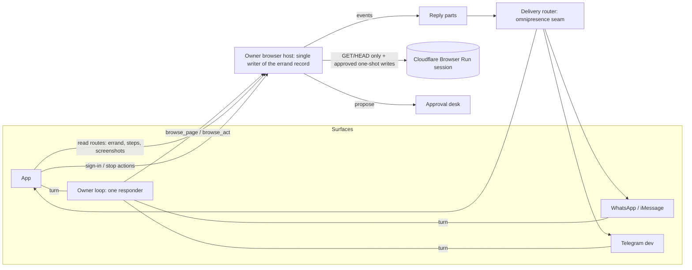

# Browser on every surface: design

Design for owner review, 11 October 2026, browser lane (ledger ruling 14). Pinned at `beta-mvp` `c081254d`. **No code until the owner approves.** Paths are under `packages/runtime/src/` unless they say otherwise. The companion audit and errand set are in [BROWSER_LANE_AUDIT_AND_ERRANDS_2026-10-11.md](BROWSER_LANE_AUDIT_AND_ERRANDS_2026-10-11.md).

## 1. Goal

The browser is one capability of Waldo's single owner loop. It is not an app feature. The owner can ask for an errand from any surface: the app, WhatsApp, iMessage, or Telegram for tests. Waldo starts the browser itself, works the errand, and reports progress and results on the surface where the request came from, in whatever form that surface supports. The app shows the most: live view, takeover, a step log with screenshots, and approval cards.

**Done means** errands E01–E20 in the errand set pass on staging from the app, and E01, E07, E12, E16 and E20 also pass from one messaging surface, with zero false claims and zero safety violations.

**Owner direction this rests on:**
- Rulings 12 to 16.
- The owner's note in this lane's chat (11 October): the browser works from any surface and updates the owner there.
- Relayed by the gap-analysis lane, 19:05Z:
  - alpha cohort of 5–10 testers, at most 50;
  - a $25 per user per month model and compute ceiling that includes browser spend (the ceiling lives in #915 L, not yet wired);
  - no purchases until the owner sets purchase limits.
  The cohort and ceiling figures are relayed and need the owner's confirmation here.

## 2. What exists, and what is missing

Read from source at `c081254d`. File and line references are in audit doc §2.

| Piece | State |
|---|---|
| Native browser (Cloudflare Browser Run) | Retained session per owner. Accessibility tree, DOM refs and a PNG per observation. Tabs, downloads into the owner workspace (#985), screenshots. Only GET and HEAD reach sites. Every in-form submit is refused. |
| Legacy browser (Browserbase/Stagehand) | Free-text `browse_page`/`browse_act`, with an approval-bound `browser_submit` that replays in a fresh session and re-reads page facts. No sign-in and no retained state. Used in production for one-shot reads. |
| Takeover | `owner_login` starts a Cloudflare structured handoff. `/console/browser-handoff` frames the interactive live view (5-minute URL). The tool result carries `console_url`. |
| Approvals | The `browser_submit` desk kind exists in the app contract with `exact.scope`. Piece A round 4 makes browser and MCP cards fully reviewable and approvable in the app. |
| Saved sign-ins | Encrypted custody, site scoping and private-session code exist (`browser-state-custody.ts`, `browser-state-site-scope.ts`, `browser-private-session.ts`). Nothing calls them. |
| Spend | A per-run browser-milliseconds reservation against a declared limit, a $10 test cap and a $5 per owner per month counter (`owner-public-browser-spend.ts`). |

**Gaps, most severe first:**

1. **Owners without Telegram cannot browse.** The browser runtime resolves the owner through the Telegram subject.
2. **The native browser cannot submit, book or RSVP.** Only file upload is coming (#987).
3. **Staging has no native browser** until S0 passes. The S0 in #908 does not test the retained path.
4. **Card fields are not masked.** The legacy review prints page bindings raw.
5. **Health values the model types or puts in a URL are not refused.** Browser arguments are sanitized as model context (audit finding 6).
6. **No mid-errand progress reaches any surface except the final reply.** The outbox is keyed by Telegram `chat_id`.
7. **The app has no step log, live view, takeover or browser presence.**
8. **No saved sign-ins.**
9. **Latency.** Each step is a full owner-loop model call: about 6 s at about 64k input tokens (latency memo, 10 October). The model also picks the provider, so a failed native call can be followed by a Browserbase retry.

## 3. Shape

| Aggregate | Single writer | State |
|---|---|---|
| Browser errand (job) and its steps | The owner browser host (`owner-browser-runtime.ts` → `common-browser-host.ts`), extending today's `common-browser:<taskId>` record | DO storage, bounded |
| Screenshots | The browser host, through the owner workspace (`browser-screenshot-workspace.ts`) | Owner workspace, same retention as the errand |
| Saved sign-ins | `browser-state-custody.ts` (one store; #941's Vault store is not adopted) | Encrypted blob per owner, site, account and generation |
| Approvals | The approval desk (`approvals.ts`), unchanged ownership | DO SQLite `ledger` |
| Delivery | The omnipresence router and outbox | As in the seam design |

Nothing here adds a second agent brain or a browser-specific delivery path. The browser host records what actually ran and emits events. The loop and the seam decide what the owner sees.

## 4. Design

### 4.1 Authority on every surface

Replace the Telegram-subject check in `assertOwner` and `current()` (`owner-browser-runtime.ts:49-60`), and in the nine other files that read `telegram_subject`, with `ownerRuntimeAuthority` (#1013). It maps the DO to its owner, and the run's own surface admission rechecks the surface. Every existing recheck point stays: the physical DO id, owner custody digest, run scope and lease.

- **Depends on:** migration `20261010060000`, applied on staging on 10 October (handoff session); production is not applied. Ledger slice S2 has the same dependency and is unowned, so the two should be coordinated.
- **Red-first test:** an owner with no Telegram link calls `browse_page` from an app turn and gets an observation. A revoked owner binding mid-errand closes the session and allocates nothing new.
- **Falsifier:** any browser call that still reads `telegram_subject` for admission.
- **Rollback:** revert. Errand records keep the same keys.

### 4.2 The errand record and step log

Extend the retained task record into a bounded errand:

- `job_id`, which is today's `taskId`.
- `origin`: `{ surface, conversation_ref, anchor_entry_id }`, so progress goes back to where the request came from.
- `goal`: the owner's words, bounded to 500 characters.
- `state`: one of `running`, `waiting_owner(sign_in | approval | choice)`, `done`, `failed`, `cancelled` or `outcome_unknown`.
- `steps[]`, at most 200, each `{ n, at, kind, site_origin, label, result, screenshot_ref? }`.
  - `kind` is one of: read, goto, type, click, select, download, upload, sign_in, submit.
  - `result` is one of: ok, refused, failed, uncertain.

**Labels are deterministic.** The host builds each label from the operation and the observed element's role and name, for example `Clicked "Search"`. The model's text is never parsed for it. Element names are external page text, so they get the same bounding and sanitising as other tainted content.

**What never enters a step:**
- typed values ("Typed into Email" records which field, not what was typed);
- secret-type field values;
- query strings and fragments;
- health data.

**Screenshots** are taken after each state-changing step and at every waiting or terminal state, not on every read. Secret-type fields are masked (§4.9).

**Retention.** Steps and screenshots are deleted 30 days after the errand ends [proposed], and on forget. They are owner data with `app_only` visibility by default.

**Tests:** a step is recorded only for an operation that executed. A refused action records `refused`. A typed password, card number or OTP never appears in the steps, the screenshots or the approval review (canary values in the fixtures).

### 4.3 Progress on the surface the request came from

The browser host emits four events: `started`, `step`, `waiting_owner` and `terminal`. They become reply parts through the omnipresence seam's router. Nothing sends directly.

| Event | App | WhatsApp, iMessage (ruling 13) | Telegram (dev) |
|---|---|---|---|
| started | "Waldo is browsing <site>" presence on the chat row, with Stop | One short line, only if the errand outlasts about 20 s [proposed]: "Working on it at <site>. Follow along: <sign-in-gated app link>" | Same text |
| step | Live step log and thumbnails (pull, §5) | Nothing | Nothing |
| waiting_owner: sign_in | A takeover card that opens the live view (§4.5) | "I need you to sign in to <site>: <sign-in-gated link>". The live-view URL is never sent to the messaging surface | Link |
| waiting_owner: approval | The full approval card (piece A), approvable | Text summary plus a link to the full review, never a stripped summary to approve | Card with buttons |
| waiting_owner: choice | Quick replies | A plain question; the owner answers in free text (numbered menus are out) | Buttons |
| terminal | Result, receipt, files, and the last screenshot on failure | Result text, plus a PDF or TXT file or an image when the owner asked for one | Same |

**Choices made here:**
- Messaging surfaces hear only when the errand needs the owner or ends, plus at most one "still working" line. Step-level updates go only to the app, where they cost nothing to ignore.
- Screenshots of signed-in pages go to messaging surfaces only when the owner asks, because they can carry account data.
- The 20 s threshold is presence UX, like a typing indicator. It is not a judgment about meaning.

**Dependencies:**
- The app half needs no outbox work. The app reads the errand while the chat row shows it as running (§5).
- Mid-errand messages on WhatsApp and iMessage need seam slices 1–2: a surface-keyed outbox and the router.
- Proactive or resumed delivery to owners without Telegram needs slice S2.

**Resuming after a wait:**
- **Sign-in:** completing the handoff (Cloudflare `handoffComplete`) records an owner event. The DO admits that event as a continuation turn for this errand. It never synthesizes owner text.
- **Approval:** the decision already continues through the desk.
- **Choice:** the owner's next message on any surface continues the errand through the shared main conversation (seam slice 5).
- Until that path exists, the owner says "done" and the model calls `resume_owner`, as today.

### 4.4 Approved writes on the native browser

A native in-form submit, or any non-GET write the page needs (add-to-cart, book, RSVP, cancel), becomes a `browser_submit` desk proposal with a native binding, following #987's pattern. The binding holds:
- `task_id`, session generation and observation revision;
- form origin and path, with query and fragment stripped;
- method and submit element label;
- the field list `{ label, value | masked }`;
- the page facts the model bound (date, time, party size, price, item).

**On approve**, the host does all of this in the same retained session:
1. Re-observes the page and requires the same origin, path, field-value digest and submit element.
2. Opens a one-request write permit for exactly that action URL and method.
3. Clicks, observes, and records a readback receipt: the confirmation page observation plus a screenshot.

**Failure handling:**
- A page that changed since review aborts with "the page changed; nothing was sent".
- A lost result after the click becomes `outcome_unknown`, with no automatic retry, consistent with one retry owner.

**Purchases stay off.** The owner's rule is a hard boundary, so a deterministic backstop is allowed. A proposal whose page has a payment field (`autocomplete` `cc-*`) or a payment-provider frame is refused: "purchases are off until you set limits". The backstop cannot see a one-click "Place order" that uses a saved card. That case rests on the model's classification plus the verbatim button label in the review. E21 tests it on a real "Buy now" page. **The owner should know this limit before purchase limits are set.**

**Coordination:**
- This changes `approvals.ts` (hot file), which piece A owns. It lands after piece A, and its contract use is reviewed with the gap-analysis lane.
- **Tests:** E12–E19 on the fixture tier; a changed page aborts; a double approval yields one write; a payment page is refused.

### 4.5 Takeover from any surface

The mechanism exists: a Cloudflare structured handoff plus the interactive live view (`native-browser-handoff.ts`).

**New:**
- **An authenticated app action** returns a fresh live-view URL to the signed-in owner. It is rate-limited like the console page.
- **The URL is a bearer capability.** It is never stored in history, push, logs, traces or messaging surfaces. It lives at most 5 minutes; the docs allow up to 1 hour, and this design keeps 5.
- **The app opens it in an in-app browser view.** The owner types credentials directly into the remote page, so they never pass through Waldo. The page shows the real address bar origin, the same check the console page asks for.
- **Messaging surfaces** get a sign-in-gated link to the app or console page, never the live-view URL.

**Unverified:** whether the live view works in iOS Safari or a WebView. Cloudflare's docs do not say. Test this on a device before the app builds against it.

### 4.6 Watching the browser

- **Version 1:** the step log with masked screenshots. It is cheap and auditable, and it works on every surface as images.
- **Version 2:** Cloudflare's view-only live view. Per Cloudflare's live-view docs, it streams the session and blocks navigation, input and JavaScript. The app offers it while an errand is running.

**Version 2 needs three things:**
- a check that `guardrails: {mode:"readonly"}` is available on the binding path this runtime uses (the docs describe it on the REST API);
- a decision on whether watching may expose unmasked page regions. A live stream does not apply the screenshot mask, so a password field's dots are shown as the site renders them, and a card number the site displays in clear would show;
- a device test.

### 4.7 Saved sign-ins per site

Wire the existing custody seam. Do not add the Vault store from #941.

- **Opt-in per site.** After a successful sign-in Waldo asks: "Keep me signed in to <site> for 30 days?" (a quick reply in the app; yes or no as text elsewhere). Default no.
- **Restore** only the cookies and origins for that site (`browser-state-site-scope.ts`), into a fresh context, under owner, site, account and generation admission.
- **Never exposed.** State never reaches a tool result, a model, a log or a trace (the custody module already says so).
- **App list:** "Signed-in sites", with forget per site. Forget deletes the blob and bumps the generation. Expiry is the sooner of the site's cookie expiry and 30 days.

**Needs an ADR before code** (new credential persistence, per CLAUDE.md). The ADR covers:
- key custody, proposed as a per-owner key derived from a Worker secret, never stored next to the blob;
- blob location, DO storage or R2;
- deletion on account forget;
- what happens to retained sessions when the owner revokes.

**Test:** errand E11 measures takeovers per repeat visit.

### 4.8 Latency

Measure first with the errand set. Then work these levers in this order [inference about impact]:

1. **One provider per environment, chosen by the host, not the model.** This removes the native-fail-then-Browserbase retry.
2. **A purpose-bound browser context.** Browser steps carry the goal, constraints, current observation and step history instead of the 64k owner prefix. It is the same loop, dispatcher and approval desk, with a smaller tool manifest, no memory writes and no health. It also makes "health never goes to browser jobs" structural. It touches "no competing agent brain", so it needs owner and architecture review before any code.
3. **Fewer round trips.** Every action already returns an observation. Allow two or three non-consequential actions per model call.
4. **Warm sessions across turns.** Retention already exists. Keep the session warm while the owner is signing in or deciding.

Targets come after the first baseline.

### 4.9 Safety gates (none weakened)

| Gate | Where it is enforced | Change |
|---|---|---|
| S0 before a staging browser binding | Guard rule 4; the binding arrives only in the PR that records a real S0 run | Re-cut S0 to cover the retained path (audit §1.1). The rule is not loosened. |
| No purchases until limits | The desk refuses payment pages (§4.4); the spend reservation stays on browser milliseconds only | E21 is a refusal test until limits exist |
| Credentials out of prompts, logs, fixtures | Sign-in only through takeover; secret fields refused for fill and masked in observations; saved-sign-in state never exported; card numbers in tool arguments redacted by the sanitizer | Canary scan after every logged-in errand |
| Secret-type fields masked in every review | Today: password and OTP | Add `autocomplete` `cc-number`, `cc-csc`, `cc-exp*`, `new-password` and `current-password` to observation, screenshot mask, fill refusal, step log and approval review on every surface. `describeBrowser` masks the same keys (piece A round 4 item 2) |
| Health never in browser jobs | **Today: not enforced** for typed values or navigated URLs. Browser tool arguments are sanitized as `internal_context`, where owner health is allowed by the beta ruling (audit finding 6) | Proposed: a browser-outbound sanitize destination that refuses health values in `type` values and URLs, with tests, as part of B1. The structural version comes with lever 2 (§4.8). Pages the owner directs the browser to, such as a lab portal, are external tainted content classified at ingress. Owner call: should such pages be refused? |
| Cost ceiling | Browser milliseconds and model calls per errand recorded per run | Counted toward the relayed $25 per user per month when #915 L exists |

## 5. app.v1 proposals (for the gap-analysis lane, sole editor of `packages/contracts/src/app/*`)

All additive. Every row that carries a new part keeps readable `text`. No new value goes into an existing row-level or page-level enum. Every new route meets the new-endpoint checklist:
- an authenticated app session, with the errand scoped to that owner;
- a screenshot `ref` that resolves only within that owner's errand, never to an arbitrary workspace file;
- rate limits on the read routes as well as the actions;
- generic errors;
- `private, no-store`.

1. **Presence now, no contract change:** reuse the existing `operation` message part (`operation_id`, `state`, `message`) for "Waldo is browsing <site>".
2. **A new message part, `browser_errand`:**
   - `{ type: 'browser_errand', job_id, state, waiting_for?, site_origin, title, steps, updated_at, fallback_text }`
   - `state` is one of `running`, `waiting_owner`, `done`, `failed`, `cancelled`, `outcome_unknown`.
   - `waiting_for` is one of `sign_in`, `approval`, `choice`.
   - Older apps drop the unknown part and show the text.
3. **Read routes:**
   - `GET /app/v1/browser/errands?state=` returns up to 20 errands.
   - `GET /app/v1/browser/errands/{job_id}` returns the errand plus up to 200 steps `{ n, at, kind, label, site_origin, result, screenshot: { ref, width, height } | null }`.
   - `GET /app/v1/browser/errands/{job_id}/screenshots/{ref}` returns `image/png` with `private, no-store`.
4. **Action:** `POST /app/v1/browser/errands/{job_id}/actions` with `{ action: 'open_sign_in' | 'watch' | 'stop', request_id }`.
   - It returns the controls receipt shape plus `live_view?: { url, expires_at, mode: 'interactive' | 'view_only' }`.
   - The URL appears only in this response.
5. **Saved sign-ins, after the ADR:**
   - `GET /app/v1/browser/sites` returns `{ site_origin, state, saved_at, expires_at, last_used_at }`.
   - `POST /app/v1/browser/sites/actions` takes `{ action: 'forget', site_origin, request_id }`.
6. **Approvals:**
   - No new approval field (contract editor, 11 Oct). Piece A's next round puts the full browser and MCP details into `review` and `fallback_text`, the same text Telegram shows, with secret-type fields masked. `exact.scope` stays origin plus path, with the query and fragment stripped.
7. **Push (with S7):** an id-only nudge when an errand waits on the owner.

## 6. Slices

One slice in flight at a time. Each has failing tests first, one full `verify`, and an owner go to merge.

| # | Slice | Depends on | Exit evidence |
|---|---|---|---|
| B0 | Close #881, #894, #895, #906, #911, #941 and #966; land #987 after its rebase; re-cut #973 onto beta with a test pinning the live pasted-only gate (`tools/source-scope.ts`) | Owner go per action; piece A for #987 | PRs closed with links to the superseding PRs; #987 green at its rebased head |
| B1 | Card and credential field masking everywhere, and a browser-outbound sanitize destination that refuses health values (§4.9) | Coordination with piece A for `describeBrowser` | Canary card number and OTP absent from observation, screenshot, steps and review; a synthetic health value in a `type` or `goto` is refused |
| B2 | S0 re-cut covering the one-shot, retained and handoff paths; one live run | Owner go to deploy the throwaway Worker | Raw S0 output; then a separate binding PR |
| B3 | Authority on every surface (§4.1) | `20261010060000` (applied on staging 10 Oct) | An app-only owner browses on staging |
| B4 | Errand record, step log and app read routes (§4.2, §5 items 1–3) | Contract parts from the gap-analysis lane | The app shows live steps for E01 |
| B5 | Errand harness and fixture site; first baseline | Owner go to host the fixture site; an owner session for the runner | First scorecard per §3.3 of the audit doc |
| B6 | Approved native writes (§4.4) | Piece A merged | E12–E19 fixture tier pass; payment page refused |
| B7 | Takeover and watching from the app (§4.5–4.6) | B4; a device test of the live view | E07 completed with sign-in from the app |
| B8 | Progress on messaging surfaces (§4.3) | Seam slices 1–2 | E22 passes |
| B9 | Saved sign-ins (§4.7) | ADR accepted | E11 with zero takeovers |
| B10 | Latency levers (§4.8) | B5 baseline; owner review of lever 2 | p50 and p95 better than baseline on the same errands |

## 7. Decisions for the owner

1. Approve this shape, or redirect it, before any code.
2. Confirm the relayed alpha figures (cohort of 5–10, at most 50; $25 per user per month) and whether browser milliseconds count toward that ceiling.
3. Per-action go for B0: the seven closes, the #987 land and the #973 re-cut.
4. Was staging ever served with a browser binding outside source? (Audit §1.1; `/console/diagnostics/common-runtime-readiness` answers it.)
5. Whether to host a Waldo-controlled fixture site for the errand set (a new deploy).
6. #973: is an owner-facing argv compute tool acceptable against the sandbox spec?
7. Whether pages that show the owner's health records (lab portals) are allowed browser destinations.
8. Lever 2 in §4.8: a purpose-bound browser context inside the same loop.
