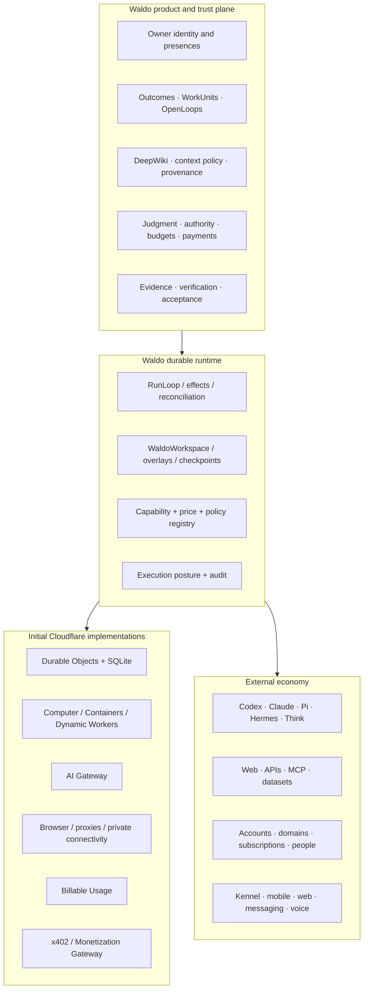

# Cloudflare's Agentic Economy Thesis and Waldo Adoption Plan

**Date:** 2026-08-04
**Status:** source-backed product and architecture research
**Scope:** recent Cloudflare first-party posts through the live 2026-08-04 feed refresh
**Evidence language:** Observed fact, Inference, Proposed decision, Unknown
**Decision language:** Adopt, Adapt, Spike, Defer, Reject

## Executive conclusion

Cloudflare is assembling an agent-native Internet stack rather than a single agent product:

```text
agent framework / channels / UI
        ↓
provider-neutral harness
        ↓
durable agent runtime and filesystem
        ↓
isolated execution, browser, tools, private connectivity
        ↓
purpose-declared identity, authorization, credentials
        ↓
discovery, metering, payment, attribution, source policy
        ↓
Internet and cloud infrastructure
```

**[Inference]** The industry is moving from assistants that call APIs toward autonomous economic actors that can discover services, obtain bounded identity, pay, execute, verify, and account for their work. The scarce product asset will not be the agent loop. It will be the trusted relationship with the person: intent, context, authority, judgment, evidence, acceptance, and continuity.

**[Proposed decision — Adopt]** Waldo should become that user-owned control plane. Cloudflare can supply initial runtime, workspace, security, model, protocol, and economic primitives behind replaceable Waldo contracts.

## Source refresh

The Agents Week tag/RSS showed the August 2 welcome and five August 3 posts at refresh time; no newer post was visible yet. Later-week announcements remain a required refresh.

| Date | Primary source | Relevant thesis |
|---|---|---|
| 2026-08-02 | [Welcome to Agents Week](https://blog.cloudflare.com/agents-week-welcome/) | Cloud must support agent-native primitives while translating the human-shaped web; scope spans execution, agentic development, secure systems-of-record access, discovery, and payments |
| 2026-08-03 | [Cloudflare Computer](https://blog.cloudflare.com/cloudflare-computer/) | An agent needs a persistent workspace plus selectable execution backends, not merely an ephemeral container |
| 2026-08-03 | [Python↔JavaScript Workers RPC](https://blog.cloudflare.com/python-workers-rpc/) | Polyglot components can compose through native-looking RPC |
| 2026-08-03 | [Kimi/GLM serving](https://blog.cloudflare.com/smaller-faster-safer-models/) | Model-serving efficiency and integrity become platform concerns |
| 2026-08-03 | [Inbound TCP and gRPC](https://blog.cloudflare.com/grpc-workers/) | Agent infrastructure is expanding beyond HTTP request/response |
| 2026-08-03 | [Billable Usage API](https://blog.cloudflare.com/billable-usage-api/) | Programmatic infrastructure cost visibility becomes a platform primitive |
| 2026-07-13 | [Precursor](https://blog.cloudflare.com/introducing-precursor/) | Security is shifting from checkpoint identity to continuous session behavior |
| 2026-07-01 | [Agent/Search/Training controls](https://blog.cloudflare.com/content-independence-day-ai-options/) | Automated access must declare purpose; policy should govern behavior, storage, and resharing |
| 2026-07-01 | [Attribution Business Insights](https://blog.cloudflare.com/attribution-business-insights/) | Content owners need visibility into who consumed content, for what purpose, and what value returned |
| 2026-07-01 | [Making AI search smarter](https://blog.cloudflare.com/making-ai-search-smarter/) | Freshness/change signals can reduce recrawling; economics move from crawl/click toward query, result, use, and outcome |
| 2026-07-01 | [Monetization Gateway](https://blog.cloudflare.com/monetization-gateway/) | APIs, datasets, pages, and MCP tools become metered resources payable inside HTTP via x402 |
| 2026-06-19 | [Temporary accounts for agents](https://blog.cloudflare.com/temporary-accounts/) | Agents need expiring, claimable accounts and throwaway deploy/verify loops without permanent credentials |
| 2026-06-17 | [Harness/platform layering and Flue](https://blog.cloudflare.com/agents-platform-flue-sdk/) | Runtime, harness, and framework are separate layers; channels and UI sit above durable primitives |
| 2026-06-05 | [AI Gateway spend limits](https://blog.cloudflare.com/ai-gateway-spend-limits/) | Real-time budgets and routing need model/provider/user/application attribution |
| 2026-05-19 | [Claude Managed Agents](https://blog.cloudflare.com/claude-managed-agents/) | Agent loop can stay provider-hosted while Cloudflare supplies sandboxes, proxies, private connectivity, credentials, browsers, and observability |
| 2026-04-30 | [Agents create accounts, buy domains, and deploy](https://blog.cloudflare.com/agents-stripe-projects/) | Agent commerce decomposes into discovery, authorization, and payment, with humans at permission/terms boundaries |
| 2026-04-17 | [Agent Memory](https://blog.cloudflare.com/introducing-agent-memory/) | Derived session memory, recall, supersession, temporal reasoning, and export are distinct from file search; private beta |
| 2026-04-16 | [Artifacts](https://blog.cloudflare.com/artifacts-git-for-agents-beta/) | Git-compatible versioned repositories become a handoff and isolation primitive; closed beta |
| 2026-04-16 | [AI Search](https://blog.cloudflare.com/ai-search-agent-primitive/) | Dynamically created hybrid-search instances provide a retrieval primitive over files/data |
| 2026-04-15 | [Browser Run](https://blog.cloudflare.com/browser-run-for-ai-agents/) | Live View, human handoff, CDP, recordings, and WebMCP bridge human and agent-native interaction |
| 2026-04-14 | [Enterprise MCP governance](https://blog.cloudflare.com/enterprise-mcp/) | Remote servers, portals, OAuth, default-deny writes, DLP, discovery, audit, and Shadow MCP detection govern enterprise tools |
| 2026-04-14 | [Non-human identity security](https://blog.cloudflare.com/improved-developer-security/) | OAuth visibility, automated revocation, token scanning, and resource-scoped permissions address machine identities |
| 2026-04-13 | [Sandbox authentication](https://blog.cloudflare.com/sandbox-auth/) | Identity-aware egress proxies inject credentials and enforce policy without exposing reusable secrets to untrusted code |
| 2026-02-20 | [Code Mode MCP](https://blog.cloudflare.com/code-mode-mcp/) | Progressive API discovery plus sandboxed composition reduces enormous tool catalogs to a small search/execute surface |

### Maturity and evidence limits

- **[Observed fact]** April 12–20 and the new August 2 launch are separate Agents Week cycles. The August feed was still incomplete at this refresh.
- **[Observed fact]** Computer is preview/not production; Agent Memory is private beta; Artifacts is closed beta; TCP/gRPC is private beta; Monetization Gateway is early/waitlist. None is a production guarantee for Waldo.
- **[Unknown]** Computer does not yet publish sufficient Waldo-grade guarantees for personal-memory durability, backup/restore, encryption, deletion, regional placement, quota behavior, or container/DO synchronization under failure.
- **[Unknown]** Cloudflare's serving evaluations do not prove Waldo planning, tool accuracy, privacy, judgment, or false-completion performance.
- **[Observed fact]** Cloudflare's “more than 50% non-human” traffic claim is a Cloudflare network/methodology signal, not an independently established measurement of all Internet traffic.
- **[Proposed decision — Adopt]** Treat every preview/beta source as a hypothesis and adapter candidate with feature flag, conformance gates, rollback, and an owned export path.

## Fourteen industry moves and what Waldo should do

### 1. The agent loop is being commoditized

**[Observed fact]** Cloudflare explicitly separates framework, harness, and runtime/platform. It aims to make durable execution, dynamic code execution, filesystem, and workflows usable by multiple harnesses.

**[Inference]** Codex, Claude, Pi, Hermes, Think, and future loops will differentiate less at the infrastructure boundary. Binding Waldo identity or memory to one loop would create the wrong moat.

**[Proposed decision — Adopt]** Keep WaldoCoordinator above provider-neutral harness and execution adapters. Waldo's differentiated layer is durable user intent, context policy, judgment, evidence, acceptance, and Open Loops.

### 2. Persistent workspace is becoming a first-class agent primitive

**[Observed fact]** Computer provides a Durable Object-backed filesystem and interchangeable container, Worker-shell, and JavaScript execution. Its pinned README says it is preview-only, approximately 10 GB per workspace, and aimed at agent-scale rather than heavy monorepo workloads. [Pinned source](https://github.com/cloudflare/computer/blob/63d363632e558f7e077794988d36ed75017c2a62/packages/computer/README.md#L1-L36)

**[Proposed decision — Spike]** Add `WaldoWorkspace`, `WorkspaceCatalog`, DeepWiki projection, WorkUnit overlays, and local/cloud session checkpoints. Use Computer as the first experimental `WorkspaceAdapter` and `ExecutionEnvironmentAdapter`, never as the contract.

**[Proposed decision — Adapt]** Store hot mutable knowledge, indexes, checkpoints, and active artifacts in the workspace. Retain R2/Artifacts for large, immutable, cold, shared, and recovery data.

### 3. Agents are becoming account holders and economic actors

**[Observed fact]** Cloudflare now supports temporary agent-created deployments and a separate flow in which agents can discover services, link/create accounts, obtain credentials, pay, purchase domains, and deploy, with human approval and terms acceptance at defined boundaries.

**[Inference]** The agentic economy needs an identity and authority layer between the person and agent-created accounts, subscriptions, purchases, and credentials.

**[Proposed decision — Adapt]** Introduce `ExternalAccountIntent`, `SubscriptionIntent`, `PurchaseIntent`, `TermsAcceptanceRequest`, `PaymentAuthorization`, and `AccountReceipt` as effect families. The account belongs to the user, not the executor session.

**[Proposed decision — Adopt]** Use expiring, claimable, disposable accounts/environments for build–deploy–verify experiments. They are ideal for reversible WorkUnits and should auto-expire when not promoted.

**[Proposed decision — Reject]** No autonomous general wallet, self-approved terms, permanent credential creation, or unbounded subscription authority.

### 4. Discovery, authorization, and payment form a new universal protocol

**[Observed fact]** Cloudflare's agent deployment flow identifies discovery, authorization, and payment as the three components needed for agents to provision services.

**[Proposed decision — Adopt]** Extend Waldo capability manifests with:

```text
service discovery
  → exact capability and price quote
  → identity/owner attestation
  → AuthorityGrant and terms judgment
  → PaymentAuthorization and budget reservation
  → EffectIntent
  → provider receipt
  → independent verification
  → acceptance or dispute/reconciliation
```

This should govern paid MCP tools, data, APIs, domains, subscriptions, compute, and human services.

### 5. The web is becoming purpose-declared

**[Observed fact]** Cloudflare is distinguishing Search, Agent, and Training by behavior and purpose rather than one generic “AI bot” label. It encourages operators with multiple purposes to separate their automation.

**[Proposed decision — Adopt]** Every Waldo web request should declare a machine-readable purpose:

```ts
type WebPurpose =
  | { kind: "agent_realtime"; ownerAttestation: string; outcomeRef: string }
  | { kind: "search_index"; indexPolicy: string; retention: string }
  | { kind: "training"; datasetPolicy: string }
  | { kind: "verification"; claimRef: string };
```

Waldo should normally operate as `agent_realtime`, use source-specific index permission for DeepWiki ingestion, and never silently turn retrieved material into training data.

**[Proposed decision — Reject]** Do not imitate human mouse/keyboard behavior to evade agent detection. Prefer APIs/MCP, identify the agent honestly, honor site policies, and surface blocked access to the user.

### 6. Provenance and source economics become product features

**[Observed fact]** Cloudflare's content posts argue that crawl/referral economics are breaking, expose attribution by operator and purpose, explore freshness/change signals, and experiment with pay-per-query/result/use. Cloudflare explicitly describes “outcome” as an emerging unit of value.

**[Proposed decision — Adopt]** DeepWiki ingestion must record source, purpose, permission, retrieved version/digest, freshness, expiry, quotation/use, and derived artifacts. Avoid re-fetching unchanged sources.

**[Proposed decision — Adapt]** Add `SourceUsageReceipt` and `AttributionEvent` so Waldo can explain which sources materially contributed to an artifact or accepted Outcome. This supports citations, deletion, licensing, cost, and future compensation.

**[Proposed decision — Reject]** Do not build a private corpus by indiscriminately copying the open web. Store the minimum licensed/allowed material, source-linked claims, and hashes; refresh from source when possible.

### 7. APIs, data, and MCP tools become metered goods

**[Observed fact]** Monetization Gateway is designed to charge for pages, datasets, APIs, and MCP tool calls through x402, moving payment proof into ordinary HTTP requests.

**[Inference]** Waldo will both consume paid capabilities and potentially distribute paid capabilities to other agents.

**[Proposed decision — Spike]** Add an x402-aware `PaidCapabilityAdapter`, but route every payment through Waldo's existing effect invariants: frozen quote, price/currency/network, expiry, budget reservation, authority, idempotency, receipt, dispute/reconciliation, and evidence of delivered value.

**[Proposed decision — Adapt]** Waldo's MCP distribution could charge per verified research result, verification, connector operation, governed execution minute, or accepted bounded Outcome—not for raw access to the user's personal memory.

### 8. Cost and value attribution move down to each agent action

**[Observed fact]** AI Gateway supports real-time spend limits scoped by model, provider, and custom identity/application attributes; Billable Usage provides delayed account/product reconciliation.

**[Proposed decision — Adopt]** Attribute reservation, estimate, actual cost, and value to:

```text
Outcome → Mission → WorkUnit → AgentSession → model/tool/executor/effect
```

Use AI Gateway for real-time model budgets, Waldo's ledger for WorkUnit/Outcome attribution, and Billable Usage for daily infrastructure reconciliation.

**[Proposed decision — Adapt]** Fallback routing is allowed only when the alternate model/provider is semantically compatible and conformance-passed. A cheaper model must not silently weaken authority, privacy, tool correctness, or verification.

### 9. Agent security becomes continuous and behavior-aware

**[Observed fact]** Precursor evaluates privacy-minimized session signals continuously rather than relying only on login/checkpoint challenges. Claude Managed Agents uses proxies for credential injection, exfiltration controls, private connectivity, browser audit, and sandbox observability.

**[Proposed decision — Adopt]** Waldo needs continuous `ExecutionPosture` rather than one-time approval:

- current executor/manifest and attestation;
- network destinations and policy violations;
- credential handle usage without secret values;
- filesystem mutations and artifact hashes;
- process/session resource behavior;
- browser action audit;
- cancellation/lease generation;
- anomalous tool/effect sequences.

**[Proposed decision — Adapt]** Use behavioral signals for risk and containment, never to create opaque personality or productivity profiles of the user.

### 10. Headless agents still require human-visible surfaces

**[Observed fact]** Flue emphasizes channels such as Slack/GitHub/Linear/Discord and frontend hooks that expose state, tool execution, and messages for headless agents.

**[Proposed decision — Adopt]** Waldo should be headless-capable but never a black box. Kennel, mobile, web, messaging, and voice consume the same projections and Needs You protocol. External channels are presences; they are not separate memories or runtimes.

### 11. Workspace, artifacts, search, and memory are different products

**[Observed fact]** Cloudflare now separates active mutable workspace (Computer), Git-compatible versioned handoff (Artifacts), file/document retrieval (AI Search), and session-derived context recall (Agent Memory). Agent Memory explicitly argues that constrained ingestion/retrieval is a better default than giving the model raw database/filesystem access, and that search and memory solve different problems.

**[Proposed decision — Adopt]** Waldo should mirror the separation behind portable contracts:

| Layer | Waldo owner | Initial adapter candidate |
|---|---|---|
| Active filesystem | `WorkspaceAdapter` | Computer preview |
| Versioned handoff/overlay | `ArtifactStoreAdapter` | Git/R2 now; Cloudflare Artifacts spike |
| File/document retrieval | `KnowledgeIndexAdapter` | Existing retrieval; AI Search spike |
| Correctable personal context | `ContextClaimStore` + memory policy | Waldo-owned canonical reducer; Agent Memory benchmark only |
| Large/cold/immutable bytes | `BlobStoreAdapter` | R2/Artifacts |

**[Proposed decision — Adapt]** Borrow content-addressed ingestion, source-line provenance, extract→verify→classify pipelines, supersession chains, hybrid retrieval, deterministic temporal computation, and exportability.

**[Proposed decision — Reject]** A model-generated memory, raw filesystem page, search result, or Cloudflare memory profile cannot become authoritative Waldo memory without provenance, classification, correction state, and owner policy. User statements and corrections remain superior evidence.

### 12. Tool distribution is moving from huge catalogs to progressive discovery

**[Observed fact]** Code Mode exposes Cloudflare's large API through two operations—search and execute—rather than loading thousands of endpoint schemas. Generated code runs in a Dynamic Worker without filesystem/environment access and with outbound fetch disabled by default. Cloudflare reports a major schema-token reduction for its API.

**[Inference]** MCP catalogs will become too large and dynamic to place wholly in model context. Discovery and composition become runtime services.

**[Proposed decision — Adapt]** Give Waldo's MCP gateway a small semantic surface:

```text
discover_capabilities(requirements, purpose)
inspect_capability(capability_ref)
prepare_operation(capability_ref, canonical_args)
request_effect(prepared_operation_ref, authority_ref)
get_operation_status(operation_ref)
```

Reads may be composed inside a constrained code sandbox. Every mutation must exit that sandbox through a typed Waldo `EffectIntent`; an opaque script cannot bundle irreversible operations outside the effect ledger.

**[Proposed decision — Adopt]** Enterprise MCP patterns apply even for a personal agent: remote/governed servers, source/version registry, policy-filtered tool disclosure, default-deny writes, centralized audit, secret brokerage, revocation, and discovery portal. Kennel-local MCP is allowed only through the same registry and provenance checks.

### 13. Credentials move out of the execution environment

**[Observed fact]** Cloudflare's sandbox pattern places a programmable egress proxy between untrusted execution and external services. The proxy can inject credentials, log/modify/block requests, and apply policy using workload identity; the sandbox never needs the reusable secret.

**[Proposed decision — Adopt]** Add a `CredentialBroker` and `EgressPolicyAdapter`:

```text
principal + owner + WorkUnit + lease + destination + method + scope
  → short-lived workload attestation
  → trusted egress proxy
  → credential injection or token exchange
  → request/effect audit without secret value
```

Every identity is audience-, resource-, purpose-, lease-, and expiry-bound. Revocation generation is checked after suspension. A provider session, Computer workspace, container, MCP client, or generated program never receives a general reusable credential.

### 14. Browsers remain a translation layer, not the ideal agent interface

**[Observed fact]** Browser Run adds live view, human takeover, CDP, recordings, and WebMCP. Cloudflare's Agent Cloud thesis describes infrastructure as a translation layer between today's human-shaped web and an emerging agent-shaped web.

**[Proposed decision — Adapt]** Use browser execution for the long tail where no safe API/MCP exists, with live supervision, recordings, declared agent purpose, bounded domain/operation policy, and a durable checkpoint before consequential UI actions.

**[Proposed decision — Adopt]** Prefer declarative WebMCP/API operations when available because they expose semantic intent and make authority, arguments, idempotency, and receipts easier to govern.

**[Proposed decision — Reject]** Browser recordings or “action succeeded” UI observations are not Outcome verification. A mutating browser action still requires frozen intent, reconciliation where possible, and independent external-state evidence.

## Revised agentic stack for Waldo



## Concrete capabilities to add to the architecture backlog

| Capability | Decision | First product use |
|---|---|---|
| `WaldoWorkspace` and DeepWiki | **Spike/Adapt** | Durable user knowledge and cloud/local session continuity |
| WorkUnit filesystem overlays | **Adopt** | Multiple agents safely use one source snapshot |
| Separate workspace/artifact/index/memory ports | **Adopt** | Prevent filesystem or vendor memory from becoming product truth |
| Cloudflare Artifacts | **Spike** | Versioned session/WorkUnit handoff and verifier input |
| AI Search | **Spike** | Replaceable retrieval index over permitted DeepWiki/source corpora |
| Agent Memory | **Defer** as production store; benchmark patterns | Compare extraction/recall while Waldo keeps canonical correction/provenance |
| Environment routing | **Adopt** | Kennel vs isolate vs Linux vs provider cloud |
| Temporary account/environment intent | **Adapt** | Throwaway deploy-and-verify loop |
| External account/subscription/domain effects | **Defer** until exact authority UX | Agent completes a business setup flow for the user |
| Purpose-declared web access | **Adopt** | Honest agent retrieval and source-policy compliance |
| Source freshness/change manifest | **Adopt** | Avoid redundant DeepWiki ingestion and stale context |
| SourceUsageReceipt/AttributionEvent | **Adapt** | Explain citations, cost, licensing, deletion, and value |
| Paid capability/x402 adapter | **Spike** | Buy one bounded dataset/API/MCP result under budget |
| Waldo MCP monetization | **Defer** until free protocol works | Sell governed verification/execution, never private memory |
| Outcome/WorkUnit cost ledger | **Adopt** | Model/executor budget and unit economics |
| Real-time AI Gateway budget | **Adapt** | Prevent provider/model overspend |
| Continuous ExecutionPosture | **Adopt** | Detect exfiltration, drift, orphaned execution, policy breaches |
| Agent identity/purpose attestation | **Spike** | Sites/services can distinguish Waldo acting for an owner |
| Credential broker and identity-aware egress | **Adopt** | Inject destination-scoped auth without exposing secrets to sandboxes |
| Progressive Code Mode discovery | **Adapt** | Keep large API/MCP catalogs out of context; route writes through EffectIntent |
| Browser Run/WebMCP adapter | **Spike/Adapt** | Supervised human-web translation with semantic actions when available |
| Channel/presence SDK | **Adopt** | Distribute Waldo through Slack, IDEs, web, voice, and other harnesses |

## What Waldo should sell in the agentic economy

**[Inference]** Selling another generic agent or chat seat is a weak position. Waldo's defensible economic units are governed work and trusted continuity.

Potential units:

- verified WorkUnit execution;
- independent verification;
- governed connector/effect operation;
- durable agent workspace;
- cross-provider session continuity;
- accepted Outcome orchestration;
- source-attributed research result;
- enterprise/user policy and audit layer for third-party harnesses.

Do not monetize:

- raw personal memory;
- health-derived context;
- complete transcripts;
- user relationship graphs;
- credentials;
- inferred personality claims.

## Sequenced adoption

### Now

1. Ratify Waldo runtime/harness/product layering.
2. Add workspace, overlay, checkpoint, source-purpose, attribution, and cost contracts.
3. Build DeepWiki as an inspectable projection with provenance/corrections.
4. Add per-Outcome/WorkUnit cost and execution-posture events.
5. Make every web/source adapter declare purpose and retention.

### First spikes

1. Computer-backed small workspace versus current DO/R2 design.
2. Kennel → cloud checkpoint/re-entry, not process migration.
3. Temporary deploy–verify environment with expiry and claim.
4. One paid data/MCP request with frozen quote and user-approved budget.
5. One source freshness/change flow proving avoided re-ingestion.

### Later

1. Account, subscription, domain, and agent purchase effect families.
2. Signed Waldo agent identity/purpose attestation.
3. Capability marketplace and outcome-priced services.
4. TCP/gRPC only after measured transport need.

### Explicitly reject

1. Cloudflare-specific types in Waldo's canonical domain contracts.
2. Preview Computer as the only copy of personal knowledge.
3. Human impersonation or bot-defense evasion.
4. Whole-web copying into DeepWiki.
5. Self-issued credentials, terms acceptance, or spending authority.
6. Payment or model fallback that silently changes quality/privacy guarantees.
7. “Human out of the loop” as a product objective; humans leave routine execution but remain at consequential judgment and acceptance.

## Hypotheses and falsifiers

| Hypothesis | Falsifier |
|---|---|
| Durable workspace materially improves continuity | Re-entry quality and task completion do not improve relative to event/artifact references alone |
| DeepWiki is valuable and inspectable | Users do not consult/correct it or it increases stale-context errors |
| Purpose declaration earns better access/trust | Sites/services do not distinguish declared agent use or policies remain incompatible |
| Outcome attribution is a useful economic unit | Cost/value cannot be assigned without arbitrary allocation or users reject outcome-priced services |
| Temporary environments accelerate verification | Provision/claim/cleanup complexity exceeds saved setup time |
| Paid capabilities improve quality | Free/owned sources match quality while paid calls add approval burden/cost |
| Continuous posture improves safety | It adds surveillance/noise without catching policy or exfiltration failures |
| Cloud offload expands Waldo's usefulness | Users prefer local-only execution or cloud context restrictions make results materially worse |

## Final product thesis

Cloudflare's bet is that agents become major users of cloud infrastructure and the web. They need storage, execution, identity, secure access, discovery, payments, attribution, and cost control designed for machine operation.

Waldo's corresponding bet should be:

> The agentic economy still needs someone who represents the person—not the provider, website, employer, model, or payment rail. Waldo is that durable representative. It can discover, buy, execute, verify, and coordinate across the agentic Internet, but only through the person's context, authority, evidence, and conscious closure.
