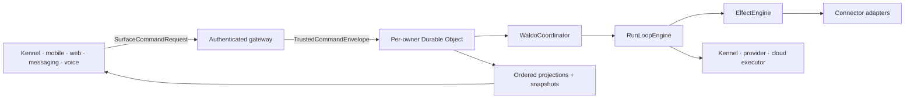

# Waldo Architecture Lock and Whole-Product Build Direction

**Status:** founder-approved build-direction lock; formal ADR reconciliation is required before conflicting code merges
**Date:** 2026-08-05
**Scope:** Waldo backend agent, Kennel desktop presence/executor, other presences, governed execution, continuity, workspace, connectors, and distribution contracts
**Primary design:** [`WALDO_FINAL_HOME_WORK_BACKEND_ARCHITECTURE_PLAN_2026-08-04.md`](./WALDO_FINAL_HOME_WORK_BACKEND_ARCHITECTURE_PLAN_2026-08-04.md)
**Product envelope:** [`WALDO_PRODUCT_CAPABILITY_MATRIX_AND_THESIS_VALIDATION_2026-08-04.md`](./WALDO_PRODUCT_CAPABILITY_MATRIX_AND_THESIS_VALIDATION_2026-08-04.md)
**Cloud implementation choices:** [`CLOUDFLARE_AGENTIC_ECONOMY_AND_WALDO_ADOPTION_2026-08-04.md`](./CLOUDFLARE_AGENTIC_ECONOMY_AND_WALDO_ADOPTION_2026-08-04.md)

## 1. Lock verdict

**[Decision — locked] Lock ownership and semantics now; select, prove, and replace implementations during building.** The architecture is ready for backend and Kennel implementation to begin in parallel. A model, provider, harness, connector, storage vendor, cloud executor, protocol revision, or UI composition may be selected during building behind its locked Interface and conformance suite. Those choices do not reopen Waldo's identity, authority, state ownership, effect, evidence, acceptance, or continuity model.

Accepted ADRs remain the repository's ratified architecture authority until amended or superseded with rationale and migration history. This founder-approved lock authorizes contract work and compatible implementation now; when a work item conflicts with an accepted ADR, its ADR reconciliation must merge before the conflicting code. This document defines target direction and build constraints, not shipped behavior or unilateral ADR ratification.

**[Decision — locked] This is a whole-product build, not a sequence of product slices.** Every software capability marked committed in the product matrix remains in scope. Dependency edges, parallel workstreams, contract releases, integration scenarios, and proof gates organize the work; they do not define smaller versions of the product or authorize silent scope cuts. Team size is not an architecture or product-scope constraint.

**[Decision — locked] Online backend authority is required for the current product.** Protocol/capability version 0.1 advertises `offlineCommands: "none"`. While disconnected, Kennel, mobile, and every other presence cannot create or queue commands, submit approval, mint authority, execute Waldo work, change canonical state, or claim completion. A presence may display an explicitly stale last-synced projection as read-only presentation; that is not offline Waldo functionality. Local-LLM support may be added later as an online-governed, evaluated provider/executor adapter; it does not create offline authority or an offline truth fork.

**[Accepted-ADR conflict — blocked from silent reconciliation]** Accepted ADR-0077 permits app-local drafts/offline queues that never become committed messages, and accepted ADR-0082 defines retained offline chat drafts. The current founder decision is stricter: protocol 0.1 permits no disconnected command creation or queue. Neither ADR is modified by this planning update; implementation that removes or retains those draft paths requires an explicit ADR reconciliation before merge.

### 1.1 Product-level lock

> **[Decision — locked]** A person can tell Waldo, **“Make sure this gets handled,”** and Waldo carries the responsibility until the real-world result is verified, accepted, reopened, or consciously released—without taking control away from the person.

Architecture exists to preserve that relationship. A module, contract, provider, integration, workspace, or UI is valuable only when it improves continuity, follow-through, execution, well-timed judgment, or honest completion. Agent launches, messages sent, tool calls, generated artifacts, and provider `done` states are observations; none is the product result.

## 2. Whole-product thesis checksum

The locked architecture must produce one Waldo that owns both personal assistance and work orchestration, including their bridge:

- one user-owned identity and correctable continuity across Home and Work;
- Capture, Outcome, optional Mission, WorkUnit, Judgment, Authority, Artifact, Evidence, Verification, Acceptance, Open Loop, and exact ReEntryPoint;
- Morning Brief, Catch Up, meeting preparation/follow-through, commitments, restrained proactivity, and Daily Close;
- provider-neutral multi-agent supervision through Kennel and future presences;
- local and cloud execution through portable workspace/checkpoint contracts;
- connectors and effectful work with intent-before-I/O, reconciliation, receipts, and terminal ambiguity;
- governed context, credentials, capability discovery, routines, skills, integration recipes, and capability packages;
- inspectable knowledge projections, export/import/deletion, source provenance, and cross-surface protocol;
- distribution into other harnesses without distributing Waldo identity, memory authority, acceptance, or closure.

Health/body context remains optional, consented, passive context inside an existing user-grounded purpose. It is not Waldo's product category, agenda, priority engine, or source of authority.

## 3. Locked authority and placement



1. Waldo backend owns identity binding, canonical product state, admission, context policy, authority, acceptance, Open Loop closure, and ordered projections.
2. Kennel is Waldo's first desktop presence and local executor. **Kennel proposes; the owner Durable Object admits.** Kennel owns local operation durability and workspace processes, never canonical Outcome, authority, memory, acceptance, or closure.
3. `WaldoCoordinator` is logically above provider/executor adapters and is physically hosted with `RunLoopEngine` in the per-owner Durable Object and SQLite transaction boundary until measured evidence requires another placement.
4. Providers, harnesses, connectors, people, and execution environments return untrusted observations, receipts, and candidate evidence. Their `done` state changes no Waldo product truth by implication.
5. No transitive delegation exists. A downstream executor receives the intersection of the owner's current grant, WorkUnit ceiling, adapter capability, purpose, resource, audience, lease, expiry, and revocation generation.

### 3.1 Canonical Kennel implementation boundary

- **[Observed fact]** [`Developerr86/Kennel@9184f83`](https://github.com/Developerr86/Kennel/commit/9184f8303ccc4feb339582327d5d26adcc190b73) is an ancestor baseline of the canonical [`Pin4sf/kennel`](https://github.com/Pin4sf/kennel) repository. New Waldo integration targets `Pin4sf/kennel`; the upstream repository remains source history, not a separate product authority.
- **[Observed fact]** Current Kennel has substantial desktop execution and supervision behavior, while its Outcome/Mission/WorkUnit records and contract v3 are local and no canonical Waldo backend client exists.
- **[Decision — locked · Adapt]** Kennel retains the desktop Island/Work/Needs You experience, persistent local daemon, provider supervision, worktrees/files/terminals, device-local operation ledger and recovery, provider-specific adapters, and an explicitly stale read-only projection cache.
- **[Decision — locked · Adopt]** The backend owns Waldo identity, responsibility/Outcome truth, commitments, context policy, authority and judgments, effects, verification, Acceptance, OpenLoops, and ReEntryPoints. Kennel reports untrusted session observations and candidate evidence through the shared protocol.
- **[Decision — locked · Reject]** Do not overwrite Kennel wholesale or keep its local product database as a second canonical writer. Cut over aggregate by aggregate behind compatibility adapters, reconciliation, and rollback.

### 3.2 Agent Governance Layer

**[Proposed decision — Adopt]** Waldo's Agent Governance Layer is the first-party, owner-side control system between a person's intent and every model, agent, tool, connector, human executor, or execution environment acting on their behalf.

It governs which authenticated command is admitted; what purpose-bound context may be disclosed; which capability may run; under whose current, exact, and revocable authority; with which credential, budget, lease, egress, and containment limits; what evidence is required before Acceptance or Open Loop closure; and how the owner corrects, revokes, exports, and deletes state. Providers execute and return untrusted observations. They never own Waldo identity, canonical `ContextClaim` truth, `AuthorityGrant`, Acceptance, or closure.

Agent Governance is cross-cutting policy and enforcement, not a new central module or durable writer. Existing owners compose it:

| Governance responsibility | Existing owner |
|---|---|
| Authenticate presence and admit an owner-bound command | Gateway + `IdentityPresenceModule` |
| Compile minimum purpose-bound context | `ContextCompiler` |
| Create, revalidate, revoke, and consume exact authority | `JudgmentAuthorityModule` + `EffectEngine` |
| Admit and revoke executable behavior and capabilities | `CapabilityRegistry` + `BehaviorPackageRegistry` |
| Bind workload identity and broker credentials outside model context | `WorkloadIdentityModule` + credential broker |
| Enforce spend, lease, egress, and containment limits | `BudgetLedger` + `PostureModule` |
| Separate observations from verification and human/delegated acceptance | `EvidenceVerifier` + `AcceptanceModule` |
| Preserve, correct, export, delete, and prevent resurrection of continuity | `ContinuityModule` + `PortabilityModule` + `DeletionCoordinator` |

The [definitive aggregate-writer matrix](#5-definitive-aggregate-writer-matrix) remains normative. This synthesis neither grants the Coordinator direct writes nor changes any sole-writer boundary.

## 4. Cross-repository protocol v0.1

The backend publishes the canonical schema package. Kennel and every other consumer bind to released schemas and the same golden fixtures; neither repository carries handwritten parallel DTOs.

```ts
interface SurfaceCommandRequest<T> {
  protocolVersion: "0.1";
  requestId: ID;
  commandType: string;
  presenceRegistrationId: ID;
  aggregate?: { kind: string; id: ID; expectedRevision?: number };
  correlationId?: ID;
  clientIssuedAt: Timestamp;
  payload: T;
}

interface TrustedCommandEnvelope<T> {
  protocolVersion: "0.1";
  commandId: ID;
  commandType: string;
  ownerId: ID;
  actor: ActorRef;
  presenceId: ID;
  authenticatedSessionId: ID;
  ownerPolicyRevision: number;
  authAssurance: string;
  ownerRootRoutingVersion: number;
  aggregate?: AggregateRef;
  expectedRevision?: number;
  requestDigest: Digest;
  causationId?: ID;
  correlationId: ID;
  receivedAt: Timestamp;
  payload: T;
}

interface PresenceCapabilityV01 {
  protocolVersion: "0.1";
  offlineCommands: "none";
}
```

`SurfaceCommandRequest` is untrusted. It cannot contain an authoritative `ownerId`, actor role, target Durable Object, `AuthorityGrant`, credential, model/provider selector, acceptance, or closure decision. The authenticated gateway derives those server-owned fields, rejects any client attempt to supply them, and creates `TrustedCommandEnvelope` only after session, presence, owner, schema, replay, and policy checks.

The initial projection contract includes snapshot and cursor semantics rather than retrofitting them later:

```ts
interface ProjectionPage<T> {
  protocolVersion: "0.1";
  ownerId: ID;
  projectionName: string;
  snapshotId: ID;
  snapshotBaseCursor: number;
  fromExclusiveCursor: number;
  highWaterCursor: number;
  nextCursor: number;
  items: T[];
  hasMore: boolean;
  generatedAt: Timestamp;
}
```

Owner cursors are monotonic inside one authority root. Consumers detect gaps, duplicates, stale snapshots, snapshot replacement, incompatible versions, and owner changes. Golden fixtures cover request rejection, server enrichment, cursor replay, snapshot replacement, account switch, duplicate IDs with changed digests, and current/previous compatible reads.

Every public gateway route enforces authentication, owner/presence authorization, strict schema and size validation, request-digest replay/conflict checks, and bounded per-session/per-owner/per-source rate limits before expensive or stateful work. Rejections use a versioned, content-free generic problem envelope that exposes no owner, Durable Object, policy, provider, credential, or internal-state detail.

## 5. Definitive aggregate-writer matrix

One named reducer is the only durable writer for each aggregate. `WaldoCoordinator` authenticates, authorizes, and sequences cross-aggregate commands; it does not write another module's tables directly.

| Aggregate or ledger | Sole durable writer | Durable location | Admitted input |
|---|---|---|---|
| WaldoIdentity, Presence | `IdentityPresenceModule` | Per-owner DO SQLite | Authenticated account/presence lifecycle command |
| Capture, Outcome, Mission, WorkUnit | `OutcomeModule` | Per-owner DO SQLite | Trusted owner command or authorized internal command |
| JudgmentRequest, JudgmentDecision, AuthorityGrant, SensitiveHandoff | `JudgmentAuthorityModule` | Per-owner DO SQLite | Trusted answer/handoff lifecycle plus current policy/revision checks |
| ExecutionRequest, RuntimeRun, AgentSession, ExecutionLease | `RunLoopEngine` | Per-owner DO SQLite | Authorized Coordinator outbox command |
| EffectIntent, EffectReceipt, reconciliation state | `EffectEngine` | Per-owner DO SQLite | Admitted effect command and adapter observation |
| Evidence, Verification | `EvidenceVerifier` | Per-owner DO SQLite plus bounded evidence refs | Attributable candidate evidence or verifier result |
| Acceptance | `AcceptanceModule` | Per-owner DO SQLite | Explicit/delegated decision bound to revision and evidence digest |
| Commitment, Schedule, TriggerOccurrence | `CommitmentScheduler` | Per-owner DO SQLite | Authorized schedule/commitment command |
| ContextClaim, Spot, Episode, Constellation, OpenLoop, ReEntryPoint | `ContinuityModule` | Per-owner DO SQLite | Provenance-bearing proposal, correction, or authorized lifecycle command |
| Artifact metadata and lifecycle | `ArtifactRegistry` | Per-owner DO SQLite; bytes through `BlobStorePort` | Content-addressed artifact registration/lifecycle command |
| Workspace metadata, checkpoints, restore attempts | `WorkspaceModule` | Per-owner DO SQLite; encrypted chunks through `BlobStorePort` | Workspace adapter checkpoint/restore observation |
| Capability manifests and eligibility | `CapabilityRegistry` | Versioned registry plus per-owner policy | Source-pinned manifest and conformance result |
| ContextProjection and projection recipes | `ContextCompiler` | Per-owner DO SQLite plus source references | Purpose-bound compilation command and attributable source observations |
| BudgetReservation, UsageReceipt | `BudgetLedger` | Per-owner DO SQLite plus provider reconciliation | Authorized reservation and attributable usage observation |
| SourceUsageReceipt, AttributionEvent | `SourceAttributionLedger` | Per-owner DO SQLite | Purpose-bound source retrieval/use observation |
| ExternalDelegationRequest/Disposition, DelegationReply, SharedContextGrant | `DelegationModule` | Per-owner DO SQLite | Authorized counterparty command and untrusted reply observation |
| ExecutionPrincipal, WorkloadIdentity, DelegationGrant, CredentialHandle metadata | `WorkloadIdentityModule` | Per-owner DO SQLite; secret value remains in broker/vault | Authorized execution/delegation command and broker receipt |
| ProtocolBinding and protocol-adapter mapping state | `ProtocolBindingRegistry` | Versioned registry plus per-owner binding state | Source-pinned adapter command and remote observation |
| RoutineDefinition, SkillBundle, IntegrationRecipe, CapabilityPackage lifecycle | `BehaviorPackageRegistry` | Versioned registry plus per-owner installation state | Source-pinned package command and conformance result |
| EvaluationEnvelope and promotion eligibility evidence | `EvaluationRegistry` | Versioned evaluation ledger | Pinned evaluation run and attributable result |
| WaldoExportBundle, import/restore job | `PortabilityModule` | Per-owner DO SQLite; encrypted payload through `BlobStorePort` | Explicit owner export/import/delete command |
| DeletionTombstone and per-store acknowledgements | `DeletionCoordinator` | Per-owner DO SQLite | Explicit owner/policy deletion command and store receipt |
| ExecutionPosture and containment disposition | `PostureModule` | Bounded security ledger | Redacted executor/egress/credential/process observation |
| Product projections and snapshot metadata | `ProjectionPublisher` | Rebuildable read models | Committed domain events only |
| Local executor operations/processes | Kennel `OperationLedger` | Owner-bound device-local store | Backend execution command with lease/fence |

Cross-module work uses commands and committed outbox records. Only the same-DO transaction runner may atomically commit events from more than one writer, and each event must still be produced by its owning reducer.

## 6. Governance invariants

### 6.1 Authority creation and consumption

- A surface records an answer or approval request; it does not construct an `AuthorityGrant`.
- `JudgmentAuthorityModule` evaluates the authenticated answer, current affected revision/digests, policy, purpose, scope, use limit, expiry, and revocation generation, then creates or refuses the grant.
- Grant consumption and `EffectIntent` creation are one SQLite transaction. The transaction validates the grant, increments/consumes its use slot, and inserts the immutable intent with a unique `(grant_id, use_index)` binding. If any check or insert fails, neither mutation commits.
- A single-use grant is consumed when its intent is created, even if the effect is later cancelled before issue. A changed or replacement intent requires a new judgment/grant; this prevents grant replay under different arguments.
- Before I/O, `EffectEngine` revalidates intent state, lease/fence, cancellation generation, expiry, revocation generation, context/argument/artifact digests, idempotency window, and adapter eligibility.

### 6.2 Context, credentials, posture, and capability admission

- Only `ContextCompiler` creates execution context. Every projection is purpose-, audience-, destination-, data-class-, source-, freshness-, expiry-, deletion-generation-, and digest-bound.
- Credential values never enter model-visible context, workspace checkpoints, events, logs, traces, artifacts, or surface projections. Executors receive a brokered handle or trusted egress injection with audience, purpose, resource, lease, and expiry limits.
- `ExecutionPosture` is continuous: manifest/attestation version, network destinations, credential-handle use, filesystem mutations, process tree, resource usage, browser actions, lease/fence, cancellation generation, anomalous effect sequence, and policy violations. It governs containment, not opaque scoring of the user.
- Capability admission is version-pinned and fail-closed. Conformance records `passed`, `failed`, `expired`, `skipped`, `unavailable`, `deferred`, and `not_run` distinctly. A registry listing or signature alone never proves safe execution.
- Routine, skill, integration-recipe, and capability-package contracts remain distinct because they own different lifecycle, review, update, revocation, and conformance semantics. None embeds credentials or authority.

### 6.3 Truth and verification

Execution activity, receipt, Evidence, Verification, Acceptance, and Open Loop closure are separate states.

- Deterministic external read-back is required whenever an external effect exposes a trustworthy independent read path.
- Artifact checks are deterministic where a declared `AcceptanceCheck` permits it. LLM-based semantic verification runs only when the owner declared that check, requests it, or policy explicitly requires it; its model/harness/grader/evidence versions and independence limits are disclosed.
- No available independent verifier yields `indeterminate`, not `passed` and not silent completion.
- The enforceable design rule is: **provider `done`, an effect receipt, or an artifact assertion can never by itself record Waldo Acceptance or close an Open Loop.** Deterministic external read-back and disclosed artifact checks supply evidence; the person or an exact delegated-acceptance policy records Acceptance. Measure false-completion and repair rates in whole-product trials rather than claiming universal prevention.

### 6.4 Operational meaning of private and user-owned

“Private” and “user-owned” are requirements to prove, not claims conferred by the architecture diagram. The threat model covers another user, a stolen/compromised presence, hostile source or workspace content, a malicious/compromised provider or connector, a compromised executor, Waldo/Cloudflare/Supabase operator access, support tooling, compromised infrastructure credentials, backup/PITR exposure, device loss, and legally compelled access.

For the current architecture, user-owned means the owner can inspect provenance, correct claims, revoke connections/authority, choose or replace providers, export permitted canonical state, delete it across named stores, and restore it without silently restoring deleted data. It does **not** mean Waldo operators or infrastructure providers are cryptographically unable to access every class. Any stronger end-to-end or user-held-key claim requires an implemented key protocol and recovery proof.

Operational requirements:

- envelope encryption uses owner- and data-class-bound keys with version, rotation, revocation, recovery, and audit semantics; credentials remain separately brokered;
- support/operator access is default-deny, just-in-time, purpose-scoped, time-bounded, separately authenticated, and immutably audited, with content access requiring an explicit incident/support policy;
- domain events contain bounded, content-minimized metadata and encrypted content references where erasure is required; append-only history never becomes a reason to retain unnecessary personal payloads;
- deletion issues one monotonic owner/data-subject generation and collects acknowledgements from DO SQLite, R2/blob chunks, search/vector projections, Supabase/source stores, provider copies where APIs permit, presence caches, observability, and backup/PITR policy;
- crypto-erasure destroys applicable content keys while preserving only the minimum nonsecret receipt/audit digest required for effect and acceptance history;
- restore imports the deletion/tombstone generation before content, re-applies deletion to restored/late data, rebuilds projections, and proves deleted content cannot reappear;
- residency, retention, legal-request handling, incident response, backup windows, and irreducible third-party retention are disclosed by data class before a production privacy claim.

### 6.5 Negative governance conformance

These scenarios are mandatory shared fixtures, not separate product features:

1. Untrusted surface or provider fields cannot become owner identity, role, capability eligibility, context policy, credential scope, `AuthorityGrant`, Acceptance, or closure.
2. A stale, revoked, expired, superseded, or replayed grant cannot create another `EffectIntent`; same grant/use index or reconciliation key with a different digest hard-conflicts.
3. Prompt-injected source, workspace, tool, or provider content cannot expand disclosed context, selected capability, credential audience, or authority scope.
4. A revoked, expired, version-drifted, or quarantined capability/package becomes ineligible before enqueue and before I/O.
5. Credential values never appear in prompts, model-visible context, events, logs, traces, artifacts, surface projections, or workspace checkpoints.
6. Cancellation-generation, lease, or fence violations stop or contain the executor; late output is quarantined as an untrusted observation and cannot mutate canonical truth.
7. Provider completion remains an observation until required Evidence exists, Verification resolves to its honest state, and the user or an exact delegated-acceptance policy records Acceptance.
8. Deletion and restore import the current tombstone generation first and prove deleted context, indexes, checkpoints, and cached projections cannot be resurrected.
9. A disconnected presence can render only an explicitly stale last-synced projection; attempts to create/queue a command, approve, execute, or mutate truth fail closed with an online-required state.

### 6.6 Public-language boundary

- Use **“target architecture,” “is designed to,”** or **“will”** for capability that has not passed its implementation, conformance, cross-surface acceptance, and operational proof gates.
- Do not claim universal market uniqueness. Comparator research supports a scoped design observation, not proof that no other system has equivalent behavior.
- “Private” and “user-owned” do not mean cryptographically operator-inaccessible end-to-end encryption without an implemented key protocol and recovery proof.
- Distinguish device/OS isolation or credential custody from canonical Waldo authority. Device enforcement can contain an executor; only the owner backend admits product commands and truth transitions.
- Preserve **“Kennel proposes; the owner backend admits.”** Do not imply Kennel, a local model, or an execution environment owns Waldo truth.
- An individual acceptance scenario is a conformance obligation, not a product slice.

## 7. Workspace and checkpoint contract

A workspace is mutable, placement-specific execution state. It is not canonical Waldo memory, an Artifact, Evidence, Verification, Acceptance, or Outcome truth. Kennel's Mac filesystem is the first `LocalWorkspaceAdapter`, not the universal filesystem model. Cloud continuation recreates eligible work from a sealed checkpoint with a new lease/fence; it does not promise live process or memory migration.

```ts
interface WorkspacePort {
  create(spec: WorkspaceCreateSpec): Promise<WorkspaceHandle>;
  restore(checkpointId: ID, lease: ExecutionLease): Promise<WorkspaceHandle>;
  checkpoint(handle: WorkspaceHandle, policy: CheckpointPolicy): Promise<WorkspaceCheckpoint>;
  inspect(handle: WorkspaceHandle): Promise<WorkspaceObservation>;
  delete(workspaceId: ID, deletionGeneration: number): Promise<DeletionReceipt>;
}

interface WorkspaceFileEntry {
  path: string;
  kind: "file" | "directory" | "symlink";
  contentDigest?: Digest;
  chunkDigests?: Digest[];
  size: number;
  portableMode?: number;
  symlinkTarget?: string;
  origin: "source" | "generated" | "toolchain";
  dataClasses: string[];
}

interface WorkspaceCheckpoint {
  id: ID;
  ownerId: ID;
  outcomeId?: ID;
  workUnitId: ID;
  workspaceId: ID;
  generation: number;
  fencingGeneration: number;
  parentCheckpointId?: ID;
  sourceBase: { kind: "git" | "artifact" | "checkpoint" | "empty"; ref?: string; digest: Digest };
  manifestDigest: Digest;
  entries: WorkspaceFileEntry[];
  excludedPaths: Array<{ path: string; reason: "secret" | "policy" | "ephemeral" | "unsupported" }>;
  executorManifestDigest: Digest;
  toolchainManifestDigest: Digest;
  environmentRecipeDigest: Digest;
  dataPolicyId: ID;
  encryptionKeyRef: ID;
  artifactRefs: ID[];
  createdAt: Timestamp;
  state: "candidate" | "sealing" | "sealed" | "expired" | "deleting" | "deleted";
}

interface WorkspaceRestoreAttempt {
  id: ID;
  checkpointId: ID;
  ownerId: ID;
  workUnitId: ID;
  targetAdapterManifestDigest: Digest;
  targetPlatform: string;
  targetWorkspaceId?: ID;
  leaseId: ID;
  fencingGeneration: number;
  verificationDigest?: Digest;
  failureCode?: string;
  deletionGeneration: number;
  startedAt: Timestamp;
  completedAt?: Timestamp;
  state: "requested" | "restoring" | "verifying" | "ready" | "failed" | "cancelled" | "deleting" | "deleted";
}
```

Conformance rules:

1. Paths are relative, forward-slash-separated, Unicode-NFC normalized, and reject absolute paths, `..`, NUL, device names, and case-fold collisions. Entries use deterministic byte ordering and canonical serialization.
2. File bytes determine content/chunk digests. `mtime`, creation time, inode, Finder metadata, and host UID/GID are noncanonical advisory observations and are excluded from the manifest digest. Only explicitly portable permission bits may be restored.
3. Symlinks are rejected or preserved only when their normalized target remains inside the workspace; no followed link may escape during seal or restore.
4. Secret paths, credential stores, sockets, device files, caches, dependency downloads, and policy-excluded data are omitted by default. A credential handle may be recreated; its value is never checkpointed.
5. Chunks are content-addressed, encrypted, owner-bound, deduplicated only inside the permitted owner/data-policy boundary, integrity-checked before use, and deletion/tombstone aware. FUSE mounting of object storage is an adapter choice, not an SSD-performance assumption.
6. A checkpoint is published as `sealed` only after every included chunk, manifest, policy, and digest is durable. Partial upload remains a nonsealed candidate. Every restore is a separate `WorkspaceRestoreAttempt`, so one immutable sealed checkpoint can be restored, failed, deleted, or retried across multiple environments without rewriting checkpoint history.
7. Every restore attempt issues a new target workspace identity where needed, lease, and fencing generation. Old processes and credentials cannot write through the new fence. Partial/failed restore is visible on the attempt and cannot be admitted as a resumable workspace.
8. Restore-attempt verification compares canonical manifest, declared environment/toolchain, required files, exclusions, and a deterministic checkpoint suite before that attempt becomes `ready` or its session is admitted.
9. The contract is platform-neutral. Mac-to-Linux restoration is a committed conformance target, but no adapter may claim it until the round-trip suite passes for its declared file kinds, modes, symlinks, case behavior, and toolchain.
10. Checkpoint deletion erases/tombstones metadata and encrypted chunks according to retention and shared-chunk reference rules, then proves that a deleted checkpoint cannot be restored.

## 8. Cloudflare implementation posture

Cloudflare supplies replaceable infrastructure, never Waldo product truth or authority.

| Primitive | Locked Waldo use | Boundary |
|---|---|---|
| Workers + per-owner Durable Objects/SQLite | Gateway host and initial canonical authority root | Same-DO placement is reopened only by measured load/size evidence and a replacement single-writer design |
| R2 | Encrypted content-addressed checkpoint chunks, large Artifact bytes, backups/export payloads | SQLite retains canonical metadata; object/FUSE access does not imply filesystem semantics or native-SSD performance |
| Sandbox SDK / Containers | Initial cloud execution candidate for isolated tools and restored workspaces | Executor only; pinned image digest, non-root user, read-only base where possible, dropped capabilities, no privileged/host namespaces or host socket, resource limits, default-deny egress, credentials, lease, deletion, cost, process-tree kill, and checkpoint conformance required |
| Computer | Feature-flagged preview `WorkspacePort`/executor adapter | Not canonical, not the sole copy, and no production dependency until preview, durability, deletion, and restore gates pass |
| Workflows | Peripheral deterministic waits or long-running service jobs | Never owns product FSMs, effect admission, authority, acceptance, or Open Loop closure |
| Queues | At-least-once transport for rebuildable/deduplicated work | Every consumer deduplicates; queue delivery never proves a domain transition |
| AI Gateway | Provider routing, real-time budgets, usage attribution, and compatible fallback | Payload logging off for private content; export private metadata only; Waldo owns policy and spend reservation |
| Workers AI | Replaceable model/embedding adapter where eval and data policy pass | No special authority and no model-generated memory truth |
| Vectorize / AI Search | Rebuildable search/knowledge projection over permitted sources | Never canonical ContextClaim or source of authority; deletion/correction must rebuild deterministically |
| Browser/Browser Run | Supervised long-tail web executor with takeover and recordings | Prefer API/WebMCP; mutation still needs effect intent, reconciliation where possible, and independent state evidence |
| Artifacts | Evaluation candidate for versioned workspace/artifact handoff | R2/Git-compatible ports remain available; beta status cannot become a lock dependency |
| Agent Memory | Benchmark for extraction, supersession, temporal recall, and export | Never production canonical memory without Waldo provenance/correction/authority conformance |
| Billable Usage | Delayed/daily infrastructure FinOps reconciliation | Not real-time authorization or Outcome value truth |
| Think and other harness/runtime primitives | Selective provider/executor adapters after conformance | Never Coordinator, memory, acceptance, or closure authority |

Container admission is fail-closed: pin image and dependency digests; run non-root; drop Linux capabilities; forbid privileged mode, host PID/network namespaces, host mounts, and container/runtime sockets; bound CPU, memory, process count, disk, wall time, and egress; use a read-only base with an explicit workspace mount; broker credentials outside the container; and prove process-tree cancellation, workspace deletion, and secret-free logs. An adapter that cannot declare or pass a control is ineligible for the affected data/effect class.

## 9. Parallel build system

There are no product phases or slices. Work proceeds through concurrent, dependency-aware workstreams that integrate continuously through the shared contracts and fixtures.

| Workstream | Owns | May start when | Continuous integration proof |
|---|---|---|---|
| Contract and conformance spine | Protocol v0.1, schemas, golden fixtures, reducers, compatibility | Architecture lock is accepted | Backend and Kennel consume identical fixtures; incompatible drift fails CI |
| Owner root and domain | Routing, Coordinator, product FSMs, writer modules, projections | Relevant contract is published | Deterministic replay, owner isolation, full supported-transition property tests |
| Trusted execution and effects | `ExecutionKernel`, grants, intent/receipt, reconciliation, budgets, cancellation | Authority/effect contracts are published | Existing RunLoop regression plus kill/ambiguity/no-duplicate-effect tests |
| Kennel and desktop harness | Presence client, operation ledger, local executor, session control, local workspace | Protocol/executor fixtures are published | Fake-backend and real-adapter conformance; backend admits every consequential proposal |
| Workspace, artifacts, and knowledge | Portable checkpoint, BlobStore, local/cloud adapters, Artifact and knowledge projections | Workspace/Artifact contracts are published | Seal/restore/delete, chunk integrity, provenance, and Mac-to-Linux declared-support tests |
| Connectors and real-world effects | Calendar, mail, docs, messaging, people/services | Connector/effect family declares exact scopes and reconciliation | Apply-then-timeout, duplicate, expiry, cancellation, revoke, read-back, terminal ambiguity |
| Personal assistance and continuity | Capture, Brief, Catch Up, commitments, meeting lifecycle, Close, Open Loops | Domain/projection contracts are published | Same history and exact re-entry across presences; no feed/activity substitution |
| Work orchestration and distribution | Outcomes, optional Missions, WorkUnits, multi-agent control, MCP/SDK/Packs | Domain/capability contracts are published | Multiple providers/harnesses cannot mint authority, acceptance, memory, or closure |
| Security, portability, deletion, and operations | Threat model, context/credential policy, posture, export/import, tombstones, load/cost/rollback | Runs alongside every workstream | Negative privacy/tenant tests, deletion proof, redacted traces, recovery/load/cost evidence |

The shared protocol/conformance spine is a dependency for cross-repository integration, not a separate product release. Backend and Kennel build in parallel against it. Workstreams may use fakes while their real adapters are being selected, but a fake proves a contract—not the user capability.

### 9.1 Whole-product integration scenarios

The following are continuous acceptance scenarios, not releases or scope boundaries. All remain required:

1. capture through accepted Outcome, optional Mission paths, WorkUnits, multiple agent sessions, Judgment, reversible external effect, independent read-back, artifact checks, Acceptance/reopen, Daily Close, and exact next-day re-entry;
2. the same canonical Outcome and Needs You state from Kennel, mobile/web, messaging, and voice capabilities that declare support;
3. local workspace seal, eligible cloud restore/recreation, Artifact return, deletion, and resumption in Kennel without authority or effect duplication;
4. another harness receiving a bounded WorkUnit through Waldo's MCP/SDK, returning candidate Artifact/Evidence, and failing to mint authority, memory, Acceptance, or closure;
5. user correction, consent withdrawal, account switch, credential revocation, provider replacement, and adapter rollback propagating without cross-owner or stale-context residue;
6. routines, skills, integration recipes, and capability packages installed, updated, revoked, and quarantined independently with no hidden privilege expansion.
7. a disconnected presence shows an explicitly stale last-synced projection while every command, approval, execution, and canonical-state mutation attempt fails closed until online backend authority is available.

### 9.2 Responsibility-backbone implementation start

**[Decision — locked · Adopt]** The first cross-repository build proves one durable responsibility, not an abstract transport layer in isolation:

1. the user captures a responsibility in Kennel;
2. the backend admits and persists the canonical Outcome and stable revision;
3. the backend delegates one bounded WorkUnit to Kennel under a lease/fence;
4. Kennel executes a provider session and reports activity plus candidate evidence;
5. the backend creates a durable Needs You judgment and records the exact answer;
6. the trusted execution path performs one reversible external effect after persisting frozen intent;
7. an independent verifier determines what became true;
8. the user accepts, reopens, or releases the responsibility; and
9. the next-day experience restores the exact surviving OpenLoop and ReEntryPoint.

The protocol/conformance spine is the first dependency because both repositories need one language. Its first fixtures must model this handshake and reject client-supplied owner identity, authority, verification, Acceptance, or closure. It must not become months of generic infrastructure before a real Outcome crosses Kennel and the backend.

The first engineering scenario is “Publish this product update by Friday, but do not publish without my approval.” The first positioning scenario is “Prepare me for tomorrow's investor meeting and make sure every follow-up is handled.” These are complementary proofs of the same responsibility contract, not product phases or scope cuts.

## 10. Concurrent falsification and cost work

These run alongside implementation and can force a placement or implementation change without shrinking the product:

1. **Owner-root event/load/storage:** measure command/event rate, SQLite write amplification, replay/snapshot behavior, hot-state size, and active-session density against target workload.
2. **Cost per accepted Outcome:** attribute context, provider, tool, workspace, verification, projection, and infrastructure cost. Cost pressure may change routing or verification policy; it cannot silently weaken privacy, authority, or truth separation.
3. **Checkpoint round-trip:** seal a representative Kennel Mac workspace, restore on declared target environments, compare the canonical manifest/toolchain, run deterministic verification, delete it, and prove it cannot be restored afterward.

## 11. Capability completion ledger

Every committed capability records these independently:

```text
architecture_specified
contract_defined
module_implemented
adapter_conformance_passed
cross_surface_acceptance_passed
operational_proof_passed
```

`true` at one level cannot imply the next. Full enum/state vocabularies may be declared early, but a state or transition is not supported until its reducer, invalid-transition cases, property/fault tests, projections, migration/rollback behavior, and relevant cross-surface acceptance pass. We do not implement only the transitions exercised by an arbitrary early scenario and call the FSM supported.

## 12. External review disposition

| Recommendation | Disposition | Reason |
|---|---|---|
| Kennel proposes; DO admits | **Adopt** | Required authority boundary for parallel repos |
| Shared protocol v0.1 plus golden fixtures | **Adopt** | Prevents contract drift and rewrite-on-integration |
| Snapshot/cursor fields in initial contracts | **Adopt** | Replay and large-history correctness belong in the shape now |
| Platform-neutral WorkspacePort/Checkpoint | **Adopt with correction** | Mac-to-Linux is not claimed before proof, but remains a contract/conformance target |
| Untrusted surface request vs trusted envelope | **Adopt** | Makes the trust boundary structural |
| Atomic grant consumption plus EffectIntent | **Adopt** | Prevents crash/replay authority reuse |
| One aggregate-writer matrix | **Adopt** | Makes the single-writer invariant testable |
| Selective independent verification | **Adopt** | Deterministic effect read-back always; semantic artifact checks when declared/requested |
| Event/storage, accepted-Outcome cost, checkpoint spikes | **Adopt as concurrent falsification** | Useful evidence; not product-scope or start gates |
| Remove capability admission, conformance, version pinning, provenance, revocation, quarantine, or eligibility expiry | **Reject** | These are security requirements at any adapter count. A broken adapter version must be killable on day one |
| Defer signature verification only for a first-party manifest created, stored, admitted, and consumed inside one declared Waldo trust boundary; govern SBOM separately | **Adopt with machine-testable triggers** | Day-one governance still requires a canonical manifest digest, every applicable executable/source/instruction digest and provenance field, registry admission, conformance, version pinning, revocation, quarantine, and eligibility expiry. Protocol v0.1 carries a typed attestation union: `deferred_first_party_internal` is eligible only when `publisherClass=waldo_first_party`, `distribution=internal_registry`, and the manifest `trustBoundaryId` matches the registry. Any external publisher or distribution, detached install, mirror/cache outside that boundary, or trust-boundary crossing requires a signed and verified manifest. SBOM is dependency inventory rather than cryptographic attestation; require it according to production/sensitive-effect policy and before external distribution, not merely when the signing trigger fires |
| Defer the four behavior-packaging contracts | **Reject** | Deferring them is a scope cut, and the build is whole-product. Note: no reviewer proposed *collapsing* them into one object; they own materially different lifecycle, review, update, revocation, and conformance semantics and remain distinct |
| Remove Mission | **Reject** | Mission stays optional but committed; both direct and planned Outcome paths are required |
| Replace safe Spot migration with an N=1 shortcut by assumption | **Reject as a rule** | Use measured inventory to choose the simplest safe migration; never assume data/user count or discard correction/deletion history |
| Claim FSM support without complete proof of the declared transitions | **Reject** | Per §11, declaring the full enum/state vocabulary early is expected and does not require implementing every transition before anything ships. What is rejected is calling a state or transition *supported* before its reducer, invalid-transition cases, property/fault tests, projections, migration/rollback, and relevant cross-surface acceptance pass. Unimplemented transitions stay explicitly unsupported; this row does not require proving all transitions in every state machine before any capability is usable |
| Add or reorder product slices | **Reject** | The build is whole-product and workstream-based |

## 13. Finite reopen conditions

The stable kernel reopens only when evidence falsifies a locked constraint, for example:

- the per-owner Durable Object cannot sustain target admitted-session/event density or bounded hot-state size after compaction/snapshots;
- the product explicitly decides that a presence must own canonical truth while disconnected, contrary to the current online-authority decision;
- representative users exceed the owner-root storage envelope under the retention/export model;
- an effect family cannot supply a safe reconciliation/terminal-ambiguity contract and requires a different execution model;
- workspace portability, deletion, or credential isolation cannot be implemented behind the locked port;
- a superseding product decision changes the one-Waldo, user-owned identity/authority/acceptance thesis.

Provider choice, connector choice, local/cloud placement, object-store vendor, framework, UI composition, protocol revision, preview-feature maturity, and performance-driven sharding are implementation decisions behind stable contracts. They are planned and finalized during building with a source pin, compatibility/conformance evidence, migration/rollback path, and explicit proof level.

## 14. Start decision

**Start building now.** Use the [next backend session prompt](../foundation/NEXT-BACKEND-SESSION-PROMPT.md) to publish the responsibility-handshake subset of protocol v0.1 and its fixtures as the first common integration seam. Backend domain and Kennel consumer work then advance in parallel against those fixtures. A workstream may wait on a named contract or authority decision; the product is not divided into smaller promised versions, and no capability is removed because another workstream is still in progress.
