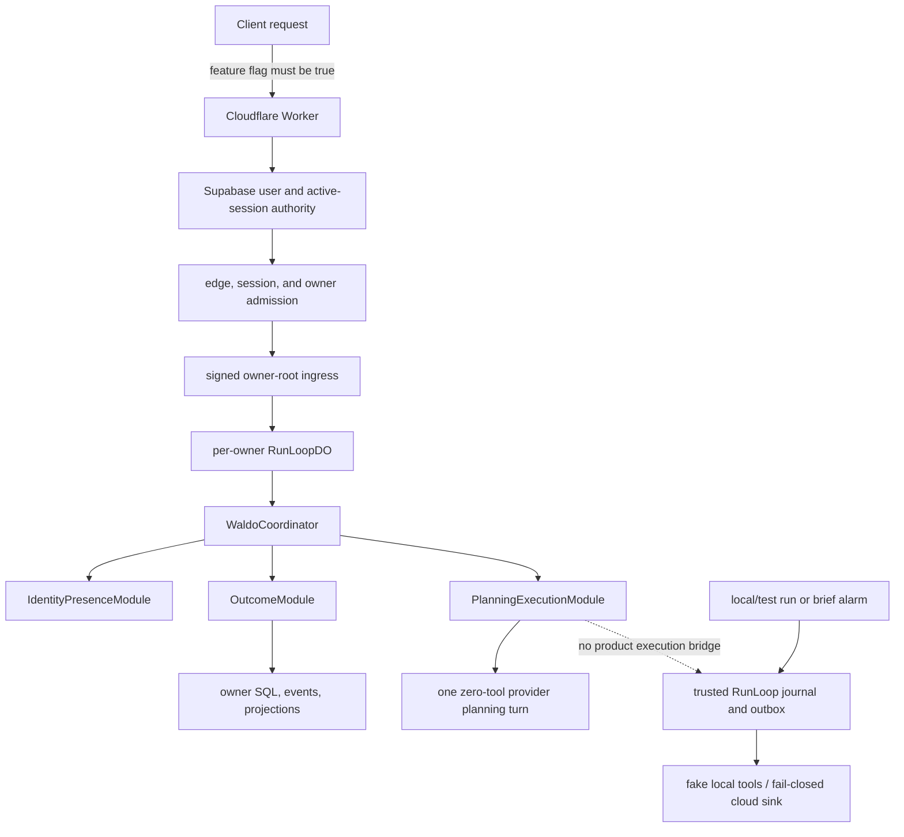

# Waldo Convergence: Backend + Brain Audit

> **Reference only.** This is a pinned implementation audit, not current sequencing or shipped proof. Use fresh source/tests and the production run contract for current work.

**Snapshot:** 2026-08-11
**Scope:** read-only audit of the current `waldo-backend` checkout, with `waldo-brain` used as product and architecture context
**Question:** what is implemented now, what is architecture-specified, what remains prototype/test-only, and what must join before Waldo can truthfully be called one durable agent that handles responsibilities over time?

## Executive verdict

**[Observed]** The backend is not a paper architecture. It contains two substantial but only partially joined systems:

1. an owner-scoped responsibility kernel that authenticates a user, captures an Outcome/Mission/WorkUnit graph, persists an owner event/projection trail, and runs one zero-tool candidate-planning turn; and
2. a trusted Durable Object run loop with journal/outbox recovery, intent-before-I/O, leases/fences/cancellation, safety gates, Scribe controls, scheduling, and replay machinery.

**[Observed]** The first system stops at `Outcome = captured`, `Mission = proposed`, and `WorkUnit = planning_authorized`. Its provider is explicitly forbidden from using tools, performing effects, creating evidence or verification, accepting work, or closing responsibility (`packages/runtime/src/run-loop/do.ts:503-527`; `packages/runtime/src/do-schema.ts:377-421,531-585`).

**[Observed]** The second system is reachable through local/test run routes and a brief-only scheduler, but its local path uses fixtures/fakes and its cloud gateway configuration is intentionally fail-closed for delivery, spend, and safety. There is no source path joining a product WorkUnit to the general trusted run/effect spine (`packages/runtime/src/run-loop/do.ts:718-770,1124-1132`; `packages/runtime/src/run-loop/adapters.ts:116-158`).

**[Inference]** The critical architecture seam is therefore not “add another agent framework” or “add more Durable Objects.” It is a **product-state-to-trusted-execution bridge** that keeps Outcome truth, execution activity, evidence, verification, and owner acceptance distinct while making them one ordered owner history.

**[Inference]** Until that bridge, a production context/memory adapter, multiple authorized presences, and cross-surface transport exist and are verified, the defensible product description is: **a locally verified responsibility capture and bounded planning kernel plus a separate durable execution substrate—not yet one durable Waldo.**

## Evidence and classification contract

| Label | Meaning in this audit |
| --- | --- |
| **[Observed]** | Directly present in the pinned local source, documentation, generated contract, Git state, or a command run during this audit. |
| **[Inference]** | The smallest product or architecture conclusion supported by observed evidence. |
| **[Unknown]** | Not established by the inspected local evidence. |
| **[Recommendation]** | Proposed Waldo direction, not current behavior. |

Implementation status is classified as:

- **implemented-local** — source and local verification exist, but no hosted/deployment claim follows;
- **implemented-disabled/unproven** — source exists behind a flag or without current deployment evidence;
- **contract-only** — schema/types/fixtures exist without a runtime reducer or ingress path;
- **prototype/test-only** — executable only through local fixtures, fakes, or test seams;
- **architecture-specified** — required by current planning/Brain docs but not implemented here;
- **missing** — no relevant source path was found.

This audit does not treat architecture prose, a green unit test, a provider completion, a session status, a commit, or an agent's self-report as production or Outcome truth.

## Source pins and working-tree custody

### `waldo-backend`

- **[Observed]** Branch: `main`.
- **[Observed]** HEAD: `dd434e9bb5dedc4a135e43e30571a141599e8991` — `feat: add minimum outcome-bound planning harness (#77)`, committed 2026-08-07T19:57:10+05:30.
- **[Observed]** Local HEAD matched the locally recorded `origin/main`. No fetch or branch switch was performed.
- **[Observed]** The checkout was already dirty. Existing modifications under `.claude/`, imported untracked skills, `.understand-anything/`, and two untracked foundation documents were not changed by this audit.

### `waldo-brain`

- **[Observed]** Branch: `main`.
- **[Observed]** HEAD: `d77840237232894562b4d2a62d91b3119d3c6dd0` — `references: dissect Spotify Xirp and Portal (why: capture Kennel custody and context lessons)`, committed 2026-08-11T16:45:57+05:30.
- **[Observed]** The local branch was four commits ahead of its locally recorded remote-tracking branch when inspected. No fetch or branch switch was performed.
- **[Observed]** `.obsidian/graph.json` was modified and two weekly ledgers were untracked. They were not changed. The untracked convergence ledger was treated only as a navigation lead, not canonical evidence.

**[Inference]** These are reproducible local snapshots, not claims about the latest GitHub state or a deployed environment.

## Science loop

### Hypothesis 1 — the current responsibility kernel can be extended rather than replaced

**[Observed]** Capture, identity admission, owner-root routing, idempotent command results, event ordering, projections, WorkUnit dependency checks, planning leases/fences/cancellation, and provider intent/receipt reconciliation are real modules sharing one owner-scoped SQLite transaction boundary (`packages/runtime/src/coordinator/waldo-coordinator.ts:134-185,420-475`; `packages/runtime/src/coordinator/outcome-module.ts`; `packages/runtime/src/coordinator/planning-execution-module.ts`).

**Result: supported.** The kernel already has the right consistency root and several reusable invariants. Replacing it with a generic orchestration framework would discard verified semantics without solving the missing product reducers.

### Hypothesis 2 — the existing RunLoop already constitutes the durable Waldo product

**[Observed]** Product planning cannot perform work. The general RunLoop is not invoked from a product WorkUnit and is exposed only through guarded local/test routes or brief scheduling. Activity/evidence/judgment observation schemas exist in v0.1 contracts, but no production runtime ingestion/reducer was found (`packages/contracts/src/protocol/responsibility-handshake-v0-1.ts:341-360`).

**Result: falsified.** Durable execution machinery is necessary but is not a durable agent product until it is bound to owner Outcomes, bounded authority, evidence, verification, acceptance, and re-entry.

### Hypothesis 3 — launch requires more cloud services or one Durable Object per mission

**[Observed]** The current Cloudflare configuration binds three Durable Object classes plus a rate limiter. It does not bind R2, Queues, Workflows, D1, Vectorize, or WebSockets (`packages/runtime/wrangler.jsonc:1-23`). The architecture lock deliberately places canonical owner authority, Coordinator, RunLoop, and transactional state in a per-owner Durable Object, with other services conditional or projection-oriented (`docs/planning/WALDO_ARCHITECTURE_LOCK_AND_WHOLE_PRODUCT_BUILD_DIRECTION_2026-08-05.md`).

**Result: unsupported for launch.** No inspected evidence establishes owner-root load, contention, storage, or alarm pressure that requires mission child objects. Split only after measured limits are reached; do not distribute the consistency model pre-emptively.

## Current runtime, as implemented



**[Observed]** The public Worker returns `404` unless `RESPONSIBILITY_PUBLIC_API_ENABLED === "true"`. When enabled it requires Supabase configuration, a Cloudflare rate limiter, and a responsibility ingress secret (`packages/runtime/src/index.ts:99-143`).

**[Observed]** Authenticated owner IDs are hashed into Durable Object names. Worker-to-object calls are operation-bound and HMAC signed (`packages/runtime/src/index.ts:164-239`).

**[Observed]** Five responsibility routes are implemented: capture, capture projection, planning turn, planning cancellation, and planning projection (`packages/runtime/src/responsibility/worker-adapter.ts:95-125`).

**[Observed]** The generated public OpenAPI instead lists only `/public/v1/briefs/morning/current` and `/v1/engagement-events`. It does not describe the implemented responsibility endpoints.

**[Inference]** This is contract-surface drift: clients cannot use the generated OpenAPI as the truth for the current Worker, and the checked-in OpenAPI advertises paths the default Worker entry does not serve.

## Capability truth table

| Capability | Actual current source | Architecture / Brain requirement | Classification | Product implication |
| --- | --- | --- | --- | --- |
| Owner identity root | Supabase user/session validation; HMAC bridge; owner-hashed DO routing | One user-owned Waldo with inspectable identity and authority | **implemented-disabled/unproven** | Strong root exists, but hosted truth is unknown. |
| Presence model | One registration per owner is enforced; expired sessions are pruned | Waldo present through Kennel, mobile, and later surfaces | **implemented-local, product-incomplete** | A second legitimate presence is rejected; cross-surface Waldo cannot enroll yet. |
| Responsibility capture | Transactional Outcome, optional Mission, WorkUnits, owner events, projections, idempotent response | Durable user-level Outcome Record | **implemented-local** | Useful kernel; state model is deliberately minimal. |
| Outcome lifecycle | Only `captured` is allowed | pursue, defer, transfer, supersede, release, accept; acceptance checks and re-entry | **architecture-specified** | No durable handling or conscious closure yet. |
| Mission lifecycle | Only `proposed` is allowed | optional multi-step responsibility grouping | **architecture-specified** | Mission is stored intent, not active orchestration. |
| WorkUnit lifecycle | `planned` and `planning_authorized` only | ready/active/waiting/blocked/completed/failed/cancelled plus retry/adapt | **implemented-local + architecture-specified remainder** | No unit can truthfully execute or complete. |
| Candidate planning | One governed provider turn, zero tools/effects/mutations, durable intent/receipt/cancel/projection | Plans should lead to bounded, authorized execution | **implemented-local** | Honest planner, not an executor. |
| AgentSession | Planning session, lease, fence, cancellation generation, candidate-plan state are persisted | Provider/native execution attempts bound to WorkUnits | **implemented-local, planning-only** | Session durability exists only for candidate planning. |
| Activity/judgment/evidence observations | v0.1 contract schemas and fixtures | Structured feedback from Kennel and other executors | **contract-only** | Cloud cannot learn what local work actually did. |
| Trusted RunLoop | DO FSM, journal/outbox, recovery, effect reconciliation, safety, replay | One physical execution/effect spine | **implemented-local** | Valuable substrate is isolated from product truth. |
| Real tool execution | Default trusted tool is a local fake `get_crs`; broad tool contracts have no matching default production handlers | Capability-declared, owner-authorized local/cloud execution | **prototype/test-only** | No general connector, filesystem, shell, or Kennel executor. |
| Delivery/effects | Cloud gateway uses `FailClosedSink`; planning forbids effects | Reversible effects first, exact receipts, reconcile unknown outcomes | **prototype/test-only / architecture-specified** | No product effect can be shipped or verified. |
| Evidence | Expected-evidence text can be captured; no Evidence entity/reducer on product path | Provenance-bearing observation, never executor self-report alone | **architecture-specified** | Completion cannot be established. |
| Verification | No product Verification Run | Evidence/version-scoped independent checks | **missing** | Outcome truth cannot advance safely. |
| Acceptance | No product acceptance/reopen/release reducer | Authorized human/system judgment separate from verification | **missing** | Waldo cannot close responsibility consciously. |
| Open Loop / re-entry | No product reducer or scheduling bridge | Return target, consequence, next check, re-entry packet | **missing** | “Make sure this gets handled” is not yet delivered. |
| Context compilation | Rich purpose-bound `ContextComposer`; only local fixture path injects it | Selected, provenance-bearing, correction-aware context | **implemented-local substrate / production adapter missing** | Product and cloud planning do not receive the governed continuity system. |
| Temporal memory recall | SQLite partial gateway excludes legacy rows without taint proof; no FTS/BM25/RRF/evolution/union read | Durable user-owned memory with provenance, correction, supersession, deletion | **prototype/partial** | Safe fail-closed behavior, but not useful production continuity. |
| Memory writes | Schema exists; inserts/updates found only in tests | Proposal/review/write/correct/delete lifecycle | **contract/schema-only** | No runtime memory formation path was found. |
| Goals | Read-only `GoalStore`; instantiated in tests, not production assembly | Durable goals must remain distinct from Outcomes and current responsibilities | **prototype/test-only** | Goals cannot currently guide or evolve in runtime. |
| Scheduling | Multiplexer and alarms exist; RunLoop exposes only the `brief` executor | Outcome checks, waits, deadlines, follow-up, re-entry | **implemented-local substrate / product bridge missing** | Proactivity is brief-shaped rather than responsibility-shaped. |
| Local/cloud protocol | HTTPS responsibility commands to owner DO; no Kennel execution/observation transport | Cloud authority plus local execution custody, ordered lease/ack/cancel/evidence | **missing beyond planning HTTP** | No continuous cross-device or local executor loop. |
| Cloudflare topology | Worker, per-owner RunLoopDO, TracerDO, probe DO, rate limiter | DO/SQLite canonical owner authority; conditional R2/Queues/search | **implemented-disabled/unproven** | Suitable launch topology; expansion is not yet justified. |
| Deployment proof | No deployment workflow or current hosted smoke evidence found | Production gate, migrations, rollback, canonical verification | **unknown** | Source readiness cannot be described as shipped. |
| Deletion/export/revocation | Session expiry and presence states exist; no end-to-end owner deletion/export propagation | Monotonic deletion generation and acknowledgements across all copies | **architecture-specified** | Privacy lifecycle remains incomplete. |

## End-to-end product trace

### 1. Capture and authority

**[Observed]** The Worker validates exact protocol/media versions, body and query bounds, edge rate admission, Supabase auth, active session authority, owner/presence/session matching, and content-free problem responses before calling the owner root (`packages/runtime/src/responsibility/worker-adapter.ts:106-203`; `packages/runtime/src/responsibility/supabase-authority.ts`).

**[Observed]** `IdentityPresenceModule` establishes one owner root and one active presence registration. It supports multiple expiring authenticated sessions beneath that registration, but rejects any second presence registration for the owner (`packages/runtime/src/coordinator/identity-presence-module.ts:70-128`).

**[Inference]** This is a safe bootstrap invariant, not the final “one Waldo, many presences” identity model. Enrollment, revocation, device loss, replacement, and surface-specific authority must be explicit before removing it.

### 2. Outcome graph

**[Observed]** Capture writes current rows, an ordered owner event sequence, projection rows, and the idempotent command result in the owner transaction. WorkUnits carry dependencies, expected evidence, required capabilities, authority, budget, isolation, stopping conditions, assignment, and session IDs.

**[Observed]** Default captured WorkUnit authority/budget/isolation are deny-all or zero. Planning authorization verifies current revision, state, capability emptiness, and dependency ordering before transitioning only to `planning_authorized` (`packages/runtime/src/coordinator/outcome-module.ts`).

**[Inference]** The model correctly refuses to confuse a rich WorkUnit description with granted authority. The next transition should preserve that rule rather than convert text fields into implied permissions.

### 3. Planning

**[Observed]** The public planning adapter constructs empty provider/executor capability manifests and an authority ceiling of one planning turn with no tools, connectors, network, filesystem, shell, effects, Outcome mutation, evidence, verification, acceptance, or closure (`packages/runtime/src/responsibility/worker-adapter.ts:193-247`).

**[Observed]** The Durable Object persists an execution request and provider intent before I/O, invokes one model, reconciles a provider receipt, validates `{summary, proposedSteps, openQuestions, constraints}`, and persists a candidate-plan projection. Governed input content is sent transiently to the provider, while the persisted envelope retains refs/digests rather than content (`packages/runtime/src/run-loop/do.ts:460-598`).

**[Inference]** This is a well-bounded planning primitive. It should remain a distinct WorkUnit contribution, not become the execution engine by gradually widening an “empty” manifest without a new admission contract.

### 4. Execution and orchestration

**[Observed]** The older trusted RunLoop contains durable mechanics that a product executor needs: journal/outbox transitions, provider and tool effect intent-before-I/O, receipt reconciliation, cancellation generations, lease fencing, alarms, safety callbacks, Scribe processing, egress controls, evidence traces, and replay fixtures.

**[Observed]** Its HTTP ingress is restricted to `/local/runs` and `/local/fake-runs` under local/test policy. Its scheduler executor is `brief`. The gateway-mode composition has Cloudflare AI Gateway but a fail-closed delivery sink, unavailable spend reader, fail-closed safety callbacks, and no `ContextComposer` (`packages/runtime/src/run-loop/adapters.ts:116-158`).

**[Observed]** No Kennel executor adapter, Claude Code/Codex session adapter, worktree bridge, workspace/filesystem bridge, WebSocket command channel, or provider-neutral native-session orchestration was found in this repo.

**[Inference]** “RunLoop is durable” and “Waldo handles work” are presently different claims. The product must create an admitted ExecutionRequest from a WorkUnit, lease it to an authorized executor, ingest normalized observations, and reduce resulting evidence without letting runtime activity directly mutate Outcome truth.

### 5. Evidence, verification, acceptance, and re-entry

**[Observed]** Contract types name session activity, judgment-needed, and candidate-evidence observations, but the runtime exports no public observation route and no reducer for them. No product entities for Evidence, Verification Run, Acceptance, Open Loop, or Re-entry Packet were found.

**[Observed Brain definition]** Outcome is a bounded owner-intended state; WorkUnit is a bounded contribution; AgentSession is a provider/executor trace; Artifact and Evidence are distinct; Verification evaluates cited evidence; Acceptance is an authorized judgment (`../waldo-brain/02-Knowledge/outcome-and-work-unit.md:14-87`).

**[Inference]** The missing reducer chain is the product, not bookkeeping. Without it, Waldo cannot distinguish “agent stopped,” “artifact exists,” “check passed,” “owner accepts,” and “nothing consequential remains open.”

## What “one durable Waldo” should mean

**[Recommendation]** Define unity at the owner authority and continuity layers, not as one model process or one ever-growing prompt:

- one stable owner root and policy revision;
- one ordered owner event namespace across authorized presences;
- one canonical Outcome/Open-Loop graph;
- one physical effect admission and reconciliation spine;
- many bounded AgentSessions and deterministic/human WorkUnits;
- selected, purpose-bound context assembled per invocation;
- explicit corrections and supersession where user statements outrank inference;
- versioned evidence and verification before acceptance;
- a durable re-entry point even when no process remains alive.

**[Inference]** This yields a coherent Waldo across mobile, Kennel, and cloud without pretending every surface shares the same process, provider transcript, tool permissions, or data custody.

## Memory and context audit

### What is real

**[Observed]** `ContextComposer` has a strong fail-closed design: owner binding, staged inputs, system skills, health material, temporal recall, provenance/taint, Scribe admission, prompt digest, checkpoints, and replay checks. These are useful trust contracts, not merely prompt templates.

**[Observed]** The DO schema includes memory blocks/inbox, episodes, skills, and goals. The temporal recall gateway is honest about being partial: current SQLite lacks FTS/BM25/RRF, episode FTS, evolution, union-read, and retained-row taint; legacy rows are excluded until source-taint proof exists (`packages/runtime/src/context-composer/sqlite.ts:215-297`).

**[Observed]** Scribe and tool boundaries contain PII/secret/raw-health/injection sanitization, schema and ACL checks, approval gates, egress constraints, and provenance canaries.

### What is not joined

**[Observed]** Gateway-mode RunLoop composition omits `ContextComposer`. Public candidate planning builds prompt material directly from Outcome/WorkUnit text plus governed input content. No production runtime writer for memory blocks, memory inbox, or episodes was found; the writes found are test setup. `GoalStore` is read-only and instantiated only by tests.

**[Unknown]** No current hosted adapter, retention job, user correction UI/API, memory proposal reviewer, supersession writer, deletion propagation, export, or recovery proof was established.

**[Inference]** Waldo currently has a context safety architecture and storage vocabulary, not a complete continuity product. Calling the tables “long-term memory” would overstate the implementation.

### Recommended production seam

**[Recommendation]** Make context compilation an owner-authorized service inside the RunLoopDO boundary, but keep source adapters outside canonical truth:

1. the WorkUnit declares purpose, allowed source classes, sensitivity ceiling, freshness, and maximum disclosure;
2. adapters return provenance-bearing candidate material;
3. Scribe/health/egress gates admit or reject each fragment;
4. the compiler persists the selection manifest, source versions, digests, exclusions, and policy revision—not unnecessary raw prompt copies;
5. invocation receipts bind to the compiled-context digest;
6. user corrections produce new versioned facts/supersession edges, never silent rewrites;
7. deletion/export traverses all canonical rows, projections, blobs, provider copies where APIs permit, caches, logs, and backups under one monotonic generation.

**[Recommendation]** Separate at least four stores/logical classes even if all launch in owner SQLite: user-declared facts and corrections; inferred/proposed memory; episodic execution/evidence history; current Outcome/Open-Loop state. Different truth, retention, and correction rules must not be hidden behind one vector index.

## Cloudflare and Durable Object placement

### Keep in the per-owner Durable Object

**[Recommendation]** Keep canonical identity/presence authority, Outcome/Mission/WorkUnit state, AgentSession admission, owner event ordering, leases/fences/cancellation, effect intents/receipts, Evidence metadata, Verification/Acceptance decisions, Open Loops, re-entry state, and alarms in the owner root for launch. They need single-owner ordering and transactional invariants more than independent scaling.

**[Recommendation]** Use a pragmatic state-plus-event ledger: normalized current rows for decisions and reads, immutable ordered events/receipts for audit/recovery, and versioned projections/checkpoints. Do not require replaying an unbounded owner life history for every read.

### Add only when evidence requires it

**[Recommendation]** Use R2 later for encrypted large artifact/checkpoint/export bytes, while owner SQLite retains canonical metadata, hash, owner, policy, provenance, and lifecycle. Use Queues only as deduplicated delivery transport after canonical intent exists. Use Workflows for peripheral long-running coordination only if replay/latency characteristics fit; never as owner truth. Treat Vectorize/search as rebuildable, permission-filtered projections.

**[Recommendation]** Do not create one DO per Mission until load tests show the owner root cannot satisfy alarm, storage, CPU, or contention requirements. If split later, the owner root must remain the authority that grants a child lease and incorporates receipts; a child cannot independently accept or close an Outcome.

### Missing operational proof

**[Unknown]** This audit found no current deployment/migration execution record, staged provider run, production smoke, owner-root load envelope, storage compaction/archive job, backup/restore drill, cross-region failure proof, or live privacy deletion proof.

**[Recommendation]** Before adding cloud services, measure: maximum open Outcomes/WorkUnits/AgentSessions per owner; event/projection growth; alarm fan-out; one-owner burst contention; cold-start/recovery latency; SQLite size; replay/checkpoint cost; duplicate/late observation behavior; and deletion/export duration.

## Local/cloud protocol for Kennel and mobile

**[Observed]** The backend currently provides authenticated request/response commands for capture/planning and projections. It does not provide a command lease to a local executor or an ordered return channel for local observations.

**[Recommendation]** Launch with a small, explicit protocol rather than a generic remote shell:

1. **Canonical commands over authenticated HTTPS.** Capture/correct Outcome, propose/authorize WorkUnit, request/cancel execution, record judgment, accept/reopen/release.
2. **Leased execution requests.** Kennel claims an ExecutionRequest with executor identity, WorkUnit revision, capability-manifest digest, policy revision, expiry, fence, and cancellation generation.
3. **Ordered observation envelopes.** Kennel returns session lifecycle, normalized activity, artifact refs/digests, candidate evidence, judgment requests, failure/stop reasons, and effect receipts with local monotonic IDs and idempotency keys.
4. **Projection feed.** Use cursor-based long polling or SSE for owner projections and pending commands at launch; add WebSockets only if measured latency/connection needs justify them. Transport must not define product semantics.
5. **Local durable outbox.** Kennel retains unsent observation envelopes and receipt acknowledgements across app/process restart. The cloud deduplicates and orders them under the owner root.
6. **Strict offline boundary.** Protocol 0.1 should allow stale/read-only projections and local executor recovery, but not fabricate canonical cloud commands while disconnected. The architecture lock records an accepted-ADR conflict about offline drafts; reconcile that ADR before implementation.

**[Recommendation]** A local operation may continue only within an already granted, unexpired lease and capability ceiling. Network loss must not widen authority. Destructive/external effects require an online admission or a narrowly pre-authorized, auditable offline grant with explicit consequence and reconciliation semantics.

## Spotify Xirp + Portal implications

The current Brain dossier is a public-source product/engineering study, not evidence about proprietary implementation. Its clean-room and licensing boundary must be preserved (`../waldo-brain/03-References/research/spotify-xirp-portal-product-engineering-dissection-2026-08-11.md:31-53`).

### Adopt

**[Observed from Brain sources]** Xirp keeps project checkout, persistent terminal sessions, provider-native CLIs, worktrees, files, rules, and skills under local Mac custody. Portal is an optional organizational context/governance plane accessed explicitly; direct Xirp sessions do not automatically acquire Workspace context (`...spotify-xirp-portal-product-engineering-dissection-2026-08-11.md:55-64,227-250`).

**[Recommendation]** Map that boundary to Waldo as:

- Kennel owns local project/process/checkout custody and provider-native interaction;
- owner RunLoopDO owns canonical responsibility, authority, lease, evidence, and acceptance state;
- context adapters are optional, revocable, source-labelled inputs—not global ambient authority;
- the cloud receives minimized normalized observations and artifact refs/digests by default, not whole terminals or provider transcripts;
- provider-native permissions remain inspectable, while Waldo enforces a stricter authority floor above them.

### Adapt carefully

**[Observed from Brain sources]** Xirp's Session is a terminal/provider process, its Goal is an initial prompt, worktrees provide checkout isolation, and statuses such as finished/failed are process state—not verified Outcomes (`...spotify-xirp-portal-product-engineering-dissection-2026-08-11.md:126-140`). Provider permissions and sandbox semantics remain provider-native (`...spotify-xirp-portal-product-engineering-dissection-2026-08-11.md:171-199`).

**[Recommendation]** Preserve provider-native session semantics rather than pretending Claude Code, Codex, and future executors are uniform. Normalize only the Waldo envelope: authority ceiling, lifecycle observation, artifact/evidence receipt, judgment request, stop reason, and cancellation. Describe a worktree as checkout isolation; declare process, filesystem, network, secret, port/database, and external-effect isolation separately.

### Reject

**[Observed from Brain sources]** Eligible Xirp/Portal session upload is manual and unredacted; Portal catalog data is a cache/model, and inferred ownership can be wrong or stale (`...spotify-xirp-portal-product-engineering-dissection-2026-08-11.md:215-225,289-302`).

**[Recommendation]** Reject:

- full transcript upload as default continuity;
- raw/derived health, private-life context, credentials, unrestricted memory, or hidden reasoning in session uploads/logs/evals;
- organizational ownership as authorization, user identity, or acceptance;
- catalog/search projections as canonical truth;
- “session finished,” commit existence, or agent confidence as Outcome completion;
- MCP authentication alone as a tool-safety proof.

**[Inference]** Xirp/Portal validates the value of a visible local-custody/context-plane seam. It does not supply Waldo's missing Outcome, verification, acceptance, memory correction, or cross-life privacy contracts.

## Privacy and trust audit

### Implemented foundations

**[Observed]** The strongest current controls are owner-derived DO routing, Supabase active-session authority, expiring sessions, strict media/version/body parsing, edge/session/owner admission, operation-bound HMAC ingress, idempotency and digest-conflict checks, single-owner storage, content-free public errors, lease fencing/cancellation, intent-before-I/O and receipt reconciliation, Scribe redaction/health gates, SSRF-aware egress, and provenance canaries.

**[Inference]** These controls reduce confused-deputy, duplicate-effect, cross-owner, prompt-injection, and sensitive-output risk at important seams. They do not establish end-to-end production privacy because the missing adapters and lifecycle paths are exactly where disclosure and deletion risks accumulate.

### Unresolved trust boundaries

- **[Observed]** Multiple authorized presences cannot coexist.
- **[Observed]** Product planning receives governed input content transiently and sends it to the configured model, but does not use the full `ContextComposer` policy/provenance path.
- **[Observed]** No product executor grant, observation admission, Evidence/Verification/Acceptance reducer, connector registry, credential broker, or effect-policy bridge was found.
- **[Observed]** No runtime memory write/correction/supersession path was found.
- **[Unknown]** No deployed provider data-use/retention configuration, regional boundary, deletion acknowledgement, backup/PITR deletion policy, or production logging payload was established.
- **[Unknown]** Existing health consent/RLS contracts were not shown joined end to end to the durable Outcome/WorkUnit/AgentSession path.

**[Recommendation]** Treat every provider, Kennel session, connector, MCP server, health source, and search index as a separately revocable principal/resource boundary. Record purpose, resource scope, data classification, allowed effects, expiry, and policy revision in the capability manifest; check it at both cloud admission and local execution.

## Required convergence sequence

These are dependency gates, not a proposal to ship infrastructure without whole-product slices.

### Gate 0 — repair the truth surface

1. Replace wall-clock-expiring test fixtures with deterministic clock-relative authority fixtures.
2. Bring public OpenAPI and the actual Worker routes under one generated source of truth.
3. State whether the responsibility API is intentionally disabled in every deployed environment and add a hosted smoke that proves the answer.
4. Reconcile the accepted offline-draft ADR conflict before implementing local/cloud commands.

**Exit:** contracts, targeted runtime tests, OpenAPI freshness, and a non-production deployed smoke agree on routes, versions, flags, and auth behavior.

### Gate 1 — one no-external-effect WorkUnit through Kennel

1. Define a versioned `ExecutionRequest`/lease/ack/cancel/observation protocol.
2. Admit one `planning_authorized → ready → active` WorkUnit to an enrolled Kennel presence.
3. Run one no-network/no-external-effect local contribution in declared checkout/process isolation.
4. Persist AgentSession lifecycle, artifact refs/digests, candidate evidence, and stop reason through the owner event ledger.

**Exit:** restart, duplicate, late, cancellation, stale-revision, expired-lease, device-loss, and cross-owner tests prove no activity can silently widen authority or mutate Outcome truth.

### Gate 2 — evidence, independent verification, and human disposition

1. Add Evidence and Verification Run entities bound to exact artifact/input versions.
2. Make verifier identity and method independent from the executor claim where consequence requires it.
3. Add judgment requests with reason, options, reversibility, expiry, consequences, affected Outcomes, and exact return target.
4. Add owner acceptance, partial acceptance, reopen, defer, transfer, supersede, and release.
5. Materialize Open Loops and Re-entry Packets from unresolved consequences.

**Exit:** the same session/artifact can be completed yet fail verification, pass verification yet await owner acceptance, or be accepted while creating a new Open Loop.

### Gate 3 — one reversible real effect

1. Route one narrow effect through the existing intent/receipt/reconciliation spine.
2. Bind connector credential, purpose, resource scope, budget, side-effect class, approval, idempotency, and postcondition verification.
3. Prove unknown-outcome recovery, duplicate suppression, cancellation races, credential expiry, and rollback/compensation.

**Exit:** neither provider nor Kennel self-report can mark the effect or Outcome true without a reconciled receipt and required verification.

### Gate 4 — useful continuity and multiple presences

1. Add explicit presence enrollment, suspension, revocation, rotation, and device-loss recovery.
2. Put product/provider invocations through one production `ContextComposer` path.
3. Add user-declared memory, proposal/review, correction, supersession, export, and deletion flows.
4. Dogfood mobile capture → cloud authority → Kennel execution → evidence → verification → Needs You → acceptance/reopen/re-entry.

**Exit:** the owner can inspect why a fact/context item was included, correct it, revoke a presence/source, delete/export it, and resume the Outcome from another surface without reconstructing a transcript.

## Decisions: keep, modify, defer, reject

### Keep

- **[Recommendation]** Per-owner RunLoopDO as launch consistency and authority root.
- **[Recommendation]** Coordinator modules and explicit writer ownership.
- **[Recommendation]** Outcome/WorkUnit/AgentSession separation.
- **[Recommendation]** Deny-by-default capability manifests and authority ceilings.
- **[Recommendation]** Intent-before-I/O, idempotency, leases/fences/cancellation, and reconciliation.
- **[Recommendation]** Scribe, egress, provenance/taint, and fail-closed partial recall behavior.
- **[Recommendation]** State-plus-event ledger and versioned projections.

### Modify next

- **[Recommendation]** Join product WorkUnits to the trusted execution spine through a versioned admitted bridge.
- **[Recommendation]** Generalize presence authority from one bootstrap presence to explicit multi-presence lifecycle.
- **[Recommendation]** Replace planning-direct prompt construction with the governed context compiler.
- **[Recommendation]** Implement observation, Evidence, Verification, Acceptance, Open Loop, and Re-entry reducers.
- **[Recommendation]** Make OpenAPI, feature flags, migrations, and deployed smoke evidence agree.

### Defer pending evidence

- **[Recommendation]** Mission child DOs, R2 artifact bodies, Queues, Workflows, Vectorize/search, and WebSockets.
- **[Recommendation]** Broad connector/tool catalog, autonomous external effects, and background mission fan-out.
- **[Recommendation]** Uniform provider abstractions beyond Waldo's small authority/observation envelope.

### Reject

- **[Recommendation]** A second execution engine beside the trusted RunLoop effect spine.
- **[Recommendation]** Session/commit/artifact/provider-done as Outcome completion.
- **[Recommendation]** Full transcript or unrestricted memory synchronization as continuity.
- **[Recommendation]** Ownership metadata as authorization or acceptance.
- **[Recommendation]** An unbounded prompt as the meaning of “one Waldo.”
- **[Recommendation]** More cloud topology as a substitute for missing product semantics.

## Unresolved questions

1. **[Unknown]** Which current deployed environments, if any, enable `RESPONSIBILITY_PUBLIC_API_ENABLED`, and at what commit/migration tag?
2. **[Unknown]** Is `RunLoopDO` intended to remain both owner product root and run engine in production, or is a split already ratified elsewhere? The current architecture lock says co-locate; implementation should not drift silently.
3. **[Unknown]** Which Kennel identity becomes an enrolled presence: app installation, OS user, device key, provider session, or a compound identity?
4. **[Unknown]** What exact data may a local executor return by default: normalized events only, selected diffs, artifact chunks, terminal transcript, or provider transcript?
5. **[Unknown]** Which verification classes may be automated, and which always require owner/affected-party acceptance?
6. **[Unknown]** What is the first reversible real-world effect whose consequence profile is small enough to validate the effect spine?
7. **[Unknown]** What are the launch retention/export/deletion requirements for events, projections, prompts, provider receipts, artifacts, health-derived context, traces, and backups?
8. **[Unknown]** Does mobile need disconnected capture drafts? Current founder direction and accepted ADRs conflict; protocol work must wait for explicit reconciliation.
9. **[Unknown]** What measured per-owner envelope would trigger mission child objects or external artifact/search services?
10. **[Unknown]** What current hosted/provider policies guarantee that transient governed inputs are not retained or reused beyond their declared purpose?

## Verification evidence

Executed against the pinned backend checkout without fetching, switching branches, deploying, or changing source:

```text
npx -y pnpm@10.34.4 --filter @waldo/contracts test
  PASS: 58 files, 1475 tests

npx -y pnpm@10.34.4 --filter @waldo/runtime typecheck
  PASS: worker and integration TypeScript projects

npx -y pnpm@10.34.4 --filter @waldo/runtime exec vitest run \
  test/responsibility-worker-adapter.test.ts \
  test/responsibility-public-do.test.ts \
  test/waldo-coordinator.test.ts \
  test/work-unit-planning-authorization.test.ts
  RESULT: 3 files passed, 1 failed; 89 tests passed, 7 failed
```

**[Observed]** All seven failures were `ResponsibilityAuthorityDeniedError` cases in `work-unit-planning-authorization.test.ts`. The shared authority fixture hard-codes `authenticatedSessionExpiresAt: 2026-08-08T00:00:00.000Z` at lines 89 and 655, which was expired on the 2026-08-11 audit date.

**[Inference]** The failures are consistent with correct production rejection of an expired session and nondeterministic test-clock coupling, not evidence of an auth regression. They also mean the current planning-authorization conformance gate is not green and must not be reported as green until the fixture is made deterministic and rerun.

**[Unknown]** Full runtime tests, Supabase container tests, mutation/property tests, staging deployment, hosted provider invocation, cross-surface dogfood, load tests, backup/restore, and deletion propagation were not run or established in this bounded audit.

## Final architecture conclusion

**[Observed]** Waldo already has the beginnings of the right durable center: an owner-rooted authority boundary, normalized responsibility objects, ordered state/event storage, bounded planning, and hardened execution primitives.

**[Inference]** The architecture should converge by joining those centers, not by broadening claims around either one. The minimal truthful invariant is:

> A WorkUnit may cause bounded activity through a leased executor; activity may produce provenance-bearing evidence; evidence may be independently verified; verification may support an authorized disposition; only that disposition changes Outcome truth; unresolved consequences remain explicit Open Loops with re-entry.

**[Recommendation]** Build and verify that invariant once, end to end, through mobile/cloud/Kennel before expanding missions, tools, providers, memory breadth, or Cloudflare topology. That is the shortest path from the current code to the product promise: **Make sure this gets handled.**
