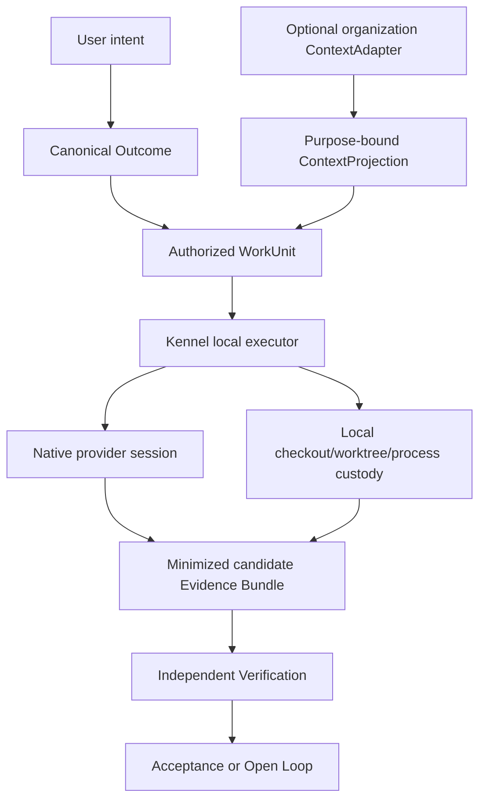

# Spotify Xirp + Portal Research for Waldo Product/Architecture Convergence

**Date:** 2026-08-11
**Scope:** Public-source product and architecture research for the Waldo convergence investigation
**Status:** Research input, not an implementation decision or shipped-capability claim
**Confidence:** High for documented beta behavior; medium or low where explicitly marked inference or unknown

## Decision in one sentence

**Adapt Spotify Xirp's local session-custody grammar and Portal's optional context-on-demand seam into Kennel, but keep Waldo's identity, canonical Outcome state, authority, evidence, Verification, Acceptance, Open Loop, memory, and health/privacy controls above both layers.**

Xirp is the closest public reference in this investigation for the part of Kennel that supervises native coding-agent processes. It is not a model for the whole Waldo product. Portal is useful as a reference for organization context, but it must remain an optional `ContextAdapter`, not Waldo's brain or authority root.

## 1. Identity resolution: what “Spotify Xirp” means

### Observed

- The supplied convergence brief names **Spotify Xirp** and **Spotify Portal** as adjacent references. It does not ask for analysis of Spotify's consumer music product.
- Spotify documents Xirp as a macOS desktop app for running Claude Code, Codex, and Gemini across local projects and persistent terminal sessions. It can be used without Portal. ([Xirp overview](https://backstage.spotify.com/docs/xirp/))
- Spotify Portal is a separate managed internal-developer-portal product built on Backstage. Xirp can connect to it for catalog-based repository discovery, Workspace context, and session sharing. ([Xirp and Portal](https://backstage.spotify.com/docs/xirp/xirp-and-portal), [Portal overview](https://backstage.spotify.com/docs/portal/))
- Backstage OSS and Spotify's proprietary Xirp/Portal products are not the same licensing surface. Spotify's terms state that Portal is not governed by the Backstage OSS license. ([Spotify for Backstage Subscription License Terms](https://xirp.spotify.com/terms-of-service))

### Identity verdict

There is no unresolved identity ambiguity after checking the attached brief, current Spotify documentation, and Waldo Brain. “Xirp” here is Spotify Xirp, a proprietary coding-agent harness in public beta. “Spotify” is the company qualifier, not a separate music-product benchmark.

### Clean-room and legal boundary

Spotify's subscription terms, last updated October 21, 2025, restrict using the products or documentation for benchmarking, competitive analysis, or developing a competing product, and limit trial/early-access products to internal testing and evaluation rather than production use. This report therefore records only independently stated public contracts and original Waldo requirements. It does not use the beta app, private tenant, binary, proprietary source, extracted prompts, intercepted traffic, assets, or hidden interfaces, and it must not be used as an implementation-reproduction guide. This is not legal advice. ([Subscription License Terms](https://xirp.spotify.com/terms-of-service))

## 2. Research contract and science loop

### Hypotheses considered

1. **H1: Xirp plus Portal is the closest public analogue to Kennel's local execution-custody and optional organizational-context split.**
2. **H2: Xirp is a provider-neutral runtime with common authority and equivalent lifecycle semantics across agents.**
3. **H3: Portal is authoritative organizational truth and can substitute for Waldo memory or canonical product state.**

### Falsifiers and result

| Hypothesis | Evidence threshold or falsifier | Result | Confidence |
| --- | --- | --- | --- |
| H1 | Xirp must preserve local project custody, compose several native agents, expose persistent sessions and worktrees, and add Portal context through an optional seam. | Threshold met by current public docs. | High |
| H2 | A public common provider contract must normalize permissions, sandbox, credentials, model settings, resume/fork semantics, tool events, and conformance across Claude, Codex, and Gemini. | Rejected. Spotify says these remain native and are not translated. | High |
| H3 | Portal must publish source-of-truth, provenance, freshness, conflict-resolution, retention, correction, and authorization guarantees sufficient for canonical personal/product truth. | Rejected. Public docs establish a catalog/Workspace context plane, not Waldo's authority or memory contract. | High |

### Action threshold

The public record is sufficient to adopt product-level patterns and define conformance experiments. It is insufficient to copy implementation details, claim runtime parity, depend on Xirp as production infrastructure, or treat marketing claims as deployed guarantees.

## 3. Product problem and interaction primitives

### User problem Xirp solves

**Observed:** Developers operating several AI coding agents across projects otherwise have to reconstruct terminals, branches, repository context, provider configuration, and attention state manually. Xirp puts those local sessions in one persistent Mac control surface and keeps each provider's native CLI interaction available. ([Getting started](https://backstage.spotify.com/docs/xirp/getting-started), [Sessions](https://backstage.spotify.com/docs/xirp/sessions))

**Inference:** The core job is not “AI coding.” It is **custody and supervision of concurrent native coding work**: start the right agent in the right checkout, preserve process continuity, see what needs attention, inspect its changes, and return without rebuilding local state.

### Interaction primitives

| Primitive | Observed behavior | Product value | Boundary Waldo must preserve |
| --- | --- | --- | --- |
| Project | Registers an absolute local folder: one Git repo, a non-Git folder, or a parent containing repositories. | Stable place/session grouping. | Registration does not prove safe access or make project data canonical context. |
| Goal | Captures intended outcome, constraints, and completion signal as the initial native-agent prompt. | Better task launch. | A prompt is not a durable `Outcome`, acceptance contract, or authority grant. |
| Session | Persistent terminal process running a native coding agent; can be project-bound or general. | Resume and supervise work. | Provider process state is not WorkUnit or Outcome state. |
| Agent choice | Claude Code, Codex, or Gemini; Xirp exposes tested provider-specific launch controls. | Multi-provider choice without replacing native CLIs. | Do not claim semantic parity across providers. |
| Worktree choice | Main checkout or separate branch/checkout for a session. | Reduces same-checkout collisions during parallel work. | Checkout isolation is not process, network, credential, port, database, or external-effect isolation. |
| Terminal + linked shell | Full interactive CLI with an additional shell in the same worktree and optional external terminal/editor. | Preserves native workflows. | Native agent permissions and external effects remain independently governed. |
| Git/files/rules/skills | Diffs, history, files, `AGENTS.md`/`CLAUDE.md`, and discovered skill instructions are visible beside the session. | Makes local context and review inspectable. | Public docs do not define instruction precedence, trust, provenance, or enforcement. |
| Minimap/grid | Multiple live sessions are grouped, filtered, focused, and viewed in a grid. | High-density supervision. | More visible activity does not reduce verification burden. |
| Status hooks | Working, idle, waiting, finished/failed state and notifications come from provider/session hooks. | Directs operator attention. | Hook/process status is an observation, not semantic completion. |
| Portal launch | A catalog entity or Workspace resolves a repository and associates a local session with Portal context. | Starts with organization context without moving execution custody to Portal. | Context remains purpose-scoped and permissioned. |
| Transcript upload | Eligible Workspace session transcripts are uploaded manually after review. | Team continuity and future-agent context. | Full transcripts are unredacted and can expose secrets, paths, code, reasoning, and personal/customer data. |
| Wiki suggestion | Portal can generate proposed Workspace wiki updates for a member to accept, reject, or dismiss. | Curates learning into shared knowledge. | Generated claims remain proposals until reviewed. |

Sources: [Projects](https://backstage.spotify.com/docs/xirp/projects), [Sessions](https://backstage.spotify.com/docs/xirp/sessions), [Settings](https://backstage.spotify.com/docs/xirp/settings), [Workspace launch](https://backstage.spotify.com/docs/xirp/workspaces/launching-sessions), [Workspace wiki](https://backstage.spotify.com/docs/xirp/workspaces/wiki-pages).

## 4. Enabling engineering capabilities

### Xirp local plane

**Observed:**

- Detects supported agent CLIs and guides installation/authentication through each native tool.
- Uses session hooks for observable process/attention states; enabling hooks does not add file or network authority.
- Provides persistent terminals that survive closing and reopening the app.
- Creates and manages task-specific Git worktrees with session and worktree lifecycles kept separate.
- Associates sessions with local project, branch, worktree, provider, context-window display, files, and Git state.
- Keeps models, credentials, reasoning settings, sandbox behavior, and most provider configuration in native agent configuration.
- Stores appearance/accessibility settings locally and warns that debug exports can expose local paths, repository names, and diagnostics.

**Inference:** `tmux` checks and daemon diagnostics suggest a local process-custody layer, but Spotify does not publish enough detail to establish the implementation, storage schema, crash recovery, or reboot durability.

**Unknown:** No public API or SDK for automating Xirp itself was found. The documented extension seam is Portal/MCP context, not an Xirp runtime API.

### Portal organization-context plane

**Observed:**

- Portal Workspaces join members, catalog entities, resources, records, wiki pages, and uploaded Xirp transcripts. Only invited members and Portal administrators can see the complete Workspace. ([Workspaces](https://backstage.spotify.com/docs/xirp/workspaces/))
- A Portal-launched session receives a curated overview and retrieves detail on demand through MCP instead of placing every document in the initial prompt. ([Workspace launch](https://backstage.spotify.com/docs/xirp/workspaces/launching-sessions))
- Portal plugins register Actions in an Actions Registry; the MCP Actions Backend exposes them through Streamable HTTP at `https://<portal>/api/mcp-actions/v1`. The older SSE endpoint is deprecated. ([MCP overview](https://backstage.spotify.com/docs/portal/core-features-and-plugins/mcp/overview))
- External agents authenticate with static bearer tokens or CIMD OAuth. CIMD uses browser authentication and a user-scoped token; refresh defaults are seven days per token and 30 days maximum session lifetime. ([Connecting AI agents](https://backstage.spotify.com/docs/portal/core-features-and-plugins/mcp/connecting-agents))
- The current published built-in MCP list contains six read-only tools: search, semantic search, catalog entity lookup, dataset lookup, dbt-project lookup, and entity-overlay lookup. Plugin-source configuration controls exposure. ([Available MCP tools](https://backstage.spotify.com/docs/portal/core-features-and-plugins/mcp/available-tools))
- Portal's tool-registration guide states that the registry does not automatically enforce permissions; each tool implementation is responsible for authorization. ([Registering MCP tools](https://backstage.spotify.com/docs/portal/core-features-and-plugins/mcp/registering-tools))

**Architecture implication:** Authentication and MCP transport do not make context or actions safe. Waldo must enforce schema, purpose, data class, source provenance, freshness, resource scope, authorization, effect class, audit, revocation, and postcondition verification independently.

## 5. Public integration constraints and contradictions

| Constraint or conflict | Observed / unknown | Consequence for Waldo |
| --- | --- | --- |
| Platform | Xirp beta is macOS-only. | Kennel can use it as a desktop reference, not a cross-surface Waldo model. |
| Product status | Xirp is in beta; terms say early-access use is for evaluation, not production. | Do not depend on Xirp as Waldo infrastructure or claim production parity. |
| Provider set | Claude Code, Codex, Gemini. | Model as provider capabilities, not an open-ended universal adapter claim. |
| Provider authority | Native credentials, permissions, sandbox, models, and reasoning remain provider-owned. | Waldo needs an authority floor above providers and deny-by-default WorkUnit ceilings. |
| GitHub | Current beta uses organization-level GitHub Apps; user-owned GitHub Apps are not supported. | Portal onboarding is not a fit for a personal, user-owned default. |
| Monorepos | Automatic monorepo onboarding is not supported. | Kennel must not infer one-repository task boundaries from a catalog component. |
| Workspace launch | Requires at least one catalog component with a resolvable source repository. | Organizational metadata availability becomes a launch dependency; local work must remain independently usable. |
| Transcript return | Upload is manual and unredacted. | Preserve conscious sharing, but replace raw-by-default upload with classified, minimized evidence bundles. |
| Gemini upload | General Xirp support includes Gemini, while upload troubleshooting names Claude Code or Codex. | Treat Gemini transcript upload support as unknown until first-party docs converge. |
| Local versus remote | Product marketing says sessions can run locally or remotely; the beta docs describe local macOS sessions. | Do not infer a remote-executor contract. Mark remote execution unverified. |
| “Vendor-independent” | Marketing uses the phrase, but docs state Xirp does not translate native agent semantics. | Reject provider-neutral runtime claims without conformance evidence. |
| “Knowledge stays current” | Marketing is broad; docs show manual transcript upload and human-reviewed wiki suggestions. | Treat continuity as curated and incomplete, not automatic institutional truth. |
| Persistence | App-close/reopen continuity is documented; reboot, daemon-loss, upgrade, corruption, and token-rotation recovery are not. | Kennel durability requires explicit recovery fixtures before claims. |
| Portal authorization | Stale custom organization ingestion can let offboarded users continue refresh until catalog state is corrected. | Waldo must fail closed on identity staleness and revocation uncertainty. |
| Third-party MCP | Portal warns that third-party servers may auto-execute actions, expose data, or fail externally; it recommends trusted read-only servers. | Capability discovery is not admission. Use version pins, allowlists, side-effect classes, and conformance gates. |
| Audit | Portal has queryable application audit events, but public docs do not prove immutable or exhaustive coverage. | Waldo needs its own append-only authority/effect/evidence ledger. |

Sources: [FAQ](https://backstage.spotify.com/docs/xirp/faq), [Changelog](https://backstage.spotify.com/docs/xirp/changelog), [Xirp product site](https://xirp.spotify.com/), [Connecting AI agents](https://backstage.spotify.com/docs/portal/core-features-and-plugins/mcp/connecting-agents), [Third-party MCP servers](https://backstage.spotify.com/docs/portal/core-features-and-plugins/mcp/third-party-servers), [Portal Audit Logs](https://backstage.spotify.com/docs/portal/core-features-and-plugins/audit-logs/getting-started).

## 6. Existing Waldo Brain evidence

Waldo Brain already contains a detailed current dossier and has incorporated Xirp + Portal into the benchmark catalog and convergence ledger:

- `waldo-brain/03-References/research/spotify-xirp-portal-product-engineering-dissection-2026-08-11.md`
- `waldo-brain/03-References/research/waldo-product-and-agentic-harness-benchmark-catalog-2026-08-04.md`
- `waldo-brain/03-References/research/kennel-general-unit-of-work-cross-product-synthesis-2026-07-30.md`
- `waldo-brain/04-Sessions/weekly/2026-08-11-waldo-product-architecture-ledger.md`

### Observed agreement with current backend direction

The current backend architecture lock already establishes the boundaries that make Xirp useful without letting it define Waldo:

- one user-owned Waldo identity and one per-owner backend authority root;
- Kennel as a desktop presence and local executor, not a canonical state writer;
- provider sessions, connectors, and executors return untrusted observations and candidate evidence;
- `Outcome`, `WorkUnit`, `AgentSession`, `Evidence`, `Verification`, `Acceptance`, and `OpenLoop` remain separate lifecycles;
- `ContextCompiler` creates purpose-bound context, and credentials remain outside model-visible context;
- health/body data remains optional, consented context rather than product category or authority.

Source: `waldo-backend/docs/planning/WALDO_ARCHITECTURE_LOCK_AND_WHOLE_PRODUCT_BUILD_DIRECTION_2026-08-05.md`.

### Conflict check

No conflict was found between the Xirp/Portal lesson and the current Waldo lock when Xirp is placed below `WorkUnit` as a local provider-session and checkout-custody layer, and Portal is placed beside it as an optional `ContextAdapter`.

There would be a direct conflict if Waldo copied any of these narrower meanings upward:

- Xirp `goal` becoming canonical Outcome;
- provider session `finished` becoming completion;
- worktree separation becoming a full isolation claim;
- Portal Workspace membership or catalog ownership becoming Waldo authorization;
- transcript upload becoming personal memory;
- Portal context becoming required for Kennel operation;
- native provider permissions becoming sufficient Waldo authority.

## 7. Adopt / Adapt / Reject for Waldo

### Adopt

1. **Local project custody relative to the optional context plane.** Connecting organization context must not transfer checkout ownership.
2. **Native-provider honesty.** Show which provider is running and expose provider-specific capability/permission differences.
3. **Persistent terminal/session custody as a first-class desktop object.** Re-entry should not require reconstructing a shell and session map.
4. **One worktree per independent code-changing WorkUnit by default.** Keep session close, worktree removal, and branch deletion as separate actions.
5. **Git, files, rules, skills, and terminal beside the live session.** Operator inspection belongs in the same supervision surface.
6. **Working/idle/waiting/process-ended signals with provenance.** Use them to route attention, not to determine Outcome truth.
7. **Context on demand.** Compile a bounded overview and retrieve deeper evidence only when needed.
8. **Explicit membership and conscious return paths.** Sharing across an organizational boundary must remain deliberate.
9. **Human-reviewed knowledge proposals.** Derived knowledge should be accepted, corrected, rejected, expired, or superseded explicitly.

### Adapt

1. **Xirp project → Kennel Local Workspace projection.** The backend owns canonical Outcome/WorkUnit references; Kennel owns the device-local checkout/process binding and recovery ledger.
2. **Xirp session → provider-specific `AgentSession`.** Attach it to one authorized WorkUnit and declare supported start, steer, pause, resume, cancel, fork, transcript, approval, and evidence behaviors.
3. **Provider choice → version-pinned capability manifest.** A shared minimum lifecycle must not erase provider differences or invent unsupported parity.
4. **Worktree → layered isolation declaration.** Report checkout, process, filesystem, network, credential, port/database, and external-effect isolation independently.
5. **Rules/skills list → instruction provenance graph.** Show source, precedence, trust level, version, conflicts, allowed tools/data classes, enforcement, and revocation state.
6. **Portal Workspace → optional `ContextAdapter`.** Project relevant organizational facts into a WorkUnit without copying them into permanent Waldo memory or granting authority.
7. **Catalog graph → evidence-bearing routing graph.** Every claim needs source, observed-at time, freshness, confidence, owner type, and correction/deletion path.
8. **Transcript upload → minimized Evidence Bundle.** Default to request, decisions, artifacts, diffs, test results, external receipts, unresolved items, and source links. Full raw transcript sharing is exceptional and separately consented.
9. **Session hooks → typed attention observations.** Provider state can create “Needs You” attention, but cannot set WorkUnit verified or Outcome accepted.
10. **Portal OAuth → short-lived, purpose-bound grants.** Fail closed when identity, membership, provider sync, or revocation state is stale.
11. **Portal audit → append-only Waldo effect and authority ledger.** Record requested authority, decision, execution, result, reconciliation, evidence, verification, redaction, delivery, and acceptance.
12. **Portal wiki suggestions → Waldo memory proposals.** Apply provenance, correction, consent, expiry, deletion propagation, and user-statement-over-inference rules before durability.

### Reject

1. A “provider-neutral” claim without version-pinned cross-provider conformance.
2. Raw transcript upload without automated secret, PII, health, customer-data, source-license, and path classification plus a visible share diff.
3. Catalog ownership, team membership, inferred code ownership, or Workspace association as execution authority.
4. Provider-native bypass/autonomous mode as sufficient permission for Waldo work.
5. Default-permissive context or action tools.
6. Worktree isolation presented as full execution containment.
7. Provider process exit, commit, PR, or artifact creation presented as Outcome completion.
8. Organization context promoted into personal memory without purpose, consent, provenance, expiry, correction, and deletion propagation.
9. A mandatory Portal-like cloud plane for basic Kennel local session custody.
10. Xirp's proprietary product, assets, prompts, or hidden implementation as a build dependency or reproduction target.

## 8. Product implications by Waldo surface

### Waldo Agent / cloud runtime

Xirp contributes no evidence that canonical responsibility should move to the desktop harness. The per-owner backend must continue owning Outcome, authority, context policy, Evidence requirements, Verification, Acceptance, Open Loop, and cross-device projections. Provider sessions remain leased execution below the Coordinator.

### Kennel

Kennel should be the Xirp-like custody and supervision plane, but with stronger semantic and safety contracts:

- local workspace/process durability;
- provider capability manifests;
- worktree and external-effect isolation declarations;
- attention-state provenance;
- inspectable instruction/context provenance;
- Evidence Bundle preview and classification;
- exact ReEntryPoint presentation;
- backend lease/fence/revocation enforcement;
- explicit separation of process ended, WorkUnit evidence ready, verification passed, and user acceptance needed.

### Mission Control

The Xirp grid is useful only as an execution view. Waldo Mission Control must remain Outcome-first:

1. What responsibility has Waldo accepted?
2. What WorkUnits exist and which dependencies block them?
3. Which provider sessions are running, waiting, failed, or stale?
4. What evidence exists and what independent Verification remains?
5. What needs the person now?
6. What has been accepted, reopened, or consciously released?

Session tiles should be subordinate evidence/attention projections, not the primary work model.

### Memory and context

Portal validates a useful retrieval pattern: small curated overview first, detail on demand. It does not validate treating shared Workspace content or raw transcripts as Waldo memory. The correct Waldo pipeline is:

```text
source observation
  -> purpose/data-class policy
  -> bounded ContextProjection
  -> provider use receipt
  -> candidate Evidence or memory proposal
  -> verification/review
  -> accepted, corrected, expired, rejected, or deleted durable claim
```

### Agent orchestration

Adopt the visibility and checkout parallelism, then add what Xirp does not publicly establish: dependency-aware WorkUnits, authority ceilings, leases/fences, retry ownership, cancellation generations, budget/effect policies, independent verification, and acceptance gates.

### Mobile and other presences

Do not port Xirp's terminal-centric UI to mobile. Mobile should show Outcome progress, “Needs You,” evidence/verification state, acceptance, and exact re-entry. Detailed terminal/file/diff control remains a Kennel capability unless a later, separately governed remote-control contract is proven.

## 9. Architecture implications



### Required seams

| Seam | Required contract |
| --- | --- |
| Backend → Kennel | Owner-bound `ExecutionRequest`, WorkUnit revision, lease/fence, authority ceiling, required capabilities, context/evidence digests, stop conditions. |
| Kennel → Provider | Provider-specific launch contract with explicit unsupported semantics and native permission floor. |
| Kennel → Backend | Attributable session observations, local operation state, artifacts, candidate evidence, ambiguity, failure, cancellation, and recovery state. |
| ContextAdapter → ContextCompiler | Source-provenanced, purpose-bound, freshness/expiry/deletion-aware claims; never raw ambient context. |
| EvidenceVerifier → Acceptance | Verification result bound to WorkUnit/Outcome revision and evidence digest; provider completion cannot bypass it. |

### Required conformance experiments

1. **Local custody:** connecting/disconnecting a context adapter never uploads a checkout without explicit share.
2. **Provider honesty:** the same task across Claude, Codex, and any later provider yields an explicit capability matrix and fails closed for unsupported behavior.
3. **Session recovery:** app close, reboot, local daemon crash, provider CLI crash, credential rotation, metadata corruption, and upgrade are tested independently.
4. **Worktree safety:** dirty state, failed setup/cleanup, shared ports/databases/caches, submodules, LFS, and branch deletion are adversarially exercised.
5. **Instruction provenance:** conflicting backend, user, repository, provider, skill, and organization instructions resolve visibly or block.
6. **Context permission:** stale membership, offboarding, revoked access, guessed identifiers, and token refresh fail closed.
7. **Safe return:** share preview detects encoded secrets, PII, health data, customer data, source excerpts, screenshots, deleted text, paths, and tool-result leakage.
8. **Outcome separation:** provider exit, commit, PR, passing unit test, or generated artifact cannot mark Outcome accepted.

## 10. Security and privacy implications

### Observed risk

Xirp warns that transcript uploads may contain prompts, tool calls, file changes, agent reasoning, paths, code excerpts, secrets, credentials, personal data, and customer data, and performs no redaction. Portal warns that third-party MCP servers can automatically execute actions and expose organizational data. Native providers retain their own network and data-handling behavior.

### Waldo rule

No raw or derived health values, unrestricted personal memory, credentials, full transcript, private source, or unrelated life context should cross into a provider, context adapter, Evidence Bundle, log, trace, debug export, or evaluation fixture merely because a session is connected to an Outcome.

Before any context or evidence crosses a boundary, Waldo must record:

- purpose and audience;
- data class and allowed destination;
- source and provenance;
- user/owner policy revision;
- minimization/redaction result;
- expiry and deletion generation;
- authority grant and use index for effects;
- receipt and reconciliation result;
- independent verification and acceptance state.

## 11. Unresolved questions

### Xirp / Portal unknowns

1. What local stores hold projects, sessions, transcripts, hooks, layouts, Portal authorization, and recovery metadata?
2. Do sessions survive reboot, `tmux`/daemon loss, app upgrade, local metadata corruption, and provider transcript drift?
3. What does switching providers “without losing context” transfer between incompatible native CLIs?
4. Is remote execution currently available, and what identity, storage, isolation, lease, and data-egress contracts govern it?
5. What exact rule/skill paths, precedence, injection behavior, and trust semantics are supported?
6. What telemetry, crash-reporting, auto-update, and diagnostics payloads leave the device?
7. What are the exact Workspace MCP tool names, schemas, mutation annotations, permission checks, and audit coverage?
8. What are Portal tenant-region, retention, backup, export, search-index, deletion-propagation, and transcript-retention guarantees?
9. Is Gemini transcript upload supported?
10. What are Xirp's GA timing, SLA, pricing, and production-support commitments?

### Waldo decisions still required

1. Which minimal provider lifecycle is common enough to standardize without inventing parity?
2. Which Evidence Bundle fields are safe-by-default, and when may a raw transcript be retained or shared?
3. Which context sources can be queried directly versus projected through backend-governed context?
4. Which local execution facts must remain device-only, and which are safe canonical projections?
5. What recovery guarantees must Kennel pass before “durable session” becomes a product claim?

## 12. Recommendation for convergence

Treat Xirp + Portal as a **lower-layer validation**, not a product template:

- Xirp validates that Kennel should own local session/process/worktree custody and expose native-provider differences in one supervision surface.
- Portal validates that organization context can be an optional, permissioned, MCP-accessible plane with curated overview and detail-on-demand retrieval.
- Xirp + Portal do not establish durable user responsibility, independent verification, acceptance, correction, conscious release, personal continuity, cross-surface identity, or GDPR-sensitive memory governance.

The build implication is to keep the current Waldo architecture lock and make Kennel's Xirp-like capabilities explicitly subordinate to canonical Outcome and authority contracts. The next architectural work should define provider capability manifests, the backend↔Kennel execution protocol, layered isolation, minimized Evidence Bundles, instruction/context provenance, and recovery conformance. No Xirp-specific runtime dependency is needed or recommended.

## Primary sources

### Spotify Xirp

- [Xirp overview](https://backstage.spotify.com/docs/xirp/)
- [Getting started](https://backstage.spotify.com/docs/xirp/getting-started)
- [Projects](https://backstage.spotify.com/docs/xirp/projects)
- [Sessions](https://backstage.spotify.com/docs/xirp/sessions)
- [Settings](https://backstage.spotify.com/docs/xirp/settings)
- [Xirp and Portal](https://backstage.spotify.com/docs/xirp/xirp-and-portal)
- [Connecting Xirp to Portal](https://backstage.spotify.com/docs/xirp/connecting-to-portal)
- [Workspaces](https://backstage.spotify.com/docs/xirp/workspaces/)
- [Workspace resources](https://backstage.spotify.com/docs/xirp/workspaces/adding-resources)
- [Workspace wiki pages](https://backstage.spotify.com/docs/xirp/workspaces/wiki-pages)
- [Launching and sharing sessions](https://backstage.spotify.com/docs/xirp/workspaces/launching-sessions)
- [FAQ](https://backstage.spotify.com/docs/xirp/faq)
- [Changelog](https://backstage.spotify.com/docs/xirp/changelog)
- [Xirp product site](https://xirp.spotify.com/)
- [Spotify for Backstage Subscription License Terms](https://xirp.spotify.com/terms-of-service)

### Spotify Portal and Backstage

- [Portal overview](https://backstage.spotify.com/docs/portal/)
- [Portal security](https://backstage.spotify.com/docs/portal/security)
- [MCP overview](https://backstage.spotify.com/docs/portal/core-features-and-plugins/mcp/overview)
- [Connecting AI agents](https://backstage.spotify.com/docs/portal/core-features-and-plugins/mcp/connecting-agents)
- [Available MCP tools](https://backstage.spotify.com/docs/portal/core-features-and-plugins/mcp/available-tools)
- [Registering MCP tools](https://backstage.spotify.com/docs/portal/core-features-and-plugins/mcp/registering-tools)
- [Third-party MCP servers](https://backstage.spotify.com/docs/portal/core-features-and-plugins/mcp/third-party-servers)
- [Portal Audit Logs](https://backstage.spotify.com/docs/portal/core-features-and-plugins/audit-logs/getting-started)
- [Backstage repository](https://github.com/backstage/backstage)

### Local Waldo sources consulted read-only

- `/Users/shivanshfulper/Developer/Pin4sf/waldo-brain/03-References/research/spotify-xirp-portal-product-engineering-dissection-2026-08-11.md`
- `/Users/shivanshfulper/Developer/Pin4sf/waldo-brain/03-References/research/waldo-product-and-agentic-harness-benchmark-catalog-2026-08-04.md`
- `/Users/shivanshfulper/Developer/Pin4sf/waldo-brain/03-References/research/kennel-general-unit-of-work-cross-product-synthesis-2026-07-30.md`
- `/Users/shivanshfulper/Developer/Pin4sf/waldo-brain/04-Sessions/weekly/2026-08-11-waldo-product-architecture-ledger.md`
- `/Users/shivanshfulper/Developer/Pin4sf/waldo-backend/docs/planning/WALDO_ARCHITECTURE_LOCK_AND_WHOLE_PRODUCT_BUILD_DIRECTION_2026-08-05.md`
