# Waldo Final Home + Work Backend Architecture Plan

**Status:** founder-approved stable-kernel build direction; accepted ADRs remain canonical until reconciled, and no product implementation is claimed by this document
**Date:** 2026-08-04
**Implementation-start addendum:** 2026-08-05
**Backend baseline:** `origin/main@8867d8f281dd2c8c574f53e553fd3d8497ddca1a` (fetched 2026-08-04)
**Architecture baseline:** `waldo-brain@6e5cbd7a0711b883e75e606487ac1cdb0b7c6750` plus Appendix A hashes
**Posture:** rethink Home + Work from first principles; retain current code only where evidence earns migration value
**Build-direction authority:** [`WALDO_ARCHITECTURE_LOCK_AND_WHOLE_PRODUCT_BUILD_DIRECTION_2026-08-05.md`](./WALDO_ARCHITECTURE_LOCK_AND_WHOLE_PRODUCT_BUILD_DIRECTION_2026-08-05.md) resolves the final authority, workspace, Cloudflare, governance, parallel-workstream, and build-start decisions. Where older phase/slice wording in this research plan conflicts with that lock, the lock document governs.
**Product validation companion:** [`WALDO_PRODUCT_CAPABILITY_MATRIX_AND_THESIS_VALIDATION_2026-08-04.md`](./WALDO_PRODUCT_CAPABILITY_MATRIX_AND_THESIS_VALIDATION_2026-08-04.md) maps the personal-assistant set (Dimension, Folk, Poke), work-orchestration set (Agent Orchestrator, Medley, Hermes), distribution surfaces, use cases, flexibility, and thesis falsifiers to this architecture.

## 0. Evidence and decision legend

Every recommendation is marked **[Observed fact]**, **[Inference]**, **[Proposed decision]**, or **[Unknown / blocked]**, and with **Adopt**, **Adapt**, **Spike**, **Defer**, or **Reject**. Untagged normative rows, diagrams, protocol fields, and numbered rules inherit **[Proposed decision — Adopt]** from their enclosing section. “Shipped” means present and tested at the pinned source SHA; it does not imply production deployment. The user has explicitly waived the earlier append-only ADR constraint for this rethink: existing ADRs may be rewritten or superseded, but every changed decision still requires recorded rationale, migration impact, and reviewable history.

## 1. Executive architecture decision

> **[Decision — locked]** Waldo is one private, user-owned agent with one per-user durable authority root. Kennel, mobile, web, messaging, and voice are presences. Providers, harnesses, connectors, people, and execution environments do bounded work; none owns Waldo identity, memory policy, Outcome truth, authority, acceptance, or Open Loop closure.

> **[Decision — locked]** Put `WaldoCoordinator` in `waldo-backend/packages/coordinator` as a deep application module, physically hosted inside a target per-owner `RunLoopDO` and the same SQLite transaction boundary. Current source does not prove owner-derived DO routing; that is an explicit migration and isolation gate. “Above RunLoopDO” is logical ownership and dependency direction, not a second service or network hop.

> **[Decision — locked]** Preserve the trusted run loop’s effect intent, keyed reconciliation, journal, governor, outbox, owner binding, and crash recovery. Extract them behind a narrow `ExecutionKernel` interface. Do not treat current Goal, Run, Session, Trace, or Spot vocabulary as the final product model.

> **[Proposed decision — Reject]** Health is not Waldo’s category, agenda, trigger ontology, or autonomy controller. Health is optional, consented, passive rich context that can make help more caring. Raw health stays in its source store; execution receives none by default and only a purpose-bound, derived, expiring projection when allowed.

> **[Proposed decision — Adapt]** Treat ChatGPT’s July 2026 Voice/Work direction as market validation for voice-guided cross-project coordination, progress checks, desktop context, and connected tools. Waldo’s stronger contract is one identity and one Outcome/Open Loop model across all providers and surfaces. Voice is a presence capability, not another agent or memory.

> **[Decision — locked]** Build the complete committed software capability envelope through parallel, dependency-aware workstreams. There are no product phases or slices. Team size does not authorize architecture or scope cuts. The current product is online-authoritative; a future local LLM remains a provider/executor adapter and does not create an offline truth fork.

> **[Proposed decision — Adopt]** The canonical reusable synthesis of Waldo's owner-side controls is the lock's [Agent Governance Layer](./WALDO_ARCHITECTURE_LOCK_AND_WHOLE_PRODUCT_BUILD_DIRECTION_2026-08-05.md#32-agent-governance-layer). It is cross-cutting composition of the existing gateway, context, authority, effects, capability, credential, budget/posture, evidence/acceptance, continuity, portability, and deletion owners—not a new module or writer.

### 1.1 Product responsibility contract

> **[Decision — locked]** Waldo must let a person say, **“Make sure this gets handled,”** then carry the responsibility until the real-world result is verified, accepted, reopened, or consciously released—without taking control away from the person.

The architecture succeeds only when it produces continuity, follow-through, execution, well-timed judgment, and honest completion with less net supervision and mental reassembly. A running agent, sent message, generated artifact, connector receipt, or provider `done` signal cannot satisfy this contract by itself.

### 1.2 Quality attributes in priority order

| Priority | Attribute | Architecture consequence | First-proof measure |
|---:|---|---|---|
| 1 | User ownership/privacy | Owner root, purpose-bound context, fail-closed authority, correction | No unauthorized context/effect in adversarial tests |
| 2 | Durable continuity | One per-user writer; replayable commands/events; exact re-entry | Kill/restart at every durable boundary without duplicate visible effects |
| 3 | Truth separation | Activity, evidence, verification, acceptance, closure stay distinct | Provider “done” cannot close Work Unit/Outcome/Open Loop |
| 4 | Effect safety | Intent before I/O; frozen digest; reconcile before retry | Indeterminate effect never causes blind repeat |
| 5 | Replaceability | Versioned manifests and conformance-gated adapters | Fake and real adapters pass one contract suite |
| 6 | Restrained attention | Consequence-ranked Needs You and notification budgets | Judgment minutes and missed consequences measured |
| 7 | Operability | Bounded retries/budgets/breakers and terminal resolution | Every failure reaches visible terminal/recoverable state |
| 8 | Simplicity | Modular monolith in one DO until measured need | No distributed transaction without a load/placement falsifier |

## 2. Source priority and resolved contradictions

**[Proposed decision — Adopt]** Source authority is dimension-specific; a product document can never make a capability shipped:

| Claim dimension | Authority |
|---|---|
| What exists or passes now | Fresh pinned source, tests, configuration, and live verification at its stated proof level |
| Target product requirement | Final company thesis, Home + Work blueprint, Outcome/Work Unit, cross-surface, and life-context language |
| Ratified architecture constraint | Current accepted ADR revisions and their recorded supersession/migration history; this document proposes but does not itself ratify them |
| External/vendor capability | Current primary vendor source plus source/version pin and Waldo conformance |
| Historical rationale | Older health-first, OneSync-first, plugin-first, or fixed-model plans, clearly marked historical |

| Conflict | Resolution |
|---|---|
| June Think stance is health-first | **[Proposed decision — Reject]** Supersede its product framing. Keep only “buy plumbing, keep governance.” Health is passive rich context for care. |
| Older plans make mobile/Brief the product root | **[Proposed decision — Reject]** One Waldo and durable Outcomes/Open Loops are the root; UIs are presences. |
| Runtime plans imply the topology is finished | **[Inference]** They establish a useful execution substrate, not the final Home + Work kernel. |
| Runtime prose says “exactly once” | **[Proposed decision — Reject]** Say at-least-once execution plus idempotency, keyed reconciliation, and effectively-once visible effects. |
| Larger windows imply more personal context | **[Proposed decision — Reject]** Prompt size is not consent; context stays purpose-bound and bounded. |
| Harness “done” means work complete | **[Proposed decision — Reject]** It is an AgentSession observation only. |

## 3. Observed current state at the pinned SHA

### 3.1 Proof level

- **[Observed fact]** A fresh 2026-08-04 fetch resolved `origin/main` to `8867d8f281dd2c8c574f53e553fd3d8497ddca1a`, dated 2026-07-18. It equals the historical audit SHA, but this was verified rather than assumed.
- **[Observed fact]** The original checkout was dirty and 28 commits behind before fetch. It remains untouched; this document is in a dedicated worktree created from the clean pinned baseline. The planning documents are the only untracked changes before handoff.
- **[Observed fact]** Targeted verification passed: `@waldo/contracts` 52 files / 1,328 tests and `@waldo/runtime` 32 files / 873 tests. Full Supabase, mutation, property, staging, production, and live-provider verification were not run.
- **[Observed fact]** Production capability is not established. The Worker default `fetch` returns 404 (`packages/runtime/src/index.ts:70-74`); `RunLoopDO.fetch` exposes only authenticated/rate-limited `/local/*` routes hidden outside local/test (`packages/runtime/src/run-loop/do.ts:433-492`).

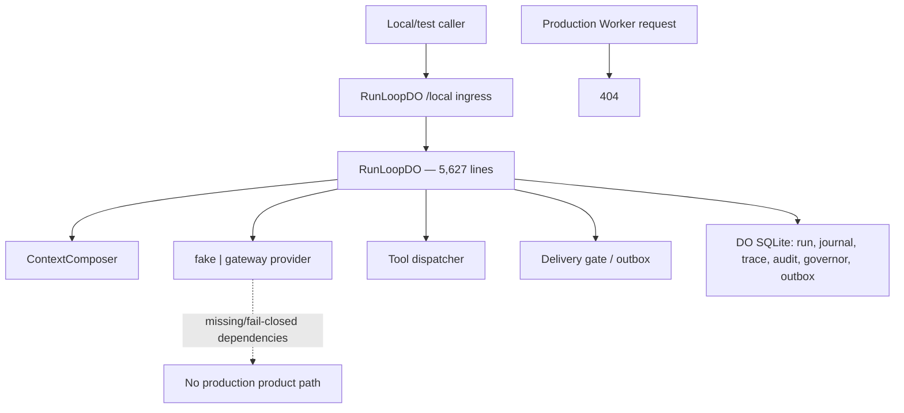

### 3.2 Current-to-target capability ledger

| Capability | Canonical status | Pinned-source evidence / proof qualifier | Target treatment |
|---|---|---|---|
| Trusted RunLoop | **Shipped** | Source/local proof: FSM, checkpoints, governor, effects, outbox, recovery; green tests; production unverified | **[Proposed decision — Adapt]** Retain kernel; prove production separately |
| Public product API | **Stub** | Contract only: OpenAPI exists; Worker returns 404 | **[Proposed decision — Adopt]** Command/query gateway |
| WaldoCoordinator | **Missing** | No symbol, contract, store, module | **[Proposed decision — Adopt]** Same-DO deep module |
| Waldo owner root | **Partial** | Opaque principal/tenant refs; no aggregate, presence registry, or owner-routed DO proof | **[Proposed decision — Adapt]** Auth outside; owner policy in coordinator |
| Outcome / Mission / WorkUnit | **Missing** | No canonical contracts, stores, or FSMs | **[Proposed decision — Adopt]** Product spine; Mission optional |
| Goal | **Partial** | Read contract/table; no public writer; prompt says unavailable | **[Proposed decision — Reject as product root]** Preserve migration evidence; add a distinct long-horizon grouping only if user evidence earns it |
| AgentSession | **Partial** | Naming collision: existing `SessionState` is per-wake security reset state | **[Proposed decision — Adopt]** Durable provider/executor session |
| JudgmentRequest | **Missing** | No durable request/status/expiry/decision | **[Proposed decision — Adopt]** Consequential choice boundary |
| AuthorityGrant | **Partial** | Narrow primitive: invocation verification/checkpoint approval only | **[Proposed decision — Adopt]** Scope, expiry, revocation, digest binding |
| EffectIntent/Receipt | **Partial** | Strong specialized core: pending effect before I/O; digest; reconciliation witnesses | **[Proposed decision — Adapt]** Generalize without weakening |
| Evidence/Verification | **Partial** | Technical only: runtime trace/replay/eval, not Outcome verification | **[Proposed decision — Adapt]** Separate execution and Outcome proof |
| Acceptance/OpenLoop/ReEntryPoint | **Missing** | No product contracts/FSMs | **[Proposed decision — Adopt]** Durable human closure/continuity |
| Artifact | **Stub** | Partial technical interface: replay source and fixtures; no durable owner | **[Proposed decision — Adopt]** Content-addressed metadata and retention |
| Spot | **Partial** | Schema only: Supabase table/RLS; no runtime writer | **[Proposed decision — Adapt]** Correctable observation |
| Constellation | **Stub** | Vocabulary only: soft ref/push literals; no contract/history | **[Decision — committed and evidence-gated]** Implement only with evidence ladder, counterevidence, correction, validity, and deletion |
| Multi-surface protocol | **Stub** | Text ingress/migrations; no production handler | **[Proposed decision — Adopt]** Commands/events/projections/cursors |
| Capability discovery | **Missing** | Fixed `fake | gateway`, no manifest | **[Proposed decision — Adopt]** Registry + conformance |
| Context composition | **Partial** | Module shipped with provenance/taint/privacy; production adapter/sources missing | **[Proposed decision — Adapt]** Purpose-bound product compiler |
| Live provider/channel path | **Stub** | Blocked: missing spend/context, fail-closed safety, throwing sink | **[Proposed decision — Spike]** One real provider + connector |

### 3.3 Preserve, but do not let current code define the product

- **[Observed fact]** `RunLoopDO` persists effect identity and request digest before adapter I/O (`packages/runtime/src/run-loop/do.ts:1692-1773`).
- **[Observed fact]** A mismatched pending effect fails closed (`packages/runtime/src/run-loop/do.ts:1757-1763`); known/unavailable receipt recovery does not trigger a second physical call (`packages/runtime/test/trusted-run-loop.test.ts:1548-1660`).
- **[Observed fact]** Delivery tests perform two attempts collapsed by sink idempotency, supporting effectively-once visibility (`packages/runtime/test/outbox-delivery.test.ts:114-160`).
- **[Observed fact]** `trusted-v2.ts` keeps its vocabulary private and leaves orchestration/writes with `RunLoopDO` (`packages/runtime/src/run-loop/trusted-v2.ts:1-24`).
- **[Inference]** The effect spine is valuable, but its 5,627-line owner lacks locality. Extract seams under conformance tests; do not replace wholesale.

Current `RuntimeRun`, `SessionState`, runtime `Evidence`, `GoalRecord`, `spots`, OpenAPI, and tool-name unions are false friends. None should be renamed into a target entity without new semantics and tests.

### 3.4 Post-merge implementation-start addendum

- **[Observed fact]** The implementation-start baseline is [`origin/main@77e770f47aba2d8f380ad8329f93c4a4a979fb44`](https://github.com/Pin4sf/waldo-backend/commit/77e770f47aba2d8f380ad8329f93c4a4a979fb44), fetched on 2026-08-05. The merge between the original audit pin and this baseline primarily establishes planning/build-direction material; it does not promote target product capabilities to shipped status.
- **[Observed fact]** The canonical desktop integration target is [`Pin4sf/kennel@4a9aa3d10673021ed271ca2a209b3a9de23bb062`](https://github.com/Pin4sf/kennel/commit/4a9aa3d10673021ed271ca2a209b3a9de23bb062). [`Developerr86/Kennel@9184f83`](https://github.com/Developerr86/Kennel/commit/9184f8303ccc4feb339582327d5d26adcc190b73) is a confirmed ancestor baseline, not a second product repository.
- **[Observed fact]** Current Kennel already supplies local desktop execution/supervision mechanics and local Outcome/Mission/WorkUnit representations. It does not yet consume the canonical Waldo protocol or defer canonical verification, Acceptance, OpenLoop, and ReEntry truth to the backend.
- **[Proposed decision — Adapt]** Migrate Kennel aggregate by aggregate: preserve its desktop/provider/workspace mechanics, introduce the shared protocol and stale-cache semantics, reconcile local migration inputs, then remove canonical-write authority only after contract and rollback proof.

This addendum refreshes the implementation handoff. Section 3.1 remains the source audit at its explicitly pinned historical SHA.

## 4. Target container architecture

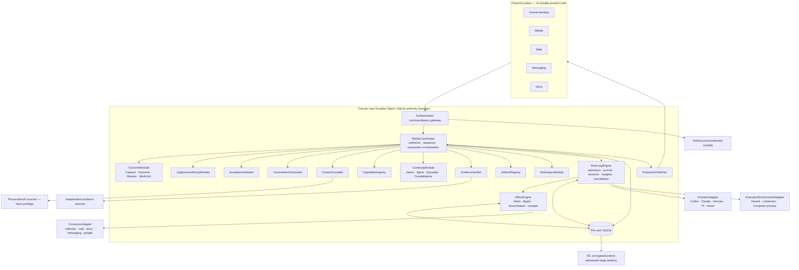

### 4.1 Exact placement

**[Proposed decision — Adapt]**

```text
packages/
  contracts/                  # canonical schemas and protocol
  coordinator/                # pure application/domain modules and ports
  runtime/
    src/run-loop/             # deployed RunLoopDO shell during migration
    src/execution-kernel/      # extracted execution/effect machinery
    src/coordinator-host/      # same-DO repositories + transaction runner
  adapters/                   # only after adapter depth earns a package
```

`packages/coordinator` imports no Cloudflare, provider SDK, UI, or network code. `packages/runtime` instantiates it with same-DO repositories inside one storage transaction. Keep the currently configured Worker class name `RunLoopDO` until a later name-only migration passes conformance and rollback gates; production deployment remains unverified.

**[Proposed decision — Reject]** Do not put the coordinator in Kennel, a harness, Supabase Edge Functions, a second DO, or a microservice.

### 4.2 Ownership and definitive writer rules

The authoritative aggregate-writer matrix is maintained in the [architecture lock](./WALDO_ARCHITECTURE_LOCK_AND_WHOLE_PRODUCT_BUILD_DIRECTION_2026-08-05.md#5-definitive-aggregate-writer-matrix). Its placement summary is:

| Module | Sole durable writes | Must not own |
|---|---|---|
| `IdentityPresenceModule` | WaldoIdentity, Presence | Outcome/effect/provider state |
| `OutcomeModule` | Capture, Outcome, Mission, WorkUnit | Provider syntax; raw I/O/retries/transcripts |
| `JudgmentAuthorityModule` | JudgmentRequest/Decision, AuthorityGrant, SensitiveHandoff | Effect issue; client-authored grants |
| `ContextCompiler` | ContextProjection | Authority; whole-person prompt dumps |
| `CapabilityRegistry` | Capability manifests, admission and conformance results | Product truth; approximate fallback |
| `RunLoopEngine` | ExecutionRequest, RuntimeRun, AgentSession, ExecutionLease | Outcome truth, acceptance, memory policy |
| `EffectEngine` | EffectIntent, EffectReceipt, reconciliation | Semantic success/closure |
| `EvidenceVerifier` | Evidence, Verification | Acceptance decisions |
| `ContinuityModule` | ContextClaim, Spot, Episode, Constellation, OpenLoop, ReEntryPoint | Personality/productivity scoring |
| `AcceptanceModule` | Acceptance | Verification generation; effect execution |
| `CommitmentScheduler` | Commitment, Schedule, TriggerOccurrence | Outcome acceptance; hidden Outcome creation |
| `ArtifactRegistry` | Artifact metadata and lifecycle | Unscoped blob reads; semantic verification |
| `WorkspaceModule` | Workspace metadata, checkpoints, restore attempts | Outcome truth; credential bytes; acceptance |
| `BudgetLedger` | BudgetReservation, UsageReceipt | Outcome acceptance; provider billing policy |
| `SourceAttributionLedger` | SourceUsageReceipt, AttributionEvent | Source content truth; acceptance |
| `DelegationModule` | ExternalDelegationRequest/Disposition, DelegationReply, SharedContextGrant | Transitive authority; counterparty private state |
| `WorkloadIdentityModule` | ExecutionPrincipal, WorkloadIdentity, DelegationGrant, CredentialHandle metadata | Reusable secret values; transitive authority |
| `ProtocolBindingRegistry` | ProtocolBinding and versioned mapping state | Waldo product truth; silent lossy downgrade |
| `BehaviorPackageRegistry` | Routine/Skill/Recipe/CapabilityPackage lifecycle and installation state | Credentials; authority; Outcome truth |
| `EvaluationRegistry` | EvaluationEnvelope and promotion eligibility evidence | Runtime execution; acceptance oracle mutation by executor |
| `PortabilityModule` | WaldoExportBundle and import/restore jobs | Implicit owner merge; credential export |
| `DeletionCoordinator` | DeletionTombstone and per-store acknowledgements | Silent physical deletion claims without receipts |
| `PostureModule` | ExecutionPosture and containment disposition | User personality/productivity scoring |
| `ProjectionPublisher` | Versioned read models and snapshot/cursor metadata | Source of truth |
| Kennel `OperationLedger` | Owner-bound local operations/processes | Waldo identity, Outcome, authority, acceptance, OpenLoop |

Rules:

1. **[Proposed decision — Adopt]** Public boundaries depend on canonical contracts, never coordinator implementation.
2. **[Decision — locked]** Each aggregate has exactly one reducer/table writer. `WaldoCoordinator` authenticates, authorizes, and sequences cross-aggregate commands; it does not mutate another reducer's tables. Provider and executor events normalize to untrusted observations first.
3. **[Proposed decision — Adopt]** Only ContextCompiler creates execution context.
4. **[Proposed decision — Adopt]** Every external mutation passes EffectEngine.
5. **[Proposed decision — Adopt]** WorkUnit transition + `ExecutionRequest` commit atomically; RunLoop admits idempotently by request ID.
6. **[Proposed decision — Reject]** No cross-repository database writes; exchange commands/events/manifests/artifact refs/projections.
7. **[Proposed decision — Reject]** No hidden SDK retries on effectful paths.

Kennel and every other presence can propose a command or report an observation; only the authenticated gateway can create a trusted command envelope, and only the owner Durable Object can admit the corresponding transition.

“One writer” means one serialized durable authority boundary and one named reducer per aggregate/table, not one function that writes everything. Same-DO atomicity is limited to SQLite commits such as product event + `ExecutionRequest`/outbox. Context retrieval, provider calls, connector I/O, and verification reads always occur outside the transaction and return through a new checked transition.

## 5. Canonical cross-repo contracts

### 5.1 Publication

**[Observed fact]** Current `@waldo/contracts` is private and version `0.0.0`; it is not a governed cross-repo release (`packages/contracts/package.json:2-8`).

**[Proposed decision — Adapt]** Keep it as the canonical schema source, but add SemVer protocol releases, immutable tags, changelog/compatibility window, generated JSON Schema/OpenAPI/AsyncAPI and Swift/Kotlin/TypeScript bindings, golden fixtures, reducer tests, and version negotiation. Enum/state semantic changes require a major version.

### 5.2 Untrusted request and trusted envelope

```ts
type ID = string;
type Revision = number;
type Digest = `sha256:${string}`;
type Timestamp = string;
interface AggregateRef { kind: string; id: ID; revision: Revision }
interface ActorRef { kind: "owner"|"presence"|"service"|"provider"|"person"; id: ID }
interface SurfaceCommandRequest<T> {
  protocolVersion: "0.1"; requestId: ID; commandType: string;
  presenceRegistrationId: ID;
  aggregate?: { kind: string; id: ID; expectedRevision?: Revision };
  correlationId?: ID; clientIssuedAt: Timestamp; payload: T;
}
interface TrustedCommandEnvelope<T> {
  protocolVersion: "0.1"; commandId: ID; commandType: string;
  ownerId: ID; presenceId: ID; actor: ActorRef;
  authenticatedSessionId: ID; ownerPolicyRevision: number;
  authAssurance: string; ownerRootRoutingVersion: number;
  aggregate?: AggregateRef; expectedRevision?: Revision;
  requestDigest: Digest; causationId?: ID; correlationId: ID;
  receivedAt: Timestamp; payload: T;
}
interface DomainEvent<T> {
  schemaVersion: string; eventId: ID; eventType: string; ownerId: ID;
  aggregate: AggregateRef; ownerCursor: number;
  causationId?: ID; correlationId: ID; occurredAt: Timestamp; payload: T;
}
interface ProjectionPage<T> {
  protocolVersion: "0.1"; ownerId: ID; projectionName: string;
  snapshotId: ID; snapshotBaseCursor: number;
  fromExclusiveCursor: number; highWaterCursor: number; nextCursor: number;
  items: T[]; hasMore: boolean; generatedAt: Timestamp;
}
```

`SurfaceCommandRequest` is untrusted and cannot carry authoritative owner, actor role, target Durable Object, grant, credential, provider/model selector, acceptance, or closure fields. The gateway derives and validates the trusted fields from the authenticated session, registered presence, current owner policy, and routing version; a client claim is never authoritative. Snapshot/cursor semantics and their gap/duplicate/account-switch fixtures ship in protocol v0.1 rather than being retrofitted after event history grows.

Every public gateway route enforces authentication, owner/presence authorization, strict schema/size validation, request-digest replay/conflict checks, and bounded per-session/per-owner/per-source rate limits before expensive or stateful work. Rejections use a versioned, content-free generic problem envelope that leaks no owner, Durable Object, provider, credential, policy, or internal-state detail.

### 5.3 Catalogue and minimum schema

| Contract | Minimum semantics |
|---|---|
| **Outcome** | `id, ownerId, revision, title, intendedState, userStatementRefs, constraints, nonGoals, acceptanceChecks, state, attentionPolicyRef, openLoopIds, timestamps` |
| **Mission** | `outcomeId, brief, planStatus, workUnitIds, informationFrontier, planDigest`; optional for simple Outcomes |
| **WorkUnit** | `responsibility, inputs, dependencies, expectedEvidence, requiredCapabilities, authorityCeiling, budget, isolation, stopConditions, assignee, sessionIds, state` |
| **AgentSession** | `workUnitId, provider/executor manifest refs, providerSessionRef, leaseId, cancellationGeneration, contextProjectionId, authorityGrantIds, eventCursor, state` |
| **JudgmentRequest** | `subject, question, options, recommendation, evidence, risk, reversibility, affectedDigest, requestedAuthority, reEntryPointId, expiry, decision` |
| **AuthorityGrant** | `grantor/grantee, exact scope/resources/purpose, argument/context/artifact digests, effect family, useLimit, usesConsumed, nextUseIndex, validity, revocationGeneration, state` |
| **EffectIntent** | `workUnitId/runId, family, adapter, reconciliationKey, canonicalArgumentsRef, argumentDigest, digestEncoding/version, data classification, authorityGrantId, grantUseIndex, grantRevocationGeneration, provider idempotency window, retryOwner/budget, cancellationGeneration, state`; `(authorityGrantId, grantUseIndex)` is unique and is committed atomically with grant consumption; the argument ref is an encrypted immutable content-addressed blob/version committed with the intent, and every attempt must resolve it and verify `argumentDigest` before I/O |
| **EffectReceipt** | `intentId, key/digest, provider operation/idempotency refs, applied/not_applied/partial/unknown, bounded response digest, adapter version, provenance` |
| **Evidence** | `subject, claim, kind, artifact/source refs, contentDigest, collector, provenance, data policy, candidate/admitted/stale/invalidated/deleted` |
| **Verification** | `outcome/revision, acceptanceCheckId, evidenceIds/digest, verifier, independence, methodVersion, pending/passed/failed/indeterminate/stale, findings` |
| **Acceptance** | `outcome/revision, evidenceSetDigest, verificationIds, actor, explicit/delegated mode, decision, grant, timestamp, reason` |
| **OpenLoop** | `outcome/workUnit, unresolvedConsequence, responsibleParty, nextTrigger, evidenceGap, reEntryPointId, attentionClass, state` |
| **ReEntryPoint** | `subject, judgment/execution/verification/conversation mode, summary, lastStableEventId, requiredDecision, context recipe, artifacts, cursor, expiry` |
| **Artifact** | `owner/workUnit, mediaType, size, contentDigest, encrypted storage ref, creator, provenance, data policy, lifecycle state` |
| **Spot** | `observation, evidence, provenance, personal/work/cross scope, sensitivity, candidate/confirmed/corrected/dismissed/promoted, user correction` |
| **Constellation** | `label, claim, supporting Spots, counterevidence, confidence band, unreviewed/confirmed/corrected/rejected, version/validity` |

Supporting contracts: `Capture`, `Commitment`, `AcceptanceCheck`, `ExecutionRequest`, `ExecutionObservation`, `ContextProjection`, `CapabilityManifest`, `ExecutionLease`, `Schedule`, `TriggerOccurrence`, `Projection`, and `DeletionTombstone`.

Identity/context contracts are first-class rather than implicit:

| Contract | Required lifecycle and fields |
|---|---|
| `WaldoIdentity` | `ownerId`, account subject refs, root DO routing version, owner policy revision, active/deleting/deleted, deletion generation; never provider identity |
| `Presence` | `presenceId`, ownerId, type, device/app instance, protocol/capability manifest, registered/active/suspended/revoked/retired, last cursor; account switch revokes old owner lease/cache before new registration |
| `ContextClaim` | statement/claim, explicit/inferred source, provenance/evidence, sensitivity/scope, correction lineage, purpose eligibility, expiry, confirmed/corrected/rejected/expired/deleted |
| `ContextProjection` | owner/purpose, WorkUnit and destination/audience, source claim refs/revisions, included data classes and explicit exclusions, personal/work/cross-scope decision, health consent/policy ref, redaction version, freshness, expiry, deletion generation, immutable digest |
| `ContextProjectionRecipe` | allowed source classes, retrieval limits, ranking policy, required/optional source behavior, audience/destination policy, max token/byte budget, version and rollback |
| `DeletionTombstone` | owner/data subject, deletion generation, source cursor, affected refs/stores, issued/acknowledged/failed status, retry owner and terminal escalation |

Presence deletion or account switching cannot merge identities: local caches and leases are owner-bound, and a new owner registration cannot reuse the prior owner’s cursor, context projection, provider session, or artifacts.

### 5.4 Contract invariants

1. **[Proposed decision — Adopt]** Explicit user statements and corrections are immutable provenance and outrank inference.
2. **[Proposed decision — Adopt]** Every mutable aggregate has owner, revision, event history, and optimistic concurrency.
3. **[Proposed decision — Adopt]** No provider/session transition directly changes Outcome acceptance or OpenLoop resolution.
4. **[Proposed decision — Adopt]** Acceptance binds an Outcome revision and evidence-set digest; later changes make it historical, not mutable.
5. **[Proposed decision — Adapt]** Delegated acceptance requires a narrow policy and AuthorityGrant; the current default is explicit user acceptance until that policy passes conformance.
6. **[Proposed decision — Adopt]** Artifacts are content-addressed; events contain bounded metadata, not full transcripts or raw health.
7. **[Decision — locked]** Each grant use is identified by `(authorityGrantId, grantUseIndex)` with a database uniqueness constraint and golden concurrent-admission fixtures. The same grant/use cannot bind two intents, and the same intent cannot change its grant binding.

## 6. Separate state machines

These are separate aggregates or ledgers. A transition in one may request a transition in another through a command, but it never implies it.

### 6.1 Outcome

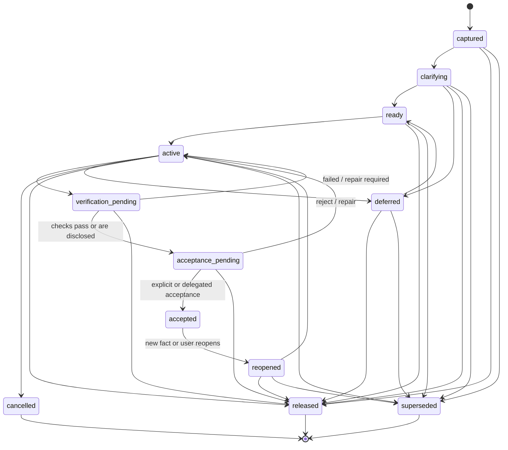

**[Proposed decision — Adopt]** `accepted` means a specific revision/evidence set was accepted. Reopen preserves that history and creates a later revision; it does not rewrite the past.

### 6.2 Work Unit

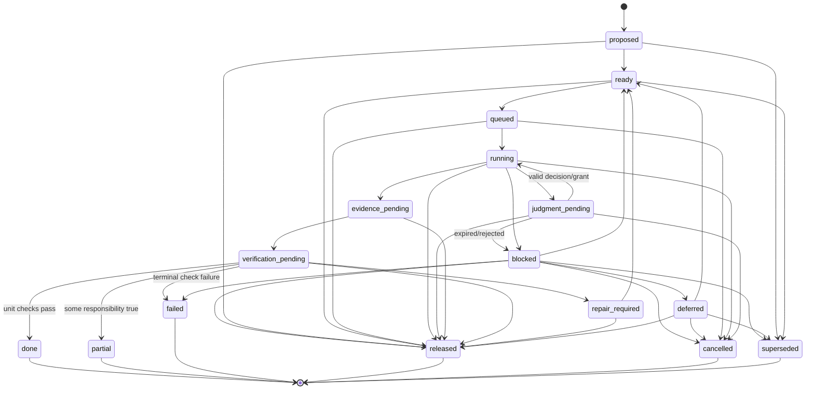

**[Proposed decision — Adapt]** Plan only to the current information frontier. Discovery may create or supersede Work Units; it must not silently broaden their authority ceiling.

### 6.3 Agent Session

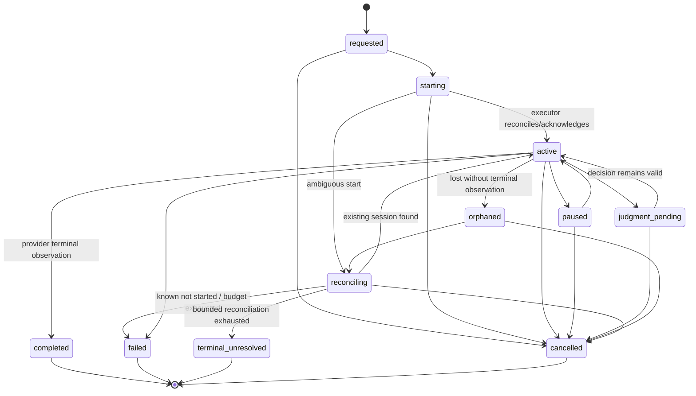

**[Proposed decision — Adopt]** `completed` records provider/session activity only. It cannot set WorkUnit `done`, Outcome `accepted`, or OpenLoop `resolved`.

### 6.4 External effect

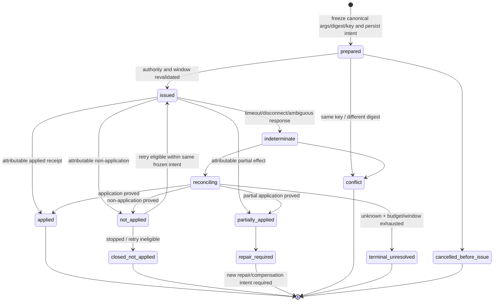

**[Proposed decision — Adopt]** Never blindly retry `indeterminate`. A retry is a new attempt of the same frozen intent only after reconciliation proves `not_applied`. Compensation is a new effect, never a rollback of historical truth.

### 6.5 Judgment and approval

`JudgmentRequest` and `AuthorityGrant` are separate aggregates. A presence can submit `AnswerJudgment`; it cannot submit, construct, or select the fields of an `AuthorityGrant`. `JudgmentAuthorityModule` evaluates the authenticated answer against the current affected revision/digests and owner policy, then creates or refuses the grant.

#### JudgmentRequest

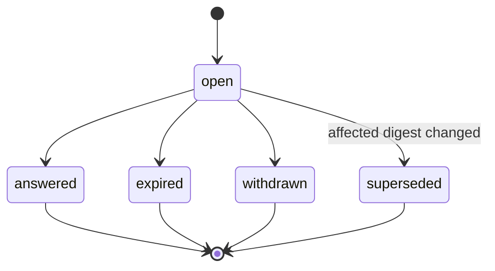

#### AuthorityGrant

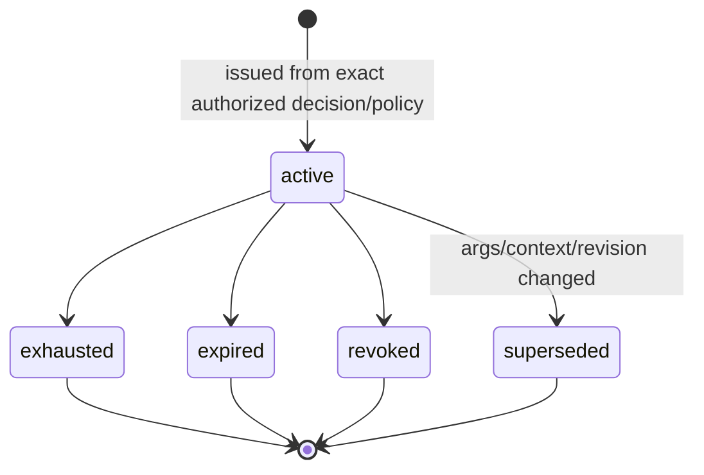

**[Proposed decision — Adopt]** Approval binds exact effect arguments/artifact and context versions. After expiry or long suspension, revalidate authority, arguments, context freshness, cancellation generation, and provider idempotency window.

**[Decision — locked]** Grant consumption and `EffectIntent` creation are one SQLite transaction. It validates state, scope, purpose, resource, use limit, expiry, revocation generation, argument/context/artifact digests, and effect family; increments or consumes the unique grant-use slot; and inserts the immutable intent. If any step fails, neither mutation commits. A single-use grant is consumed when the intent is created, even if the intent is later cancelled before issue; changed or replacement arguments require a new judgment and grant.

### 6.6 Evidence, verification, and acceptance

These are three independent aggregates. `AdmitEvidence`, `RequestVerification`, and `RecordAcceptance` are separate commands joined by stable IDs and immutable digests.

#### Evidence

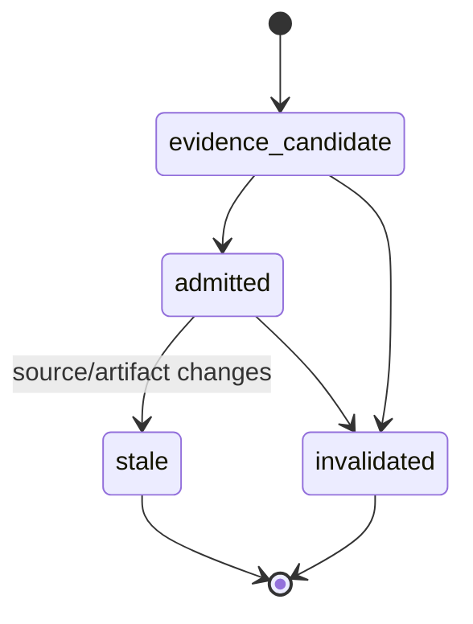

#### Verification

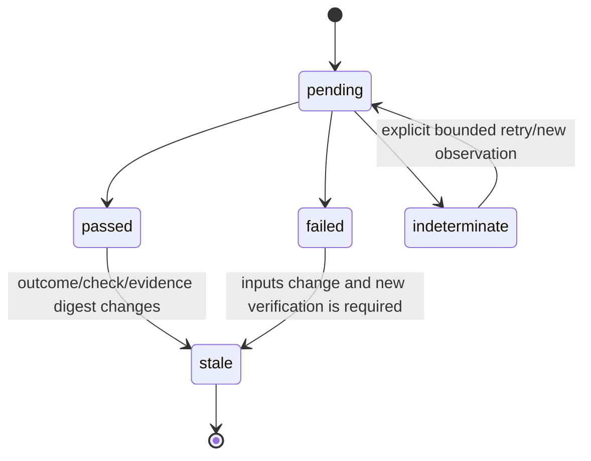

#### Acceptance

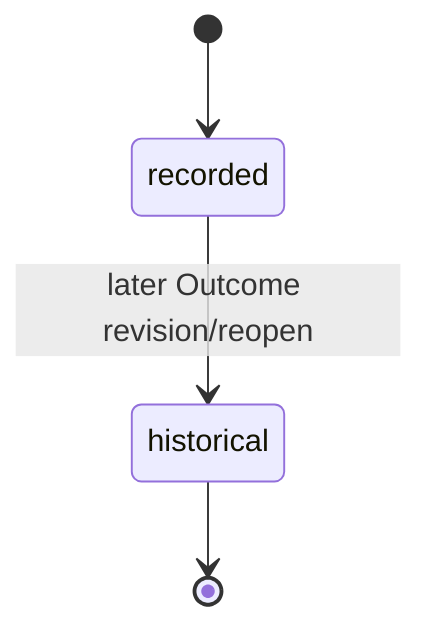

**[Decision — locked]** Deterministic independent read-back is always required when an external effect exposes a trustworthy read path. Artifact checks are deterministic where a declared `AcceptanceCheck` permits it. LLM-based semantic verification runs only when the owner declared that check, explicitly requests it, or policy requires it; the model, harness, grader, evidence, and independence limits are disclosed. If no independent verifier is available, record `indeterminate`; never describe self-assertion as independent verification.

### 6.7 Open Loop and re-entry

```mermaid
stateDiagram-v2
  [*] --> open
  open --> waiting: another party/time/event
  open --> needs_judgment
  open --> ready
  waiting --> ready: trigger observed
  waiting --> needs_judgment
  needs_judgment --> ready: decision captured
  ready --> waiting: action taken; consequence still pending
  ready --> resolved: consequence proved/accepted
  open --> released
  waiting --> released
  needs_judgment --> released
  ready --> released
  ready --> superseded
  resolved --> open: reopened by new fact/user
  released --> [*]
  superseded --> [*]
```

Every nonterminal OpenLoop has one exact `ReEntryPoint`: last stable event, next decision/action, required context recipe, evidence gap, artifact refs, and event cursor. Morning Brief and Daily Close read this state, not unread transcript volume.

## 7. Data ownership and retention

**[Proposed decision — Adapt]** Retention classes are policy-controlled defaults, not hard-coded promises. Users can shorten retention; legal/security requirements may impose documented minimums.

| Data | Authoritative owner/store | Default retention | Execution exposure | Deletion behavior |
|---|---|---|---|---|
| Account identity, auth factors | Identity provider/Supabase auth | Account lifetime + security audit policy | Principal/verification refs only | Account erasure workflow + required security tombstone |
| Waldo owner policy/presences | Per-user DO SQLite | Account lifetime | Necessary policy claims only | Tombstone and projection invalidation |
| Outcome/Mission/WorkUnit | Per-user DO SQLite | Until user deletes/releases under policy | Purpose-bound subset | Event tombstone; dependent projections removed |
| Judgment/Authority | Per-user DO SQLite append-only audit | Security policy, longer than grant validity | Exact current grant only | Revoke immediately; audit minimized/retained per policy |
| Effect intent/receipt | Per-user DO SQLite | Audit/reconciliation window | Adapter gets frozen intent | Tombstone payload where allowed; retain nonsecret digest/audit |
| OpenLoop/ReEntry | Per-user DO SQLite | Until resolved/released + user policy | Minimal re-entry projection | Cascade/tombstone safely |
| Raw health | Health source/Supabase health tables | User/source policy | **Never by default** | Source deletion + index/projection invalidation |
| Derived health context | ContextProjection in DO, encrypted | Short TTL, purpose-bound | Only named destination/audience | Expire/delete; no prompt/log residue |
| Credentials/tokens | OS keychain/provider vault/secret binding | Until revoked | Just-in-time handle, never value in model context | Revoke/delete and rotate dependent sessions |
| Raw provider transcript | Kennel/provider source by default | Local/provider user policy | Not copied by default | Local/provider deletion plus semantic projection tombstone |
| Semantic session events | Per-user DO SQLite | Outcome/OpenLoop policy | Bounded normalized facts | Tombstone and rebuild projections |
| Small artifact metadata | Per-user DO SQLite | Parent policy | References and hashes | Tombstone; schedule blob erasure |
| Large artifact bytes | Encrypted R2 or source-owned store | Parent policy | Signed/short-lived scoped access | Cryptographic/logical deletion + blob erasure |
| New Spot/Constellation claims | Target per-owner DO SQLite with correction history | Until user deletes | Only when relevant and permitted | Tombstone; prevent re-inference from deleted evidence |
| Legacy Supabase Spots | Supabase remains authority until user-reviewed cutover | Existing user/source policy | Read-only migration projection | Supabase tombstone propagates before/through cutover |
| Surface projection/cache | Presence local store | Short disconnected-display window | Surface-specific read-only rendering | Cursor tombstone, remote wipe where supported; no command admission or truth change |
| Observability | Redacted aggregate telemetry | Short operational window | No content/credentials/raw health | Automatic expiry; deletion by owner key where feasible |
| Billing/usage attribution | Backend ledger + daily provider reconciliation | Finance policy | No personal content | Aggregate/anonymize after attribution window |

**[Proposed decision — Reject]** Complete transcripts, credentials, raw health, unrelated personal history, and unbounded file trees do not enter provider or execution environments by default.

## 8. Authority, privacy, credential, and trust boundaries

### 8.1 Trust zones

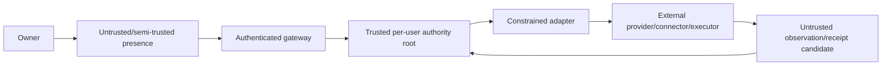

1. **[Proposed decision — Adopt]** Authorization is fail-closed. Gateway authentication establishes actor/owner; Coordinator policy determines allowable product transition; RunLoop revalidates grant at effect issue.
2. **[Proposed decision — Adopt]** A model, provider, executor, connector, or local app never grants itself authority.
3. **[Proposed decision — Adopt]** Provider output, tool output, local files, webpages, messages, and transcripts are untrusted data subject to injection controls and provenance.
4. **[Proposed decision — Adopt]** Credential values never cross into model-visible context, events, traces, receipts, artifacts, or surfaces. Adapters use references to a credential broker.
5. **[Proposed decision — Adopt]** Every `ContextProjection` declares purpose, audience, destination, included data classes, exclusions, source provenance, freshness, expiry, redaction version, and digest.
6. **[Proposed decision — Reject]** Personal context cannot silently leak into Work. Cross-scope use needs explicit relevance, purpose, policy, and (for sensitive classes) consent.
7. **[Proposed decision — Adopt]** Health-derived context must be minimized and caring, not controlling: e.g. “prefer a lighter schedule today” can be proposed; raw metrics/diagnoses do not enter a coding or mail session.
8. **[Proposed decision — Adapt]** User corrections invalidate downstream claims/projections and are test inputs for non-recurrence.
9. **[Proposed decision — Reject]** A health observation or derived health claim cannot by itself create or promote a Capture, proposal, Outcome, WorkUnit, JudgmentRequest, OpenLoop, Schedule, attention-priority escalation, or AuthorityGrant. It may influence wording/options only inside an already existing user-grounded Capture, Outcome, commitment, question, or explicitly enabled caring purpose; ordinary user intent still controls every promotion.
10. **[Proposed decision — Adopt]** Conformance includes negative tests proving health-derived inputs cannot change capability eligibility, authority ceilings, effect admission, or Outcome priority unless an explicit owner policy names that exact purpose and the user action remains reversible/correctable.
11. **[Decision — locked]** “Private” and “user-owned” require the explicit threat actors, operator-access policy, key lifecycle, content-minimized event references, per-store deletion acknowledgements, crypto-erasure, backup/PITR behavior, and restore/re-delete proof in the [architecture lock](./WALDO_ARCHITECTURE_LOCK_AND_WHOLE_PRODUCT_BUILD_DIRECTION_2026-08-05.md#64-operational-meaning-of-private-and-user-owned). No stronger end-to-end or operator-inaccessibility claim is made without its implemented key protocol.

### 8.2 Context compilation algorithm

```text
requested capability + WorkUnit purpose
  -> classify destination and data policy
  -> retrieve only eligible sources
  -> apply owner statements/corrections before inference
  -> minimize and redact
  -> enforce personal/work/health boundaries
  -> prove every requested aggregate/action has a non-health user-grounded purpose
  -> attach provenance/freshness/expiry
  -> hash immutable ContextProjection
  -> admission check against adapter manifest
```

Required source absent means fail closed. Optional source absent produces an explicit degraded projection; Waldo never invents continuity.

## 9. Retry, reconciliation, cancellation, and ambiguity

| Call/effect family | Sole retry owner | Key / frozen identity | Ambiguous result rule | Budget/breaker/terminal path |
|---|---|---|---|---|
| Surface → command gateway | Surface transport | Stable `command_id` + payload digest | Query command acknowledgement/projection before resend | Bounded network retry; conflict on changed digest |
| Scheduler occurrence → Coordinator | Occurrence dispatcher | schedule + occurrence instant/revision | Look up occurrence result | Missed-occurrence policy; visible degradation |
| Coordinator → RunLoop admission | Coordinator durable outbox | `execution_request_id` + WorkUnit revision | Lookup admission | Terminal blocked if incompatible/stale |
| Model completion without effects | RunLoop provider router | run/turn/manifest/context digest | Retry only known pre-result failure; discard ambiguous partial generation | Provider budget, jitter, breaker, fallback only if semantics compatible |
| Provider session start/resume/steer | RunLoop | executor operation/session key + command digest | Reconcile provider/Kennel operation before retry | Orphaned/reconciling/terminal visible |
| Kennel executor call | RunLoop | `operation_id`, lease/fence, cancellation generation | Kennel ledger returns existing operation/session | Lease expiry, bounded reconcile, Needs You |
| Connector read/search | Connector adapter | Query digest + snapshot/freshness | Bounded retry is safe; disclose stale/partial | Read budget/breaker; degraded result |
| Calendar create/update/delete | EffectEngine | Stable effect key + canonical event args digest | Provider lookup by idempotency key/event ref; compare material fields | Reconcile; terminal unresolved if unknown |
| Email/message send | EffectEngine | Stable send key + recipients/body/attachment digests | Search provider sent state/message ID before resend | Never blind resend; human-visible unknown |
| File/doc write | EffectEngine | Target/version + content digest | Read target/version/content; detect partial/conflict | New repair/compensation effect |
| SCM/issue mutation | EffectEngine | Repository/object/revision + patch digest | Read object/history by operation marker | Conflict/repair; never overwrite changed state |
| Payment/purchase/submission | EffectEngine | Provider idempotency key + full frozen order digest | Provider transaction lookup mandatory | No retry while unknown; escalate |
| Notification delivery | Delivery outbox | delivery ID + semantic payload digest | Channel lookup/dedupe when supported | Bounded attempts; alternate channel only after `not_delivered` is proved, or through a preapproved multi-channel DeliveryPlan with explicit duplicate semantics; otherwise Needs You |
| Human assignment/message | EffectEngine | person/channel/content digest | Reconcile source conversation/task | Show unknown; do not duplicate social action |
| Artifact upload | Artifact adapter | Content hash + part ledger | Resume/query parts; final hash verify | Quarantine corrupt/partial artifact |
| Evidence source read | Verification module | Check + source snapshot | Failure = `indeterminate`, never pass | Retry read budget; acceptance remains pending |
| Surface projection delivery | Projection outbox | owner cursor/event ID | Duplicate harmless; request missing cursor range | Snapshot rebuild after gap |
| Provider SDK internal retry | Disabled or owned/declaratively counted by adapter | Manifest-declared | Hidden retries make sensitive adapter ineligible | Conformance failure/circuit open |
| Compensation/undo | EffectEngine as new intent | New key/digest linked to original | Reconcile independently | Never erase original receipt/history |

Cross-family invariants:

- **[Proposed decision — Adopt]** Persist intent before I/O and freeze canonical arguments/digest before first attempt.
- **[Proposed decision — Adopt]** Same reconciliation key with a different digest is a hard conflict and audit/security event.
- **[Proposed decision — Adopt]** Every path has one retry owner; nested retry counts consume the same declared budget or the adapter is ineligible.
- **[Proposed decision — Adopt]** Use bounded exponential backoff with jitter, deadline, retry budget, circuit breaker, and a user-visible terminal state.
- **[Proposed decision — Adopt]** Cancellation is a monotonic generation checked before each resumed step. Late results are quarantined as evidence; cancellation does not undo an effect.
- **[Proposed decision — Adopt]** Approval/authority and provider idempotency windows are revalidated after suspension.

## 10. Cloudflare and external capability decisions

| Capability | Current evidence | Decision | Waldo boundary / gate |
|---|---|---|---|
| Durable Objects + SQLite | Existing trusted runtime and tests | **[Decision — locked]** | Initial per-user canonical authority root and one serialized durable boundary; placement changes only after load/size falsification and a replacement single-writer design |
| R2 | Existing Cloudflare object store; current code has only contract-level workspace/blob seams | **[Decision — locked]** initial blob adapter | Encrypted content-addressed checkpoint chunks, large Artifact bytes, backup/export payloads; canonical metadata stays in SQLite; FUSE/object access is not native-SSD semantics |
| Sandbox SDK + Containers | Available isolated execution/container primitives | **[Decision — locked]** initial cloud-executor candidate | Executor only; pin image digest, run non-root/read-only base where possible, drop capabilities, forbid privileged/host namespaces and host/runtime sockets, bound resources, default-deny egress, broker credentials, and pass lease/fence, checkpoint, deletion, cost, process-tree cancellation, and secret-free-log conformance |
| Workflows | Durable long-running workflow primitive | **[Proposed decision — Adapt]** peripheral jobs only | May own deterministic waits/service jobs; never product FSMs, authority, effect admission, acceptance, or OpenLoop closure |
| Queues | At-least-once delivery primitive | **[Proposed decision — Adapt]** transport only | Consumers deduplicate by stable ID/digest; delivery cannot prove a product transition |
| AI Gateway | Current provider routing, observability, and spend controls | **[Proposed decision — Adapt]** | Provider routing/budgets/usage only; private payload logging off, metadata minimized, Waldo owns policy and atomic budget reservation |
| Workers AI | Current model and embedding surface | **[Proposed decision — Adapt]** adapter | Evaluated model/embedding option only; no special authority or model-generated memory truth |
| Vectorize / AI Search | Current vector/search primitives; AI Search remains an evaluated implementation choice | **[Proposed decision — Spike/Adapt]** | Rebuildable permitted-source projection only; correction/deletion must rebuild and it never owns ContextClaim truth |
| Browser / Browser Run | Browser automation with supervised/handoff capabilities | **[Proposed decision — Spike/Adapt]** | Prefer API/WebMCP; browser mutation remains an effect and needs reconciliation/read-back where possible |
| Artifacts | Versioned handoff primitive with maturity caveats in the source refresh | **[Proposed decision — Spike]** | Candidate `ArtifactStoreAdapter`; R2/Git-compatible ports remain available and beta maturity cannot become product authority |
| Agent Memory | Memory extraction/recall primitive with private-beta evidence limits | **[Proposed decision — Benchmark only]** | Compare extraction/supersession/temporal/export patterns; Waldo retains canonical provenance, correction, retention, and authority |
| Think turns/submissions/session trees/recovery | `@cloudflare/think@0.15.1`; docs updated 2026-07-23; experimental ([pinned overview](https://github.com/cloudflare/agents/blob/2b2b5980e1945cf55f5a11626bc395e7c460516f/docs/think/index.md#L1-L28)) | **[Proposed decision — Spike]** | Adapt only where conformance proves code reduction; Waldo owns product state |
| Think approval descriptors | Cold-loadable pending approvals and pause patterns | **[Proposed decision — Adapt]** | Map to Waldo JudgmentRequest; Waldo owns decision/grant |
| Think Actions ledger | Pending before execute, but thrown/timed-out rows deleted; stale explicit-key row reruns after 5m; authorization defaults full | **[Proposed decision — Reject]** as effect/retry/authority owner | No frozen digest conflict or reconcile-first guarantee; route effects into RunLoop instead ([ledger](https://github.com/cloudflare/agents/blob/2b2b5980e1945cf55f5a11626bc395e7c460516f/docs/think/actions.md#L82-L118), [authorization](https://github.com/cloudflare/agents/blob/2b2b5980e1945cf55f5a11626bc395e7c460516f/docs/think/actions.md#L188-L220)) |
| Cloudflare Computer | `cloudflare/computer` commit `63d3636`; npm `@cloudflare/computer@0.1.1` points to it; preview-only; DO workspace plus isolate/container backends | **[Decision — locked]** feature-flagged preview adapter | Implement only behind `WorkspacePort`/`ExecutionEnvironmentAdapter`; never product truth, sole copy, or production dependency until maturity/durability/deletion/restore gates pass ([pinned README](https://github.com/cloudflare/computer/blob/63d363632e558f7e077794988d36ed75017c2a62/packages/computer/README.md#L1-L49)) |
| Python↔JS Workers RPC | Structured-clone RPC/live objects; announced 2026-08-03 | **[Implementation choice — not selected]** | Only a named Python-native workload and benchmark can justify; explicit DTOs still required ([source](https://blog.cloudflare.com/python-workers-rpc/)) |
| Kimi K2.6 / GLM-5.2 serving | Official platform pages expose 262,144-token contexts; serving optimizations are not a Waldo contract | **[Proposed decision — Spike]** | Add to the versioned roster only after Waldo evals; no unbounded personal prompt ([Kimi](https://developers.cloudflare.com/ai/models/%40cf/moonshotai/kimi-k2.6/), [GLM](https://developers.cloudflare.com/changelog/post/2026-06-16-glm-5-2-workers-ai/), [serving](https://blog.cloudflare.com/smaller-faster-safer-models/)) |
| Inbound TCP/gRPC | Private beta | **[Implementation choice — not selected]** | Current Kennel protocol does not require it; activate only after measured transport need ([source](https://blog.cloudflare.com/grpc-workers/)) |
| Billable Usage API | Daily account/product cost; not real time | **[Proposed decision — Adopt]** for FinOps | Delayed reconciliation only; own per-WorkUnit usage ledger remains required ([source](https://blog.cloudflare.com/billable-usage-api/)) |
| Retry article | Useful synthesis; author disclaims production experience | **[Proposed decision — Adapt]** as checklist, **Reject** as authority | Existing Waldo invariant is stronger ([source](https://bhavishyapandit9.substack.com/p/idempotency-and-retry-semantics-for)) |
| ChatGPT Voice in Work/Codex | Starts tasks, checks progress, coordinates agents; selected-experience permissions; one voice conversation; desktop-only for Work/Codex; Codex history separate | **[Proposed decision — Adapt]** as Presence | One Waldo command/event truth improves on documented ChatGPT/Codex history separation ([official guide](https://help.openai.com/en/articles/20001275-chatgpt-work-and-codex)) |

### 10.1 Computer falsification gates

Computer remains preview-only until all pass: owner/Outcome/WorkUnit isolation; credential injection/rotation/revocation and log absence; default-deny auditable egress; crash/restart/concurrent-write and container/DO VFS consistency; artifact hash/evidence extraction; timeout/process-tree kill/orphan recovery; EffectIntent-to-Receipt mapping; cost/cold-start comparison; version pin/fallback. In addition, Cloudflare must remove its upstream “not suitable for production” warning, or Waldo must explicitly choose and support an owned fork. Internal conformance alone cannot override upstream maturity. Failure of any production-critical gate keeps it disabled.

### 10.2 Model routing and evaluation changes

**[Proposed decision — Adapt]** Route by tested capability, not provider prestige or window size. Each model version must be evaluated for tool choice and argument accuracy, multi-turn result continuity, false-done/premature-closure rate, evidence-grounded verification, judgment calibration, privacy/redaction, bounded retrieval at realistic budgets, latency/cost/cancellation, and failure/fallback compatibility. Production eligibility expires when version/source fingerprints drift.

**[Unknown / blocked]** No current evidence establishes that Python RPC, gRPC, or the new model candidates improve a named committed workload. Do not add them until a falsifiable benchmark earns the adapter; this implementation decision does not shrink the product capability envelope.

## 11. Kennel executor protocol and synchronization

### 11.1 Boundary

**[Decision — locked]** Kennel is both a rich presence and the initial local `ExecutionEnvironmentAdapter`. Its UI reads backend projections. Its local executor owns local process/session mechanics and a local operation ledger. Kennel proposes; the owner Durable Object admits. It never becomes an alternate product database or authority root.

### 11.2 Operation protocol

Backend → Kennel commands:

| Command | Required binding |
|---|---|
| `EnsureExecutorRegistered` | device/presence identity, manifest fingerprint, attestation posture, protocol version |
| `StartSession` | operation ID, WorkUnit/revision, lease/fence, provider manifest, context projection digest/ref, grants, budget, cancellation generation |
| `ResumeSession` | stable session ref, last acknowledged event cursor, new lease, unchanged/explicitly changed context digest |
| `SteerSession` | stable command ID/digest, session ref, exact user/coordinator instruction, grant if consequential |
| `PauseSession` | reason, expected checkpoint/evidence, lease behavior |
| `CancelSession` | monotonic cancellation generation and reason |
| `RequestArtifact` | artifact descriptor, path allow-list, classification, max size, hash policy |
| `ReconcileOperation` | stable operation ID and expected command digest |

Kennel → Backend events:

| Event | Meaning |
|---|---|
| `OperationAccepted` | Local intent persisted before spawn/resume; includes operation digest |
| `SessionObserved` | Provider session ref and normalized lifecycle observation |
| `ProgressObserved` | Bounded semantic milestone, not raw transcript |
| `JudgmentNeeded` | Blocker/options/evidence/risk; Coordinator creates canonical request |
| `ArtifactOffered` | Hash, size, media type, classification, provenance; upload not yet trusted |
| `EffectRequested` | Request to backend EffectEngine; Kennel does not perform backend-owned connector effect |
| `OperationReconciled` | Known started/not-started/active/terminal/unknown with evidence |
| `SessionTerminalObserved` | Provider completed/failed/cancelled; not WorkUnit completion |
| `Heartbeat` | Lease/fence, cursor, process state, resource usage |

### 11.3 Local durability and sync rules

1. **[Proposed decision — Adopt]** Kennel persists `operation_id + command_digest + disposition` before spawning or resuming a provider. Same ID/different digest is a hard conflict.
2. **[Proposed decision — Adopt]** Backend is retry owner for backend→Kennel operations. Provider subprocess and SDK retries are declared/disabled so they cannot amplify the call path.
3. **[Proposed decision — Adopt]** Events have monotonically increasing per-session sequence, command causation, stable event ID, and bounded payload. Backend acknowledges a contiguous cursor.
4. **[Proposed decision — Adopt]** Reconnect starts with `ReconcileOperation` and cursor exchange; it never assumes a lost acknowledgement means “not started.”
5. **[Proposed decision — Adopt]** Leases use fencing tokens. Expired/superseded executors cannot publish authoritative new observations, though late results may be quarantined as candidate evidence.
6. **[Proposed decision — Adopt]** Raw transcripts and sensitive local file contents remain local by default. Semantic summaries carry provenance and are proposals until admitted.
7. **[Proposed decision — Adopt]** Local mode is not a second identity: all product commands and Waldo execution require available online backend authority. Loss of that authority pauses or contains execution under the current lease/fence; reconnection reconciles before resume.
8. **[Proposed decision — Reject]** Git repository, branch, session, task, or PR is not the universal Outcome. Kennel supports general work.

### 11.4 Synchronization failure cases

| Failure | Required behavior |
|---|---|
| Disconnect before start acknowledgement | Reconcile operation ID; do not spawn twice |
| Process starts but Kennel crashes | Rebuild local ledger/process observation; backend session becomes reconciling/orphaned |
| Backend lease changes while old process runs | Fence old writer; quarantine late events |
| Provider emits out-of-order events | Kennel normalizes local sequence; backend requests missing range |
| Artifact changes after approval | New digest invalidates grant and verification |
| Disconnected UI attempts a command or approval | Do not create or queue it; show an online-required state and, if available, only an explicitly stale read-only last-synced projection |
| Local transcript deleted | Preserve bounded product events/evidence refs; mark unavailable source honestly |

## 12. Multi-surface event and command protocol

### 12.1 One durable Waldo, multiple presences

**[Proposed decision — Adopt]** The command gateway maps authenticated account → one owner root → one per-user DO. `presence_id` identifies origin and delivery preference, not an identity partition. A voice turn, Kennel chat, mobile capture, web review, or messaging reply uses the same aggregate IDs and owner cursor.

### 12.2 Commands

Minimum command set for the first product:

```text
CaptureIntent, PromoteCaptureToOutcome, ClarifyOutcome, CorrectStatement,
PlanOutcome, ApproveMissionPlan, CreateOrReviseWorkUnit, AssignWorkUnit,
StartWorkUnit, SteerSession, PauseWorkUnit, CancelWorkUnit,
AnswerJudgment, RequestAuthorityRevocation,
AcceptOutcome, RejectOutcome, RequestRepair, ReopenOutcome, ReleaseOutcome,
ResolveOpenLoop, SnoozeOpenLoop, UpdateAttentionPolicy,
RegisterPresence, AcknowledgeProjection, RequestProjectionSnapshot
```

Every untrusted surface request has a stable request ID, payload digest, registered presence, expected aggregate revision, correlation, protocol version, and client issue time. The gateway derives authenticated owner/actor/session fields and creates the trusted command envelope. Duplicate ID/same digest returns the original acknowledgement. Same ID/different digest is a hard conflict. Stale expected revision returns current truth and a safe rebase instruction; the server does not last-write-win.

### 12.3 Events and projections

**[Proposed decision — Adapt]** Publish domain events to an owner-ordered outbox and derive surface projections such as `HomeToday`, `WorkBoard`, `NeedsYou`, `OutcomeDetail`, `SessionSummary`, `MorningBrief`, `DailyClose`, `Shelf`, and `Continuity`. Surfaces resume from `owner_cursor`; after an unrecoverable gap they fetch a versioned snapshot then continue.

Projection events are at-least-once and reducible. They contain no secrets, raw health, or raw transcripts. Each projection declares freshness/degraded state. While online, a surface may optimistically render a pending state only after transmitting a command to the backend; backend acknowledgement remains authority. Protocol 0.1 does not create or queue disconnected commands.

### 12.4 Voice as a presence

**[Observed fact]** OpenAI’s 2026-07-23 release lets Voice in Work/Codex start tasks, check progress, ask about agents, and coordinate multiple agents; Voice inherits the selected experience’s tools/permissions, only one voice conversation runs at a time, and Codex history remains separate. Work/Codex Voice is currently desktop-only on macOS/Windows; standalone Voice in these experiences is not available on web/mobile ([official release notes](https://help.openai.com/en/articles/11391654-chatgpt-business-release-notes#h_4aaf73076e), [guide](https://help.openai.com/en/articles/20001275-chatgpt-work-and-codex)).

**[Proposed decision — Adapt]** Waldo voice normalizes speech to the same command protocol. Barge-in/redirection becomes a durable command with causation. Progress is read from projections, not transcript inference. Consequential approval reads back the frozen effect summary and binds the exact digest. Raw audio, transcript, semantic command, and user-promoted memory have separate retention settings.

## 13. Capability manifests and discovery

### 13.1 Manifest shape

```ts
type Capability =
  | { name: "session.control"; level: "native"|"emulated"; operations: Array<"start"|"resume"|"steer"|"pause"|"cancel"|"reconcile">; cancellation: "fenced"|"best_effort" }
  | { name: "effect.operation"; family: EffectFamily; operations: string[]; semantics: EffectSemantics }
  | { name: "context.input"; modalities: Array<"text"|"image"|"audio"|"file_ref">; maxBytes: number; maxTokens?: number }
  | { name: "artifact"; mediaTypes: string[]; maxBytes: number; hashing: "sha256"; resumable: boolean }
  | { name: "presence"; modalities: string[]; offlineCommands: "none"; approvalReadback: boolean };

interface EffectSemantics {
  retryOwner: "waldo_run_loop" | "adapter_declared";
  hiddenRetries: { count: number } | { status: "unknown" };
  idempotency: { mode: "provider_key"|"resource_version"|"none"; ttlSeconds?: number };
  reconciliation:
    | { mode: "lookup_by_key"|"lookup_by_operation_ref"|"read_compare"; maxAgeSeconds: number }
    | { mode: "unavailable" };
  ambiguousOutcome: "reconcile_required" | "unsafe";
  evidence: { receipt: "attributable"|"best_effort"|"none"; fields: string[] };
}

type ManifestAttestation =
  | {
      mode: "deferred_first_party_internal";
      publisherClass: "waldo_first_party";
      distribution: "internal_registry";
      trustBoundaryId: string;
      manifestDigest: Digest;
      verification: "deferred";
    }
  | {
      mode: "signed";
      publisherClass: "waldo_first_party" | "external";
      distribution: "internal_registry" | "external";
      trustBoundaryId: string;
      issuer: string; keyId: string; algorithm: "ed25519";
      signature: string; signedDigest: Digest; trustRootVersion: string;
      verification: "verified" | "failed" | "untrusted";
    };

interface CapabilityManifest {
  schemaVersion: string;
  manifestId: string;
  kind: "model" | "provider" | "executor" | "connector" | "presence";
  vendor: string; product: string; version: string;
  sourceUri: string; sourceFingerprint: string; observedAt: string;
  attestation: ManifestAttestation;
  supplyChain: {
    manifestDigest: Digest;
    executableDigest?: Digest; sourceDigest?: Digest;
    instructionDigest?: Digest; dependencyLockDigest?: Digest;
    buildProvenanceRef?: string; sbomRef?: string;
  };
  lifecycle: "experimental" | "preview" | "beta" | "ga" | "deprecated";
  capabilities: Capability[];
  dataPolicy: {
    allowedClasses: string[]; prohibitedClasses: string[];
    destinations: string[]; residency: string[];
    retention: { mode: "none"|"bounded"|"provider_policy"; maxSeconds?: number };
  };
  authority: {
    default: "deny"; approval: "external_waldo_grant";
    binding: Array<"argument_digest"|"context_digest"|"resource"|"expiry"|"use_count">;
  };
  isolation: {
    mode: "local_process"|"isolate"|"container"|"remote_service";
    egress: { mode: "deny_all"|"allow_list"|"provider_managed"; destinations?: string[] };
    credentials: "brokered_handle"|"just_in_time_secret"|"provider_managed";
  };
  limits: { concurrency?: number; timeoutMs?: number; costModel?: string };
  conformance: { suiteVersion: string; status: ConformanceStatus; evidenceRefs: string[] };
  validUntil?: string;
}

type ConformanceStatus =
  | "passed" | "failed" | "expired" | "skipped"
  | "unavailable" | "deferred" | "not_run";
```

### 13.2 Discovery and admission

1. Adapter owner publishes a source-pinned manifest with a canonical manifest digest, every supply-chain digest/provenance field applicable to its kind, and one typed attestation mode. The attestation digest must equal `supplyChain.manifestDigest`.
2. Registry admits `deferred_first_party_internal` only when publisher, distribution, and trust-boundary fields match the registry's declared first-party boundary. External publication/distribution, detached installation, an out-of-boundary mirror/cache, or any trust-boundary crossing requires `signed` mode and successful issuer/key/trust-root verification. Failed, untrusted, or falsely deferred attestation is ineligible.
3. Registry validates the discriminated schema and rejects unknown/unsafe defaults. SBOM policy is evaluated independently from signature policy and is required before external distribution or production use for a policy-declared sensitive effect/data class.
4. Conformance harness tests declared behavior with the real version where policy permits.
5. Results record `passed`, `failed`, `skipped`, `unavailable`, `deferred`, and `not_run` distinctly.
6. Coordinator compiles WorkUnit requirements; Registry returns only compatible candidates and reasons.
7. Policy applies privacy, authority, cost, reliability, locality, and user preference.
8. RunLoop pins the selected manifest fingerprint in `ExecutionRequest`, session, effects, and evidence.
9. Version drift expires eligibility until re-evaluation; no silent approximation.

### 13.3 Required capability namespaces

| Kind | Declarations |
|---|---|
| Model | modalities, structured output, tool calls, reasoning mode, context/cost, safety/data policy, cancellation, determinism controls |
| Provider harness | session create/resume/steer/pause/cancel, event stream, artifact access, subagents, approval interrupts, reconciliation, transcript locality |
| Executor | OS/runtime, filesystem, network/egress, credentials, isolation, resource limits, checkpoint/recovery, artifact/evidence, process-tree cancellation |
| Connector | read/write operation families, scopes, idempotency window, lookup/reconciliation, versioning, rate limits, webhooks, data retention |
| Presence | command/modalities, `offlineCommands: "none"`, stale read-only projection behavior, judgment affordances, projection support, local security, audio/transcript policy |

**[Proposed decision — Reject]** Capability declarations are not self-certifying. Sensitive-effect eligibility requires current conformance evidence.

## 14. Whole-product end-to-end integration scenario

### 14.0 Product and engineering proofs

The integration sequence below is the first complete engineering proof of the product promise:

> “Publish this product update by Friday, but do not publish without my approval.”

It must traverse capture, canonical Outcome, bounded WorkUnits, a real Kennel/provider session, a durable judgment, one reversible effect, a persisted receipt, independent verification, user Acceptance or reopen, and exact next-day re-entry.

The corresponding positioning proof is:

> “Prepare me for tomorrow's investor meeting and make sure every follow-up is handled.”

That scenario applies the same responsibility backbone to personal/work context, people, meeting preparation, artifacts, calendar/messaging, restrained attention, and follow-through. Neither scenario is a smaller product phase; together they prevent the architecture from becoming either coding-agent infrastructure or a passive personal-assistant dashboard.

### 14.1 Initial real-effect choice

**[Proposed decision — Adapt]** Use one real, reversible Google Calendar mutation as the first external effect: schedule a follow-up block after a Kennel/provider session produces a reviewed artifact. Google Calendar permits a client-generated event ID specifically to keep local and remote records synchronized and prevent duplicate creation after an operation succeeds but the response fails ([official guide](https://developers.google.com/workspace/calendar/api/guides/create-events)). Reconcile by the frozen client-generated event ID and bounded field digest. Add email send only after its provider-specific sent-state reconciliation passes.

**[Unknown / blocked]** Product must ratify Google Calendar create/update, the target account/calendar, minimal OAuth scopes, attendee/notification policy, test tenant, and cleanup before that connector becomes active. The architecture and other workstreams do not depend on this provider choice.

### 14.2 Continuous integration sequence

```mermaid
sequenceDiagram
  actor User
  participant Surface as Mobile/Kennel/Voice
  participant Gate as Command Gateway
  participant Coord as WaldoCoordinator
  participant Tx as Same-DO TransactionRunner
  participant Domain as OutcomeModule
  participant Judge as JudgmentAuthorityModule
  participant Run as RunLoopEngine
  participant Effect as EffectEngine
  participant Accept as AcceptanceModule
  participant Continuity as ContinuityModule
  participant Kennel as Kennel Executor
  participant Provider
  participant Conn as Calendar Connector
  participant Verify as Independent Verifier

  User->>Surface: “Prepare proposal and block follow-up tomorrow”
  Surface->>Gate: CaptureIntent(command_id)
  Gate->>Coord: TrustedCommandEnvelope
  Coord->>Tx: authorize CaptureIntent
  Tx->>Domain: reduce Capture/Outcome proposal
  Coord-->>Surface: Capture + proposed Outcome projection
  User->>Surface: confirm intended state + acceptance checks
  Surface->>Coord: ClarifyOutcome(expected revision)
  Coord->>Tx: authorize Outcome/Mission/WorkUnit command
  Tx->>Domain: reduce Outcome ready + optional Mission/WorkUnits
  Coord->>Tx: admit research/draft WorkUnit
  Tx->>Domain: reduce WorkUnit queued
  Tx->>Run: atomically reduce ExecutionRequest
  Run->>Kennel: StartSession(operation_id, lease, projection, grant ceiling)
  Kennel->>Kennel: persist local operation intent
  Kennel->>Provider: start/resume provider session
  Provider-->>Kennel: draft artifact + asks which final framing
  Kennel-->>Run: JudgmentNeeded + artifact hash/evidence
  Run-->>Coord: normalized observation
  Coord->>Tx: authorize JudgmentRequest creation
  Tx->>Judge: reduce canonical JudgmentRequest
  Coord-->>Surface: JudgmentRequest in Needs You
  User->>Surface: choose framing
  Surface->>Coord: AnswerJudgment(framing digest)
  Coord->>Tx: validate answer/current digest
  Tx->>Judge: reduce JudgmentDecision
  Coord->>Run: resume provider session
  Run->>Kennel: SteerSession(framing decision)
  Provider-->>Kennel: final artifact
  Kennel-->>Run: final artifact hash/evidence
  Run-->>Coord: normalized final-artifact observation
  Coord-->>Surface: review final artifact + exact calendar EffectIntent summary
  User->>Surface: approve exact calendar effect
  Surface->>Coord: AnswerJudgment(approval of displayed digest)
  Coord->>Tx: authorize answer + admitted effect command
  Tx->>Judge: reduce decision + exact AuthorityGrant
  Note over Tx,Effect: One transaction through Judgment and Effect: consume unique grant use and create immutable intent
  Tx->>Judge: consume (grant_id, use_index)
  Tx->>Effect: reduce EffectIntent/frozen args/digest/key
  Effect->>Conn: create calendar event with idempotency key
  alt attributable response
    Conn-->>Effect: provider operation receipt
  else timeout/ambiguous
    Effect->>Conn: reconcile by key/provider reference
    Conn-->>Effect: applied/not applied/unknown
  end
  Effect->>Effect: reduce EffectReceipt/reconciliation state
  Effect-->>Coord: execution observation + evidence refs
  Coord->>Verify: read back calendar state; run declared artifact checks only
  Verify-->>Coord: versioned verification result
  Coord-->>Surface: acceptance pending
  alt user accepts
    User->>Surface: AcceptOutcome(revision, evidence digest)
    Coord->>Tx: authorize acceptance + continuity commands
    Tx->>Accept: reduce Acceptance
    Tx->>Continuity: resolve relevant OpenLoop
    alt no unresolved consequence remains
      Coord-->>Surface: conscious closure; no next-day ReEntryPoint
    else another OpenLoop survives
      Tx->>Continuity: store surviving consequence + ReEntryPoint
      Coord-->>Surface: next Morning Brief reads exact OpenLoop/re-entry
    end
  else user rejects/repairs
    User->>Surface: Reopen/request repair
    Coord->>Tx: authorize reopen/repair
    Tx->>Domain: reduce new Outcome revision + WorkUnit
    Tx->>Continuity: reduce OpenLoop + ReEntryPoint
    Coord-->>Surface: next Morning Brief reads exact OpenLoop/re-entry
  end
```

### 14.3 Scenario acceptance tests

This whole-product scenario is accepted only if all pass. It is an integration proof, not a smaller product release or a boundary on parallel implementation:

1. Capture can remain a Capture; promotion to Outcome is explicit or confirmed.
2. One Outcome is visible with the same ID/revision from Kennel and another surface.
3. Mission is skipped for a simple case or approved for a complex one; both paths work.
4. A real Kennel/provider session pauses or is contained when online authority or its lease is unavailable, then reconciles and resumes after reconnect/restart without duplicating start.
5. Raw transcript/local files do not appear in backend events by default.
6. Judgment includes evidence/risk/reversibility/exact affected digest/expiry/re-entry.
7. Approval becomes stale on argument/artifact/context/cancellation-generation change.
8. Effect intent is committed before I/O; same key/different digest hard-conflicts.
9. Injected timeout after physical apply reconciles without a second visible calendar event.
10. Receipt is not treated as verification; provider `done` cannot close anything.
11. Independent source read verifies the calendar state and artifact-specific checks.
12. Acceptance binds revision/evidence digest; rejection/reopen preserves history.
13. Daily Close and next-day Morning Brief resume only surviving OpenLoops at the exact unresolved decision/action; clean closure fabricates no re-entry.
14. Kill tests at every durable boundary recover without silent loss or duplicate user-visible effect.
15. Feature flag rollback disables new Coordinator ingress while existing trusted runtime proof remains green.
16. Every disconnected presence rejects command creation/queueing, approval, execution, and canonical mutation while showing only an explicitly stale read-only projection.

## 15. Dependency-aware migration preserving the trusted runtime

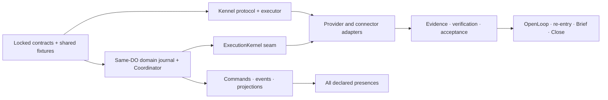

The arrows are contract or runtime dependencies, not product phases. Independent nodes run in parallel and integrate continuously.

1. **[Proposed decision — Adopt]** Freeze existing RunLoop conformance and recovery fixtures as locked evaluators.
2. **[Observed fact]** `DEFERRED_DO_PRODUCT_TABLES` is catalog drift: it still lists runs/outbox/schedules/daily push budget as deferred although runtime-specific tables exist (`packages/runtime/src/do-schema.ts:17-26`, `packages/runtime/src/tracer/schema.ts:97-201`, `packages/runtime/src/run-loop/do.ts:4646-4663`). Produce a source-generated current-table manifest before any migration; never let that list drive tooling.
3. **[Proposed decision — Adapt]** Add new contract schemas and product tables beside, not by repurposing, current runtime tables.
4. **[Proposed decision — Adapt]** Add owner-root routing: authenticated owner → deterministic DO name; reject owner mismatch inside the DO; inventory existing rows/DO IDs; define quarantine or user-reviewed import; prove two owners cannot admit into one root.
5. **[Proposed decision — Adapt]** Bridge trusted V2 effects additively. Preserve the old 64-hex `request_digest`, `idk_*` key, private readers, and raw-argument exclusion. New intents add digest encoding/version and encrypted classified argument reference. A conformance fixture must recover an old pending V2 effect after Coordinator deployment without reissue or privacy regression.
6. **[Proposed decision — Adapt]** Run Coordinator in shadow projection mode from explicit test commands; compare deterministic event/projection output without effects.
7. **[Proposed decision — Adapt]** Introduce `ExecutionKernel` around existing RunLoop admission/effect behavior. One real implementation first; a fake test implementation is the second use case. Do not create speculative adapter layers.
8. **[Proposed decision — Adopt]** Atomically persist product event + ExecutionRequest in the same DO. Existing RunLoop remains the only physical effect executor.
9. **[Proposed decision — Adapt]** Add gateway and projections behind per-owner feature flags and protocol negotiation.
10. **[Proposed decision — Adapt]** Migrate legacy Supabase Spots without dual-write: first inventory real users/rows and correction/deletion history, then choose the simplest safe path. If history/traffic requires a dual-read cutover window, Supabase remains authoritative; user reviews promotion into the new claim model; a cutover cursor is recorded; corrections/deletions/tombstones propagate across the window; rollback makes the new store read-only and returns authority to the recorded Supabase cursor. For a genuinely bounded founder-only dataset, reviewed export/import may satisfy the same invariants without building a permanent cutover subsystem.
11. **[Proposed decision — Adapt]** Integrate Kennel with fake provider, then one current provider. Keep local operation ledger and backend reconciliation.
12. **[Proposed decision — Adapt]** Add one connector effect family only after its reconciliation contract passes fault injection.
13. **[Proposed decision — Adopt]** Turn on verification/acceptance/OpenLoop closure only after independent checks work. Before that, UI labels remain “activity/evidence,” never “complete.”
14. **[Proposed decision — Adapt]** Computer, Think internals, Python, gRPC, additional providers, collaborative Outcomes, and organizational tenancy remain behind their named contracts. Their implementation activates when a committed workload and conformance evidence justify the adapter; they cannot become alternate truth or authority paths.

Rollback boundaries:

- Every risky workstream has a per-owner feature flag and additive schema.
- Protocol readers support at least current and previous version.
- Old RunLoop proof routes and tables are untouched until new conformance is stronger.
- Legacy V2 pending effects remain readable/recoverable through the old encoding until no pending record remains and the compatibility retention window closes.
- A migration never rewrites old Goal/Spot data into Outcome/Constellation truth without user review.
- There is never a Spot dual-write period. Authority and cutover cursor are explicit; corrections and tombstones win across both read paths.
- Failed new projections can be rebuilt from product events; failed adapter adoption can fall back only to a semantically compatible, conformance-passed adapter.
- No rollback deletes effect receipts or historical acceptance; rollback disables new commands and preserves audit/re-entry.

## 16. Issue-ready parallel workstreams

| Workstream | Dependencies | Affected repositories | Acceptance and conformance tests | Rollback boundary |
|---|---|---|---|---|
| **Contract and conformance spine** | Architecture lock | `waldo-backend`; generated bindings in consumers | Protocol v0.1 schema/golden fixture/property/compatibility tests; state transition rejection; snapshot/cursor/account-switch fixtures | Unpublished version or prior compatible tag |
| **Owner root and domain** | Relevant released contracts + current-table manifest | `waldo-backend` | Deterministic routing; inside-DO owner mismatch rejection; two-owner negative; command dedupe/conflict; atomic event+ExecutionRequest; every supported FSM transition and invalid transition | Owner feature flag; additive tables |
| **ExecutionKernel and effects** | Coordinator request, authority, effect contracts | `waldo-backend` | Full trusted-runtime regression; old pending V2 recovery; grant-use+intent atomicity; effect/recovery kill tests; no behavior/privacy drift | Old direct call path/readers; connector flag off |
| **Gateway, events, projections** | Protocol + owner root | `waldo-backend`, presence repos | Auth fail-closed; snapshot/cursor gaps/duplicates; stale revision; disconnected command/approval rejection; stale read-only projection; projection redaction | Read-only/old surfaces |
| **Kennel desktop harness** | Protocol/executor/workspace fixtures | `kennel`, `waldo-backend` | Operation ledger, same-ID/digest conflict, lease fencing, reconnect, cancel, transcript nonexport, fake backend and current provider conformance | Fake/local adapter or provider disabled |
| **Judgment, authority, evidence, acceptance** | Domain + presence + effect/artifact contracts | `waldo-backend`, `kennel`, presence repos | Expiry/revocation/use limit; server-created grant; stale approval; independent read-back; selective artifact checks; accept/reject/repair/reopen history | Advisory/evidence-only labels |
| **Workspace, artifacts, knowledge** | Workspace/Artifact/BlobStore contracts | `waldo-backend`, `kennel`, cloud adapters | Canonical seal/restore/delete; chunk integrity; provenance; Mac-to-Linux declared support; no secrets; new fence on restore | Per-adapter flag; source workspace preserved |
| **Personal assistance and continuity** | Domain/projections/acceptance | `waldo-backend`, Kennel, mobile/web/messaging/voice policy | Exact re-entry; Brief/Close/Catch Up/meeting lifecycle; attention budget; correction/deletion; safe Spot cutover | Hide proactive projection; restore recorded authority cursor |
| **Connectors and real-world effects** | Effect family, exact scopes, reconciliation contract | `waldo-backend`, connector packages | Intent-before-I/O; frozen-digest conflict; apply-then-timeout; idempotency expiry; revoke; deterministic read-back; terminal ambiguity | Per-family flag off |
| **Distribution and capability packaging** | Capability/protocol/security contracts | Relevant repos | MCP/SDK/Packs cannot mint authority, memory, acceptance, or closure; install/update/revoke/quarantine; no transitive delegation | Per-adapter/package flag |
| **Security, portability, operations** | Runs with every workstream | All affected repos | Tenant/privacy/health/credential negative proof; export/import/delete; redacted posture/traces; load/storage/cost/recovery/rollback | Global/per-owner kill and preserved audit history |

Mandatory test families across workstreams: owner/tenant isolation, authorization fail-closed, prompt injection, raw-health/transcript/credential nonleakage, command idempotency, complete supported state-machine property tests, fault injection at every durable boundary, retry amplification, reconciliation ambiguity, cancellation fencing, protocol compatibility, deletion/tombstone propagation, observability redaction, and full trusted RunLoop regression.

### 16.1 Agent-Ready child-issue contract

The table is the dependency-aware workstream map. It is issue-ready only when decomposed into bounded child issues that each include all fields below; no workstream may be assigned as a catch-all implementation issue.

| Required child-issue field | Required content |
|---|---|
| Outcome and user proof | One observable capability/result, not “implement module” |
| Status | `agent-ready` or `needs-info`; unresolved provider/effect/product choices remain `needs-info` |
| Dependencies | ADR and contract versions, parent/preceding issue IDs, source/version pins |
| Exact scope | Allowed repositories/packages/files and prohibited paths |
| Inputs/outputs | Commands/events/tables/manifests/artifacts changed, with schema revisions |
| Data/privacy impact | Classes read/written, destination, retention/deletion, credential path, health/transcript negative proof |
| Authority/effect impact | Grant binding, retry owner, key/digest, reconciliation, cancellation, terminal UX |
| Golden cases | Exact valid input/event sequence and expected output/projection/state; one duplicate and one stale-revision case |
| Degraded-path five cases | Exact tests for `null`, `permission-revoked`, `network`, `hostile`, and `concurrent` inputs/failures |
| Proof disposition | Record `passed`, `failed`, `expired`, `skipped`, `unavailable`, `deferred`, and `not_run` distinctly with reason/evidence |
| Acceptance/conformance | Given/when/then criteria, named falsifier, fault-injection points, owner isolation, compatibility |
| Exact verification | Commands and expected test/evidence output for every affected repo |
| Observability | Redacted metrics/events/alerts and proof no forbidden content is emitted |
| Rollback | Feature flag/schema compatibility/state preservation; no receipt/acceptance history deletion |
| Out of scope | Explicit adjacent capabilities not authorized by the issue |

Backend child issues use the pinned toolchain and at minimum run:

```bash
npx -y pnpm@10.34.4 --filter @waldo/contracts test
npx -y pnpm@10.34.4 --filter @waldo/runtime test
npx -y pnpm@10.34.4 verify
git diff --check
```

An issue may narrow the first two commands when its path scope proves the other package unaffected, but every integration gate runs full `verify`. Kennel/mobile/web issues must quote the exact current repository commands after fresh inspection; this plan does not invent them. A real connector/effect issue cannot become `agent-ready` until the effect family, provider, scopes, reconciliation lookup, idempotency window, test tenant, and reversible cleanup are recorded.

## 17. Unknowns, hypotheses, falsifiers, and ADR decisions

### 17.1 Implementation choices resolved inside the owning workstream

| Unknown | Default for planning | Why it matters / decision point |
|---|---|---|
| Can low-risk Outcomes be auto-accepted? | **[Decision — locked default]** Explicit user acceptance until an exact delegated-acceptance policy and conformance suite pass | Changes Acceptance/Authority policy and UX, not the product scope |
| Is Mission optional? | **[Decision — locked]** Yes; direct WorkUnit for a simple Outcome and Mission for work needing an inspectable plan | Avoids ceremony; both paths remain committed and tested |
| Initial real effect family? | **[Implementation choice]** Calendar create/update is the recommended reversible candidate | Owning connector workstream ratifies vendor/scopes/reconciliation/test tenant before activation |
| May root spawn child execution DOs/Workflows later? | **[Implementation choice]** Not unless load evidence earns it | Requires concurrency/load evidence and a replacement single-writer design |
| Voice retention? | **[Proposed decision — Adapt]** Semantic command by default; raw audio/transcript separate opt-in/short retention | Privacy and correction provenance |
| Shared/collaborative Outcomes? | **[Committed extension]** Preserve contracts; activate only after counterparty identity, tenancy, disclosure, authority, and ordering conformance pass | Does not narrow the whole-product commitment; prevents an unsafe shortcut |
| Does Goal remain above Outcome? | **[Decision — locked default]** No user-facing Goal until evidence earns a distinct long-horizon grouping | Prevents duplicative ontology while leaving a replaceable grouping seam |
| What qualifies as “long suspension”? | **[Unknown / blocked]** Per effect/provider risk and idempotency window | Approval and reconciliation validity |
| Production retention durations? | **[Unknown / blocked]** Policy classes, not guessed numbers | Legal/privacy/product choice |
| Owner-root retention and cold-history compaction contract? | **[Unknown / blocked]** No named contract yet; storage currently appears only as a concurrent measurement and a reopen condition | Snapshot and cursor semantics were put in the initial contract rather than retrofitted; cold event/audit history needs the same treatment. The owner-root event/load/storage measurement must produce a retention, snapshot, and archival contract before a production claim, or the per-owner storage envelope becomes a hard write-failure path rather than a designed-for bound |
| Independent verifier cost/latency budget? | **[Implementation choice]** Measure continuously; deterministic effect read-back always, semantic artifact verification only when declared/requested | Routing and UX SLO |
| First-user product acceptance thresholds? | **[Unknown / blocked for product claims, not construction]** Define before cross-surface acceptance claims | Prevents a technically complete workflow from being mistaken for reduced user burden |

### 17.2 Hypotheses and falsifiers

| Hypothesis | Falsifier |
|---|---|
| Coordinator and RunLoop should share one DO transaction | Ordinary parallel WorkUnits cause measured judgment/alarm SLO failures that child execution cannot solve while root remains authority |
| Outcome is the correct root object | Users prefer session/task truth and clarification costs more judgment time than re-entry saves |
| Mission should be optional | Complex general work cannot be planned/audited/resumed unless every Outcome has a Mission |
| Manifests prevent unsafe drift | Adapters pass admission but fail required controls because declarations cannot be tested deterministically |
| Purpose-bound context is enough | Whole-product trials fail materially without broad history after retrieval/clarification improvements are exhausted |
| Independent verification builds trust | It adds cost/latency without reducing false completion or repair rate |
| One Waldo across Home and Work is valuable | Users consistently split identity/context despite scopes and correction controls |
| Needs You reduces burden | Missed consequences rise or users still inspect raw sessions routinely |
| Health as passive context feels caring | Users perceive derived context as controlling, invasive, or irrelevant even with consent/correction |
| Computer can be an executor | Any isolation/credential/egress/recovery/consistency/cost/version gate fails |
| Same-DO product root remains viable | Measured storage/concurrency/collaboration patterns conflict with it, not hypothetical scale anxiety |

**Anti-criterion:** this architecture is not successful merely because an agent runs longer, uses more tools/context, creates more tasks, or sends more notifications. It succeeds when accepted Outcomes increase while consequential judgment time, false completion, privacy exposure, duplicate effects, and missed Open Loops fall.

### 17.3 Proposed ADR rewrite/ratification set

1. Waldo identity, Coordinator placement, and per-user durable root.
2. Canonical Outcome/Mission/WorkUnit spine and state separation.
3. Store ownership, retention, deletion, and raw-health boundary.
4. Multi-surface command/event/projection protocol.
5. Kennel executor/local reconciliation protocol.
6. Capability manifest, version pinning, and conformance eligibility.
7. Purpose-bound ContextProjection and personal/work/health policy.
8. Exact authority, judgment expiry, cancellation, and revocation generations.
9. Effect intent, retry ownership, reconciliation, compensation, and corrected “exactly once” language.
10. Evidence, independent verification, acceptance, reopening, and staleness.
11. OpenLoop and exact re-entry lifecycle.
12. Attention governor, schedules, routines, and prospective intents.
13. Voice/media Presence contract and retention.
14. Model routing/evaluation roster.
15. ExecutionEnvironmentAdapter and Cloudflare Computer preview gates.
16. Correctable claims, Spots, Episodes, Constellations, and promotion policy.
17. Workspace, checkpoint, Artifact, KnowledgeProjection/DeepWiki, blob-store, and deletion boundaries.
18. MCP/A2A/AG-UI protocol adapters, version pinning, mapping lossiness, and non-authority.
19. Workload identity, non-transitive delegation, credential brokerage, and identity-aware egress.
20. Budget/usage/source attribution and deferred agent-commerce effect families.
21. Redacted trace export, evaluation independence, and capability/skill/tool supply-chain trust.
22. User-owned export, import, deterministic restore, and portability verification.
23. Routine, skill, integration-recipe, capability-package, installation/update, and revocation boundaries.
24. External/cross-person delegation, shared-context disclosure, human executor, and sensitive computer handoff.

### 17.4 Older decisions to supersede, amend, or retain

| Older stance | Treatment in new ADR metadata |
|---|---|
| Health-oriented DO/Supabase and pre-activity trigger framing | **[Proposed decision — Reject]** Supersede product framing; **Adapt** raw-health storage/security mechanics |
| Brief/shadow-Fetch/Spots/Chat V1 | **[Proposed decision — Reject]** Supersede with the one-Waldo whole-product Outcome/OpenLoop architecture |
| GoalRecord as primary objective | **[Proposed decision — Reject]** Supersede; **Adapt** only through user-reviewed migration |
| Coarse L1/L2/L3 autonomy | **[Proposed decision — Reject]** Supersede with exact AuthorityGrant; tier may only tighten |
| Fixed health delivery/intervention tables | **[Proposed decision — Reject]** Supersede with consequence/urgency/expiry/quiet-state/attention policy |
| Fixed memory halls / recall-all / fail-open recall | **[Proposed decision — Reject]** Supersede with evidence-linked claims and purpose-bound projection |
| Fixed health-trigger skills/self-evolution | **[Proposed decision — Reject]** Supersede with versioned capability bundles/reviewed proposals |
| Engagement/WIS as canonical value | **[Proposed decision — Reject]** Supersede; no opaque user scoring |
| Fixed model roster | **[Proposed decision — Reject]** Supersede with evaluated/source-pinned routing |
| Sandbox-specific runtime choices | **[Proposed decision — Reject]** Supersede with ExecutionEnvironmentAdapter |
| DO-only runtime, journal/outbox, Loop Governor | **[Proposed decision — Adopt]** Retain and generalize to Home + Work |
| Sanitization, truth invalidation, credential custody, health authority | **[Proposed decision — Adopt]** Retain under new context/store ADRs |

Product implementation may begin under the [architecture lock](./WALDO_ARCHITECTURE_LOCK_AND_WHOLE_PRODUCT_BUILD_DIRECTION_2026-08-05.md). The ADR set and protocol v0.1 are the first shared contract work, not a pre-build product phase. A real provider or effect activates only after its owning workstream records version/vendor, exact scopes, reconciliation, idempotency window, test environment, cleanup, and conformance evidence; selection proceeds during building and does not block unrelated workstreams.

## 18. Ecosystem refresh and architecture-lock boundary

This section is part of the architecture plan, not a provider roadmap. It records only net-new implications from the broader 2026 agent/harness ecosystem refresh and defines what “lock” means.

### 18.1 Net-new trend ledger

| Current signal | Evidence | Waldo treatment |
|---|---|---|
| Agent interoperability is splitting by responsibility rather than converging on one universal protocol | MCP separates host/client/server and tool/resource/prompt control; A2A defines Agent Cards, Tasks, Messages, and Artifacts; AG-UI defines streaming UI/tool/state events | **[Proposed decision — Adapt]** Use protocol translators. MCP is a capability/resource seam, A2A is an optional external delegation seam, and AG-UI is an optional presence-stream seam. None is Waldo's domain model or source of truth. |
| Protocols are still moving quickly | MCP's 2026-07-28 release candidate moved Tasks from experimental core to an independently versioned extension and changed its lifecycle | **[Observed fact — Adopt]** Pin protocol revisions and extensions independently. Never make `WorkUnit`, `AgentSession`, or `JudgmentRequest` aliases of an external protocol object. |
| Durable harnesses are becoming workspace-centric | Current agent SDKs expose resumable sandbox sessions, predictable filesystems, skills/progressive disclosure, approval interruptions, and traces | **[Inference — Adapt]** A replaceable workspace/checkpoint plane is now a first-class adapter boundary. It strengthens Kennel/cloud re-entry but does not replace Coordinator or RunLoop durability. |
| Identity and authorization are becoming the constraint on autonomous work | NIST's 2026 initiative explicitly targets agent identity, authorization, secure interoperability, auditing, non-repudiation, prompt injection, and delegation on behalf of people | **[Proposed decision — Adopt]** Represent workload identity and delegation explicitly; authority never propagates merely because one agent called another. |
| Agent commerce is standardizing around verifiable intent/mandates and receipts | AP2 v0.2 defines linked checkout/payment mandates, receipts, dispute evidence, and autonomous/human-present modes; x402 provides machine-readable HTTP payment challenges | **[Proposed decision — Adapt]** Payment is a separate future effect-family decision, but AuthorityGrant → EffectIntent → EffectReceipt must be able to project to mandate/payment protocols without bypassing Waldo approval or reconciliation. |
| Agent telemetry is becoming interoperable but schema ownership is still shifting | OpenTelemetry moved GenAI conventions into a dedicated repository; MCP's release candidate adds trace-context propagation | **[Proposed decision — Adapt]** Waldo owns a stable redacted trace model and exports through a versioned OpenTelemetry mapping. Upstream semantic-convention churn must not change domain events. |
| Persistent context and dynamic capability ecosystems enlarge the attack surface | OWASP's 2026 guidance names goal hijack, tool misuse, identity/privilege abuse, agentic supply-chain compromise, unexpected code execution, and memory/context poisoning | **[Proposed decision — Adopt]** Treat retrieved content, skills, MCP/A2A metadata, workspace files, memories, and generated code as untrusted inputs with provenance, quarantine, revocation, and negative tests. |
| Skills are becoming portable, but personal-agent memory is not | Agent Skills defines portable procedural packages; no mature primary-source standard found in this refresh defines a user-owned, semantically complete personal-agent memory export/restore contract | **[Proposed decision — Adapt]** Skills may travel as reviewed capability bundles, not identity or memory. Waldo defines an encrypted, versioned export/restore contract for its own user-owned truth. |

Primary sources: [MCP architecture](https://modelcontextprotocol.io/specification/2025-06-18/architecture), [MCP 2026-07-28 release candidate](https://blog.modelcontextprotocol.io/posts/2026-07-28-release-candidate/), [A2A concepts](https://a2a-protocol.org/latest/topics/key-concepts/), [AG-UI events](https://docs.ag-ui.com/concepts/events), [NIST AI Agent Standards Initiative](https://www.nist.gov/artificial-intelligence/ai-agent-standards-initiative), [NIST agent identity and authorization concept](https://csrc.nist.gov/pubs/other/2026/02/05/accelerating-the-adoption-of-software-and-ai-agent/ipd), [AP2 specification](https://ap2-protocol.org/ap2/specification/), [x402](https://docs.cdp.coinbase.com/x402/welcome), [OpenTelemetry semantic conventions](https://opentelemetry.io/docs/specs/semconv/), [OWASP Agentic Top 10](https://genai.owasp.org/2025/12/09/owasp-top-10-for-agentic-applications-the-benchmark-for-agentic-security-in-the-age-of-autonomous-ai/), [SLSA v1.2](https://slsa.dev/spec/v1.2/), [Agent Skills](https://agentskills.io/specification), [Anthropic agent-evaluation guidance](https://www.anthropic.com/engineering/demystifying-evals-for-ai-agents), and [OpenAI sandbox-agent architecture](https://openai.com/index/the-next-evolution-of-the-agents-sdk/).

### 18.2 Required additions to the target module boundary

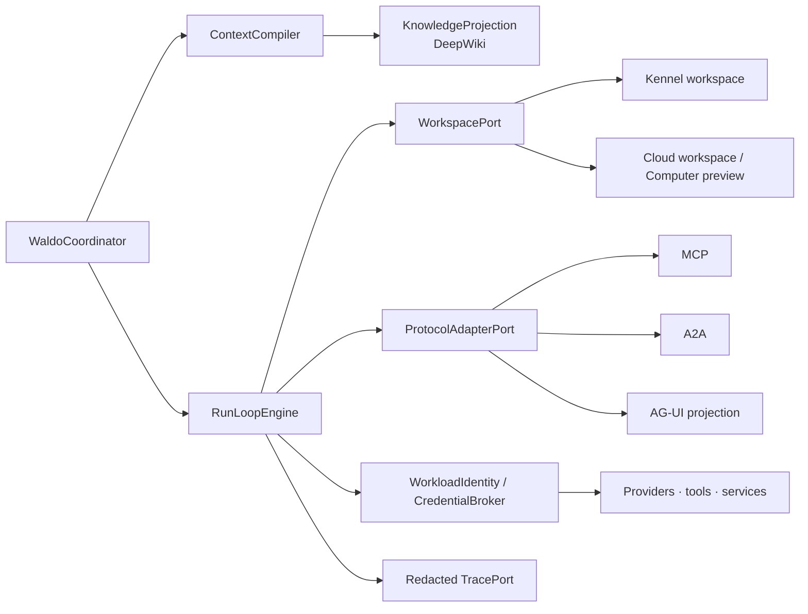

1. **[Proposed decision — Adapt] Workspace and knowledge plane.** Add `WorkspacePort`, `WorkspaceCatalog`, `WorkspaceCheckpoint`, `WorkspaceRestoreAttempt`, `KnowledgeSource`, `KnowledgeProjection`, and `SourceUsageReceipt`. A workspace is mutable execution state; an immutable sealed checkpoint is reusable input to multiple restore attempts; a restore attempt owns target environment/fence/verification/failure; an Artifact is a content-addressed deliverable; a KnowledgeProjection/DeepWiki is an inspectable, rebuildable projection; a ContextClaim is governed memory; R2 or another blob store is storage. These are separate contracts. A filesystem may reduce direct R2 traffic for live session state, but it cannot replace encrypted durable artifact backup, multi-surface availability, deletion propagation, or canonical metadata.
2. **[Proposed decision — Adapt] Protocol translation plane.** Add `ProtocolAdapterPort` with revision, extension, authentication, capability, lossiness, and fail-closed downgrade declarations. Mapping rules are explicit: MCP Task/A2A Task → remote execution observation or AgentSession reference, never `WorkUnit`; A2A Artifact → candidate `Artifact`; MCP elicitation/A2A input-required → candidate `JudgmentRequest`; AG-UI state/tool events → ephemeral projection events, never domain events. An MCP server, A2A Agent Card, registry entry, signed descriptor, or remote task status describes a counterparty; it does not confer Waldo authority or prove executable trust.
3. **[Proposed decision — Adopt] Execution principal and delegation.** Add `ExecutionPrincipal`, `WorkloadIdentity`, `DelegationGrant`, `CredentialHandle`, and `EgressDecision`. Every identity is owner-, WorkUnit-, executor-, audience-, purpose-, lease-, and expiry-bound and records its on-behalf-of chain and attestation references. Delegation intersects authority; it never widens it. Re-entry checks revocation generation and reissues short-lived credentials. Token passthrough and bearer-token chaining are forbidden.
4. **[Proposed decision — Adapt] Cost, commerce, and source-value extension.** Add `BudgetReservation`, `UsageReceipt`, `Quote`, and `SourceUsageReceipt` now as non-payment ledger contracts. Reserve `PurchaseIntent`, `PaymentAuthorization`, `TermsAcceptanceRequest`, and `AccountReceipt` as future effect-family extensions. A wallet, autonomous purchase, paid MCP call, or account creation requires its own explicit product decision and conformance; none is implied by the current software lock.
5. **[Proposed decision — Adopt] Trace/evaluation and capability supply chain.** Add stable internal correlation across command → Outcome → WorkUnit → AgentSession → EffectIntent/Receipt → Evidence/Verification/Acceptance/OpenLoop. `ExecutionTelemetryEnvelope` and `EvaluationEnvelope` pin the model, harness, tools, environment, budgets, manifests, graders, and evidence because an agent result is a property of the complete execution configuration, not the model alone. Export only redacted, policy-permitted fields. Capability bundles include a canonical manifest digest; every executable/package/source/instruction digest and build/dependency provenance field applicable to that capability kind; typed attestation status; manifest signatures and trust-root/key lifecycle when required by the declared trust boundary; dependency/SBOM reference under its separate policy; vulnerability/conformance evidence; expiry; revocation; and quarantine state. A digest, signature, or registry listing alone is insufficient. The executor cannot edit its promotion evaluator, trust root, or acceptance oracle.
6. **[Proposed decision — Adapt] User-owned portability.** Add `WaldoExportBundle` and deterministic restore verification for Outcome/Mission/WorkUnit history, unresolved OpenLoops/ReEntryPoints, explicit statements/corrections, governed ContextClaims, Artifact metadata and permitted bytes, source provenance, policy/retention metadata, tombstones, and optional reviewed SkillBundles. Credentials, provider secrets, raw health, and provider-owned transcripts are excluded by default and represented only by reconnect/delete instructions. Export/import never merges owners implicitly.
7. **[Proposed decision — Adapt] Behavior packaging and distribution.** Keep `RoutineDefinition`, `SkillBundle`, `IntegrationRecipe`, and `CapabilityPackage` distinct. A routine owns trigger/stale/pause/attention behavior; a skill owns a reviewable typed procedure and evals; a recipe owns onboarding, required connections, composition, and update policy; a capability package owns executable/tool/MCP manifests, digests, provenance, conformance, expiry, and revocation. A Waldo Pack may compose them but never embeds authority, credentials, Outcome truth, or silent privilege expansion.
8. **[Decision — committed and evidence-gated] External and human delegation.** Add `ExternalDelegationRequest`, `ExternalDelegationDisposition`, `DelegationReply`, and `SharedContextGrant` for cross-person/agent work. Add `HumanExecutorAdapter` as an executor family with identity/organization, jurisdiction, job capabilities, SLA, cost/expense policy, data classes, cancellation/refund/dispute behavior, evidence types, and verification availability. Compute near the data owner, disclose status by default, require separate approval for typed data replies, treat returned payloads as untrusted, and never equate a person or remote agent saying “done” with Acceptance.
9. **[Proposed decision — Adopt] Sensitive computer handoff.** Browser/computer environments expose a durable `sensitive_handoff` session state for login, CAPTCHA, payment, consent, or private input. Freeze intent before I/O; keep credentials/private values out of model-visible events and transcripts; resume with the same operation key and a new fencing generation; treat screenshots, DOM, and files as untrusted evidence; verify the external postcondition rather than the click; and provide a terminal ambiguous/failure path.
10. **[Proposed decision — Adopt] Experience capability ledger.** For every user-visible capability, record `architecture_specified`, `contract_defined`, `module_implemented`, `adapter_conformance_passed`, `cross_surface_acceptance_passed`, and `operational_proof_passed` independently. No capability is “supported” merely because one of those is true, and `true` at one level never implies the next.

Minimum contract sketches:

```ts
interface WorkspaceCheckpoint {
  id: ID; ownerId: ID; outcomeId?: ID; workUnitId: ID; workspaceId: ID;
  generation: number; fencingGeneration: number; parentCheckpointId?: ID;
  sourceBase: { kind: "git"|"artifact"|"checkpoint"|"empty"; ref?: string; digest: Digest };
  manifestDigest: Digest; entries: WorkspaceFileEntry[];
  excludedPaths: Array<{ path: string; reason: "secret"|"policy"|"ephemeral"|"unsupported" }>;
  executorManifestDigest: Digest; toolchainManifestDigest: Digest;
  environmentRecipeDigest: Digest; dataPolicyId: ID; encryptionKeyRef: ID;
  artifactRefs: ID[]; createdAt: Timestamp;
  state: "candidate"|"sealing"|"sealed"|"expired"|"deleting"|"deleted";
}
interface WorkspaceRestoreAttempt {
  id: ID; checkpointId: ID; ownerId: ID; workUnitId: ID;
  targetAdapterManifestDigest: Digest; targetPlatform: string; targetWorkspaceId?: ID;
  leaseId: ID; fencingGeneration: number; verificationDigest?: Digest; failureCode?: string;
  deletionGeneration: number; startedAt: Timestamp; completedAt?: Timestamp;
  state: "requested"|"restoring"|"verifying"|"ready"|"failed"|"cancelled"|"deleting"|"deleted";
}
interface ProtocolBinding {
  protocol: "mcp"|"a2a"|"ag_ui"|string; revision: string; extensions: string[];
  adapterManifest: Digest; remoteRef?: string; internalRef: AggregateRef;
  mappingVersion: string; lossiness: "none"|"declared"; authContextRef?: ID;
}
interface WorkloadIdentity {
  id: ID; ownerId: ID; workUnitId: ID; executorId: ID; purpose: string;
  audiences: string[]; resourceScopes: string[]; leaseId: ID; authorityGrantIds: ID[];
  issuedAt: Timestamp; expiresAt: Timestamp; revocationGeneration: number; state: "active"|"expired"|"revoked";
}
interface SourceUsageReceipt {
  sourceRef: ID; retrievedDigest: Digest; purpose: string; permissionBasis: string;
  retrievedAt: Timestamp; freshnessAt: Timestamp; expiry?: Timestamp;
  derivedArtifactRefs: ID[]; quotationDigest?: Digest; cost?: { amount: string; currency: string };
}
interface ExecutionTelemetryEnvelope {
  traceId: ID; correlationId: ID; ownerPseudonym?: string; outcomeId?: ID; workUnitId?: ID;
  sessionId?: ID; effectIntentId?: ID; manifestDigests: Digest[]; environmentDigest?: Digest;
  authorityGrantRef?: ID; retryDisposition?: string; reconciliationDisposition?: string;
  usage?: { inputTokens?: number; outputTokens?: number; cost?: string }; contentCaptured: false;
}
interface EvaluationEnvelope {
  subjectRef: AggregateRef; model: Digest; harness: Digest; tools: Digest[]; environment: Digest;
  contextRecipe: Digest; budgets: Record<string, string>; grader: Digest; evidenceRefs: ID[];
  result: "passed"|"failed"|"indeterminate"; evaluatedAt: Timestamp;
}
interface WaldoExportBundle {
  formatVersion: string; ownerId: ID; createdAt: Timestamp; rootManifestDigest: Digest;
  encryptedPayloadRef: string; includedClasses: string[]; excludedClasses: string[];
  tombstoneCursor: number; signature: string; restoreSuiteVersion: string;
}
interface RoutineDefinition {
  id: ID; ownerId: ID; trigger: TriggerSpec; proposedAction: CapabilityRef;
  stalePolicy: string; attentionPolicy: ID; expiresAt?: Timestamp;
  state: "draft"|"active"|"paused"|"expired"|"revoked";
}
interface ExternalDelegationRequest {
  id: ID; ownerId: ID; targetPrincipal: ID; workUnitId: ID; purpose: string;
  capability: CapabilityRef; disclosureCeiling: string[]; authorityCeiling: ID;
  idempotencyKey: string; requestDigest: Digest; expiresAt: Timestamp;
}
interface SensitiveHandoff {
  id: ID; sessionId: ID; operationKey: string;
  kind: "login"|"captcha"|"payment"|"consent"|"private_input";
  promptProjection: ID; fencingGeneration: number;
  state: "requested"|"active"|"resumed"|"expired"|"cancelled";
}
```

The complete workspace serialization, path normalization, `mtime` exclusion, symlink containment, secret exclusion, encrypted chunk/deduplication, partial-seal, restore-fence, deletion, and Mac-to-Linux declared-support conformance rules are locked in the [whole-product build direction](./WALDO_ARCHITECTURE_LOCK_AND_WHOLE_PRODUCT_BUILD_DIRECTION_2026-08-05.md#7-workspace-and-checkpoint-contract). Kennel's Mac filesystem is the initial local adapter, not the canonical filesystem. Cloud continuation recreates from a sealed checkpoint with a new lease/fence; it does not claim live process migration. No offline product-truth mode is in the current architecture.

### 18.3 What is locked and what remains a build-time implementation choice

| Boundary | Lock posture |
|---|---|
| One Waldo identity; one owner authority root; same-DO Coordinator + RunLoop; one reducer per aggregate | **[Decision — locked]** Stable kernel. Change only through a superseding ADR plus migration/conformance proof. |
| Outcome/Mission/WorkUnit; separate AgentSession, effects, evidence, verification, acceptance, OpenLoop/re-entry | **[Decision — locked]** Stable domain vocabulary and state separation. Mission is optional per Outcome but remains committed. |
| Intent-before-I/O, frozen immutable arguments/digest, atomic grant-use + intent, reconciliation before retry, one retry owner, bounded terminal resolution | **[Decision — locked]** Non-negotiable effect spine. |
| Purpose-bound context, user correction precedence, health as passive caring context, credential nonexposure | **[Decision — locked]** Non-negotiable trust boundary. |
| Backend canonical truth; Kennel proposes and the owner DO admits; no current offline authority mode | **[Decision — locked]** Local LLM support may arrive behind an adapter without forking product truth. |
| Provider/model/executor/connector roster; local versus cloud placement; storage implementation | **[Decision — open implementation]** Select during building through versioned conformance-gated adapters. |
| MCP/A2A/AG-UI/AP2/x402/OpenTelemetry revisions | **[Decision — open implementation]** Pinned protocol adapters; never canonical product truth. |
| Cloudflare Computer, Think primitives, Python/gRPC, paid capabilities, autonomous purchasing, shared Outcomes | **[Decision — contract-planned and evidence-gated]** Implement/activate against named workloads and conformance; none can become an alternate authority path. |

### 18.4 Build-start gate and verdict

**[Decision — locked] The stable kernel is locked and implementation starts now.** Provider implementations and fast-moving external protocol revisions remain open behind their stable Interfaces. This is a finite architecture lock, not a promise that implementations or the ecosystem stop changing.

The backend publishes protocol v0.1, schemas, golden fixtures, and the definitive writer/authority rules as the shared seam. Backend domain/runtime and Kennel presence/executor work then proceed in parallel with the other workstreams in Section 16. Fake adapters can prove contracts while real implementations are selected, but they cannot prove user capability. A real provider/effect is activated only after its exact version/vendor, scopes, reconciliation, idempotency, test environment, cleanup, and conformance are recorded. Before a production claim, security threat modeling, retention values, deletion drills, external-adapter conformance, load/recovery tests, and rollout/rollback acceptance must pass.

The lock reopens only when measured evidence falsifies a locked constraint: owner-root load or storage is untenable; a new product decision requires disconnected canonical truth; an effect family cannot be made reconcilable; workspace portability/deletion/credential isolation cannot fit the port; or the one-Waldo user-owned thesis changes. Provider, connector, model, cloud, storage, framework, protocol-revision, and UI choices are ordinary build-time decisions and do not reopen the core.

## Appendix A. Source pins

### A.1 Waldo canonical reading pack

All files below were read from `waldo-brain@6e5cbd7a0711b883e75e606487ac1cdb0b7c6750`; SHA-256 prevents a later edit from being mistaken for the planning input.

| Source | SHA-256 |
|---|---|
| `03-References/research/waldo-personal-agent-orchestration-final-architecture-2026-08-01.md` | `685aebe0fd35f76e77b945a7acc6bc844423c06572128d6954c6dbd95f5f99e9` |
| `03-References/research/waldo-desktop-home-work-product-blueprint-2026-08-02.md` | `84d948147a435b1a77fd209d303ac2e0492467c72ef3bf5bc7d1054316ddb52e` |
| `03-References/research/cloudflare-agents-week-2026-waldo-architecture-adoption-2026-08-04.md` | `a81d5ba6959eb63c844518d26fca17064786cb7ef0e68692c09163b32716a551` |
| `04-Agent-Harness/qm-harness-breakdown-and-waldo-adoption-2026-08-01.md` | `9a32c9301043fc52570f78a1b30d086ad0dc86c0672d8f12e697c29df3120f89` |
| `04-Agent-Harness/project-think-adoption-stance.md` | `dc539e19e02ef22f13235e55fb9474e518de5809143818685879369879ee7629` |
| `04-Agent-Harness/harness-runtime-architecture-decided-vs-gap.md` | `79fdff64f2cd76a788da76ff061fddd97e11b783c5526ccf757994405edd73c4` |
| `03-References/research/waldo-product-and-agentic-harness-benchmark-catalog-2026-08-04.md` | `1f2627f0a0627d31e5cc3b74f0a43d3c5091806e6eab9e9f203f5c3f271f72ea` |
| `02-Knowledge/outcome-and-work-unit.md` | `d185bef24e6adc23a5ada9f5b7f424f186ca096f2c7df113f47d286dc0f6e6de` |
| `03-References/research/waldo-company-story-source-extraction-2026-08-01.md` | `d791f8d4280c3580fb654466df75ea578028576c8aaec23cc6a464125f0c6ae5` |
| `03-References/research/waldo-core-verification-set-architecture-and-betaworks-application-corrections-2026-08-03.md` | `c347f3d8ff49a8d955c29a4d0fa783b5018817594253c47b9f37f53809fa2adb` |
| `03-References/research/waldo-desktop-kennel-home-work-product-build-plan-2026-08-02.md` | `43dd4f3922b807a042e1e60247c6c822a576ef0410e89de2b8d4699be9c40f42` |
| `03-References/research/waldo-cross-surface-product-ecosystem-and-consumer-story-synthesis-2026-08-01.md` | `4de9eca1f94a3be426d7691ae64f88c84c2c873b7e2e074d16434e0b1dc24f76` |
| `03-References/research/waldo-life-context-agent-judgment-product-language-synthesis-2026-08-01.md` | `b281fbf27d2505fc6194bbc11aafa8a568b3e16ea0f03d5e7b54bfb083b192bd` |

### A.2 Current external source pins

- Agents Week [tag](https://blog.cloudflare.com/tag/agents-week/) and [RSS](https://blog.cloudflare.com/tag/agents-week/rss/) checked 2026-08-04; no entry newer than 2026-08-03 was visible at refresh time. **[Unknown / blocked]** Recheck after the week closes.
- Cloudflare Computer `main` and npm `v0.1.1`: [`63d363632e558f7e077794988d36ed75017c2a62`](https://github.com/cloudflare/computer/commit/63d363632e558f7e077794988d36ed75017c2a62), 2026-08-03.
- `@cloudflare/think@0.15.1`: [`413011e5b282ce215598223d4c2df5e9dbfaff03`](https://github.com/cloudflare/agents/tree/413011e5b282ce215598223d4c2df5e9dbfaff03/packages/think), tagged 2026-07-28; repository source checked at [`2b2b5980e1945cf55f5a11626bc395e7c460516f`](https://github.com/cloudflare/agents/commit/2b2b5980e1945cf55f5a11626bc395e7c460516f), 2026-08-03.
- Think docs [overview](https://developers.cloudflare.com/agents/harnesses/think/) updated 2026-07-23; [Actions](https://developers.cloudflare.com/agents/harnesses/think/actions/) updated 2026-06-26 and experimental.
- Cloudflare [Computer](https://blog.cloudflare.com/cloudflare-computer/) was published 2026-08-03 13:15:24Z; [Python RPC](https://blog.cloudflare.com/python-workers-rpc/), [model serving](https://blog.cloudflare.com/smaller-faster-safer-models/), [gRPC/TCP](https://blog.cloudflare.com/grpc-workers/), and [Billable Usage](https://blog.cloudflare.com/billable-usage-api/) were published 2026-08-03 13:00:00Z; all refreshed 2026-08-04.
- Official [Kimi K2.6](https://developers.cloudflare.com/ai/models/%40cf/moonshotai/kimi-k2.6/), [GLM-5.2](https://developers.cloudflare.com/changelog/post/2026-06-16-glm-5-2-workers-ai/), and [Workers AI pricing](https://developers.cloudflare.com/workers-ai/platform/pricing/) pages, refreshed 2026-08-04; pricing page updated 2026-07-29.
- Bhavishya Pandit, [“Idempotency and Retry Semantics for AI Agents”](https://bhavishyapandit9.substack.com/p/idempotency-and-retry-semantics-for), published 2026-08-04 05:01:31Z. This is a secondary, self-described synthesis, not production authority.
- OpenAI [Work/Codex guide](https://help.openai.com/en/articles/20001275-chatgpt-work-and-codex) and [Business release notes](https://help.openai.com/en/articles/11391654-chatgpt-business-release-notes#h_4aaf73076e), 2026-07-23 release, refreshed 2026-08-04.
- MCP [2026-07-28 release candidate](https://blog.modelcontextprotocol.io/posts/2026-07-28-release-candidate/) plus [architecture](https://modelcontextprotocol.io/specification/2025-06-18/architecture) and [security guidance](https://modelcontextprotocol.io/docs/tutorials/security/security_best_practices), refreshed 2026-08-04. The release candidate is not treated as a final production revision.
- Linux Foundation A2A [latest key concepts](https://a2a-protocol.org/latest/topics/key-concepts/), AG-UI [event protocol](https://docs.ag-ui.com/concepts/events), and Linux Foundation [Agentic AI Foundation announcement](https://www.linuxfoundation.org/press/linux-foundation-announces-the-formation-of-the-agentic-ai-foundation), refreshed 2026-08-04.
- NIST [AI Agent Standards Initiative](https://www.nist.gov/artificial-intelligence/ai-agent-standards-initiative), [agent identity/authorization concept paper](https://csrc.nist.gov/pubs/other/2026/02/05/accelerating-the-adoption-of-software-and-ai-agent/ipd), and [AI agent security RFI summary](https://www.nist.gov/publications/summary-analysis-responses-request-information-regarding-security-considerations-ai), refreshed 2026-08-04; the concept paper remains draft/reviewing-comments evidence, not a final standard.
- AP2 [v0.2 specification](https://ap2-protocol.org/ap2/specification/), Coinbase [x402 documentation](https://docs.cdp.coinbase.com/x402/welcome), OpenTelemetry [semantic conventions 1.43.0](https://opentelemetry.io/docs/specs/semconv/), and OWASP [Top 10 for Agentic Applications](https://genai.owasp.org/2025/12/09/owasp-top-10-for-agentic-applications-the-benchmark-for-agentic-security-in-the-age-of-autonomous-ai/), refreshed 2026-08-04.
- Google Calendar [create-events guide](https://developers.google.com/workspace/calendar/api/guides/create-events) and [events API reference](https://developers.google.com/workspace/calendar/api/v3/reference/events), refreshed 2026-08-04; a client-generated event ID is the recommended reconciliation key candidate, subject to connector conformance.
- SLSA [v1.2 specification](https://slsa.dev/spec/v1.2/), Agent Skills [specification](https://agentskills.io/specification), Anthropic [agent evaluation guidance](https://www.anthropic.com/engineering/demystifying-evals-for-ai-agents), and OpenAI [trustworthy third-party evaluations](https://openai.com/index/trustworthy-third-party-evaluations-foundations/), refreshed 2026-08-04. No mature primary-source standard for a semantically complete personal-agent memory export/restore contract was found; that absence is recorded as an unknown, not proof that none exists.

## Appendix B. Benchmark incorporation

| Reference | Waldo use | Boundary |
|---|---|---|
| Dimension + Folk + Poke | **[Proposed decision — Adapt]** Home/capture/relationship/attention patterns | No separate personal agent or opaque people score |
| AO + Hermes + Medley | **[Proposed decision — Adapt]** Work planning, mission/Kanban, recovery, information-frontier DAG | Repository/session/PR is not universal Outcome; harness not identity |
| Understand Anything + Paxel + Webhound | **[Proposed decision — Adapt]** Clean-room evidence-linked graph/session judgment and correctable continuity | No activity-derived personality/productivity truth |
| Pi + Hermes + QM + Think | **[Proposed decision — Adapt]** Replaceable harness contracts, durable sessions, capability manifests, policy floors | Effect, authority, memory, acceptance remain Waldo-owned |
| OpenClaw + Waldo privacy | **[Proposed decision — Adapt]** User ownership, local/private execution where useful | Local does not mean ungoverned or alternate truth |
| Notion + Dust + Glean + Agent365 | **[Proposed decision — Adapt]** Shared knowledge/connectors/admin patterns where product scope requires | Personal owner-root tenancy remains canonical unless a separate organization-tenancy decision passes authority and isolation review |
| Omi + bounded executors | **[Proposed decision — Spike]** Ambient capture/voice and physical execution later | Explicit consent, attention, privacy, authority, and receipt gates |

## Appendix C. Failure-path checklist

| Failure | Required state/result |
|---|---|
| Duplicate capture | Same acknowledgement; no duplicate Outcome |
| Capture classification uncertain | Keep Capture; ask/defer promotion |
| Required context source missing | Fail closed; optional source yields typed degradation |
| Private/health context requested by executor | Exclude by default; purpose-specific consent and minimization |
| Manifest lacks control/reconciliation | Reject before enqueue; no approximation |
| Kennel disconnects during start | Reconcile operation ID; no duplicate spawn |
| Provider exits without terminal event | Session orphaned/reconciling; WorkUnit unresolved |
| Provider says “done” without evidence | Session complete only |
| Approved artifact changes | Grant and verification stale |
| Approval expires while paused | Revalidate grant/args/context/window/cancellation |
| Connector times out after send | Effect indeterminate → reconcile; no resend |
| Reconciliation remains unknown | Human-visible terminal resolution |
| Same key/different digest | Hard conflict + security/audit event |
| Verifier unavailable | Verification indeterminate; acceptance pending |
| User rejects result | Repair/reopen/release; preserve history |
| Cancel during provider activity | Persist generation; quarantine late events |
| Surface disconnected | Explicitly stale last-synced projections may render read-only; command creation/queueing, approval, execution, and canonical mutation fail closed until online backend authority is available |
| Events duplicate/out of order | Cursor reducer dedupes/requests missing range |
| Deletion requested | Tombstone propagates across DO/local/index/blob/projection/source copies where supported |
| Brief freshness cannot be proved | Show stale/degraded; never manufacture continuity |
