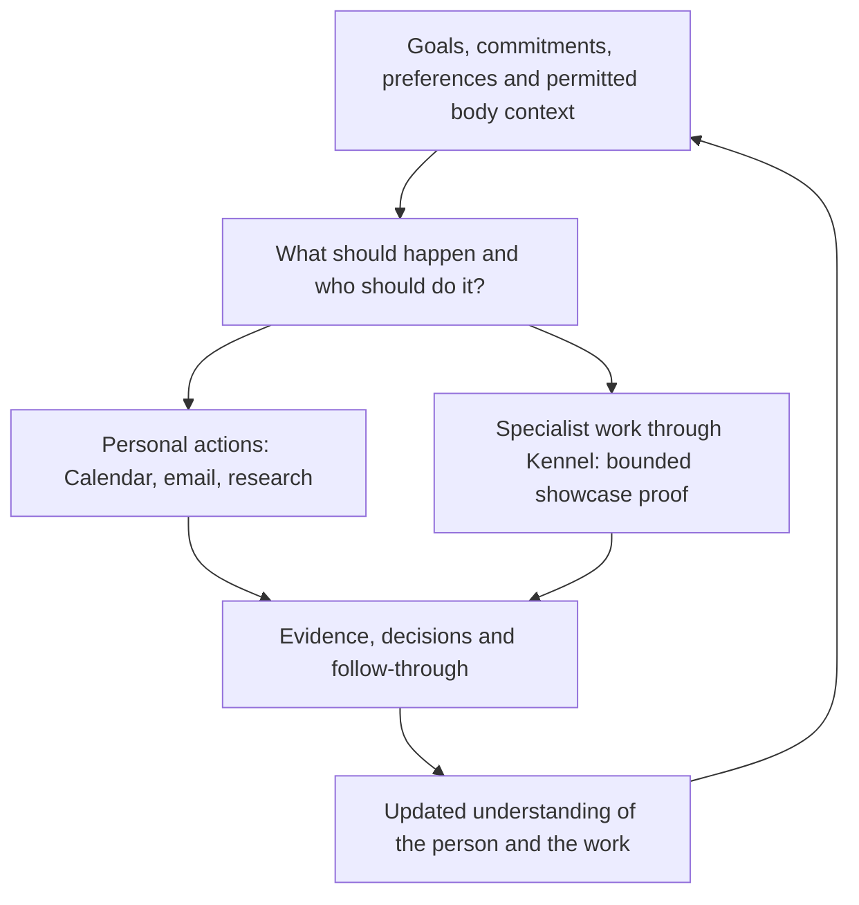
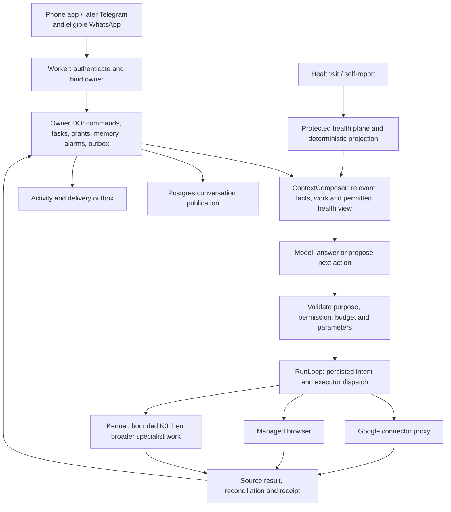

# Waldo MVP: one personal agent that carries work through

Canonical backend MVP build plan · established 18 September, audited 20 September, finalized by user direction 21 September 2026 · PR #138

**Recommendation:** retain Waldo's Cloudflare owner runtime, Supabase and existing iPhone app. Finish one durable personal-agent loop: understand the person → decide the next useful step and executor → act within permission → verify and follow through → update understanding. Buy managed browser execution. Make optional health context part of the first complete loop. Include one bounded Kennel handoff in the showcase; expand work orchestration and cross-person coordination after the personal loop is reliable.

This is the user-selected product and implementation baseline, consolidated into PR #138. It supersedes the earlier release order in this file. It does not claim runtime validation, release readiness, competitor parity, merge, or implementation. Read the [worker packet](waldo-agent-mvp/README.md), [implementation contracts](waldo-agent-mvp/IMPLEMENTATION_CONTRACTS.md), and [cross-repository synchronization checklist](waldo-agent-mvp/ADR_RECONCILIATION.md). Older Brain/app scope is a synchronization dependency, not a reason to reopen the agreed product decision. Accepted security invariants and released wire contracts remain binding until their explicit amendment/migration; synchronize the affected seams in S0 before changing them.

## 1. The product premise and release decision



Waldo is the continuing relationship and responsibility owner. A model reasons; a connector acts; a browser provides reach; a specialist executes a bounded assignment. None of those disposable executions is the person’s Waldo.

The first release is a capable personal assistant with recognizable personality, correctable memory, health-aware planning, useful public research, real Calendar/email actions, and proactive follow-through. It runs in the cloud when the laptop is off. Health sharing is optional; support for health-aware planning is not optional in the product. The app is the first surface. WhatsApp remains a first-class integration workstream subject to a supported route, and Telegram is the recommended second-surface demonstration/fallback. Full Kennel and agent-to-agent extensions follow.

The latest written direction supersedes the earlier suggested month-end deadline, India/US cohort and implied budget. **No launch date, monthly budget or exact cohort is agreed.** Recommend internal use first, then 5–10 invited India-based iPhone users, with a deliberate mix of wearable users and people declining health access. Those numbers are a proposal. Expand geography and cohort after the same acceptance checks pass, rather than making a US launch an initial dependency.

### The broader destination: an ambient personal agent

The user's final clarification makes the destination explicit: Muse-like personal-agent capability, available through the app and eligible messaging channels, a proper web dashboard, coordination between different people's Waldos, and management of existing Claude/Codex/other work harnesses through Kennel. This is part of the product direction. The personal beta is its first independently useful release; it is not the whole ambition.

Ambient means continuity across time, devices and events: Waldo notices admitted changes, maintains commitments, takes permitted next steps and interrupts only when useful. It does not require constant model inference, unrestricted surveillance or a desktop that stays on. The dashboard presents the same work that a WhatsApp message can start, pause or inspect. Each person has their own Waldo; coordination exchanges scoped requests and results between them.

### First-principles changes to the philosophy

| Change | Consequence for builders |
|---|---|
| Make useful responsibility the product unit | Start from the person's outcome and next useful step. Most chat stays chat; an ongoing commitment gets durable state without forcing a project-management ceremony |
| Make the executor a choice, not Waldo's identity | Use an API, browser, specialist harness, another person's Waldo, or the person according to capability and permission. Memory and follow-through remain with the originating Waldo |
| Make health part of practical personal understanding | Let permitted body context affect feasibility and pacing; do not let missing wearable access prevent useful assistance |
| Make continuity independent of a surface or model session | App, web and messaging share the same owner, commitments, decisions and activity. Switching surfaces cannot create another agent brain |
| Make cross-person coordination explicit | A colleague's Waldo represents that colleague. A relationship is not blanket access to their calendar, memory, health or work environment |
| Treat the current architecture as a hypothesis | Preserve components because they meet the required behavior cheaply, not because they already exist. Amend architecture decisions where they obstruct a proven product need |

The retention recommendation is evidence-based: existing identity, persistence, scheduling and effect primitives fit this loop. S0 must test that proposition. If a thin composition still cannot satisfy the concrete recovery, isolation, latency or operating-cost checks, reopen that failing component's design with an explicit comparison and migration plan. Do not treat “retain Cloudflare” or any existing ADR as an unconditional veto on a better result. Conversely, a new competitor feature alone is not evidence that the runtime needs replacement.

### The three proof stories

| Story | Required product behavior | First-release status |
|---|---|---|
| Organize and adapt my day | Use priorities, fixed commitments, preferences, self-reported energy and permitted health context; protect focus time; adapt authorized blocks; return at the agreed time without another prompt | Required |
| Handle a real follow-up | Use a selected investor/customer conversation or user-supplied context; prepare a precise follow-up; obtain exact send approval; send and verify; monitor the selected thread; stop or update when a reply arrives | Required for the full personal beta; a day-only internal alpha is explicitly smaller |
| Coordinate work through Kennel | Give a bounded feature outcome to specialist execution, collect artifacts and verification, surface only needed decisions, survive the desktop disconnecting | K0 bounded proof joins the showcase under the user's final clarification; full integration remains later and does not block a separately labeled personal-only pilot |

General research and booking preparation remain inside the product envelope. The beta supports public web research and a user-controlled handoff for bookings/purchases. It does not advertise autonomous checkout on arbitrary sites. Broader task families are added through the same tool and result contracts, not new agent identities.

### One demonstration that exercises the entire personal loop

The user says: “Protect time for the proposal today. I feel low-energy. Help me follow up with the investor after lunch.” Waldo uses the admitted Calendar and current optional health projection, prepares a feasible plan, and creates or moves only its permitted focus blocks. A meeting changes; it checks conflicts and revises the plan within the standing rule. It prepares the investor email, asks once for the exact send, records the provider result, and monitors that thread until a reply or the agreed deadline. The laptop is off throughout. The user can correct a preference, stop the follow-up, revoke a connection, and inspect what happened.

The system must explain unavailable or stale health context. It must not turn “low energy” into a durable medical/personality inference. An observed reply is evidence of a response, not proof the investor accepted the proposal.

### Product focus and the differentiation hypothesis

**Recommended first ICP:** an India-based iPhone-using founder or technical builder with a demanding calendar, real follow-ups and an existing Codex/Kennel-compatible work setup. Health-aware planning remains useful through self-report when a wearable is absent. This is a recruitment hypothesis, not a finalized cohort. Broader knowledge workers can use the personal pilot, but should not have to install a coding harness to get value. Do not market the first joined showcase to every consumer at once.

**Proposed product promise:** “Waldo turns your priorities and available energy into a realistic day—and carries chosen work through your own agents.” The measurable benefit is less planning, context reconstruction and chasing unfinished work. Memory, browser access and multiple channels support that promise; none is exclusive to Waldo.

Two competing hypotheses must remain testable: H1, joining personal capacity and work execution produces enough extra value to win repeated use; H2, users primarily value reliable personal follow-through, and the Kennel connection adds little outside technical founders. Prefer H1 for the joined showcase, but compare user ratings and interventions for personal-only versus joined stories. If users do not choose the handoff again, preserve the architecture and stop expanding K beyond the bounded proof. No architectural work can substitute for that evidence.

Public competitor material is not evidence of an exclusive USP. Muse describes proactive tasks, editable memory, rich outputs and even sleep-related dashboards; Instinct describes personal context and proactive assistance. Those features must not be claimed as absent from competitors. Our narrower differentiating combination and its quality need a dated hands-on comparison and user evidence. [Muse product design](https://introducing.muse.ai/), [Instinct](https://instinct.com/)

### Premium experience: build these details inside the existing slices

| Under-specified aspect | Decision for this MVP | Proof / owner |
|---|---|---|
| First-session value | Ask what matters today, what is fixed and how the user feels. Offer a useful editable plan from those answers before a broad connection setup. Request Calendar only when needed for read/action; health and Kennel are separate optional connections | S1/S2 app owner; first-run test with health declined and no connected account |
| Discoverability | Show three truthful starting tasks: plan my day, handle a follow-up, research something. Show delegate work only when Kennel is actually available. Every suggestion must match admitted tools | S1 app + capability interface; never advertise a mocked/unavailable action |
| Personalization with control | Let users inspect why a preference affected a plan, correct it in conversation or UI and change verbosity/initiative. Distinguish “today only,” “from now on” and “forget that”; show what changed and update affected pending plans. Keep style preferences distinct from action grants | S1 memory + app; next response uses the correction without repeated setup or unrelated edits |
| Conversation under real use | Accept a new message while work runs. Bind steering to a known task; ask only when the target is ambiguous. Preserve independent task state, coalesce repeated progress and make stop/undo accessible | S1/S2; burst-message, interruption and simultaneous-task tests; multiple pending tasks do not require parallel Kennel execution |
| Useful results | Day plan: priorities, fixed commitments, flexible blocks, changes and next action. Follow-up: editable exact draft, approval state, sent receipt and next check. Research: recommendation, short comparison, citations and achievable next step. Work: progress, diff/checks and next decision. Provide ordinary text fallback on messaging | S2/S3/B/K0; each card backed by canonical IDs/revisions; arbitrary generated apps/PDF tooling is deferred |
| Failure and recovery | State what happened, what remains unknown and the next available step. Preserve entered work after reconnect. Finish useful supported preparation even when a task cannot be completed: a booking shortlist and handoff link, a retained request waiting for Kennel, or a reconnect action. Never ask users to debug provider terminology | Every slice; changed account, unavailable desktop, unsupported task, provider timeout and partially completed action |
| Notification quality | Group routine progress; notify when a decision, deadline or meaningful change warrants it. Respect snooze/quiet hours and user initiative preferences; unresolved work remains visible in Activity | S2/S4; unsolicited messages rated useful, stopped tasks remain quiet |
| Native craft | Clear loading/empty/offline states, readable typography, accessible controls, Dynamic Type/VoiceOver, reduced motion and one-handed approvals. Use existing app components; do not start a visual-framework rewrite | App owner; physical iPhone recordings/screenshots and accessibility checks on the complete proof story |
| Value and commercial fit | Record verified commitments handled, user interventions and user-reported relief. Do not infer hours saved from token counts. Test willingness to pay after repeated real use and measured serving cost; do not launch an unlimited-use promise | S4 product owner; observed repeat use and interviews, no fixed price or revenue claim |

These are acceptance details for existing work, not nine new subsystems. The first impression should be one useful action followed by a dependable return. A broader dashboard, avatar builder, voice platform or connector catalog must not displace that work.

## 2. Changes from the previous PR #138 baseline

**Retain the architecture direction; use the revised release cut and execution order below.** The following table records changes from [the previous plan at 10e48fb](https://github.com/Pin4sf/waldo-backend/blob/10e48fb979f8c775491d0121dbafa18b8624006c/docs/planning/WALDO_PERSONAL_AGENT_PRODUCT_ARCHITECTURE_AND_BUILD_PLAN_2026-09-18.md); its section numbers refer to that historical version. PR #138 has valuable recovery, memory, connector, source-separation and app-honesty detail. Its target is broader than the smallest product described in the latest direction. It also leaves key vendor/model choices open and overburdens the initial path with later capabilities.

| Finding | Selected amendment in this revision | Relevant section |
|---|---|---|
| Health joins after the founder alpha | Join self-report in the first day-planning slice and physical HealthKit proof before the advertised health-aware invited beta | §§4.6, 5, 16 G5 |
| Trusted Relationships are a personal-beta dependency | Move relationships and their cross-owner protocol after personal beta | §§5, 9, 16 G3 |
| Gmail, selected Drive and Granola share a gate | Deliver selected-thread follow-up and reply monitoring first; make Drive/Granola separate later connectors | §16 G4 |
| Swiggy comes before browser reach | Public research and bounded managed browsing join early; India commerce is demand/access driven, not a general-agent prerequisite | §§10–11, 16 G6–G7 |
| App + inbound email is privileged over the requested channel direction | App + push first; Telegram as the recommended demonstration/fallback; WhatsApp eligibility work in parallel. Dedicated inbound email is optional | §§12, 16 G8 |
| “Cloudflare browser tooling” is not a selected implementation | Choose Browserbase hosted Stagehand HTTP execution for the beta; keep one replaceable browser interface | §§11, 14 |
| Model selection can become another research programme | One primary model, a short held-out task evaluation, a pinned configuration and a bounded failure policy; no routing platform | §§6.4, 14, G0–G1 |
| Current recovery treats model inference like an irreversible external effect | Distinguish unknown inference from unknown send/purchase. Allow bounded inference regeneration before final-output staging, never replay uncertain external actions | §6.1 and production composition |
| Health-pattern mining is in the broad release target | Defer observational-pattern discovery. Ship reliable day planning from admitted self-report and existing validated health computation | §16 G5b |
| The plan references a cross-repository launch contract as current authority | Reconcile the actual published files and refs once. The pinned launch file exists, but that path returned 404 at current Brain main in this audit | §§2.3–2.4, 21 |

Keep the existing safeguards that make autonomous work usable: owner isolation, current permissions, intent before external action, action reconciliation, correct/forget, truthful failure states, cancellation, source freshness and useful receipts. Apply them at concrete effects and data boundaries. Ordinary conversation should not require a Mission graph, an approval ceremony, or multiple reviewer agents.

### A practical simplification test

Every launch dependency must support a proof story above, prevent a concrete failure in it, or be a required provider/platform integration step. Move everything else out of the critical path. Do not delete existing modules merely because they are deferred: callers and migrations may still depend on them.

## 3. What exists, what is missing, and what must be retained

Source pins refreshed for this audit:

- [Backend main](https://github.com/Pin4sf/waldo-backend/tree/e91bee017b0c36759cbfda1353fc11c73e3afe0a): `e91bee017b0c36759cbfda1353fc11c73e3afe0a`.
- [PR #138 head](https://github.com/Pin4sf/waldo-backend/tree/10e48fb979f8c775491d0121dbafa18b8624006c): `10e48fb979f8c775491d0121dbafa18b8624006c`, open and unmerged.
- [App main](https://github.com/Pin4sf/waldo-app/tree/7218c18fed8b874492e3831bbb5bd1e1c58abe58): `7218c18fed8b874492e3831bbb5bd1e1c58abe58`.
- Brain main: `a3e8f410eacbb607961b9491026ebeaba1243b16`. PR #138's [launch-contract pin](https://github.com/Pin4sf/waldo-brain/blob/be08c4afa6f356c66600e73ae0bf54e5d7a3a158/01-Waldo/product/WALDO_PERSONAL_AGENT_LAUNCH.md) is readable, but its path is absent from the current-main tree. Do not equate a readable pinned proposal with a landed main document. [Brain PR #31](https://github.com/Pin4sf/waldo-brain/pull/31) remains open at `43be41e1a24af5d901eb6b68d9a63e1c32dfa6f7`.
- The primary local backend checkout is older (`7942261d…`) and contains unrelated modifications. Read-only snapshots were used; that checkout was preserved.

| Evidence in current source | Implication |
|---|---|
| Gateway mode constructs an unavailable spend reader and fail-closed delivery/safety; trusted planning explicitly rejects gateway mode | A working production composition must be implemented; setting API keys is insufficient. [Adapters](https://github.com/Pin4sf/waldo-backend/blob/e91bee017b0c36759cbfda1353fc11c73e3afe0a/packages/runtime/src/run-loop/adapters.ts#L145), [RunLoop](https://github.com/Pin4sf/waldo-backend/blob/e91bee017b0c36759cbfda1353fc11c73e3afe0a/packages/runtime/src/run-loop/do.ts#L1887) |
| Owner routing, SQLite state, scheduler, outbox, leases, dispatch validation and ContextComposer exist | Retain them. Complete the personal-agent composition instead of introducing another runtime owner. [Scheduler](https://github.com/Pin4sf/waldo-backend/blob/e91bee017b0c36759cbfda1353fc11c73e3afe0a/packages/runtime/src/scheduler/multiplexer.ts#L55) |
| App `agentClient` invokes its own Supabase `agent`/`calendar` functions | Migrate one command path deliberately. Do not run the legacy app engine and DO engine for the same task. [Client](https://github.com/Pin4sf/waldo-app/blob/7218c18fed8b874492e3831bbb5bd1e1c58abe58/src/agent/agentClient.ts#L74) |
| App chat errors generate a prototype reply that says a schedule was moved | Remove fabricated success before using real accounts. [Fallback](https://github.com/Pin4sf/waldo-app/blob/7218c18fed8b874492e3831bbb5bd1e1c58abe58/src/chat/useChat.ts#L49) |
| Legacy chat takes a caller-supplied thread ID and reads history using a service-role client without checking thread ownership | **HIGH, source-backed isolation defect.** Fix or disable before reuse; test two owners and mismatched IDs. No deployed exploit was attempted. [Chat](https://github.com/Pin4sf/waldo-app/blob/7218c18fed8b874492e3831bbb5bd1e1c58abe58/supabase/functions/agent/chat.ts#L53), [service-role client](https://github.com/Pin4sf/waldo-app/blob/7218c18fed8b874492e3831bbb5bd1e1c58abe58/supabase/functions/_shared/http.ts#L28) |
| Prototype Calendar mutations lack stable create IDs and omit the available If-Match primitive | Reuse connector knowledge, not its retry semantics. [Commit](https://github.com/Pin4sf/waldo-app/blob/7218c18fed8b874492e3831bbb5bd1e1c58abe58/supabase/functions/agent/commit.ts#L139) |
| HealthKit code and optional health sync exist, but current sync is app-launch driven and best effort | Retain native/SQLCipher work; implement truthful freshness, consent and background ingestion. Laptop-off cloud work does not guarantee fresh phone data. [Sync](https://github.com/Pin4sf/waldo-app/blob/7218c18fed8b874492e3831bbb5bd1e1c58abe58/src/health/sync/syncHealthToday.ts#L27) |
| Health sync preference defaults to enabled; legacy chat places numerical Form/Recovery/Weight context into model messages | Disable legacy upload until separate cloud consent, and replace that model path with the admitted health projection. Keeping the app shell does not mean retaining its existing data destinations. [Sync default](https://github.com/Pin4sf/waldo-app/blob/7218c18fed8b874492e3831bbb5bd1e1c58abe58/src/health/sync/syncPrefs.ts#L13), [chat context](https://github.com/Pin4sf/waldo-app/blob/7218c18fed8b874492e3831bbb5bd1e1c58abe58/supabase/functions/agent/chat.ts#L19) |
| Production correctable memory, Gmail send/reply monitoring, push delivery and managed browser wiring are not established by inspected source | These are actual build slices. Do not describe the product as already built because schemas exist |
| Identity registration currently rejects a second presence for an owner | “One endpoint” is not sufficient for channels: release an additive multi-presence contract before app + Telegram/WhatsApp. [Identity](https://github.com/Pin4sf/waldo-backend/blob/e91bee017b0c36759cbfda1353fc11c73e3afe0a/packages/runtime/src/coordinator/identity-presence-module.ts#L99) |

The [source audit](waldo-agent-mvp/SOURCE_AUDIT.md) includes exact paths, additional findings and inspection limits. Tests reported in PR #138 are prior evidence; none were rerun for this read-only planning pass. No production or staging path was exercised.

## 4. Lessons from the agent market

These are verified first-party descriptions, not hands-on reliability measurements. Instinct's internals remain largely undisclosed. No personally tested Instinct success story was supplied.

| Reference | Useful lesson | Waldo decision |
|---|---|---|
| [Instinct](https://instinct.com/) | One assistant that understands what matters, takes initiative and follows up | Optimize completed commitments and low interruption, not a computer-control feature count |
| [Meta Muse](https://introducing.muse.ai/) | Main conversation plus visible work, editable memory, structured approvals and selective notifications | Chat, Today and Activity with embedded decisions. Borrow the separation between execution and permission, not its entire VM infrastructure |
| [Grok Bot](https://docs.x.ai/grok-bot/skills-routines-and-automations) | Reusable skill, scheduled routine and one-off task are different things | Prove a one-off task before enabling its routine; show next run, stop and latest result |
| [Vellum Assistant](https://www.vellum.ai/docs/key-concepts/memory-and-context) | Corrected memory and bounded retrieval differ from transcript compaction | Explicit memory revisions and retrieval validity; a longer transcript is not personal understanding |
| [Poke](https://poke.com/faq) | Familiar interaction and practical integration recipes | Ask for a connection when a real task needs it; avoid a connector wall during onboarding |
| [Folk personal AI](https://app.folk.com/docs/connecting-apps) | Personal workflows can delegate into coding tools/cloud agents | Preserve the personal-to-work route, but do not claim that nobody else offers it; folk.com is distinct from folk.app CRM |
| [Hermes](https://hermes-agent.nousresearch.com/docs/user-guide/features/cron/) | Small curated memory, searchable history, procedures on demand and separate run/delivery failures | Reuse these mechanics; keep Waldo's identity and state owners |
| [OpenClaw](https://docs.openclaw.ai/automation/tasks) | Durable tasks, quiet monitoring, reconnect and delivery recovery | Persist responsibility independently of a model session; notification failure must not repeat a successful external action |

Muse documents durable application state and credentials outside its untrusted runtime and an independent permission authority. The transferable principle is a small server-enforced action boundary, not a requirement to reproduce Sentinel, a VM per user or a second model reviewing every turn. [Muse engineering](https://research.meta.ai/blog/security-and-safety-for-ai-agents-our-approach-with-muse)

The defensible Waldo ambition is **a better integrated personal-understanding → health-aware planning → action → specialist-work loop**. Whether it is better must be measured. The competitor survey does not establish uniqueness or parity. See [competitor evidence](waldo-agent-mvp/COMPETITOR_RESEARCH.md).

## 5. Selected stack and build-versus-buy decisions

| Layer | Select for MVP | Why / explicit limit |
|---|---|---|
| iPhone app | Existing Expo/React Native application, TypeScript, existing native HealthKit module, SQLCipher and secure key storage | Fix and connect the existing investment. No SwiftUI rewrite, watchOS expansion or framework upgrade project for this release |
| Web dashboard | React + TypeScript + Vite, Cloudflare Workers static assets, same authenticated backend API and durable event cursor | Start W after shared app contracts stabilize. Share contracts and client logic; do not create another orchestration backend or force reuse of native HealthKit UI |
| Public ingress | Existing Cloudflare Worker; authenticated owner routing and versioned contracts | One backend entrypoint for the app, channels and the Kennel bridge |
| App transport | Authenticated HTTP commands + SSE using SDK-54 `expo/fetch`; durable cursor/snapshot on reconnect | Stream progress without making the connection the task lifetime. No second realtime state owner |
| Durable agent | Existing per-owner DO/SQLite, Coordinator, RunLoop, scheduler and outbox | Complete missing dependencies. No new LangGraph/Temporal/Cloudflare Agents state owner alongside it |
| Conversation and protected data | Supabase Postgres, Auth/RLS and existing protected health plane | One publication writer; DO owns execution/order, Postgres owns visible conversation bytes. No second transcript |
| Models | Existing provider interface and Cloudflare AI Gateway; recommend Sonnet 5 as the first primary candidate, pinned after a short task evaluation | Quality-first baseline; no claimed account access or measured Waldo quality yet. Retain Sonnet 4.6 as the first comparison because source already supports it. No silent cheap-model fallback for sensitive actions |
| Model integration | Existing adapter, extended for streaming and validated tool proposals; official provider transport/SDK only where it reduces code | Do not replace orchestration with a general agent framework. Roster/schema/response IDs must be changed together, not an env-var-only swap |
| Calendar and Gmail | Direct Google APIs through a typed Supabase connector proxy; refresh/access credentials remain in Vault/proxy | Two providers' workflows do not justify a general integration platform. Exact actions stay under Waldo permission and reconciliation |
| Memory | Compact structured claims/commitments in existing owner store; protected searchable history in Postgres | Start with structured + lexical retrieval. Add pgvector only if held-out recall tests show a real semantic-retrieval gap. No graph DB, Mem0 or second memory authority |
| Managed browser | Browserbase + documented hosted Stagehand HTTP API, called from the Worker behind one BrowserExecutionPort | Login persistence, mobile takeover and step-level APIs. No new Node server required by the chosen API path; deployment smoke test still required |
| Notifications | `expo-notifications` for native registration/UI; native APNs delivery behind the existing delivery interface | One iOS provider path, owner-bound tokens and minimal lock-screen text. App Activity is durable truth; push is a hint |
| Second channel | Official Telegram Bot API, linked from authenticated app | Thin surface for the same owner; exact consequential approvals initially deep-link to app |
| WhatsApp | Dedicated eligibility + supported-provider adapter workstream | Keep first-class; activate only for the exact admitted route/cohort. No linked-device bridge as launch infrastructure |
| Documents/files | Existing Postgres content and object storage only when an actual artifact needs it | No unconditional R2 transcript/archive plane |
| Linux/code execution | Defer; use Cloudflare Sandbox/Containers when file/code tasks need Linux, Kennel for local workspace work | Cloudflare Computer preview is not an MVP production dependency |
| Verification | Existing Vitest/Cloudflare test pool, contract tests, Supabase/RLS integration tests; native device checks and a small scenario eval harness | Reuse current tools. Do not build a generalized eval platform before testing the three proof stories |
| Operations | Existing spend hooks, structured redacted logs, per-run counters and provider dashboards | Meter cost per completed loop; no raw health, full prompts or credentials in generic telemetry |

The current Anthropic page names `claude-sonnet-5` and prices standard inference at $2/M input and $10/M output tokens. This is a current vendor quote, not a guarantee of Waldo account access or a benchmark. Select the final model/version/config after the composition spike and a short held-out evaluation; changing it later is a configuration/adapter evaluation, not a new architecture. [Model](https://www.anthropic.com/claude/sonnet), [pricing](https://claude.com/pricing)

Expo SDK 54 documents streaming fetch and ReadableStream support, so start with its existing native fetch path rather than introducing a socket framework. Provisional text is not a committed message. On reconnect, fetch the canonical cursor/snapshot; an expired stream cursor forces resnapshot rather than replaying arbitrary cached chunks. The physical-app streaming/reconnect probe in S0 decides compatibility. [Expo SDK 54 fetch](https://docs.expo.dev/versions/v54.0.0/sdk/expo/)

### Why this browser path

Browserbase documents persistent per-site login Contexts and mobile-embeddable Live View. Hosted Stagehand exposes start/navigate/observe/extract/act/end operations over HTTP. Choose that documented API contract, independently of the newer Stagehand v4 SDK; do not install an unpinned “latest” SDK and assume it is the same interface. [Contexts](https://docs.browserbase.com/platform/browser/core-features/contexts), [Live View](https://docs.browserbase.com/platform/browser/observability/session-live-view), [hosted API](https://docs.stagehand.dev/v3/api-reference/python/start-a-new-browser-session)

Cloudflare Browser Run is a credible later replacement and offers a lower browser-hour price. Its current Stagehand guide only supports v2.5.x, while live takeover is marked beta. Cloudflare Computer explicitly says preview and unsuitable for production. These are distinct products. Do not make the prototype filesystem/computer package the core durability layer. [Compatibility](https://developers.cloudflare.com/browser-run/stagehand/), [Browser Run](https://developers.cloudflare.com/browser-run/), [Computer status](https://github.com/cloudflare/computer)

Use one provider initially. Before broadening browser claims, test chosen public sites, one login on a physical iPhone, cancellation, session loss and cleanup from India. Browserbase browser geography, retention settings, proxy traffic and hosted-model processing must be checked for the selected account. If a required scenario fails, change this one adapter; do not build two browser stacks in parallel.

Nango/Composio remain later options for a measured long-tail connector need. They are not authority systems and do not remove Google scope/approval obligations. Using one now would add credential migration and another supplier before the first two direct integrations work. This is a scope-based recommendation, not a claim those services are inferior.

## 6. Runtime shape: one loop, replaceable executors



### Canonical state

| State | Owner | What may be copied |
|---|---|---|
| Owner identity, grants, accepted task/commitment state, non-health compact claims, schedules, ordering and execution metadata | Existing owner DO and its named modules | Revocable client projections; no alternate authoritative task database |
| Exact visible user/assistant content | Supabase publication service under owner-scoped access | Device cache and bounded provider context; not duplicate full DO transcripts |
| OAuth refresh/access material | Vault + typed connector proxy | Only opaque connection references reach DO/model |
| Raw/normalized health and numeric derived results | Protected health plane; account/consent-bound SQLCipher cache on phone | Only explicitly permitted, minimal planning projection reaches reasoning; no raw arrays in generic memory/browser jobs |
| Browser login state | Vendor Context mapped to owner + site + provider account | Session reference; not a shared context, model-visible cookie jar or copied local desktop profile |
| Workspace files, terminal and raw execution traces | Kennel or later isolated cloud executor | Selected artifacts, progress and evidence references attached to Waldo work |

A shared Supabase brand does not establish that app and backend migrations are compatible. Before changing transport, map legacy tables/functions to the canonical target, define one migration/cutover owner, preserve any live user data, and stop the old execution path for migrated commands. Reversible cutover means routing back only for commands that the new path has not admitted; never execute the same command in both systems.

### The normal turn

Authenticate → stage admitted input → reserve stable order/run identity → compose bounded context → one model reasoning step → validate proposed tool → persist intent → execute/read back → update task and memory candidates → publish exact response → deliver only if useful.

Use a normal answer for ordinary chat. Promote durable work when the user makes a commitment, schedules something, asks Waldo to keep watching, or delegates a multistep outcome. Reuse existing responsibility contracts; do not invent a parallel generic “task graph” to avoid understanding them. Expose ordinary names such as “Waiting for reply” and “Needs your approval.”

For the decision “who should do it?”, the MVP dispatcher chooses: answer directly, official API, managed research browser, the admitted K0 Kennel executor, ask the user, or wait for an external event. A model may propose the route; the server determines which executors and operations are available. Start with one reasoning agent and deterministic tools, not a standing swarm.

### Recovery categories must differ

| Operation | Failure/retry rule |
|---|---|
| Read/lookup | Retry with bounded backoff; report stale/unavailable source if exhausted |
| Inference before a final answer is staged | If response cannot be recovered, mark that attempt interrupted; regenerate within aggregate spend limits using a fresh inference-attempt identity, durable committed tool results and the existing logical operation IDs. Never restart the whole turn and replay completed effects |
| Final response already staged | Publish/recover the same bytes; never re-run a model to reconstruct a frozen answer |
| Calendar create/update | Reconcile stable event ID and current etag before retry; external edit triggers a fresh proposal |
| Email send or other irreversible action | Unknown outcome stays indeterminate until evidence resolves it; never infer “not sent” from an absent immediate lookup |
| Push/channel delivery | Retry/coalesce delivery only; never re-execute the completed action to regenerate a notification |

The existing gateway returns `gateway_trusted_receipt_unavailable` on reconciliation. Decide and test the inference policy above as an explicit contract amendment before enabling production. No general model API promises recoverable exactly-once inference merely because Waldo supplies an idempotency key. Preserve PR #138's exact staged-input/output publication protocol and crash probes; do not pretend DO/Postgres share a transaction. [Current gateway](https://github.com/Pin4sf/waldo-backend/blob/e91bee017b0c36759cbfda1353fc11c73e3afe0a/packages/runtime/src/llm/gateway.ts#L92)

## 7. Autonomy that feels useful

“Reversible” is insufficient by itself: an editable calendar invitation can already notify another person. Permissions must capture external consequences, scope and current facts as well as reversibility.

| Action | Default |
|---|---|
| Public research, reading admitted sources, drafting, planning | Autonomous within task/data/spend scope |
| A specifically requested reminder | Schedule it; show time and cancellation. Ask only if time/purpose is genuinely ambiguous |
| Change Waldo-created personal focus blocks | Autonomous only under an explicit standing rule; otherwise propose exact change |
| Change meetings involving others, send any message/email, confirm a booking, buy something, publish or delete important data | Exact approval by default, even if the provider offers an undo |
| New source, permission expansion, new destination or materially changed price/content | New consent/approval; memory never supplies it |
| Uncertain prior send/booking | Reconcile or ask for a resolution; do not resend blindly |

Example standing rule: “For seven days, adjust only Waldo-created focus blocks in my selected calendar, weekdays 09:00–18:00, without guests, never touch fixed meetings, at most two changes per day, and tell me what changed.” Implement that as typed constraints with expiry/revoke and before/after receipts. User-expressed health or preference changes may alter a proposal, never enlarge this rule.

Approval cards live in trusted app UI and show recipient/account, exact content or before/after, money if any, and expiry. Freeze the approved payload and invalidate approval on material change. A browser page or incoming email cannot approve itself or choose an outbound destination.

Cancellation stops future work and suppresses stale publication/delivery. If an action already crossed the irreversible boundary, cancellation reports its actual status and attempts reconciliation. It cannot claim the prior effect did not happen.

## 8. Personal understanding, health and skills

### Memory: small, correct and usable

Start with explicit user preferences/facts, current goals, commitments/Open Loops and brief evidence-linked episodes. Contacts mentioned in a follow-up do not require a Trusted Relationships protocol. Preserve provenance, applicable time, revision and source validity. Retrieve only relevant current records plus recent conversation; keep unresolved work separately from prose summaries.

Explicit “remember/correct/forget” is immediate and inspectable. Inferred sensitive claims need confirmation; do not constantly ask permission for ordinary temporary context. A correction supersedes the old value everywhere. A forget barrier prevents old transcript extraction/reindexing from recreating the forgotten claim. The user can separately delete the source conversation. Summarization, embeddings, caches and scheduled jobs must respect source/consent generations.

Begin with deterministic/lexical retrieval and a small explicit profile. Add semantic retrieval only after a held-out memory test exposes failures it can solve. Do not train or fine-tune a model, build a knowledge graph, or import a second memory service for the MVP.

### Finalized memory decision: retain tiers, simplify the initial records

The older five **storage tiers** and five **hall categories** are different concepts. Keep the useful tiered responsibilities with the following MVP implementation; do not build five independent services or copy all tiers into each prompt.

| Original tier | MVP decision |
|---|---|
| 0: volatile working context | ContextComposer assembles a bounded, revision-bound view for the current step; conversation recap is a cache, never permission or action truth |
| 1: durable personal memory | Per-owner canonical claims/preferences with provenance, temporal validity, revision and correction/forget. Generate a compact profile view rather than repeatedly loading the complete store |
| 2: episodic memory | Store admitted, evidence-linked summaries of relevant experiences; retrieve by entity/topic/time and fetch bounded details on demand |
| 3: procedural memory | Use reviewed versioned procedures for the actual beta workflows. Do not automatically turn every multi-tool session into a production skill |
| 4: archive | Retain source/history under explicit retention and deletion rules; defer a separate R2 archive pipeline until volume or retention warrants it. An archive cannot silently resurrect forgotten facts |

The five hall categories currently in code are facts, events, discoveries, preferences and advice. The compact MVP record model keeps facts/preferences as profile claims, events as episodes where appropriate, and durable commitments separately as executable task state. Discoveries and advice remain evidence-bound candidates or reviewed procedure inputs; broad health-pattern discovery is deferred. Relationship names may be ordinary claims; cross-person grants belong to the later explicit relationship protocol. Preserve migration compatibility where needed; do not destroy historical rows or treat a rename as completed memory engineering.

**Current implementation gap:** backend main `e91bee0` still defines five halls. Its inspected ContextComposer SQLite recall adapter intentionally admits no legacy memory rows because source taint/provenance is missing; the path is explicitly partial and does not provide ranked episode retrieval. S1 must fix the retained-provenance write/read path and prove actual useful recall. Removing the filter or inventing provenance is not a fix. PR #138 remained open at `10e48fb` when checked on 21 September. [Hall contract](https://github.com/Pin4sf/waldo-backend/blob/e91bee017b0c36759cbfda1353fc11c73e3afe0a/packages/contracts/src/memory/hall.ts#L8), [recall adapter](https://github.com/Pin4sf/waldo-backend/blob/e91bee017b0c36759cbfda1353fc11c73e3afe0a/packages/runtime/src/context-composer/sqlite.ts#L354)

### Memory behavior workers must implement and prove

1. **Compact briefing with freshness:** compose stable admitted personal context, currently relevant circumstances, active commitments and an index of relevant memories. Retain source revisions and generated-at metadata. A correction/forget/revocation invalidates every dependent view before the next reasoning step. If rebuilding fails, use a valid smaller view or report unavailable context; never reuse a known-invalid profile.
2. **Immediate explicit changes:** remember/correct/forget uses the trusted admission path and acknowledges persistence only after commit. New turns on every surface observe that revision. Corrections made while a task is running fence stale proposals before action/publication; a preference still cannot grant permission.
3. **Incremental consolidation:** committed turns enqueue a durable bounded background job for eligible memory candidates and episode summaries. Use a source cursor and idempotent source/revision key. Keep the job out of chat latency; deduplicate, resolve conflicts and consult forget barriers. Sensitive inference requires confirmation. Nightly cleanup is optional maintenance, not the only opportunity for a memory to become usable. Store enough job state to distinguish queued, applied, rejected and failed; the user should not receive a false “remembered” acknowledgement for a candidate.
4. **Purposeful retrieval:** provide logical search, read-detail and authorized-history operations through existing typed interfaces. Use stable entity IDs, aliases, lexical ranking and time filters first; demonstrate actual query relevance rather than latest-N rows. Let the model refine a bounded search when needed. Validate selected records against current owner, consent, source and supersession state immediately before use. Add semantic retrieval only for measured paraphrase/association failures; the tier boundary does not change.
5. **Natural personalization:** relevant context should influence an ordinary task without a special recall request. Example: a previously stated late-morning focus preference changes a day plan; a temporary low-energy report affects today's pacing, then expires. Also test irrelevant-context cases so Waldo does not force health or personal references into every answer.
6. **Correction and expiry over inferred traits:** observations, preferences, inferences and procedures are distinguishable. Do not generalize one incident into a personality/health claim. Keep corrections sourced and history time-aware; expired or superseded items cannot behave as present truth. Forget excludes the claim from ordinary history retrieval as well as current lookup.

The Instinct memory teardown motivated the compact briefing, selective retrieval and background consolidation checks. It is the author's black-box reconstruction, not verified Instinct internals, and does not prove a need for Git-backed Markdown or a managed memory vendor. The finalized Waldo decision is independent of that storage format. [Teardown](https://supermemory.ai/blog/reverse-engineering-instinct-memory/)

### Health: part of the day, optional to share

The phone collects only the agreed minimal HealthKit categories. Cloud processing requires separate explicit consent. Use the existing protected computation and accepted health destination rules; do not create another readiness score in the model or app.

First useful inputs are self-reported energy, permitted sleep context, and eligible existing recovery information where the source/algorithm is already validated. Do not invent a new HRV-to-productivity formula or introduce pattern-mining prerequisites. Preserve observation window, source/method, consent epoch, computation version, freshness and uncertainty. Self-report expires as contextual state rather than becoming a permanent trait.

The day planner treats fixed commitments, deadlines, timezone, time availability and permissions as hard constraints. Preferences, effort and the admitted functional health view are soft inputs. The model proposes; deterministic checks reject clashes and unauthorized changes. User priorities win when the user knowingly chooses a harder day.

The health-aware branch must handle consent declined/revoked, no accessible data, sparse history, query failure and stale observations. Apple deliberately does not reveal whether read access was denied. A successful permission request is not proof of accessible samples. Locked-device/background behavior requires physical-device testing. [Apple authorization](https://developer.apple.com/documentation/healthkit/authorizing-access-to-health-data), [background delivery](https://developer.apple.com/documentation/HealthKit/HKHealthStore/enableBackgroundDelivery%28for%3Afrequency%3AwithCompletion%3A%29)

The laptop can be off while the cloud agent works. If the iPhone has not supplied fresh health data, the agent uses the last valid admitted projection or the no-data/self-report path; it never changes the observation timestamp to the time it woke up. Health provenance and numeric cards stay in the app. Do not send sensitive values in notification lock-screen text or external messaging.

Health patterns, causal explanations, medical recommendations and clinical prediction are outside the beta. A later pattern feature requires its own evidence; absence of that feature does not undermine honest health-aware day planning. This selected narrowing of older Brain pattern-awareness scope must be mirrored through the bounded ADR synchronization checklist.

### Personality and procedures

Use a reviewed compact runtime voice pack drawn from existing Waldo assets: warm, grounded, lightly playful, concise when unsolicited, honest about uncertainty and failed actions. Do not copy old numeric-health examples or success claims without current evidence. Keep user style settings separate from permission.

Implement a small reviewed procedure set: plan day, adapt day, remember/correct/forget, prepare follow-up, watch selected reply, public research. These are versioned procedures with declared inputs/tools/result checks, not self-modifying production skills. Builder `.claude/skills` are not automatically customer tools. Learn from completed work by recording user corrections and outcomes; code/prompt/skill changes still go through development and evaluation.

## 9. The real action and follow-through paths

### Calendar

Connect Calendar alone first. Read availability and selected events; separate read/write grant. Restrict automatic writes initially to owner-only, non-recurring Waldo-created focus blocks without attendees. Persist a Google-compatible client-generated event ID before create. Use current etag + `If-Match` for updates/deletes; `412` means re-read and re-propose. Read back actual final state and record it. Undo is a new conditional action, not a promise that an external edit can always be erased. [Google concurrency](https://developers.google.com/workspace/calendar/api/guides/version-resources)

Calendar changes need a cloud trigger, not an app refresh. Initially, use the same durable scheduler to reread a bounded upcoming window (proposed: next 48 hours every 15 minutes during opted-in planning hours, plus the scheduled morning plan). Persist event IDs, etags and last-observed state; unchanged results require no model call. Handle explicit cancellations and reconcile disappeared records by ID rather than equating absence from a moving window with deletion. Coalesce related changes into one replan. A failed/stale read suppresses automatic changes and shows the limitation. Document the polling delay; later switch to Google watch/sync only if measured latency or scale requires it. Acceptance must move/cancel a real test meeting while both app and laptop are off and prove one resulting authorized adaptation.

### Email

Keep review drafts inside Waldo initially, rather than adding Gmail draft CRUD solely to send later. Request `gmail.readonly` for selected-thread context/monitoring and `gmail.send` only when sending is needed. Do not request compose/modify/delete breadth without a feature using it. Google still classifies mailbox reads/metadata as restricted; an in-app draft does not remove the read-scope integration requirements. [Scopes](https://developers.google.com/workspace/gmail/api/auth/scopes)

Freeze exact RFC 5322/MIME bytes, recipients, account, thread and attachments before approval. Send that snapshot through `users.messages.send`; never send a mutable provider draft by ID. Record the provider message ID and reconcile uncertain sends. A stable RFC Message-ID can aid lookup but is not a Gmail idempotency guarantee, and a missing search result immediately after timeout does not prove absence. [Send method](https://developers.google.com/workspace/gmail/api/reference/rest/v1/users.messages/send)

Monitor only owner-admitted thread IDs, with expiry, last-seen message ID/cursor and a bounded schedule. Start with coarse, configurable rereads, for example every 30 minutes during agreed hours; make the observed delay explicit. Read receipts, auto-replies and delivery bounces are not substantive responses. A response stops the old follow-up and proposes the next step; it never silently approves another send. Add Gmail Pub/Sub watch/history only when measured latency or scale warrants the extra infrastructure. [Google push model](https://developers.google.com/workspace/gmail/api/guides/push)

### Proactivity

Use one scheduler for a requested reminder, due follow-up, admitted calendar change, or bounded day-review rule. Keep occurrence identity, task state, execution result and delivery state separate. No-change runs stay quiet and record a no-op. Cheap deterministic checks should not invoke a model.

Persist next-due work before arming the alarm. Deduplicate wakes, re-arm from durable state and expose exhausted retries as failed/pending repair. Add a bounded repair sweep for overdue occurrences rather than treating platform retry as an eventual-completion guarantee. Reuse the existing scheduler instead of introducing a second workflow engine. [Durable Object alarms](https://developers.cloudflare.com/durable-objects/api/alarms/)

Every notification has a reason, relevant source and next action; respect quiet hours, coalesce duplicates and expose snooze/done/stop. The owner can see “waiting,” “failed,” or “nothing changed” in Activity. APNs acceptance is not proof a person saw a notification. The app fetches canonical state on open, including after a lost push.

### Browser

Start with public research, extraction, comparison and preparation. Worker-controlled navigate/observe/extract and individually validated act steps are sufficient; do not hand an unconstrained hosted browser agent the user's whole context. Persist run/session mapping and result references outside the browser. Serialize use of a login Context. Keep provider keys and sensitive session URLs out of model output and app logs.

A label such as “read-only” or `persist:false` is not an effect sandbox. Navigation may have site-side effects; authenticated actions require a specifically supported task family and enforcement. Initial public browsing carries no user login credentials. For login, MFA or a final purchase/booking, pause and let the user take over; suspend automation and avoid capturing secret-entry frames into model context. An unsupported final step remains a handoff, not a claimed autonomous completion.

Browserbase-hosted model processing is a distinct data path from Waldo's AI Gateway. Admit its model/retention route explicitly; do not assume the main gateway's logging settings apply. Only public task context is allowed until that route and authenticated cleanup are proved. Health/email memory is not automatically sent to browser reasoning.

## 10. Build order and worker ownership

These are deliverable slices, not new runtime entities. Durations are engineering estimates for scoped work with existing accounts and experienced implementers; provider approvals are separate. Re-estimate after S0.

| Slice | User-visible result | Implementation and exit | Depends on | Planning estimate |
|---|---|---|---|---|
| S0: truth + production composition spike | Real app message gets a real durable answer, can stop/reconnect, and can read a test Calendar | Remove fictional success; contain legacy thread-ownership bug; owner/account epoch; production context, spend, safety and sink; one typed Calendar read; prove no duplicate published turn after restart | Current source pins and integration test accounts | 3–5 working days |
| S1: continuing personal conversation | Waldo has a consistent voice, remembers priorities, accepts corrections and carries an explicit commitment | Publication protocol, compact memory and validity/deletion, generated client, Chat/Today/Activity basics, one durable commitment. Kill at publication boundaries; next turn remains live | S0 | 5–8 days |
| S2: day → action → return | A day plan adapts permitted focus blocks and follows up with the laptop off | Calendar grant/proxy/etag/reconciliation and bounded cloud change polling; self-report planning; durable schedules; native push registration/delivery; quiet hours; stop/snooze; physical-device cloud wake | S1 | 5–8 days |
| H: HealthKit joins the day | Permitted current health changes the plan; declined/stale/revoked paths remain useful and truthful | Account/consent-bound cache and sync; minimal native samples, protected projection, provenance/freshness, background anchor and physical-device proof | S0 identity and a released projection contract; joins S2 | 7–12 days, parallel |
| S3: real follow-up | User reviews an exact email; Waldo sends, tracks the selected response and follows through | In-app draft, approved immutable send, uncertain-send recovery, exact-thread polling, anti-injection and duplicate tests | S2 effect/schedule spine; Google scope readiness | 4–7 days |
| B: public research/browser | A research request returns cited current results and survives a failed browser session | Browserbase hosted HTTP adapter, task bounds, citations, cancellation, cleanup, metering; supported-site/iPhone handoff spike | S0 contract baseline; independent of health implementation | 3–5 days, parallel after contracts |
| C: channel demonstration | Same owner/task continues between app and Telegram | Multi-presence migration and global subject claim, app-initiated link, revoke, dedupe, event order; exact approvals deep-link to app | S1 conversation contract; join after S2 | 3–5 days; WhatsApp admission work starts immediately |
| K0: bounded showcase handoff | Waldo delegates one real repository task to Kennel using its Codex-first path and returns the diff and verification | Paired outbound desktop bridge, one explicit project attachment, one serial work item, progress/cancel/result and a reconnect probe; preserve Kennel's existing owner-approval path | S1 durable task contract; separate Kennel readiness spike | 2–3-day feasibility spike, then estimate implementation from actual gaps; no assumed working cloud bridge |
| S4: invited-beta release proof | A small cohort can use the complete day and follow-up loops repeatedly | Join H/S3/B; recovery/isolation/device tests; correct/forget/revoke; spend limits; 14-day internal observation of utility/noise; operational runbook | S2 + H + S3 + B; C only if advertised | 5–8 engineering days plus observation, partly overlapping |
| K: joined work proof | “Implement this feature” reaches Kennel and returns verifiable evidence | Versioned executor request/progress/cancel/artifact/result; bounded workspace grants; disconnected state; existing Acceptance semantics | Stable personal beta and independent Kennel readiness | Estimate only after executor contract audit |
| W: web dashboard | Inspect and control the same Waldo from a desktop browser | Chat, Today, Activity/decisions, Memory/connections and Work; same login, owner, task IDs and replay/cancellation behavior | S1 contracts; basic shell may parallelize after S2 with a separate owner | 5–8 days for personal dashboard only; coordination views estimated with R/K |
| R: coordination between people's Waldos | Two people arrange one meeting without exposing unrelated context or committing without permission | App-linked counterpart identity; scoped invitation/proposal/accept/decline/cancel messages; per-owner decisions, dedupe, expiry, block/revoke and shared receipt references | S4 personal reliability, W visibility and the multi-presence/identity contract | Estimate after one two-owner protocol spike; not included in personal-beta estimate |

**Internal alpha:** S2 + H + memory correction and recovery. A self-report-only engineering demo may precede H, but cannot claim working wearable integration. **Personal invited beta:** S4 with both required personal proof stories. If Gmail access is not ready, invite only a clearly named day-planning pilot; do not call that the complete beta described here. A channel is advertised only after its own live proof.

**Showcase MVP, reflecting the final user clarification:** demonstrate S2 + H, the S3/B personal capabilities, and K0. Demonstrate A14 with one actually available coding harness; do not require supporting every harness, a swarm, a full web dashboard or coordination between people. A small Work card in the app is sufficient. If K0 is blocked, report that the joined showcase is incomplete rather than silently redefining it as a personal-only demo. The personal pilot can still proceed under its own label.

**Joined-product beta:** add W + K + R, with at least one eligible messaging surface. W gives the human a place to manage both personal and delegated work; K and R then add distinct work-harness and cross-person coordination proofs. These are explicit subsequent deliverables. Their scope is not silently included in the personal-beta schedule or cost estimate.

### Roadmap addendum: conversation path after S4

The post-S4 order is **S4 → ConversationEntry → Joined Conversation Path → Telegram → S5**. Each step requires a real end-to-end run with the intended app, owner runtime and provider path before the next step is admitted; fixtures, mocks and schema presence are supporting evidence only.

- **ConversationEntry:** make the canonical conversation record the immutable, owner/thread-bound source for the model input and app-visible payload. Model context and app payloads are separate projections; neither may be reconstructed by mutating the other. Branches and threads retain append-only ancestor references so edits, retries and resumptions preserve provenance without rewriting history.
- **Joined Conversation Path:** prove one conversation continues across the app and the shared owner runtime with ordering, reconnect, cancellation, account isolation and truthful receipts. Record the real-run evidence and failure classifications for each path.
- **Telegram:** add the app-linked, revocable Telegram presence for the same owner and conversation path. Deduplicate provider events and keep consequential approvals in the trusted app path until Telegram approval is separately proved.
- **S5:** accept the joined app/channel path only after the Telegram proof and the preceding real-run evidence pass. Treat **S4.5** as the stabilization checkpoint; publish the assistant export only after S4.5, from the canonical append-only conversation and its permitted projections.
- **S5.5 and later:** add browser execution together with Cloudflare Sandbox when the slice needs isolated Linux/file/process work; do not treat either as evidence for conversation correctness. Add heartbeat/status at **S6.5** so liveness is observable without making a transport connection the task lifetime. **S7** covers pending approvals and the durable Activity ledger, with approval state and activity evidence remaining distinct from conversation prose.

Every named slice publishes its real-run evidence, including source/config pins, account and consent state, observed provider effect, recovery result and sanitized references. No later slice may be marked complete by inheriting an earlier slice's evidence.

### First frontier: concrete work packets

1. **Kernel/composition owner:** `packages/runtime/src/index.ts`, owner routing, `run-loop/adapters.ts`, `run-loop/do.ts`, `llm/gateway.ts`, ContextComposer, publication/outbox and relevant contracts. Produce the smallest production composition and failure recovery. This owner alone changes shared contracts, migrations, generated schemas and roster. No bypass of fail-closed dependencies.
2. **App/health owner:** app `src/agent/agentClient.ts`, chat hooks/stores, protected routing, account epoch, SQLCipher lifecycle and native HealthKit ingestion. Remove mock-success behavior, isolate state, and consume the released client/projection fixtures. Backend protected-health migrations go through the integration owner; app lane does not invent a second health authority.
3. **Connector owner, after S0 contracts:** typed Google proxy, Calendar adapter and later Gmail path. Own provider observations/conformance fixtures; propose shared DTO/migration changes to the kernel owner rather than editing concurrently. Browser lane starts only when staffing and the released interface permit it.
4. **Independent reviewer:** break the actual proof story, account switches, revoke, provider-success/response-loss, forgotten-memory resurrection, stale health and notification retries. Review the produced evidence rather than treating a worker's “done” as acceptance.

Only the first frontier becomes executable issues now. Later rows are sequencing, not permission for every worker to modify shared contracts in parallel. Register implementation ownership in the existing issue/ledger workflow when execution is authorized. This planning packet creates no issues or comments.

### Two stop rules that prevent endless architecture work

- S0 falsifier: if real app → owner root → model → Calendar read → committed answer cannot be composed without unrelated work-agent machinery, use a thin personal-agent composition root reusing the existing identity, scheduler, dispatcher and effect primitives. Record the seam change. Do not start a wholesale rewrite or keep extending the spike without a concrete failure diagnosis.
- Browser falsifier: if the chosen hosted API cannot support the required site/iPhone/cancellation scenario, change the browser adapter after a bounded comparison. Do not make a universal computer platform prerequisite for Calendar and follow-ups.

## 11. Acceptance checks that define the release

Proposed thresholds below must be frozen before implementation/evaluation, not lowered afterward to declare success. They are product targets, not measured results.

| ID | Test and evidence | Proposed threshold / falsifier |
|---|---|---|
| A1: continuing conversation | Real iPhone, fresh login, streaming interruption, force-close/reconnect, duplicate command, process restart at each publication boundary | No duplicate committed message, stale cross-owner content, regenerated frozen response or wedged next turn |
| A2: correct personal understanding | 40 held-out explicit recall/correction/temporal/forget scenarios; source-aware expected answers; repeat after restart/reindex | ≥95% correct retrieval/abstention; every tested explicit correction and forget wins; zero stale-claim resurrection |
| A3: adaptive day | 10 day scenarios × 3 clean repeats across health on/off/stale, India timezone and travel/DST; external meeting move/cancellation with app/laptop off | ≥90% feasible and useful plans; 100% fixed constraints and permission checks; cloud change checkpoint triggers at most one adaptation within the stated polling window; provider state confirms every claimed write |
| A4: bounded autonomy | Standing focus-block rule, outside-window event, attendees added, etag race, expired/revoked permission | All out-of-scope actions rejected or newly approved; one authorized effect per logical operation |
| A5: health-aware reality | Physical iPhone with authorized test data; no-accessible/limited/stale/locked/revoked/alternate-account cases; compare protected projection and generated plan | No invented readiness, false freshness or cross-account/consent leakage; useful no-health branch; app numeric data never enters forbidden destinations |
| A6: investor follow-up | 10 selected-thread cases × 3 repeats; edited draft, account switch, provider timeout after commit, auto-reply, real reply, revoked access | ≥90% end-to-end success; 100% exact approved send content; zero duplicate sends; unknown outcomes stay visibly unknown |
| A7: cloud return | Laptop off and app terminated; due reminder, lost/duplicate wake, quiet hours, cancellation, failed push | Cloud state advances independently; zero out-of-policy notifications; Activity survives delivery failure; no external action rerun for notification retry |
| A8: public research | 10 answerable tasks × 3 repeats plus separate unanswerable/hostile cases; source URLs checked and browser loss injected | ≥90% of answerable trials produce a source-supported useful answer; needless abstention counts as failure. Report justified abstention separately; zero sensitive disclosure, unauthorized submit or fabricated receipt |
| A9: control | Correct/forget, source revoke, grant revoke, logout/switch and account deletion during active runs | Old generations cannot read, act or publish; provider cleanup pending is shown honestly; no deleted content reconstructed |
| A10: quality and cost | 14 internal days; each proactive item rated, task attempts and complete costs counted | Proposed ≥80% useful proactive items and no repeated unwanted nudge after dismissal; p50/p95 cost and latency reported; zero unbounded runs |
| A11: later same-agent proof | App and Telegram race, replay/link/revoke; later Kennel disconnect/return | One owner/task truth, no duplicate action, no cross-owner subject claim; local work truthfully waits for executor availability |
| A12: joined dashboard | Start in messaging, inspect in web, approve in app, interrupt in another surface; refresh during progress | Same task and current decision everywhere; stale approval rejected; no browser connection owns execution; no duplicated operation |
| A13: cross-person coordination | Two owners negotiate one meeting; duplicate and late messages, refusal, revoked relationship, conflicting proposals and an impersonated sender | No unilateral commitment of the other person; only authorized fields shared; each owner can stop; exact external-message/calendar approvals enforced; one linked outcome or truthful partial failure |
| A14: existing work harness | Kennel dispatches a bounded real workspace change using Codex first; disconnect/cancel/reconnect; collect independent verification; prove Claude separately later | Correct workspace and granted scope; retained task/execution identity; provider completion is not user acceptance; no personal-health context leakage; no false claim that an unavailable harness ran |
| A15: natural and fresh memory | 20 held-out multi-session histories × 3 repeats: implicit relevant preference use, aliases/paraphrases, irrelevant facts, time expiry, conflicting updates, failed consolidation, correction during execution, and forget followed by full rebuild | ≥90% correct use or justified non-use on answerable labeled cases; report recall and inappropriate personalization separately; every tested explicit correction/forget holds across views and surfaces; no fabricated provenance or grant |
| A16: first-use and premium task experience | Five target users independently complete the entry flow and one permitted task; include no-health/no-account path, interruption, reconnect and accessible UI | At least 4/5 reach a useful editable plan within 5 minutes of entering the app, without developer coaching; record connection time separately. No invented success, lost input, stale approval, unlabeled unavailable action or inaccessible core control; user can explain what happened and what remains |

S4 also records voluntary repeat use over the 14-day observation window, reasons for return/abandonment, intervention burden, user-rated usefulness and willingness to pay. As an initial decision rule, seek at least 4 of 5 target testers returning for real tasks on three distinct days in week two without researcher reminders. This small-cohort signal is a directional product test, not a market estimate or a claim of retention. If it fails, improve the existing loop before adding integrations. If participants cannot use the app because of access/outages, report that failure separately rather than replacing it with a favorable survey score.

Report personal-only and Kennel-enabled results separately. Enthusiasm for a coding demo must not hide an unusable personal day loop, and no personal user must connect a repository to pass onboarding. Record completed commitments, rescue interventions, unnecessary clarifications, missed returns and notifications per completed commitment alongside self-reported effort reduction.

For routine conversation propose p95 first useful feedback under 5 seconds, excluding a visible provider incident; long work gives immediate acknowledgement/progress rather than a fake quick completion. Measure this in the actual app/region before promising it.

A run may complete an action or deliver a reminder without demanding a separate ceremonial user acceptance. An open-ended human outcome is not automatically accepted because a provider returned success. Keep that distinction in the data while keeping the UX simple.

Track denominator, attempted/failed/abstained tasks, retries, human interventions, end-state proof and cumulative cost. Run fault-injection cases even when the happy path passes. Zero failures in finite tests is not universal safety proof. Competitor parity requires a separate dated, comparable hands-on study; this audit did not perform one.

## 12. Timeline and cost proposal

### Timing

Assuming two experienced implementation owners plus part-time review and test accounts available early, plan **3–4 weeks to a complete internal day loop, and 6–8 weeks to the invited beta** including email/research and longitudinal checks. This is an initial range, not a commitment. A strong third owner can move connector/browser work off the critical path; it cannot remove shared-contract, physical-device or provider lead times. One owner should expect longer.

Re-estimate after the first 3–5-day composition spike using actual migrated surfaces and adapter failures. Google access, Apple signing/TestFlight and a supported WhatsApp route have external lead times; distinguish implementation-ready from provider-enabled. Do not promise a month-end launch without that evidence.

The 6–8-week estimate covers the personal beta, not W/R/full K. K0 is now required for the joined showcase and needs its own 2–3-day readiness spike before estimating completion. It can parallelize behind S1 if a Kennel owner is available; with the same two owners it may extend the critical path. Work-harness inference/subscription usage and relay traffic must be added to the cost model once measured.

### Cost model

Use measured per-user workloads, not competitor subscription prices. All USD figures below are illustrative planning scenarios using public list prices checked on 20 September 2026, excluding tax, labour and one-time external assessments. They do not authorize purchases.

```text
monthly cost = platform base + additional projects + model usage
             + browser hours/hosted processing/proxy traffic
             + storage/egress/delivery/observability + evaluation + reserve

model cost/user/month = 30 × (daily input MTok × input rate
                            + daily output MTok × output rate)
```

At the quoted Sonnet 5 $2/$10 per million tokens, with no cache discount assumed:

| Scenario per active user/day | Total input across all calls | Total output across all calls | Model/user/month |
|---|---:|---:|---:|
| Light | 120,000 | 12,000 | $10.80 |
| Moderate | 400,000 | 40,000 | $36.00 |
| Heavy | 1,500,000 | 150,000 | $135.00 |

Input includes repeated system/history/tool context and retries; output includes billable reasoning where applicable. These are assumed workloads, not observations. Count browser model calls too, at their actual provider rates; do not conceal them inside browser-hours or double-count them if already included above.

Base references: Workers Paid starts at $5/month; Supabase Pro $25/month includes compute credit for one Micro project, while a second Micro adds roughly $10; Browserbase Developer is $20/month with 100 browser-hours, then $0.12/hour, and 1 GB proxy allowance then $12/GB. Verify account allowances and any separate hosted Stagehand processing charges before purchasing. [Workers](https://developers.cloudflare.com/workers/platform/pricing/), [Supabase](https://supabase.com/pricing), [Browserbase](https://www.browserbase.com/pricing)

Example **10-user moderate cohort**: $360 model + $50 platform bases + $10 additional Micro staging project + $18 proxy overage if total proxy usage is 2.5 GB + $25–75 other metering/evaluation costs = **$463–513**, before contingency. With a 30% planning reserve, approximately **$602–667**. Propose a **$600–750/month operating envelope** for that scenario only, then replace it with measured costs before admission. Assume 6 browser-hours/user/month, so 60 total is within the quoted included hours. Long browser sessions, heavy research and proxy volume can materially exceed this estimate.

At 25 users with the same assumptions, model cost alone is $900/month; do not extend a 10-user budget to 25 users unchanged. Heavy usage is roughly $135/user/month before platform costs. Start small and measure p50/p95 cost per completed day/follow-up, not merely tokens per response.

Initial configurable limits should cover per-run model calls, tool calls, wall time, browser minutes and total spend, plus daily owner and account-wide caps. A proposed starting test configuration is 10 model calls, 20 tool steps and 10 browser minutes per run, with a visible pause when more is needed. Choose dollar ceilings after S0 measurement; do not silently use the whole monthly budget on one task. Deterministic reminders and unchanged-source checks avoid model cost.

## 13. Channels, Kennel and the broader product

WhatsApp remains a real workstream, not a deleted ambition. Current public Business Solution Terms restrict general AI providers and describe an EEA/Brazil registered-number exception; the separate Third Party Agent user terms do not establish Waldo developer admission. India availability therefore needs a supported, verified route for Waldo's actual offering. A competitor offering WhatsApp does not prove eligibility for us. Keep this as one tracked external integration question rather than allowing it to expand into a general legal programme. [Business terms](https://www.whatsapp.com/legal/business-solution-terms?lang=en), [Third Party Agent terms](https://www.whatsapp.com/legal/third-party-agents-terms?lang=en)

Recommend Telegram for a prompt same-agent demonstration after app state works. Use the official Bot API, app-initiated one-time linking, provider event dedupe and revocation. Sharing a chat with Waldo does not share its whole memory or grant Calendar/email actions. Existing owner registration needs an additive multi-presence migration; globally unique provider-subject claims can live behind one protected registry with a uniqueness constraint. It need not become a microservice fleet. [Telegram API](https://core.telegram.org/bots/api)

iMessage is not a beta dependency. No supported general cloud bot route was verified in this audit. The examined OpenClaw path requires a signed-in Messages Mac, which conflicts with making the user's desktop a prerequisite. Investigate a supported commercial route only when justified; do not equate a Mac bridge with a cloud API. [OpenClaw iMessage](https://docs.openclaw.ai/channels/imessage)

Apple signing/device/TestFlight, appropriate HealthKit use, Google OAuth scopes/verification and truthful data disclosures are concrete release requirements for the chosen integrations. Keep a short launch-readiness checklist; do not insert unrelated policy expansion ahead of S0. External beta cannot assume test-user OAuth credentials represent unrestricted production access.

### Kennel: use the user's existing work harness

Kennel receives a task reference, scoped work context, workspace permission, budget, cancellation identity and expected evidence. It returns progress, artifacts and test evidence; Waldo updates the same responsibility and asks only for decisions that require the person. Laptop-off personal tasks continue; laptop-local work waits visibly for reconnect unless a separately authorized cloud executor exists. Never send health context or unrelated personal memory to a coding worker merely because both belong to the same owner.

K0 uses one explicitly attached project and the available, authenticated Codex execution adapter, following Kennel's current Codex-first serial direction. Claude and other harnesses are subsequent compatibility proofs. Keep the existing native harness's workspace tools, session and credentials inside Kennel. Waldo is responsible for the outcome and the next follow-up; Kennel is responsible for execution scheduling, local workspace custody and provider lifecycle. Do not wrap a working coding harness in another agent loop or send its credentials into the personal cloud runtime.

Use a device-initiated authenticated outbound relay/polling connection for the cloud-to-local bridge. Never expose the loopback daemon publicly. Persist command IDs and the mapping from Waldo task to Kennel Outcome/WorkUnit/Attempt and actual provider session; retries must recover that mapping. Losing the desktop connection means availability is unknown or waiting, not that the task failed or may be started twice. Preserve existing explicit work approval in Kennel for K0; carrying approval from the phone is a separate authenticated command contract, not a prompt claiming approval.

The first demonstration is a small feature in an isolated test repository: Waldo receives the outcome, prepares the bounded handoff, Kennel obtains the needed work approval and runs one harness, and Waldo receives an artifact reference plus independently checked tests/diff. The user reviews the result. Merging or deploying remains separately authorized. Do not add parallel scheduling, automatic provider fallback, existing-session takeover or a generic remote terminal to K0.

The bounded local Kennel source check used HEAD `173fb0a875fcee0705d003e1f134ac0118517782`, with unrelated dirty files preserved. It found outcome/attempt/proof routes, native Codex resume, artifact handoff and receipt-bound checks. It did not establish a cloud relay or a working joined journey. Existing harness command ingress explicitly rejects material command classes: do not repurpose it to smuggle plan approval or expanded workspace authority. Add a narrowly authenticated admission path for the new relay while preserving the native owner decision path. See [the Kennel source map](waldo-agent-mvp/KENNEL_K0_SOURCE_MAP.md) for exact files and the proof boundary.

### Web dashboard and coordination between people's Waldos

W is a real product surface sharing the same backend, not an internal admin panel. Start with five views: Chat; Today; Activity and Decisions; Memory and Connections; Work. Show what Waldo is doing, waiting for, requesting and has verified. Work shows Kennel availability, delegated outcomes, artifact links and review decisions. The later People view shows invitations and joint commitments, with clear sharing and cancellation controls. Avoid an agent-network graph as the default interface.

Use React/TypeScript with Vite and Cloudflare Workers static assets, Supabase owner authentication and the same typed command/snapshot/event client used by the app. Server authorization applies to every command; client routing conveys no authority. This is a selected simple implementation, not a need for another SSR host. Cloudflare documents this React SPA + API deployment pattern. [Reference](https://developers.cloudflare.com/workers/vite-plugin/tutorial/)

For R, implement one narrow first-party protocol for two Waldos to arrange a meeting. Exchange an authenticated envelope containing sender/recipient identity, relationship ID, request ID, message kind, allowed payload, expiry and correlation IDs. Kinds are invite, propose, accept, decline, cancel and receipt. Keep each person's private state under their existing owner root; a delivery record may reference both owners but is not shared personal memory. Existing exact-send and external-action approval defaults still apply.

Each Waldo independently decides whether its owner has permitted the proposed step. Share explicitly approved availability windows rather than calendar contents or health reasons. A received message is untrusted input, never authority to act as the receiver's person. On conflicting proposals or partial completion, show the actual per-owner state; do not claim atomic commitment across two calendars. Add replay, impersonation, expiry, block/revoke and deletion cases before expanding beyond scheduling. MCP/tool connectivity alone does not solve this coordination protocol. Add external-agent protocol adapters only for an actual counterpart requirement.

Keep a small executor contract now; implement only the executors actually used. Direct extensions inside Muse/Codex/other-agent surfaces remain future adapters with capability discovery, scoped handoff and result normalization; Codex execution through Kennel is already covered by K0. No agent-to-agent network, universal plugin platform or new shared-memory system is required for the personal beta or showcase.

## 14. Canonical ownership and next-worker brief

PR #138 is the consolidation point; this file is the single backend build plan. The supporting packet supplies worker guidance, research and detailed recovery contracts rather than another roadmap. The user's September 21 direction selects the release cut/build order/stack here. Complete the bounded Brain/app synchronization in `waldo-agent-mvp/ADR_RECONCILIATION.md` before implementing an affected contradictory seam. Do not edit protected canonical rule mirrors locally, mislabel an open proposal as merged, or erase unrelated older worktrees/source. The cross-repository record must preserve accepted invariants while replacing obsolete product cuts; it is a concrete S0 delivery task, not another open-ended planning programme.
The resulting worker entrypoint should be short: product premise, current baseline, selected stack, first frontier, concrete acceptance and links to deeper references. Workers should not need to ingest every historical market survey or reconstruct launch authority from dated documents. Do not create all future execution issues before S0 establishes the actual seam.

Copy-ready implementation handoff:

> Build S0 of the reviewed Waldo MVP plan from fresh isolated backend/app worktrees. Preserve existing dirty checkouts. Use this finalized PR #138 scope, complete the bounded cross-repository synchronization, and verify current source pins, then register the bounded implementation lane using the repository workflow. The outcome is one authenticated iPhone message routed to the existing cloud owner root, one real model response and one read-only test Calendar result, with exact durable publication, stop/reconnect and truthful errors. Remove the prototype success fallback and fix or disable the legacy chat thread-ownership defect before using real users. Wire production context, spend, permission and delivery dependencies; do not bypass fail-closed code, add a second orchestration framework, invoke broad work-unit machinery for ordinary chat, or start browser/relationship/commerce/Kennel implementation. One owner writes shared contracts and migrations. Prove two-owner isolation, same-key replay, restart at publication boundaries, cancellation, provider failure and accurate cost/latency in the actual deployment target. Report exact source/config pins, commands, passed/failed/not-run evidence and the smallest next frontier. Re-estimate the timeline from what this spike reveals.

### Review packet disposition

The 18 questions in the previous PR #138 plan §20 resolve as follows: retain the kernel with a composition spike (1–2); preserve staged publication and generation-bound deletion (3); enforce narrowed tools at dispatch (4); use provider concurrency/reconciliation (5); defer cross-owner relationships (6); bring real HealthKit proof forward (7); keep novel browser payments as takeover (8); freeze rather than blindly delete transitive modules (9); replace broad gates with these vertical slices (10–12); retain typed secret-owning connector proxy and route-specific model data controls (13–14); release multi-presence before channels (15); defer health-pattern claims (16); measure deliberate continuity as a product hypothesis (17); use a small held-out scenario suite now and a separate honest hands-on parity study later (18).

## 15. Evidence and remaining uncertainty

This audit inspected PR metadata, its 1,330-line candidate plan in relevant architecture/release/protocol sections, current backend/app source snapshots, the pinned Brain launch contract, live main refs, and current primary vendor documentation. Research agents supplied bounded competitor, browser/open-runtime and source audits; the main reviewer spot-checked decisive source and vendor claims.

Not performed during the source audit: installing/building the app, executing runtime/contract tests, exploiting the legacy defect, calling live models/connectors, signing/TestFlight, physical-device HealthKit, paid browser trials, measuring actual cost/latency, using competitors hands-on, merging or deploying, or changing protected Brain/ADR/soul files. Browser provider and model selections are reasoned recommendations awaiting the named implementation probes, not measured vendor rankings.

Supporting evidence: [source audit](waldo-agent-mvp/SOURCE_AUDIT.md), [competitor research](waldo-agent-mvp/COMPETITOR_RESEARCH.md), [browser/open-agent research](waldo-agent-mvp/RUNTIME_BROWSER_RESEARCH.md). Dated evidence is retained as reference; this document remains the single execution plan. Documentation publication checks and remote read-back are recorded separately in PR #138 and ledger #116; they are not runtime evidence.

Worker implementation guidance and the role-specific source/library reading map are in [WORKER_GUIDE.md](waldo-agent-mvp/WORKER_GUIDE.md). It applies this plan; it does not create a second scope or architecture authority.

### Engineering execution companion — 21 September 2026

Use the [repository map](waldo-agent-mvp/REPOSITORY_MAP.md) to assign backend/app/health/Kennel/Brain changes and the [engineering quality guide](waldo-agent-mvp/ENGINEERING_QUALITY.md) for testing, CI, dependency management, bounded automatic improvement and cleanup. Implement those checks alongside the existing slices; A1–A16 and the release cut above remain authoritative. The engineering audit refreshed backend main to `65a334ccf1cb2b7d8298d416680b546cce0e868f` after PR #138 merged. Earlier pins and open-PR observations above are historical audit evidence. CI availability and the behavioral-suite gap are dated in the companion and must be refreshed before claims.

#### Harness contracts and later controls

The harness contract families are: authority/consent; identity/addressing; conversation/projection; memory/provenance/correction; action/reconciliation; and monitoring/lifecycle. S7 exposes a pending approval queue, append-only Activity feed, and stop/undo controls through app/dashboard views; Telegram buttons may drive only separately proved approval scopes. Trusted agent-to-agent coordination follows S7. Dashboard views must cover conversation branches, memory corrections, connection status, approvals/activity, schedules/heartbeat and coordination, with acceptance for authority, durability, reconnect and failure recovery.

Founder-alpha Google custody remains native Vault plus the typed connector proxy. Nango Cloud may enter at S5.5 only for long-tail providers behind a Waldo-owned `ConnectionBroker`, after an accepted custody ADR proves account-handle migration/reconnect, deletion parity, cutover/rollback and read-path behavior. Composio is not the connector spine.

Hardening adopted from the Pi/Hermes study includes typed lifecycle/outcome and error events, refusing truncated tool calls, append-only checkpoints and branches, crash-safe delivery obligations, idle heartbeat maintenance, phone approval round trips and audit evidence. Raw wearable streams stay phone-local; only consented aggregate summaries cross into the agent.
