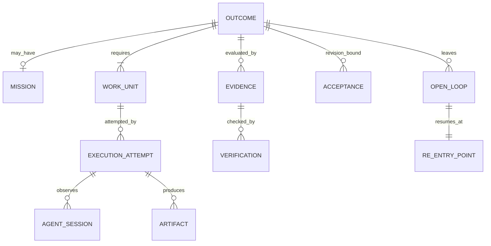
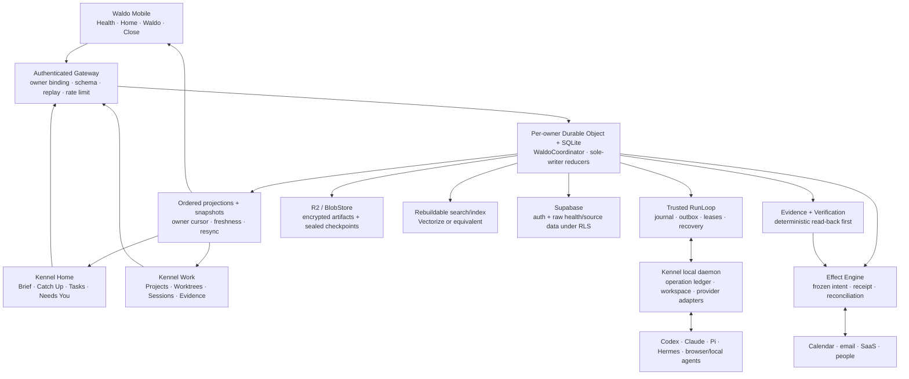

# Waldo Product and Architecture Convergence

**Status:** decision-ready product and target-architecture specification; implementation and operational proof remain separate
**Snapshot:** 2026-08-11
**Scope:** Waldo Cloud, Kennel, mobile, durable continuity, agent orchestration, Mission Control, execution, evidence, verification, privacy, and launch sequencing
**Pre-existing investigation ledger (read-only):** `waldo-brain/04-Sessions/weekly/2026-08-11-waldo-product-architecture-ledger.md`

This synthesis plus its three linked audits is the durable resumption artifact for the completed convergence. The Brain ledger was already untracked, changing work in another checkout, so this investigation preserved it instead of creating a competing writer or overwriting user-owned state.

## Revision record — Health First  and Kennel Home/Work

**Founder correction:** health is a strong Waldo wedge and the existing CRS, Form, Spots, Constellation, and related mobile experiences must be preserved and joined to agency. Kennel is one Electron application with a synchronized personal **Home** and an execution-focused **Work** surface inspired by Xirp's local custody model.

| Decision area | Previous convergence | After this correction |
| --- | --- | --- |
| Launch wedge | Delegated work reaches verified closure. | **Health-informed daily agency that can carry delegated work to verified closure.** Health is the entry wedge; durable responsibility and execution are the expansion spine. |
| Health product | Capacity was a supporting card; detailed health/readiness was deferred. | **Health First is retained at launch.** CRS, Form, Spots, Constellation, longitudinal health context, and care interventions remain first-class mobile capabilities. |
| Mobile Home | Outcome/judgment/closure-first redesign. | **Body + day + responsibility Home.** Health, calendar, commitments, Outcomes, Open Loops, and care proposals jointly shape Today, Brief, and Close. |
| Kennel definition | Primarily local execution/orchestration plus evidence/judgment UI. | **One Electron desktop with Home and Work.** Home renders the shared personal-agent projection; Work is the local execution/orchestration environment. |
| Kennel Home | Optional desktop rendering of brief/close. | **First-class synchronized surface** for Morning Brief, CRS/Form interpretation, Spots/Open Loops, tasks, calendar, meeting briefs, communication Catch Up, Needs You, and Daily Close. |
| Kennel Work | Outcome-first Mission Control with provider sessions underneath. | **Xirp-inspired local custody** for projects, worktrees, terminals, files, Codex/Claude sessions, rules/skills, and persistent recovery, wrapped by Waldo Outcomes, authority, evidence, verification, and Open Loops. |
| Cross-device sync | Mobile was the primary personal UI; Kennel mostly rendered work. | Mobile and Kennel Home consume the same cloud-owned `HomeProjection`; neither syncs a second task or health truth store to the other. |
| Health privacy | Kennel had no default health access. | Kennel Home receives only purpose-bound derived health/capacity projections by default; raw health remains inside the governed health boundary. |
| Launch exclusions | No health-first navigation. | No **health-only dashboard**, opaque readiness authority, diagnosis, fabricated intervention, or raw-health propagation. Health-first entry is explicitly allowed. |

> **Product flag — Health is recommended, not required.** Health First is a high-value Waldo surface and enhancement that should be offered and recommended to every user because consented body context can make planning, care, and agency substantially better. It must never be a prerequisite for using Waldo. A user who does not connect health—or later revokes it—still receives the complete core personal-agent and orchestration product: Home, calendar and communication context, capture, Outcomes, planning, Morning Brief, Kennel Work, agent execution, verification, Open Loops, and Daily Close. The product must degrade by omitting health-derived enhancement, never by disabling Waldo, inventing a readiness default, penalizing the user, or repeatedly pressuring them to connect health. Build around health as a differentiated optional capability, not as a category ceiling or architectural lock-in.

## Evidence contract

- **[Observed]** means supported by pinned local source/tests or a current first-party external source.
- **[Inference]** means the narrowest product or architecture implication consistent with observed evidence.
- **[Decision]** means the recommended target for the product now being built.
- **[Unknown]** means evidence is unavailable, private, contradictory, or not yet tested.
- A planning document establishes target direction, not shipped capability.
- `architecture_specified`, `contract_defined`, `module_implemented`, `adapter_conformance_passed`, `cross_surface_acceptance_passed`, and `operational_proof_passed` remain independent.

### Repository pins and authority

| Repository | Evidence pin used | Lineage warning |
| --- | --- | --- |
| `waldo-backend` | active `main@dd434e9` | A read-only `ls-remote` confirmed remote `main@dd434e9`; no live deployment inference follows. |
| `waldo-brain` | active local `main@d778402` | Remote `main` was `9f280abe` when checked. The local research commits and untracked convergence ledger were read-only evidence, not silently promoted to remote canonical truth. |
| `kennel` | canonical Electron `main@367c484` | A read-only `ls-remote` confirmed the remote pin. Per founder direction, Electron is the only implementation lineage used for product and build decisions. |
| `waldo-app` | active local `main@d9578e6`; remote `main@ed255869` as a separate evidence pin | A read-only `ls-remote` confirmed `main@ed255869`. Active HEAD is a source-empty scaffold and 66 commits behind its recorded remote. The richer Expo audit describes remote `main`, not the active checkout. Canonical implementation revision is **[Unknown]**. |

**[Decision]** Build Kennel on Electron `main`. Resolve the mobile revision before creating mobile implementation tickets. The keep/modify/rebuild dispositions identify reusable concepts, not authorization to merge branches or preserve unrelated implementations.

## Executive convergence

### The answer

> **[Decision] Waldo is the body-aware, durable, user-owned agent that helps a person plan within real human constraints and carries responsibility from intent to a verified, consciously accepted outcome across time, devices, people, and execution agents.**

The single strongest problem is not task capture or agent launching. It is **responsibility decay between intention and real-world closure**. Work is fragmented across conversations, calendars, people, coding agents, files, and services. Individual sessions can finish while the underlying responsibility remains partially true, unverified, blocked, waiting, or forgotten. Waldo owns that gap.

### What each surface is

- **Waldo Cloud** is the canonical continuity and authority root. It owns identity, Outcomes, policy, context compilation, schedules, judgments, evidence admission, verification, acceptance, Open Loops, and ordered projections.
- **Kennel Home** is the desktop personal-agent surface: the same Today, health-informed Brief, calendar, tasks, communication Catch Up, meeting preparation, Needs You, and Close that continue on mobile.
- **Kennel Work** is Waldo's trusted local execution and orchestration harness: projects, worktrees, terminals, provider sessions, artifacts, evidence, and consequential judgments. It owns device-local process and workspace durability, never canonical Outcome truth.
- **Mobile** is the body-aware, highest-frequency human connection: CRS, Form, Spots, Constellation, wearable context, capture, Today, Morning Brief, Needs You, corrections, receipts, and Daily Close. It is not a second runtime or truth store.
- **Claude, Codex, Pi, Hermes, browser agents, cloud agents, tools, and people** are replaceable executors. Their completion reports are observations.

### The abstraction decision

**[Decision] Do not create both a durable `Responsibility` aggregate and an `Outcome` aggregate.** The user-facing promise is a responsibility; the canonical durable object is `Outcome` because it states what must become true, under which constraints, with which evidence and acceptance conditions.

**[Decision] `Mission` is optional.** It is an inspectable plan container for a complex Outcome with multiple Work Units and dependencies. A simple Outcome must skip Mission ceremony.

```text
Outcome (the responsibility Waldo carries)
  ├─ optional Mission (reviewed plan)
  ├─ Work Unit(s) (bounded contributions)
  │    └─ Execution Attempt(s) / Agent Session(s)
  ├─ Artifact(s) + Effect Receipt(s)
  ├─ Evidence
  ├─ Verification
  ├─ Acceptance
  └─ Open Loop + Re-entry Point, until consciously resolved or released
```

### The launch wedge

> **[Decision] Launch Waldo as the body-aware personal agent that helps the user plan a realistic day and makes sure delegated work actually reaches verified closure.**

Health is the entry wedge because it gives Waldo permissioned context about capacity, recovery, and changing human constraints that generic personal agents and coding harnesses do not normally possess. Durable Outcomes and Kennel execution turn that context into agency instead of another score dashboard. The first undeniable loop is:

```text
mobile admits health/wearable context and computes or retrieves CRS/Form
→ Waldo explains what changed through Home, Spots, and Constellation
→ Home combines body state, calendar, communication, commitments, and Open Loops
→ user accepts or changes the proposed day
→ capture an Outcome on mobile or Kennel Home
→ delegate a bounded Work Unit to Kennel
→ execute through Codex or Claude
→ collect artifacts and deterministic evidence
→ ask only for consequential judgment
→ perform one reversible calendar effect
→ independently verify what became true
→ accept, reopen, or release
→ carry any surviving Open Loop into the next Morning Brief
```

This is narrower than the long-term product but exercises the full Waldo thesis. The committed broader product remains in scope; the wedge determines launch order and proof, not the ceiling.

## 1. Product definition

### One sentence

Waldo is the body-aware, durable personal agent that helps a person plan realistically and takes responsibility for an intended outcome until it is verified, accepted, reopened, or consciously released.

### One paragraph

Waldo understands what a person is trying to make true and what their current body, calendar, commitments, relationships, and work context can realistically support. It preserves those constraints, turns complex work into an optional Mission and bounded Work Units, delegates execution to local or cloud agents and people, monitors what happened, distinguishes claims from evidence, asks for judgment when authority or ambiguity requires it, verifies the result independently where possible, and carries unresolved consequences across devices and days. The person experiences one Waldo; Cloud, Kennel Home, Kennel Work, mobile, models, tools, and connectors are implementation placements beneath that relationship.

### One page

Waldo begins when the user says something like “Make sure this gets handled.” It captures the intended state, deadline, constraints, acceptance checks, and authority boundary. It may keep the input as a Capture, promote it to an Outcome after clarification, or attach it to an existing Outcome.

For simple work, Waldo creates one bounded Work Unit. For complex work, it proposes an optional Mission: a plan only to the current information frontier, with dependencies and explicit unknowns. The user can inspect or change the plan without learning the underlying orchestration machinery.

Waldo selects an eligible executor. Work tied to the user's computer goes through Kennel, which owns local files, worktrees, terminal processes, provider-native sessions, device credentials, and local recovery. Cloud-compatible work can later use a governed cloud workspace adapter. Every executor receives purpose-bound context, an explicit capability ceiling, budget, lease, fence, stop conditions, and required evidence.

During execution, Waldo records normalized observations rather than copying entire private transcripts into durable memory. A provider saying `done`, a process exiting, a commit appearing, or a message being sent does not complete the Outcome. Waldo admits attributable Evidence, runs the declared Verification recipe, then asks for Acceptance when policy requires human judgment. If the result is partial, ambiguous, stale, rejected, or waiting on another party, Waldo creates or updates an Open Loop with one exact Re-entry Point.

Morning Brief and Daily Close are not generated from unread counts or activity volume. They are projections over current Outcomes, commitments, judgments, evidence gaps, schedules, Open Loops, and consented health/capacity context. CRS, Form, Spots, and Constellation remain recognizable product experiences: they explain longitudinal body context and connect it to a proposed action. A standing Health First/care purpose is established explicitly during onboarding and remains revocable. Health may surface a care proposal or change a plan, but never creates hidden authority, diagnosis, or an irreversible action by itself.

The product earns autonomy progressively. It may observe and organize by default, suggest with an explanation, act under exact approval, and automate only narrow repeatable effects whose scope, expiry, revocation, reconciliation, and verification are understood. The user can inspect, correct, revoke, export, and delete the relationship state.

### Waldo is explicitly not

- only a health/readiness dashboard or diagnostic product;
- a todo list with generated priorities;
- a generic chatbot or one giant context window;
- a coding-agent launcher or terminal dashboard;
- an activity feed labeled Mission Control;
- a workflow canvas requiring enterprise ontology;
- an opaque behavioral/personality scorer;
- a system that equates provider completion with truth;
- an “everything agent” that gains arbitrary authority from a prompt;
- three separate agents for cloud, desktop, and mobile.

## 2. Canonical problem pools

| Rank | Problem | User behavior and workaround | Why current agents fail | Waldo mechanism | Primary surface |
| ---: | --- | --- | --- | --- | --- |
| 1 | Outcome ambiguity and follow-through failure | The user reopens sessions, checks diffs, asks “did this ship?”, and manually remembers downstream work. | A session's horizon ends before the human responsibility does. | Outcome, Evidence, Verification, Acceptance, Open Loop. | Today + Outcome detail |
| 2 | Responsibility fragmentation | Intent, promises, deadlines, constraints, and dependencies live across chat, calendar, notes, agents, and people. | Each tool sees its own object and loses the larger consequence. | Capture promotion, Outcome association, Commitment and dependency links. | Capture + Today |
| 3 | Body-context blindness and capacity mismatch | The user manually reconciles sleep, recovery, symptoms, stress, meeting density, and work demands—or ignores the mismatch until a plan fails. | Personal/work agents usually lack governed longitudinal body context; health products stop at scores and charts instead of safe agency. | CRS, Form, Spots, Constellation, provenance-bearing health context, and explained care/planning proposals. | Mobile Health + shared Home |
| 4 | Context reconstruction | Every day and every new executor starts by asking what happened and what matters. | Transcript history is noisy, provider-specific, and not purpose-bound. | Context Claims, decisions, artifacts, evidence, summaries with provenance, Re-entry Point. | Home Brief + Kennel Work |
| 5 | Execution fragmentation | The user coordinates terminals, browser work, SaaS tools, people, and retries manually. | Executors have no shared authority, lease, dependency, or completion contract. | Work Units, executor manifests, leases/fencing, normalized events. | Kennel Work |
| 6 | Open-loop accumulation | Blocked or partial work is mentally carried until forgotten. | Most systems have `done`, `failed`, or reminders, but no durable unresolved-consequence model. | Open Loop with owner, trigger, evidence gap, next action, and conscious release. | Home + Daily Close |
| 7 | Judgment overload | The user watches every session because they do not know when intervention matters. | Activity is surfaced instead of consequence, uncertainty, and reversibility. | Needs You policy and exact Judgment Requests. | Mobile + Kennel Needs You |

**[Decision]** The deeper common abstraction is **unresolved responsibility under changing context**. Intent, planning, execution, session fragmentation, follow-through, open loops, reconstruction, and capacity are different failure points in that lifecycle.

## 3. Competitive primitive matrix

The matrix compares product primitives, not feature counts.

| Reference | Strongest primitive | Missing or unsafe for Waldo | Waldo disposition |
| --- | --- | --- | --- |
| Waldo target | Consented longitudinal body context joined to daily planning, durable Outcome ownership, local execution, evidence, acceptance, and Open Loops. | Health foundations, product kernel, trusted RunLoop, mobile, and Kennel are not yet connected in one operationally proved loop. | **Build the Health First → Home → Work → verified closure vertical slice before breadth.** |
| Dimension | Connected workday loop: Morning Briefing, Catch Up, action, artifacts, recap. | No public durable Outcome/verification contract; product availability is time-bounded. | **Adapt** the daily loop and calm projections. |
| Folk | Persistent relational presence, editable memory, routines, messaging, cloud execution, Crew. | Memory provenance/authority and general verified completion are not public at Waldo depth. | **Adapt** relationship continuity; keep memory correctable and non-authoritative. |
| Poke | Messaging-native delegation, Recipes, MCP, event/API ingress, human fallback. | Broad command/integration access does not prove exact authority or effect reconciliation. | **Adapt** distribution and concise interaction; reject arbitrary JSON as trusted commands. |
| Paxel | Local multi-provider transcript analysis and cross-session behavioral/session patterns. | Builder scores and archetypes are not Outcome truth; excerpts and derived payloads cross privacy boundaries. | **Adapt** deterministic extraction and provenance; reject personality scoring and raw-upload defaults. |
| Agent Orchestrator | Dense parallel coding supervision, isolated worktrees, terminal control, CI/review feedback loops. | Repository/session/PR remains the work unit; current product is coding-specific. | **Adapt** Kennel supervision below Outcome truth. |
| Medley | Mission interview, reviewed DAG, per-task provider routing, parallel workers, steering. | Mission engine is proprietary; inherited host permissions/context are too broad for Waldo authority. | **Adapt** optional Mission and frontier planning; require Waldo leases and grants. |
| Spotify Xirp | Local multi-provider native-CLI custody, persistent terminals, project files/rules/skills, worktrees. | Provider semantics are not normalized; worktree isolation is not full execution isolation. | **Closest Kennel analogue. Adapt** custody and capability honesty. |
| Spotify Portal | Optional organizational catalog/Workspace context through permission-aware MCP. | Catalog ownership is not authorization; raw transcript upload is not redacted. | **Adapt** as an optional Context Adapter; never make it Waldo memory or authority. |
| Hermes | Provider-neutral personal harness, channels, schedules, memory/skills, subagents, remote execution. | Self-modifying memory/skills and provider judges can silently become truth. | **Adapt** harness portability; route learning through governed proposals and evals. |
| Pi | Small composable multi-provider agent runtime, state/tool loop, coding CLI. | Runtime primitives do not provide Waldo product semantics, authority, or closure. | **Adopt as an executor reference**, not the Waldo brain. |
| OpenClaw | Single-operator local assistant, many channels, tools, skills/plugins, device nodes. | Main-session tools can run on the host unless sandboxing is configured; local control plane can blur authority and execution. | **Adapt** channel/device composition; reject host access as implicit approval. |
| Cloudflare Agents/“OS” stack | Durable identity/state, real-time connections, schedules, recovery, Workflows, Sandbox, Browser, MCP. | Infrastructure runtime state is not Waldo Outcome truth, user ownership, or acceptance. | **Adopt selectively** behind Waldo-owned contracts. |
| MCP | Host-controlled capability negotiation and isolated client/server context exchange. | Capability advertisement is not safety conformance or authorization. | **Use for context/tool adapters**, not the Kennel control protocol or product state. |

### Spotify Xirp + Portal conclusion

**[Observed]** Xirp is a proprietary macOS beta composing native Claude Code, Codex, and Gemini sessions over local projects, terminals, worktrees, Git/files, rules, and skills. Portal is optional and supplies organizational catalog and Workspace context through MCP. Registered project content is not uploaded to Portal merely because a project is connected; native model providers retain their own data and network behavior.

**[Decision]** Adopt the two-plane pattern:

```text
Kennel = local execution custody plane
Waldo Context Adapters = optional personal/project/organization context planes
Waldo Cloud = identity, authority, Outcome, verification, acceptance, continuity
```

Reject raw transcript upload by default. The return path should be a classified evidence bundle containing decisions, artifacts, diffs, checks, unresolved items, and provenance. Full transcript sharing is exceptional, previewed, scoped, and redacted.

## 4. Minimal domain model

### Core objects

| Object | Purpose | Canonical owner |
| --- | --- | --- |
| `Outcome` | Desired real-world state, constraints, deadline, acceptance checks, current revision and disposition. | Waldo Cloud `OutcomeModule` |
| `Mission` | Optional reviewed plan for a complex Outcome. | Waldo Cloud `OutcomeModule` |
| `WorkUnit` | Bounded contribution with dependencies, required capabilities, stop conditions, authority ceiling, and evidence requirements. | Waldo Cloud `OutcomeModule` |
| `ExecutionAttempt` | One leased attempt to perform a Work Unit through an executor. | Waldo Cloud RunLoop |
| `AgentSession` | Provider-native session/process observation associated with an attempt. | Waldo Cloud RunLoop; local mechanics in Kennel |
| `Artifact` | Content-addressed produced object and provenance. | Waldo Cloud metadata; bytes through blob/workspace adapters |
| `Evidence` | Attributable candidate proof relevant to an acceptance check. | Waldo Cloud `EvidenceVerifier` |
| `Verification` | Result of an independent declared check: passed, failed, indeterminate, or stale. | Waldo Cloud `EvidenceVerifier` |
| `Acceptance` | Human or exact delegated-policy decision bound to Outcome revision and evidence digest. | Waldo Cloud `AcceptanceModule` |
| `OpenLoop` | Unresolved consequence that remains the user's/Waldo's responsibility. | Waldo Cloud `ContinuityModule` |
| `ReEntryPoint` | Exact next decision/action, required context recipe, evidence gap, artifacts, and cursor. | Waldo Cloud `ContinuityModule` |

### Supporting objects

| Object | Why it earns its place |
| --- | --- |
| `Capture` | Lets a thought exist without prematurely becoming a commitment or Outcome. |
| `Commitment` / `Schedule` | Represents time- or counterparty-bound responsibility independently of execution. |
| `JudgmentRequest` / `AuthorityGrant` | Separates human choice from executable permission. |
| `ContextClaim` | Stores correctable, provenance-bearing continuity rather than opaque memory blobs. |
| `HealthContextClaim` / `CareProposal` | Represents minimized CRS/Form-derived context and an explained, correctable proposed response without turning a health signal into authority. Raw samples remain outside the owner DO. |
| `HomeProjection` | Gives mobile and Kennel Home one revisioned view of body context, day plan, commitments, Catch Up, Needs You, and Open Loops without duplicate task or health stores. |
| `Event` | Preserves ordered audit/replay input and projection repair without making full rebuild-only event sourcing mandatory. |

### Terms deliberately not made separate canonical objects

- **Responsibility:** the user-facing relationship represented by an Outcome lifecycle.
- **Task:** UI language for a Work Unit where useful; no second task store.
- **Step:** executor-local plan detail unless it needs independent scheduling, authority, evidence, or dependency tracking; then it is a Work Unit.
- **Goal/Project:** optional organizational links/views, not mandatory ancestors of every Outcome.
- **Memory:** product capability composed from Context Claims, episodes, decisions, artifacts, and retrieval policy, not one undifferentiated row type.
- **Spots/Constellation:** retained Health First product experiences and projections over governed health/context contracts; this convergence does not replace them with generic task ontology or invent new semantics for them.

### Essential relationships



## 5. One durable Waldo agent

One durable agent does not mean one immortal model process or one giant prompt. It means one stable identity and responsibility ledger with replaceable reasoning/execution turns.

### Persisted identity and state

- owner identity and registered presences;
- current Outcome/Mission/Work Unit revisions;
- commitments, schedules, triggers, and attention policy;
- health consent/source state, derived Health Context Claims, care proposals, and their correction/decision history; raw health samples remain in the governed health store;
- user statements, corrections, provenance, and purpose-bound Context Claims;
- decisions, authority grants, revocations, and expiry generations;
- execution attempts, leases, fences, cursors, and normalized observations;
- artifacts, evidence, verification, acceptance, and effect receipts;
- Open Loops and exact Re-entry Points.

### Ephemeral working context

- a purpose-bound projection compiled for one reasoning or execution turn;
- the minimum necessary source excerpts and current state;
- provider-specific scratch state;
- executor-local workspace and process state;
- short-lived credentials represented to models only by brokered handles.

### Continuity loop

```text
event arrives
→ canonical reducer updates truth
→ projection identifies changed consequence
→ planner decides whether to wait, ask, schedule, or execute
→ bounded turn receives compiled context
→ executor produces observations and candidate evidence
→ verifier checks declared postconditions
→ acceptance/open-loop reducer records what remains
→ future presence resumes from ordered projection + exact re-entry
```

## 6. Product architecture



### Placement decisions

| Capability | Waldo Cloud | Kennel | Mobile | External executor |
| --- | --- | --- | --- | --- |
| Identity and canonical continuity | **Owns** | Registered presence | Registered presence | Never owns |
| Outcome/Mission/Work Unit truth | **Owns** | Proposes and renders | Captures and renders | Returns observations |
| Planning policy | **Owns** | Rich plan inspection/edit UI | Lightweight confirmation | May propose only |
| Personal/project context policy | **Owns** | Supplies local attributable sources | Supplies user/phone sources | Receives minimum projection |
| Local files, apps, terminals | References only | **Owns execution custody** | None | Acts through Kennel grant |
| Provider process lifecycle | Admits, leases, reconciles | **Owns local mechanics** | Shows projection | Owns native session only |
| Cloud execution workspace | Admits and tracks | Checkpoint/restore client | None | Adapter owns mechanics |
| Evidence admission/verification | **Owns** | Collects candidate evidence | Reviews/accepts | Supplies candidate evidence |
| External effects | **Owns intent/reconciliation** | Requests or executes local effects | Approves | Connector performs effect |
| Acceptance and closure | **Owns canonical record** | Rich review surface | Primary quick decision surface | Never owns |
| Home/Today projection | **Compiles and owns revision** | Full desktop Home/Catch Up rendering | Body-aware portable Home rendering | No role |
| Morning Brief/Daily Close | **Compiles** | **Primary desktop UI** | **Primary mobile UI** | No role |
| Health/CRS/Form/Spots/Constellation | Owns admitted derived projection and policy; raw source boundary remains separate | Displays purpose-bound derived Home context | **Collects, explains, and controls consent** | Excluded by default |
| Credentials | Broker/vault metadata | Device secrets where local | Secure token handles | Short-lived scoped handle only |

### Cloudflare decisions

- **Per-owner Durable Object + SQLite:** canonical launch authority root because access is owner-scoped, serialized, transactional, and cross-device.
- **No Mission/Outcome Durable Objects at launch:** they add cross-actor transactions and ordering before measured owner-root load requires partitioning.
- **Transactional current state + append-only domain events:** use events for audit, projection rebuild, and repair; avoid full rebuild-only event sourcing.
- **DO alarms:** owner-local scheduled wake-ups.
- **Queues:** at-least-once transport for deduplicated peripheral work and projection/index rebuilds; never a domain transition authority.
- **Workflows:** peripheral long waits or service processes only. Do not make Workflows the owner of Outcome, Effect, Acceptance, or Open Loop state.
- **R2:** encrypted artifact bytes, sealed workspace checkpoints, exports, and cold archive; SQLite retains canonical metadata.
- **Vectorize/AI Search:** rebuildable retrieval projection only.
- **AI Gateway:** provider routing, budgets, and private metadata with payload logging disabled for sensitive content.
- **Agents SDK/Think/Sandbox/Browser/Computer:** replaceable adapters. Their durable session state does not supersede Waldo's domain state.

## 7. Execution, session intelligence, and outcome verification

### Minimal lifecycle

The UI can present a compact lifecycle while internal aggregates remain separate:

```text
captured → clarifying → ready → active
active → waiting_user | waiting_external | review_needed | verification
verification → acceptance_pending
acceptance_pending → accepted | active(repair) | released
accepted → reopened
```

`blocked`, `cancelled`, `superseded`, and `released` are explicit terminal or suspended dispositions. “Completed” is reserved for provider/session observation or a done Work Unit; an Outcome is `accepted`, not merely `completed`.

### Agent execution protocol

```tex
1. OutcomeModule admits a ready Work Unit.
2. Coordinator selects an eligible executor manifest and context recipe.
3. RunLoop persists ExecutionRequest, lease, fence, budget, and cancellation generation.
4. Kennel persists operation_id + command_digest before spawning.
5. Provider emits native events; Kennel normalizes only the common lifecycle it can prove.
6. Reconnect begins with operation reconciliation and cursor exchange.
7. Session terminal state yields observations, artifacts, and candidate evidence.
8. EvidenceVerifier admits attributable evidence and runs declared checks.
9. AcceptanceModule records the user/delegated decision for an exact revision/digest.
10. ContinuityModule resolves or preserves the Open Loop and Re-entry Point.
```

### Local/cloud transport

**[Decision]** Use an authenticated WebSocket with hibernation for online command/event delivery, plus HTTP for registration, snapshot retrieval, large artifact negotiation, and recovery RPC. Every message has protocol version, stable ID, digest, owner-derived routing, causation/correlation, aggregate revision, and cursor.

- A lost acknowledgement triggers reconciliation, not duplicate start.
- One retry owner exists for each operation.
- Same ID/same digest returns the original disposition.
- Same ID/different digest hard-conflicts.
- Lease/fence changes quarantine late observations.
- A sleeping or disconnected laptop cannot receive new work.
- Protocol 0.1 permits only explicitly stale read-only projections while disconnected; no offline command/approval queue.
- MCP remains a tool/context adapter protocol, not the Waldo↔Kennel authority protocol.

### Session Intelligence pipeline

```text
provider-native session events
→ deterministic normalization
→ project/worktree/commit/test/artifact association
→ candidate intent and decision extraction
→ unresolved-item and blocker proposals
→ Outcome/Work Unit association with provenance
→ evidence bundle
→ declared verification
→ user correction/acceptance
```

Use deterministic extraction first:

- process/session IDs, timestamps, exit state, retries, and tool calls;
- git status/diff/commit/branch/worktree;
- test command, exit code, and structured report;
- PR/deployment/provider receipts;
- artifact path, hash, media type, and provenance;
- file changes and external read-back.

Use LLM reasoning only for candidate intent, semantic decisions, blocker summaries, acceptance-check suggestions, and unresolved questions. Store those as proposals with source links and confidence. User statements and corrections win.

### Three completion truths

| Truth | Example | Can close Outcome? |
| --- | --- | --- |
| Provider claim | “Done”, process exit, task status finished. | No |
| Execution evidence | Diff, tests, artifact, sent-message receipt, calendar operation receipt. | No |
| Verified and accepted Outcome | Independent checks pass and acceptance is recorded for exact revision/evidence. | Yes |

If no independent verifier exists, Verification is `indeterminate`. Waldo presents the limitation and asks the user; it does not silently upgrade a self-report.

### Event model

Minimum domain events:

```text
capture.recorded
health.source_status_changed
health.context_claim_updated
care.proposal_created
care.proposal_decided
home.plan_proposed
home.plan_decided
brief.completed
outcome.created
outcome.clarified
outcome.activated
mission.proposed
mission.approved
work_unit.created
work_unit.ready
execution.requested
execution.accepted
session.observed
judgment.requested
judgment.answered
authority.issued
artifact.offered
evidence.admitted
verification.requested
verification.resolved
effect.intent_recorded
effect.receipt_recorded
effect.reconciliation_resolved
acceptance.recorded
outcome.reopened
open_loop.created
open_loop.updated
open_loop.resolved
outcome.released
projection.published
```

Events are content-minimized and reference encrypted artifacts where payload erasure is required. They are not a license to retain raw transcripts, health values, credentials, or private source bodies indefinitely.

## 8. Final product surfaces

### Waldo Mobile

| Surface | Purpose | Shows | Actions | Backend requirement | Launch |
| --- | --- | --- | --- | --- | --- |
| **Home / Today** | Body-aware personal-agent home. | CRS/Form interpretation, relevant Spots and Constellation, Morning Brief, calendar, active Outcomes, Needs You, commitments, care proposals, and surviving Open Loops. | Capture, approve/change plan, inspect why health changed it, snooze/release, open Outcome, ask Waldo. | Shared `HomeProjection`, health-derived evidence, attention policy, schedule/Open Loop. | Must |
| **Health / Body** | Preserve the Health First wedge and longitudinal understanding. | Existing CRS, Form, Spots, Constellation, wearable trends, explanations, confidence/freshness, and relevant care interventions. | Inspect, correct, grant/revoke consent, add context, accept/dismiss a care proposal. | Health ingestion/computation, consent/RLS, provenance, derived projection, truthful degraded states. | Must |
| **Waldo** | Conversation and capture across life/work. | Current thread plus attributable Outcome/context references. | Ask, clarify, correct, promote Capture. | Conversation projection, context compiler, command gateway. | Must |
| **Outcome** | Understand whether the responsibility is actually true. | Intended state, current plan, evidence, verification, artifacts, remaining Open Loop. | Accept, reopen, request repair, release. | Outcome/Evidence/Acceptance projections. | Must |
| **Needs You** | Consequential decisions only. | Exact choice, why now, risk, reversibility, affected digest, expiry. | Approve/deny/edit/ask. | Judgment/Authority module. | Must; embedded in Today first |
| **Daily Close** | Conscious closure and tomorrow handoff. | Accepted, progressed, blocked, slipped, released, and exact re-entry. | Accept corrections, reschedule, release, ask. | Close projection over Outcomes/Open Loops. | Must |
| **Waldo Knows** | Inspect and correct continuity. | Context Claims, source, freshness, purpose, correction/deletion state. | Correct, forget, revoke source, export. | Continuity/portability/deletion. | Should |
| **Settings & Privacy** | Make the trust boundary understandable. | Connections, data classes, model destinations, retention, devices, export/delete. | Revoke, reconnect, export, delete. | Policy, audit, portability. | Must |

Health/Body remains an accessible first-class mobile destination because it is the wedge, not a buried capacity card. Missions, Sessions, Open Loops, Calendar, Memory, and Approvals remain contextual views within Home, Outcome, Waldo, and Settings until use proves a dedicated destination is necessary. The exact existing semantics of Spots and Constellation remain source authority; this convergence joins them to agency rather than renaming them speculatively.

### Kennel Desktop

| Surface | Purpose | Shows/actions | Launch |
| --- | --- | --- | --- |
| **Home** | Desktop continuation of the same personal Waldo. | Health-informed Morning Brief, Today plan, CRS/Form interpretation, relevant Spots/Open Loops, tasks, calendar, meeting briefs, communication Catch Up, Needs You, and Daily Close; approve/change/respond/open exact source. | Must |
| **Work** | Xirp-inspired local custody under Outcome truth. | Projects, repositories, files, worktrees, terminals, rules/skills, Codex/Claude sessions, active Outcomes, optional Mission graph, Work Units, dependencies, blocked/waiting/review states; assign/start/pause/steer/cancel. | Must |
| **Needs You** | Rich judgment and evidence review. | Diff/artifact/effect preview, uncertainty, authority scope, acceptance controls. | Must |
| **Outcome Detail** | Full local-to-cloud responsibility trace. | Context sources, sessions, artifacts, evidence, checks, decisions, Open Loop and re-entry. | Must |
| **Sessions** | Provider-native operator drill-down. | Terminals, worktrees, process state, native controls, logs, usage. | Must, secondary |
| **Computer** | Local capability and permission custody. | Repositories, workspaces, agent versions, credentials/permissions status, adapters. | Must, settings-level |
| **Shelf** | Artifact handoff and inspection. | Files, previews, hashes, provenance, export/open. | Should |

Home and Work are two modes of one Electron Kennel, not separate products or identities. Both consume cloud-owned projections. Home never reads a separate mobile task database, and Work never promotes provider state to Outcome truth. “Mission Control” represents Outcomes and unresolved consequence; `Sessions` remains a drill-down for operators who need it.

### Waldo Cloud

Cloud has no primary consumer dashboard at launch. Its visible surfaces are projections and receipts consumed by mobile/Kennel:

- shared mobile/Kennel Home, Health First interpretation, Morning Brief, Catch Up, and Daily Close;
- Work board and Outcome detail;
- Needs You;
- evidence and effect receipts;
- continuity/privacy/export/delete;
- system health only for operators, with content-minimized telemetry.

## 9. Interaction model

### Morning

Mobile Home and Kennel Home render the same revisioned brief assembled from consented CRS/Form and relevant Spots/Constellation, current commitments, Outcomes, communication changes, judgments, schedule, and surviving Open Loops. Mobile uses a compact sequence; Kennel may use a split view with the synthesized day on the left and source-specific Catch Up on the right. Health context is visible when it materially explains the plan, not reduced to a decorative score.

> Your recovery is below your normal range and you have six meetings. I protected 10:00–11:30 for the launch specification and moved two low-consequence tasks. Two implementation Work Units can run in Kennel Work while you are in meetings. The onboarding fix still needs your acceptance; tests and the preview are ready.

Actions: **Why this plan? · Approve plan · Change plan · Start eligible agents · Catch Up · Review onboarding fix · Ask Waldo**. “Finish Briefing” records accepted, changed, and dismissed proposals; it does not merely close the screen.

### During work

User: “Get the onboarding bug fixed before tonight.”

Waldo associates or creates the Outcome, confirms the acceptance check, creates one Work Unit, leases it to Kennel Work, and chooses an eligible provider. Work opens the relevant project/worktree/session environment while preserving the Outcome and remaining consequence above provider activity. Kennel collects diff/test/build/preview evidence. Waldo interrupts only for ambiguity, changed scope, authority, or acceptance; Kennel Home and mobile show the same canonical `Needs You` item.

### Evening

> Five responsibilities were accepted. The onboarding fix passed its declared checks and you accepted the preview. The investor memo is waiting for your review. App Store screenshots remain blocked by the new build; tomorrow's Re-entry Point is the screenshot checklist after QA finishes. One low-value reminder was released.

Daily Close is a correction and closure ritual, not a performance score.

## 10. Existing system audit

### Waldo Backend

| Existing surface | Disposition | Reason |
| --- | --- | --- |
| Authenticated owner-derived routing and per-owner DO | **KEEP + HARDEN** | Correct canonical authority shape; needs multi-presence and operational proof. |
| `WaldoCoordinator` and Outcome/Mission/Work Unit capture/planning | **MODIFY** | Extend beyond capture and zero-tool planning into admitted execution/evidence/acceptance. |
| Trusted RunLoop journal/outbox/recovery/effect patterns | **KEEP** | Strong execution substrate; bridge it to product state rather than create a third runtime truth. |
| Planning-only Work Unit state | **MODIFY** | Add supported execution, evidence, verification, repair, and terminal dispositions with tests. |
| Memory/context interfaces | **MODIFY/COMPLETE** | Preserve fail-closed seams; implement provenance, correction, purpose, retention, and retrieval. |
| Health First foundations and local CRS/Form path | **KEEP + COMPLETE** | Health is the mobile entry wedge. Join consented ingestion, production computation, provenance, Spots/Constellation, Home projections, and care actions through admitted capability manifests without treating existing contracts as live proof. |
| Worker/OpenAPI route drift and time-dependent authorization fixtures | **REBUILD/FIX BEFORE CLAIMS** | Contract and deterministic-test truth must match runtime. |

### Kennel

This table describes only canonical Electron `main@367c484`. Its README, source, fixtures, and recorded acceptance artifacts establish the implementation inventory; plans and self-description remain below current verification evidence.

| Existing surface | Disposition | Reason |
| --- | --- | --- |
| Local daemon, authenticated socket, SQLite WAL, App Server supervision | **KEEP** | Valuable local custody and recovery foundation. |
| Worktrees, files, terminals, Take Control, provider process discovery | **KEEP + CONFORM** | Core Kennel value; declare isolation and provider-version capabilities honestly. |
| Codex-only integration | **MODIFY** | Keep provider-native details behind a minimum `ProviderAdapter`; add Claude next. |
| Local Outcome/Mission/Work Unit database | **MIGRATE** | Becomes proposal/cache after backend cutover; never a second canonical writer. |
| Outcome/Mission Work surface with session/delivery lanes | **MODIFY/REBUILD PRIORITY** | Preserve real Outcome, Mission DAG, exact attention, and worker controls; make Evidence, Verification, Acceptance, and remaining consequence primary. |
| Session Review / Insights regex scores and archetypes | **REMOVE/REBUILD** | Replace with evidence-bearing Session Intelligence and user-correctable proposals. |
| GitHub/review/preview/recovery adapters | **KEEP + PROVE** | Real source and tests exist, but local adapter evidence does not establish cloud-authorized or production acceptance. |

### Waldo Mobile

The reusable foundations below were observed in the recorded `origin/main@ed255869` lineage. They are absent from the active `d9578e6` checkout, which contains no application source. “Keep” therefore means evaluate for reuse after choosing a canonical revision; it does not describe the active checkout as product-capable.

| Existing surface | Disposition | Reason |
| --- | --- | --- |
| Expo/RN shell, PKCE/SecureStore, native calendar/health readers, SQLCipher gates | **KEEP** | Useful shipping and privacy foundations after boundary review. |
| Health-first Home, CRS, Form, Spots, and Constellation | **KEEP + JOIN TO AGENCY** | Preserve the established health wedge and visual/product language; combine it with calendar, commitments, Outcomes, Open Loops, explanations, and care actions in Home. |
| Fabricated moved meetings, sent briefings, memory counts, chat replies, receipts | **REMOVE IMMEDIATELY** | False state is incompatible with the trust promise. |
| App-owned Cloudflare DO runtime and direct internal Supabase reads | **REMOVE/MIGRATE** | Mobile becomes a presence over the canonical Waldo backend. |
| Planning/tasks/Missions/approvals as cosmetic state | **REBUILD ON PROJECTIONS** | No local imitation of canonical truth. |
| Detailed health/readiness and longitudinal experience | **KEEP + VERIFY** | It leads the personal-agent wedge, but every metric, intervention, and derived claim must have live ingestion/computation, provenance, consent, degraded states, and app-to-response proof. |

## 11. Human trust and privacy model

### Progressive autonomy

| Level | Default actions | Requirement |
| --- | --- | --- |
| Observe | Read permitted state, summarize, classify candidate context/evidence. | Purpose, provenance, data minimization. |
| Suggest | Propose a plan, schedule change, Work Unit, or memory correction. | Explanation, alternatives, easy correction. |
| Approve | Run agents, modify files, change calendar, draft external communication. | Exact scope/digest, expiry, revocation, reconciliation. |
| Automate | Repeat a narrow reversible action under policy. | Proven conformance, bounded frequency/budget, audit, independent verification, kill switch. |

Always require fresh explicit judgment for sending consequential messages, production deploys, purchases, form submissions, deletions, credential changes, public publishing, and irreversible external actions unless the user created a narrowly scoped delegated policy that explicitly covers the exact action class.

### Privacy boundaries

- Raw health values remain in Supabase under per-user RLS and do not enter DO SQLite, logs, traces, evals, or model prompts.
- Mobile health storage uses SQLCipher. Health-derived capacity statements are minimized, consented, correctable, and purpose-bound.
- Kennel Home receives the shared derived projection—interpretation, freshness, provenance reference, confidence, and why it changed a proposal—not unrestricted raw samples by default. Kennel Work receives no health context unless the current Work Unit's explicit purpose and grant require a minimized constraint.
- Mobile and Kennel never synchronize health, tasks, briefs, or approvals directly with each other; both reconcile ordered cloud projections so revocation, correction, and account switching remain authoritative.
- Raw agent transcripts and unrestricted local file contents stay local by default.
- Credentials stay in Supabase Vault, device keychain, or a broker; models receive short-lived handles, never secret values.
- Context compilation declares purpose, audience, destination, source, data class, freshness, expiry, and digest.
- Work and personal sources do not mix merely because the same Waldo owns both; the purpose-bound projection decides disclosure.
- Events and telemetry are content-minimized. High-cardinality identifiers and private paths do not become metrics labels.
- Export, correction, revocation, deletion, and restore-without-resurrection are product flows, not backend runbooks only.
- “User-owned” means inspectable, correctable, portable, revocable, and deletable. Do not claim operator-inaccessible encryption without a proved user-held-key protocol.

## 12. Build plans

### Backend

| Priority | Module / contract | Implementation decision | Dependency and proof |
| ---: | --- | --- | --- |
| P0 | Responsibility-to-execution bridge | One admitted command atomically records Work Unit execution request through existing RunLoop. | v0.x shared fixtures; no provider completion can mutate Outcome truth. |
| P0 | Evidence/Verification/Acceptance/Open Loop | Add sole-writer reducers, schemas, events, projections, invalid transitions, stale-digest behavior. | Execution bridge; deterministic checks and user acceptance fixture. |
| P0 | Kennel protocol | Versioned register/start/resume/steer/pause/cancel/reconcile/event contracts with lease/fence/cursor. | Shared fixtures in backend and Kennel. |
| P0 | Multi-presence gateway/projections | Owner-bound registrations, ordered cursor, snapshots, gap/account-switch handling. | Identity routing; mobile/Kennel conformance. |
| P0 | Health First production path | Join consent/RLS ingestion, CRS/Form computation, provenance/freshness, Spots/Constellation projection inputs, and care-proposal policy without leaking raw values into agent/runtime logs. | Real device/source fixtures, health-data review, privacy mutation tests, app-to-projection acceptance. |
| P0 | Shared Home projection | One revisioned projection for mobile and Kennel Home: health interpretation, Today plan, calendar, tasks/commitments, Catch Up candidates, Needs You, and Open Loops. | Multi-presence ordering, purpose-bound context, truthful source/degraded state. |
| P0 | Effect family | Reversible Google Calendar create/update with client-generated ID, frozen intent, read-back, and terminal ambiguity. | OAuth/scopes decision and test tenant. |
| P1 | Context/continuity | Context Claims, corrections, purpose-bound compiler, Open Loop/Re-entry projections. | Privacy/deletion tests. |
| P1 | Morning Brief/Daily Close | Deterministic projection recipe plus restrained LLM narrative. | Today/Open Loop/Commitment truth. |
| P1 | Artifact/blob/checkpoint | Content-addressed metadata in DO; encrypted bytes through BlobStore/R2. | Deletion and integrity conformance. |
| P2 | Additional connectors/providers | Add only through manifests and real fault-injected conformance. | First loop accepted and adapter gate stable. |

Migration is additive. Keep the existing trusted RunLoop and effect proof routes until the new bridge has stronger conformance. Do not dual-write canonical Outcome truth. Preserve historical receipts and acceptance across rollback.

### Kennel

1. Consume released backend fixtures; remove handwritten parallel DTO authority.
2. Add authenticated presence registration, capability manifest, projection snapshot/cursor client, and reconnect reconciliation.
3. Add Electron **Home** backed by the shared `HomeProjection`: Brief, Today, derived CRS/Form interpretation, relevant Spots/Open Loops, tasks, calendar, meeting briefs, communication Catch Up, Needs You, and Close.
4. Make Home display only purpose-bound derived health context by default; consent and detailed/raw health inspection remain controlled from mobile/health surfaces.
5. Persist local operation intent before process spawn; enforce stable digest, lease, fence, and cancellation generation.
6. Shape Electron **Work** around Xirp's useful custody primitives—projects, files, terminals, worktrees, provider-native sessions, rules/skills, and recovery—while retaining Waldo Outcomes and authority above them.
7. Wrap the current Codex App Server path in the minimum real `ProviderAdapter` contract without hiding provider-native capabilities.
8. Add Claude Code as the second adapter to prove the seam; do not claim parity where lifecycle/permission semantics differ.
9. Normalize session events and collect deterministic artifacts/evidence without uploading raw transcripts by default.
10. Rebuild Work/Mission Control around backend Outcomes and Needs You; keep Sessions as operator drill-down.
11. Migrate local product records into explicit proposals or a stale read-only cache; remove second-writer behavior.
12. Prove app close, reboot, daemon crash, provider crash, credential rotation, version mismatch, laptop sleep, reconnect, duplicate command, late-event, and cross-device Home cursor cases.

### Mobile

#### Must ship

- canonical backend onboarding and registered presence;
- consented Health First onboarding plus truthful ingestion/source state;
- existing CRS, Form, Spots, Constellation, and longitudinal health experiences joined to explanations and agency;
- body-aware Home/Today with real Morning Brief, calendar, active Outcomes, Needs You, care proposals, and Open Loops;
- Waldo conversation/capture and correction;
- Outcome detail with evidence, verification, accept/reopen/release;
- push notifications for consequential judgment and verified-ready outcomes;
- Daily Close;
- privacy/connections/export/delete baseline;
- truthful loading, stale, offline, empty, and error states.

#### Should ship

- voice capture;
- inspect/correct “Waldo Knows”;
- calendar/day-plan editing;
- artifact preview/share;
- deeper trend inspection and derived-capacity explanations beyond the launch Health First loop.

#### Later

- broad connector catalogue;
- social/cross-person delegation;
- cloud computer control;
- capability marketplace;
- rich project/mission management views better suited to Kennel.

## 13. Brutally prioritized launch product

### Onboarding

1. Create/sign in to one Waldo identity.
2. Explain Health First consent, sources, derived claims, model destinations, and what will never be shared by default.
3. Connect one supported health source and render the first truthful CRS/Form/Spots/Constellation state, including unavailable or insufficient-data states.
4. Connect calendar and show the first body-aware Home/Today proposal.
5. Register one Kennel Mac and one current coding provider.
6. Explain the trust ladder with concrete personal and work examples.
7. Ask for one responsibility the user genuinely needs handled this week.

### First five minutes

- The user sees one attributable health/body insight and how it changes—or deliberately does not change—the proposed day.
- The user captures an Outcome in natural language from mobile Home or Kennel Home.
- Waldo reflects the intended state, deadline, constraints, and one acceptance check.
- The user confirms or edits it.
- Waldo shows whether it can act now, what will remain local, and when it will ask again.
- If executable, the first Work Unit is leased to Kennel.

### Day 1

- Mobile Home and Kennel Home show the same revisioned Brief, tasks/commitments, Needs You, and Open Loops at their respective densities.
- One consented health/capacity change produces an explained, correctable planning or care proposal.
- Kennel runs one real provider session.
- Waldo returns an artifact/evidence bundle, not an activity summary.
- The user resolves one Needs You judgment.
- One reversible calendar effect is written and read back.
- The user accepts, reopens, or releases the Outcome.

### First Morning Brief

Shows no more than:

- the one to three Outcomes that change today's choices;
- the attributable CRS/Form or Spot/Constellation change that materially affects the plan;
- consequential Needs You items;
- schedule/commitment conflicts;
- agent work that can proceed without attention;
- surviving Open Loops with exact re-entry;
- health/body context only when it explains a proposal, care intervention, or relevant constraint.

### First completion loop

The product must visibly distinguish:

```text
agent says done
→ evidence collected
→ verification passed/failed/indeterminate
→ user accepted/reopened/released
```

### First Daily Close

The user sees what became true, what did not, why, what remains, and exactly where tomorrow resumes. No gamified score and no fabricated “productive day” narrative.

### Launch exclusion list

- no generic agent marketplace;
- no dozens of connectors;
- no activity-heavy analytics;
- no personality/archetype scoring;
- no autonomous external sends/deploys/purchases;
- no raw-transcript cloud memory;
- no health-only dashboard detached from agency;
- no opaque readiness authority, diagnosis, fabricated health intervention, or raw-health propagation into Kennel Work/model logs;
- no second canonical task/outcome store;
- no unsupported offline commands;
- no claim of “fully autonomous” or “everything agent.”

## 14. Phased roadmap as proof gates

The committed whole-product envelope remains intact. These phases are maturity and rollout gates, not excuses to create incompatible product slices.

### Phase 0 — Truth and contract foundation

Observable exit:

- false mobile state removed;
- Health First contracts are classified against real ingestion/computation/runtime evidence; existing CRS, Form, Spots, and Constellation experiences are preserved while unsupported states are made truthful;
- backend route/OpenAPI and deterministic-test drift fixed;
- responsibility→RunLoop bridge specified and fixture-backed;
- Evidence/Verification/Acceptance/Open Loop contracts published;
- Kennel operation/reconnect protocol shared;
- one canonical writer per aggregate documented and enforced.

### Phase 1 — Internal founder dogfood

Observable exit:

- one real consented health source produces a provenance-bearing derived Home projection without leaking raw values into agent logs or Kennel Work;
- mobile Home and Kennel Home render the same revisioned Brief and record the same accepted/changed/dismissed plan decisions;
- one real Outcome crosses mobile/Kennel/backend;
- one Codex or Claude session executes under lease/fence;
- evidence bundle is generated;
- one calendar mutation survives apply-then-timeout without duplication;
- user accepts/reopens/releases;
- next-day Re-entry Point is correct after laptop sleep/restart.

### Phase 2 — Private alpha

Observable exit:

- two provider adapters pass declared conformance;
- mobile Health/Home, Needs You, Outcome, and Close plus Kennel Home/Work operate with truthful degraded states;
- reconnect/account switch/revocation/deletion tests pass;
- false-completion and user-review burden are measured;
- users repeat the responsibility loop weekly without being trained on the architecture.

### Phase 3 — Public launch

Observable exit:

- onboarding reliably reaches first accepted Outcome;
- Health First onboarding reliably reaches a useful, explained Home proposal without diagnosis, opaque authority, or unsupported personalization;
- operational recovery, privacy, deletion, cost, rate-limit, and rollback proof passes;
- Morning Brief and Daily Close reduce reassembly rather than create another feed;
- support and incident paths are ready;
- public claims match demonstrated proof levels.

### Phase 4 — Expansion

Add admitted connector families, voice/messaging presences, cloud workspace continuation, behavior packages, human/cross-agent delegation, and broader life/work Outcomes. Each expansion reuses the same Outcome, authority, evidence, acceptance, and Open Loop spine.

## 15. Critical questions resolved

| Question | Decision |
| --- | --- |
| What is Waldo? | One body-aware, durable, user-owned agent that plans within real human constraints and carries responsibility to verified and accepted outcome. |
| Strongest problem? | Responsibility decay between intent, fragmented execution, and real closure. |
| Why durable? | Responsibilities outlive sessions, devices, laptop uptime, providers, and daily context. |
| Abstraction above sessions? | Canonical Outcome; responsibility is its user-facing contract. |
| Is Mission correct? | Yes for complex Outcomes, optional and never the atomic truth object. |
| What is Kennel? | One Electron desktop with synchronized personal-agent Home and Xirp-inspired local execution Work. |
| What belongs in Cloud? | Canonical identity/state, admitted derived health context, shared Home projection, policy, planning, timers, sync, evidence, verification, acceptance, and Open Loops. |
| What belongs locally? | Files, terminals, apps, worktrees, provider-native sessions, device credentials, local process recovery. |
| What belongs in mobile? | Health First consent and experiences—CRS, Form, Spots, Constellation—plus Home/Today, capture, Brief, Needs You, correction, receipt, acceptance, and Close. |
| How know finished? | Declared postconditions → attributable Evidence → independent Verification → exact Acceptance. |
| How understand sessions? | Deterministic event/artifact extraction first; LLM proposals with provenance and correction second. |
| Concurrent execution? | Dependency-aware Work Units, eligible executor manifests, leases/fencing, bounded child authority, normalized events. |
| Canonical state model? | Separate Outcome, Work Unit, Session, Effect, Evidence, Verification, Acceptance, and Open Loop lifecycles. |
| Minimum backend? | Per-owner DO/SQLite, gateway, Health First derived-context path, shared Home projection, coordinator, RunLoop bridge, Kennel protocol, verification/acceptance/Open Loop, and one effect family. |
| Delete which surfaces? | Fabricated mobile states, app-owned duplicate runtime, Kennel archetype scores, dead/unwired capability claims. |
| Fundamentally redesign? | Join mobile Health/Home to agency; add synchronized Kennel Home; refocus Work/Mission Control and Session Intelligence; complete memory correction and multi-presence sync. |
| Mission Control represents? | Outcomes, consequence, Work Units, evidence, judgments, and remaining Open Loops; sessions are drill-down. |
| Morning experience? | One explained proposal from body context, calendar, communication, commitments, Outcomes, and Open Loops—not a score, activity feed, or unread-volume summary. |
| During-work experience? | Delegate, monitor silently, interrupt on consequence/ambiguity, return verified-ready work. |
| Evening experience? | Conscious accept/reopen/release and exact tomorrow re-entry. |
| Launch wedge? | Health-informed daily agency that can carry delegated work to verified closure. |
| Why not Dimension + AO + Codex? | Those systems split body context, daily planning, session supervision, execution, authority, and closure; Waldo makes one health-informed Home and Outcome/continuity spine canonical across them. |
| Defensibility? | Consented longitudinal body and life context, accepted Outcome/evidence history, trusted executor protocol, verification recipes, and earned autonomy policy compound together. |
| What ships first honestly? | One truthful Health First → shared Home plan → delegated local execution → verified/accepted Outcome → next-day re-entry loop. |

## 16. Hypotheses, falsifiers, and decision-changing evidence

| Preferred hypothesis | Falsifier | Action if falsified |
| --- | --- | --- |
| Outcome-first orchestration reduces user burden. | Users still inspect raw sessions as often or spend more time defining Outcomes than they save. | Narrow capture contract, automate evidence collection, or retreat to a focused supervision product. |
| One Waldo across Home and Work is trusted. | Users consistently separate identities because context mixing feels unsafe or irrelevant. | Preserve one backend kernel but expose explicit, independently permissioned personal/work domains. |
| Independent verification is worth latency/cost. | It does not reduce false completion, review time, or repair cost. | Restrict verification to high-consequence or deterministic checks and disclose confidence. |
| Morning Brief reduces reconstruction. | It becomes another ignored feed or hides consequential items. | Reduce cadence/density and show only state changes requiring a decision. |
| Per-owner DO remains the correct authority root. | Measured hot-owner load, storage, latency, or active-session density breaches targets after compaction/snapshots. | Partition behind a new single-writer design while preserving owner-ordered truth. |
| Kennel can support a real provider seam. | Adding Claude after Codex requires rewriting Outcome/authority/evidence semantics. | Redesign the provider Interface before adding more adapters. |
| Health First is a strong entry wedge. | Users inspect CRS/Spots/Constellation but do not return for planning, accept care proposals, or connect them to meaningful action. | Preserve health utility but narrow the launch claim; test a more specific care loop instead of treating the dashboard as agency. |
| Health-informed agency improves plans and trust. | It changes agendas without understandable causality, feels controlling/diagnostic, or performs no better than calendar/commitment context alone. | Require explicit standing purpose and explanations; constrain automatic use to validated signals, or make the signal user-invoked. |
| Kennel Home creates one continuous Waldo. | Users treat it as a duplicated mobile dashboard or its communication/health context distracts from work. | Preserve the shared projection but reduce desktop Home to briefing, Catch Up, Needs You, and re-entry rather than creating another management surface. |

## 17. Verification and evidence status

### Observed in the current investigation

- Backend source contains responsibility handshake fixtures v0.1/v0.2, planning-turn fixtures v0.3, `WaldoCoordinator`, `OutcomeModule`, planning execution state, and the older trusted RunLoop/effect substrate.
- Health First has preserved consent/RLS, CRS/Form, derived-source, safety, and Morning Brief foundations in the broader Waldo evidence set; current production ingestion, computation, Spots/Constellation-to-Home projection, care-action runtime, and app-to-response acceptance remain unproved.
- The durable product path currently stops at capture and zero-tool planning authorization; the target execution/evidence/acceptance loop is not operationally proved.
- Kennel's canonical product/runtime lineage is Electron `main@367c484`; all Kennel conclusions and build recommendations now use that lineage exclusively.
- Waldo mobile's active checkout is a source-empty scaffold 66 commits behind its recorded remote; richer Expo/mobile findings belong to that recorded remote lineage, not active HEAD.
- Current Waldo Brain contains the product architecture ledger and a dedicated current Spotify Xirp + Portal public-source dissection.
- Current official comparator sources still support the key primitives, while several repositories have materially advanced since the August 4 pins.

### Unverified or not claimed

- No production deployment or live cross-surface acceptance was tested in this investigation.
- The founder-provided Home/Catch Up screenshot is an interaction reference for synthesis plus source-specific action, not evidence that Waldo currently implements that surface.
- No branch switch, merge, rebase, or fetch was performed. Kennel's Electron authority comes from explicit founder direction plus the confirmed remote `main`; mobile lineage selection remains unresolved.
- No Xirp beta binary, private tenant, proprietary source, network trace, or decompilation was used.
- Cloudflare product availability does not prove Waldo integration or operational suitability.
- Current external repository HEADs are research pins, not admitted dependency versions.
- Customer demand, retention, willingness to pay, and burden reduction remain product hypotheses requiring dogfood and alpha evidence.

### Checks run

- All four new reports passed an explicit untracked-file whitespace check using `git diff --no-index --check`.
- `npx -y pnpm@10.34.4 verify:guards` passed every repository guard plus 11 guard tests after the synthesis was complete.
- The backend audit separately passed 1,475 contract tests and runtime typecheck. Its targeted runtime selection passed 89 tests and failed 7; all seven failures used a session expiry fixed at 2026-08-08, so current `main` is not reported as fully green.
- Canonical Electron Kennel passed typecheck, lint, and build in an isolated export. Its test suite passed 83 of 85 tests: installed Codex conformance failed closed on a version mismatch, and the PTY shell test failed to spawn in the isolated export. No live UI/provider mutation, packaging, signing, or production acceptance was performed.
- Mobile was source-audited only. No build, app launch, mutation path, device acceptance, or branch reconciliation was performed.

## 18. Source register

### Waldo

- [Architecture lock](./WALDO_ARCHITECTURE_LOCK_AND_WHOLE_PRODUCT_BUILD_DIRECTION_2026-08-05.md)
- [Final Home + Work backend architecture](./WALDO_FINAL_HOME_WORK_BACKEND_ARCHITECTURE_PLAN_2026-08-04.md)
- [Product capability matrix](./WALDO_PRODUCT_CAPABILITY_MATRIX_AND_THESIS_VALIDATION_2026-08-04.md)
- [Capability source notes](./WALDO_PRODUCT_CAPABILITY_VALIDATION_SOURCE_NOTES_2026-08-04.md)
- [Backend + Brain audit](./WALDO_CONVERGENCE_BACKEND_BRAIN_AUDIT_2026-08-11.md)
- [Canonical Kennel Electron + mobile audit](./WALDO_CONVERGENCE_KENNEL_MOBILE_AUDIT_2026-08-11.md)
- [Spotify Xirp + Portal research](./WALDO_CONVERGENCE_SPOTIFY_XIRP_RESEARCH_2026-08-11.md)
- `waldo-brain/04-Sessions/weekly/2026-08-11-waldo-product-architecture-ledger.md`
- `waldo-brain/03-References/research/spotify-xirp-portal-product-engineering-dissection-2026-08-11.md`

### Current external sources checked 2026-08-11

- [Dimension](https://dimension.dev/) and [Dimension docs](https://docs.dimension.dev/llms.txt)
- [Folk memory](https://www.folk.com/docs/memory) and [Folk Crew](https://www.folk.com/docs/crew)
- [Poke docs](https://poke.com/docs)
- [Paxel](https://paxel.ycombinator.com/)
- [Agent Orchestrator at `aab4c973`](https://github.com/Untrivial-ai/agent-orchestrator/tree/aab4c973d0f309e796807f6f5ebce9767872f6e6)
- [Medley at `8f41ec5d`](https://github.com/Spine-AI/medley/tree/8f41ec5df61bdbbc6c766f349dbe461fc495eee3)
- [Spotify Xirp](https://backstage.spotify.com/docs/xirp) and [Spotify Portal](https://backstage.spotify.com/docs/portal/)
- [Hermes Agent at `c0106e50`](https://github.com/NousResearch/hermes-agent/tree/c0106e50e7ecedb3ce34e785d949725dc4e0e457)
- [Pi at `f98629b3`](https://github.com/earendil-works/pi/tree/f98629b3991aa1c7938f21249f9d9f0f320fd432)
- [OpenClaw at `3cfb344f`](https://github.com/openclaw/openclaw/tree/3cfb344f9f272252db3f2da3ea4bdc8ea3cada85)
- [Cloudflare Agents](https://developers.cloudflare.com/agents/), [Durable Objects](https://developers.cloudflare.com/durable-objects/), and [Workflows](https://developers.cloudflare.com/workflows/)
- [Cloudflare Agents source at `48eeba71`](https://github.com/cloudflare/agents/tree/48eeba71f59eee41fc541b215150377e0aba3593)
- [MCP architecture](https://modelcontextprotocol.io/specification/2025-06-18/architecture)

## Deliverable coverage

| Requested deliverable | Section |
| --- | --- |
| Product Definition | 1 |
| Canonical Problem Pools | 2 |
| Product Architecture | 6 |
| Surface Map | 8 |
| User Journey | Executive convergence, 5, 9, 13 |
| Responsibility Matrix | 6 |
| Existing System Audit | 10 |
| Competitive Primitive Matrix | 3 |
| Data Model | 4 |
| Event Model | 7 |
| Backend Build Plan | 12 |
| Kennel Build Plan | 12 |
| Mobile Build Plan | 12 |
| Launch Product | 13 |
| Phased Roadmap | 14 |
