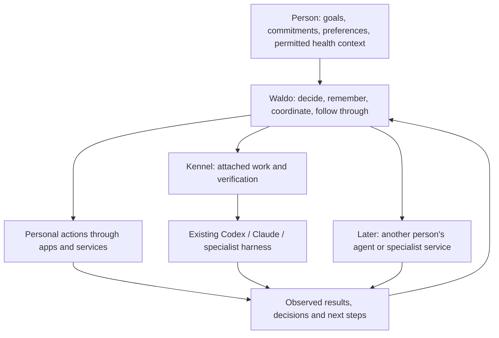

# Waldo ecosystem: one personal relationship, many capable executors

21 September 2026 · proposed positioning and expansion logic · companion to the [MVP build plan](../WALDO_PERSONAL_AGENT_PRODUCT_ARCHITECTURE_AND_BUILD_PLAN_2026-09-18.md)

This note defines the ecosystem thesis without adding implementation dependencies to the MVP. Market advantage, partner incentives, willingness to pay and network effects below are hypotheses to validate. No partnerships, universal interoperability or competitor superiority are established.

## Recommendation

Position Waldo as a personal agent for life and work: it understands what matters to a person, helps plan around their real capacity, and carries selected commitments through their tools and agents. Kennel is its work execution and review surface, using existing harnesses. Health is a meaningful source of personal context and a reason to improve decisions; it does not have to become a separate health-coaching business.

The person should experience one continuing relationship. They can still interact directly with Codex, Claude or another specialist when that is the better interface. Waldo adds coordination where it earns its cost; it must not become an obligatory intermediary for every keystroke or a second manager that the user has to supervise.

**Consumer promise:** “Waldo understands what matters to you, helps you make room for it, and follows through across your day and your work.”

**Ecosystem thesis:** as execution becomes available from more models and agents, users still need help deciding what matters, supplying the right context, resolving decisions and checking what actually happened. Waldo can own that continuing personal relationship while specialists retain their expertise and execution environments. This is a strategic inference, not a proven market category.

## Product roles

| Participant | Contribution | Boundary |
|---|---|---|
| Waldo personal agent | Priorities, preferences, permitted body context, commitments, decisions and continuity | The person's continuing agent; no indiscriminate import of all personal/work data |
| Waldo app, messaging and later web | Capture, conversation, personal planning, approvals, corrections and understandable progress | Views and controls over the same work, not separate agent identities |
| Kennel | Attached workspaces, provider sessions, execution scheduling, artifacts and verification workflow | Work execution/review; it does not independently decide the person's life priorities |
| Codex, Claude and specialist harnesses | Skilled execution in their supported environments | Use actual installed/authenticated capabilities; do not assume equivalent readiness or expose local credentials |
| APIs, browsers and plugins | Access to specific services and supported actions | Capability and result contracts; installing a plugin is not permission to use all its powers |
| Other people's Waldos or external agents | Negotiate scoped requests and return results for their own principals | Distinct owners, permissions and private context; no shared personal brain |

## Why health can matter

Health earns a place when it changes a useful decision: how much to take on, which work to protect, whether to ask for help, what to defer, and when to stop. The feature should let someone rest as readily as it helps them delegate. Do not equate a biometric signal with productivity, override the person's priorities or share health explanations with a work agent.

Depth means trustworthy source handling, personal context, missing-data honesty, user correction and a better practical result. More scores or confident interpretations are not evidence of depth. Support the same planning experience with self-report when users decline wearable access.

Health is not an uncontested category. Oura Advisor describes biometric and personal context, trends, adjustable check-ins and reviewable/deletable memories. Muse describes sleep-related artifacts alongside general assistance. These public claims establish competitive overlap; they do not establish clinical benefit or measured superiority. [Oura](https://ouraring.com/blog/oura-advisor/), [Muse](https://introducing.muse.ai/)

The proposed opportunity is to connect permitted capacity context to actual commitments and chosen work execution. Test whether users prefer the resulting decisions and need fewer interventions, using comparable plans with and without health context. Measure planning usefulness; do not claim improved health outcomes from a short beta.

## What makes the bridge valuable

A useful bridge works in both directions. Waldo can prepare a bounded assignment for Kennel, and a selected work outcome or blocker can return to Waldo's day and follow-up state. Later, a user already inside a harness can explicitly attach a task to Waldo through a supported plugin without moving their whole workflow to a new dashboard. No ambient upload of private work transcripts is required.

The value is in briefing once, preserving the outcome across interruptions, checking results and managing the next step. Merely forwarding a prompt and forwarding its answer adds little. Folk already documents Cursor Cloud Agent delegation and MCP connections, so personal-to-coding delegation alone is not an exclusive position. [Folk connections](https://app.folk.com/docs/connecting-apps)

Proposed demonstration: “I need the beta ready Friday, but I am low-energy today.” Waldo offers a feasible plan, protects fixed commitments and proposes what the user could defer or delegate. The user authorizes one bounded task. Kennel runs the existing Codex harness in the attached project. A blocker returns as a specific decision, then the same task resumes. Waldo reports the actual diff and checks, leaves acceptance to the user and updates remaining commitments. The worker receives task requirements, not health readings. The personal cloud loop continues while the desktop is off; local execution truthfully waits if unavailable.

## Four expansions, each earned by use

| Stage | Customer value | What justifies the next stage |
|---|---|---|
| 1. Individual usefulness | Reliable health-aware day, follow-up and research; K0 bounded work proof | Repeated real delegation and evidence that users need less rescue; no colleague adoption required |
| 2. Interoperable work | Additional harness/tool adapters and a supported way to carry selected work back from a harness | Repeated unmet tasks plus a supported API/runtime; every adapter passes lifecycle, result, cancellation and isolation checks |
| 3. Specialist ecosystem | Curated external capabilities discovered when a user needs them | Real demand and an independent provider able to integrate against a documented contract; support cost and completion quality remain acceptable |
| 4. Coordination between people | Two agents handle a scoped shared task, beginning with arranging a meeting | Both people already receive standalone value and both report less coordination; a usable human handoff remains when one has no agent |

App-first delivery and one Codex-first K0 proof remain the current scope. A marketplace, universal agent router, new community network and broad agent discovery are not launch requirements. Model/harness upgrades should improve Waldo's available execution, while Waldo preserves the person's relevant continuity.

## Open interfaces without promising universal control

Use official APIs or MCP for supported tools; consider A2A at a boundary with an actual independently operated agent that supports it. Keep Waldo's internal outcome, memory and permission semantics under its own contracts. Protocol support is not proof that another product exposes its private agent or permits us to delegate work through it. [MCP](https://modelcontextprotocol.io/docs/2026-07-28/getting-started/intro), [A2A](https://a2a-protocol.org/latest/)

An external executor must declare its supported operations and return task identity, progress, decision requests, artifacts, factual completion status and recovery/cancellation semantics. Start with one real integration, extract the shared interface after it works, and require conformance for the next. An adapter that cannot resume or verify an action must report that limitation instead of inheriting a blanket promise from the Waldo brand.

Make it worthwhile for others to participate: users receive less briefing and supervision; harness providers may receive more qualified work through existing accounts; specialist providers may receive demand for their expertise. These are incentives to validate, not partnerships to assume. Some providers will compete for the same customer relationship or decline integration. Preserve a useful product when they do.

## Defensibility, distribution and business model

The possible durable advantage is a trusted relationship backed by repeated correct decisions, usable corrections, dependable integrations and task-specific evaluation evidence. Personal learning can improve value for one user; it is not itself a network effect. More integrations create coverage, not automatically defensibility. A real interpersonal network effect exists only when another person's participation increases useful coordination for both.

Build retention through usefulness and portability: users should be able to inspect, correct and export their own context. Do not depend on trapping their memories. Do not treat intimate health data as a shared training-data asset. Any aggregate product learning must respect the data boundaries already in the plan.

Start with the overlap cohort: busy technical founders/builders using iPhone and an existing coding harness, with optional wearable data. Personal-only users remain supported and should be evaluated separately. Win one customer's joined day/work journey before trying to sell a consumer health product, developer tool and enterprise orchestration platform simultaneously.

Distribution hypotheses: the app earns a daily relationship; a bounded Kennel demonstration reaches users who already value coding agents; later supported harness plugins let users attach responsibility from where they already work; useful shared-task invitations may create referrals only after two-person coordination is proven. None requires a marketplace at launch.

Recommend testing a paid personal subscription with clear usage boundaries after real cost/usefulness data. Separately expose heavier hosted execution cost where needed; existing harness usage remains under the user's applicable provider account and supported integration terms. Defer commissions, enterprise sales and selling a standalone memory API until demand justifies those businesses. No price, entitlement or revenue target is set here.

## Falsifiers and decision rules

Two hypotheses compete: H1, personal understanding plus work continuity removes meaningful coordination effort; H2, a good personal assistant plus direct harness use is simpler and equally effective. Prefer H1 as the showcase thesis, but test both on the same bounded tasks.

Before opening each expansion, record representative cases, baselines, trial counts, quality thresholds and full costs. Compare direct harness use against the joined flow on setup effort, human interventions, verification burden, completion quality and willingness to delegate again. Use the main plan's existing personal-loop and repeated-use gates. For a first adapter, require completed real tasks from at least two independent target users who request repeat use, not only an internally rehearsed demo; this is directional evidence, not statistical proof.

If health context does not improve user-rated planning, simplify its presentation rather than add more signals. If Kennel adds supervision or latency without reducing coordination, keep the personal product useful and stop broadening the bridge. If third-party integration requires unsupported access, do not pretend a plugin makes it possible. If cross-person tasks need both people to join before either gets value, repair the human fallback and delay network expansion.

**Disposition:** adopt the personal-to-work continuity thesis as the proposed ecosystem direction; prove individual utility and one bridge first; defer broad ecosystem construction. This can support a distinct market position, but the position is earned by the end experience and repeat use, not established by an architecture diagram.
